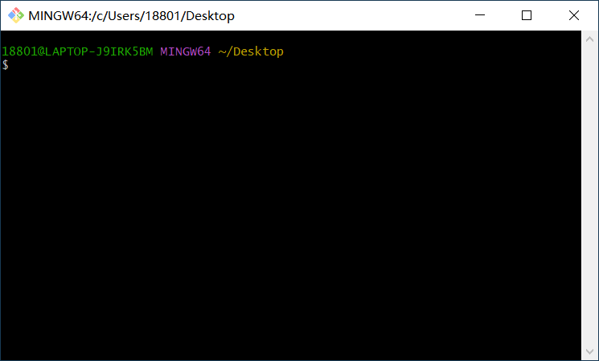
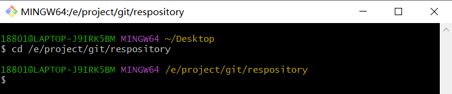
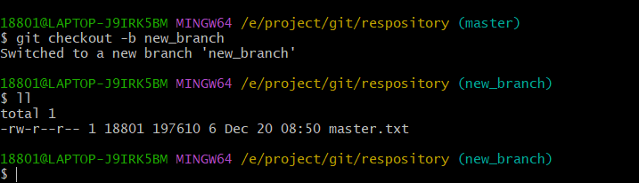
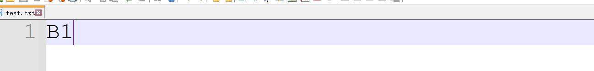
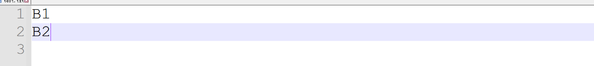
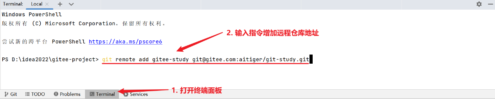
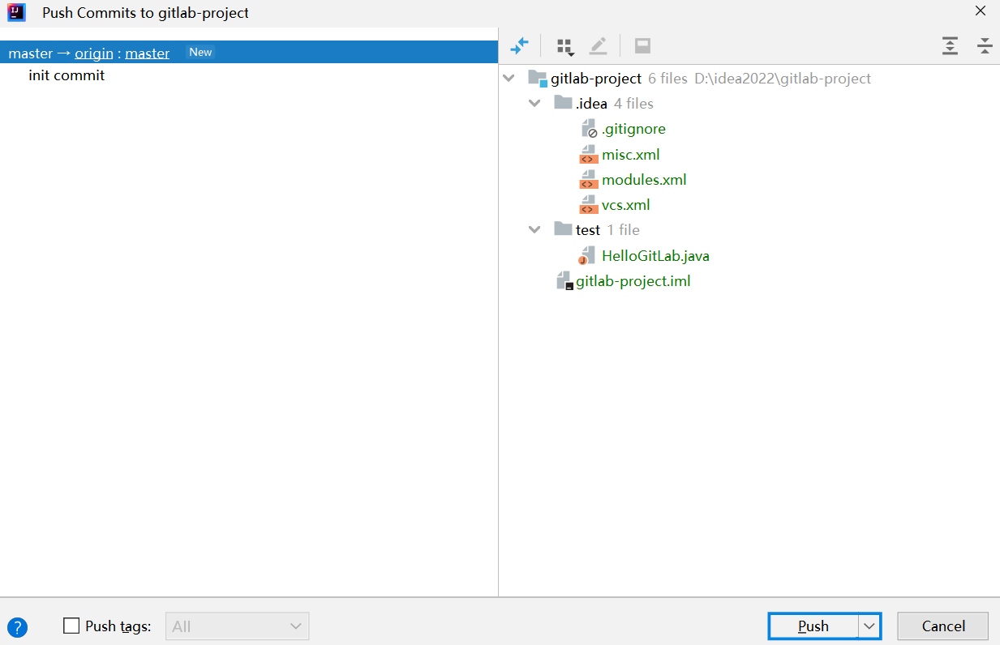
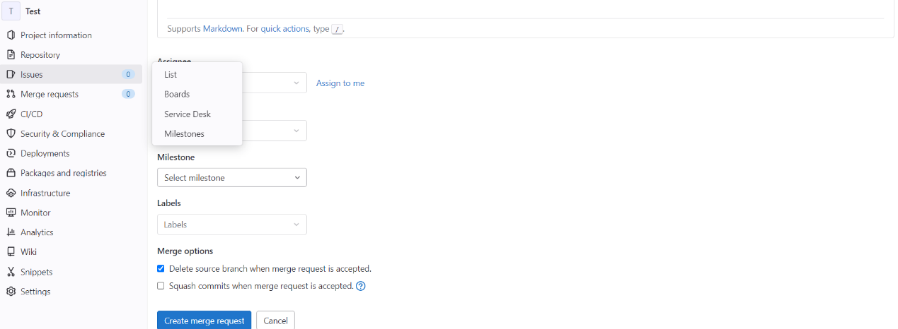
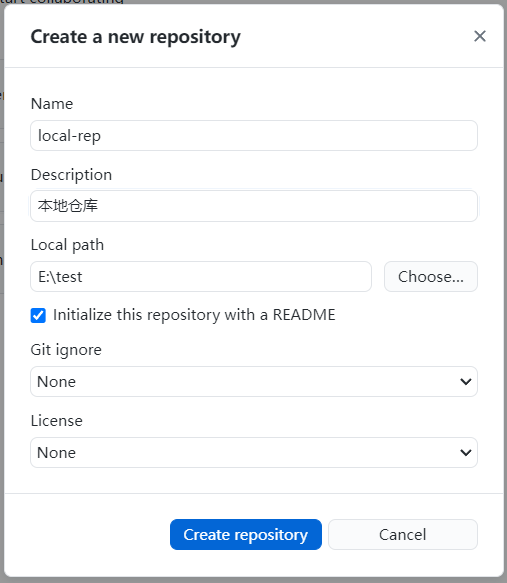
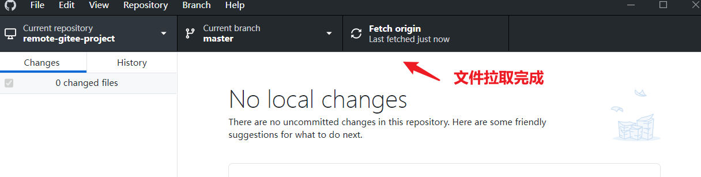

## Git快速入门

### Git概述

Git是一个免费的，开源的分布式版本控制系统，可以快速高效地处理从小型或大型的各种项目。Git易于学习，占用空间小，性能快得惊人。

### SCM 概述

SCM（Software Configuration Management，软件配置管理）是一种标识、组织和控制修改的技术。它应用于整个软件生存周期。

作为评价一个大中型软件开发过程是否正确，合理，有效的重要手段，CMM(Capability Maturity Model )能力成熟度模型提供了不同等级的标准流程，对软件开发过程（流程）进行了约束和建议, 而作为CMM 2级的一个关键域（Key Practice Area，KPA），SCM软件在整个软件的开发活动中占有很重要的位置。

Git软件比Subversion、CVS、Perforce和ClearCase等SCM（Software Configuration Management软件配置管理）工具具有性价比更高的本地分支、方便的暂存区域和多个工作流等功能。

### Git安装

#### 软件下载

软件官网地址为：[https://git-scm.com/](https://www.oracle.com/java/technologies/downloads/)

软件下载地址为：

https://github.com/git-for-windows/git/releases/download/v2.40.0.windows.1/Git-2.40.0-64-bit.exe

最早Git是在Linux上开发的，很长一段时间内，Git也只能在Linux和Unix系统上跑。不过，慢慢地有人把它移植到了Windows上。现在，Git可以在Linux、Unix、Mac和Windows这几大平台上正常运行了。由于开发机大多数情况都是windows，所以本教程选择相对简单的Windows系统软件版本进行下载，此处我们下载Windows系统的2.40.0版本软件

#### 软件安装

Git软件安装的步骤虽然比较多，但是整个安装过程还是比较简单的，双击exe执行文件，按照引导界面的提示安装即可

点击Next下一步，选择安装目录，默认安装在c盘中

点击Next下一步，选择组件，此处默认即可

点击Next下一步，配置启动菜单，此处默认即可

点击Next下一步，配置编辑器工具，这里选择自己习惯的编辑工具即可。

后续就不需要进行什么特殊配置了，所以连续默认选择Next下一步即可。

 

 

 

 

 

  

#### 软件测试

在Windows桌面空白处，点击鼠标右键，弹出右键菜单

Git软件安装后，会在右键菜单中增加两个菜单

- Git GUI Here

- Git Bash Here

此处仅仅是为了验证Git软件安装的效果，所以选择Git Bash Here菜单, 选择后，Windows系统弹出Git软件的命令行黑窗口，

窗口弹出后，可以输入Git软件的操作指令。此时我们使用键盘输入操作指令：git -v或 git --version，查看当前Git软件的安装版本。

git -v

git --version

 

输入指令回车后，如果黑窗口中打印出咱们安装的软件版本2.40.0，Git软件安装成功了。

##  Git基础使用

### Git基础概念

Git是一个免费的，开源的分布式版本控制软件系统，学习Git软件的具体操作前，我们需要对一些基础的概念和名词进行解释

#### 版本控制

一般情况下，一份文件，无论是DOC办公文档，还是编程源码文件，我们都会对文件进行大量的修改和变更。但是我们无法保证每一次的修改和变更都是正确并有效的，往往有的时候需要追溯历史操作，而版本控制（Revision control）是一种在开发的过程中用于管理我们对文件、目录或工程等内容的修改历史，方便查看更改历史记录，备份以便恢复以前的版本的软件工程技术。

没有进行版本控制或者版本控制本身缺乏正确的流程管理，在软件开发过程中将会引入很多问题，如软件代码的一致性、软件内容的冗余、软件过程的事物性、软件开发过程中的并发性、软件源代码的安全性，以及软件的整合等问题。

#### 分布式

在Git中，每个版本库都是一样重要得。所以就不存在像集中式版本控制软件中以谁为主得问题。任何一个库都可以当成主库。

这种方式可以更大限度地保证项目资源得安全。

#### 系统

一般软件系统指的是可以独立运行的软件应用程序。而Git软件就是专门用于对代码文件进行版本控制得应用程序。同时也提供客户端对系统所管理得资源进行访问。

#### 区域

Git软件为了更方便地对文件进行版本控制，根据功能得不同划分了三个区域

- 存储区域：Git软件用于存储资源得区域。一般指得就是.git文件夹

- 工作区域：Git软件对外提供资源得区域，此区域可人工对资源进行处理。

- 暂存区：Git用于比对存储区域和工作区域得区域。Git根据对比得结果，可以对不同状态得文件执行操作。

### Git基础指令

Git软件是免费、开源的。最初Git软件是为辅助 Linux 内核开发的一套软件，所以在使用时，简单常用的Linux系统操作指令是可以直接使用的

#### Linux 系统操作指令

| **指令**         | **含义**                | **说明**                                 |
| ---------------- | ----------------------- | ---------------------------------------- |
| cd 目录          | change directory        | 改变操作目录                             |
| cd ..            |                         | 退回到上一级目录                         |
| pwd              | Print work directory    | 打印工作目录                             |
| ls               | list directory contents | 显示当前目录的文件及子文件目录           |
| ll               | ls -l 简化版本          | 更详细地显示当前目录的文件及子文件目录   |
| mkdir 文件夹名称 | make directory          | 新建一个文件夹                           |
| rm 文件          | remove                  | 删除文件                                 |
| rm -r 文件夹     | Remove                  | 删除文件目录                             |
| touch 文件       |                         | 如果创建的文件不存在，那么创建一个空文件 |
| reset            |                         | 清屏                                     |
| clear            |                         | 清屏                                     |
| exit             |                         | 退出终端窗口                             |

#### Git软件指令

##### 配置信息

作为一个工具软件来讲，一般都会有默认的配置文件来保存基础的配置信息，Git软件的配置文件位置为：`Git安装路径/etc/gitconfig`

默认情况下，我们可以通过指令获取软件的配置信息：

git config -l

##### 名称和邮箱

如果你是第一回使用Git软件，需要告诉Git软件你的名称和邮箱，否则是无法将文件纳入到版本库中进行版本管理的。这是因为在多人协作时，不同的用户可能对同一个文件进行操作，所以Git软件必须区分不同用户的操作，区分的方式就是名称和邮箱。

当然了，你可能会说我就用本地库就行了，不需要进行多人协作，是不是就可以不用配置呢。这是不行的，因为Git软件的设计初衷本身就是针对于linux系统的分布式开发协同工作，所以它天生就是用于分布式协同工作的，这里无论你是否使用这个功能，它本身就是这么设计的。所以是一定要配置的，否则就会出现如下提示：

当然了，配置的过程并不复杂，输入相关指令即可

git config --global user.name test

git config --global user.email test@atguigu.com

这里的--global表示全局配置，后续的所有文件操作都会使用该用户名称及邮箱。此时在操作系统的用户目录，会产生新的配置文件

文件中就包含了刚刚增加的配置信息

##### 初始化版本库

Git软件主要用于管理文件的版本信息，但它只是一个软件，不可能安装后就直接将系统中所有的文件全部纳入到它的管理范畴中。并且，软件管理版本信息的主要目就是管理文件的修改和变更，如果将系统中所有文件都进行管理其实意义是不大的。所以一般情况下，我们需要指定某一个文件目录作为软件的管理目录。因为这个目录主要就作为Git软件的管理文件的版本变化信息，所以这个目录也称之为Git软件的版本仓库目录。

具体操作过程如下：

- 我们首先通过指令进入到指定文件目录

- 执行指定的指令，创建文件版本库

git init

- 版本库创建成功后，会在目录中创建.git目录，用于管理当前版本库。

##### 向版本库中添加文件

虽然创建了版本库，但是现在版本库中还没有任何的文件，所以这里我们先手动创建文件：test.txt

因为文件已经放置在版本库中了。所以可以通过软件的指令查看版本库状态

git status

此时会发现，test.txt 文件属于 `untracked files（未追踪文件）`,这里表示当前的 test.txt 文件虽然放置到了版本库的文件目录中，被Git软件识别到了，但是未纳入到版本库管理中。所以属于未追踪文件。通过这个现象可以认为，系统文件夹物理目录和版本库管理目录的含义是不一样的。只有文件被纳入到版本库管理后，Git软件才能对文件修改后的不同版本内容进行追踪处理，也就是所谓的 `tracked files` 了。那么如何将文件纳入到版本库的管理呢，这就需要我们执行以下命令了：

\#这里的文件是需要提供扩展名的

git add test.txt

此时你再查看版本库状态，就会发现文件状态的变化。

你会发现，此时文件状态为 `cached file`，这是什么意思呢？其实这也是Git管理文件时的一种状态：`暂存状态`。就是我们生活中常说的草稿状态。也就是说对于Git来讲，它认为此时文件只是一种临时草稿状态，随时可能会进行修改或删除，并不算真正的操作完成状态。所以并不会把文件纳入到版本库管理中。

为什么会这样呢？其实这就涉及到版本的作用。生活中，我们学习时，一般会写学习笔记，虽然写完后不一定会看，但是该写的还是要写的。然后给这些笔记文件起名时，一般就会带着当天的时间或数字。比如【Java学习笔记_20220101.md】，或者【Java学习笔记_Ver1.1.md】，这里的时间或数字主要作用就是用于区分同一份笔记在不同时间节点记录的内容，这里的数字或时间我们就称之为版本。

那如果你只是随便写写，或写到一半，还没有写完的话，会专门给文件改个名称吗？应该不会，对不对，因为对于你来讲，这个笔记文件并没有记录完成，对吗。但是你非得说，你今天不想继续学习了，然后给文件改了一个名称，也不是不可以。对于Git软件来讲，道理是一样的。如果确定要把文件放置在版本库中，那么就需要执行确定提交指令

\# commit表示真正地纳入到版本库中

\# -m 表示提交时的信息（message），是必须输入的。用于描述不同版本之间的差别信息

git commit -m "my first git file"

再查看Git状态

提交后，Git会对当前的操作进行Hash计算，通过计算后的值将数据保存下来，保存的位置为版本库.git文件目录的objects中，我们可以通过指令查看当前提交

git show

由于文件内容进行了转换处理，直接打开你是看不懂的

##### 修改版本库文件

现在文件已经被纳入到版本库中，因为咱们的文件是空的，所以这里我们增加一些内容

此时，Git版本库中的文件和本地的文件就有了不同。我们可以查看状态

`modified`表示文件已经修改了，我们可以把这一次的修改提交到版本库中

原则上来讲，这里的操作顺序依然应该是

\# 先增加，再提交

git add test.txt

git commit

但是这里我们简化了一下操作

`git commit -a -m "update file"`

这个指令操作中多了一个**-a**的参数，等同于将增加，提交两步操作融合成了一步。

提交成功后，我们来展示以下当前Git软件库

##### 查看版本库文件历史

版本库中的文件我们已经修改并提交了，那么文件的版本信息就会发生变化，那我们如何来查看这个变化呢？这里我们可以采用log指令进行查看

git log

如果感觉看着不舒服，也可以美化一下显示方式:

git log --pretty=oneline

也可以使用简单方式查看

git log --oneline

##### 删除文件

一般情况下，Git软件就是用于管理文件的版本变更，但是在一些特殊的场景中，文件可能作废或不再使用，那么就需要从版本库中删除，记住，这里说的并不是从物理文件目录中删除，而是从版本库中删除。

- 将本地文件从目录中删除

- 查看Git版本库状态信息

此时Git软件会识别出来，版本库中有一份文件和当前用于临时操作文件的暂存区内的文件状态不一致：版本库中文件还在，但是操作区内的文件已经没有了。所以软件提供了两个选择：一个是将版本库中的文件也进行（提交）删除操作。另外一个就是从版本库中恢复文件。

- 使用指令从版本库中恢复文件

git restore test.txt

- 如果想要真正删除文件，那么也要将版本库中同时删除

此时查看Git日志

##### 恢复历史文件

如果版本库中一份文件中已经被删除了，那么此时这份文件还能找回来吗？其实原则上来讲，已经不行了，因为文件删除本身也是一种变更操作，也算是版本库管理的一部分。所以想要将已经删除的那份文件从版本库中取出来，已经是不可能了。但是，要注意的是，版本库管理的是文件不同版本的变更操作，这个不同版本的概念还是非常重要的。也就是说，最后的那个删除的文件版本已经没有了，但是之前版本的文件其实还是存在的。所以如果我们能将文件恢复到某一个版本，那么那个版本的文件就依然存在。

- 查看版本库信息

- 将版本库文件重置到某一个版本

​	\# 这里的f2f113f就是版本Hash值，用于唯一确定版本库中此版本的标记

​	\# 当然了这是一个简短版，完整的比较长

​	\# 如果不记得具体的版本值，版本值也可以使用HEAD值，比如最新的上一个版本：HEAD^

​	\# 如果后退更多的版本,可以使用 HEAD~N

​	git reset --hard f2f113f

- 被删除的文件回来了

##  Git进阶使用

在之前的操作中，所有的操作都是基于一条主线完成的。就好比，咱们学习的时候，记学习笔记，今天学点，那么就写一点，明天学点，再写一点，最后，完全学完了，这个笔记也就记全了。但实际上，有些文件可能再不同的场合需要同时使用不同的内容，而且还不能冲突，比如项目的配置文件，我需要本地进行测试，同时还要部署到服务器上进行测试。本地和服务器上的环境是不一样的，所以同一个配置文件就需要根据环境的不同，进行不同的修改。本地环境没问题了，修改配置文件，提交到服务器上进行测试，如果测试有问题，再修改为本地环境，重新测试，没问题了，再修改为服务器配置，然后提交到服务器上进行测试。依次类推，形成迭代式开发测试。

从上面的描述上看，就会显得非常繁琐，而且本质上并没有太重要的内容，仅仅是因为环境上的变化，就需要重新修改，所以如果将本地测试环境和服务器测试环境区分开，分别进行文件版本维护，是不是就会显得更合理一些。这个操作，在Git软件中，我们称之为branch，分支。

这里的分支感觉上就是树上的分叉一样，会按照不同的路线生长下去。有可能以后不再相交，当然，也可能以后会不断地纠缠下去，都是有可能的。

### Git分支

#### 主干分支

默认情况下，Git软件就存在分支的概念，而且就是一个分支，称之为master分支，也称之为主干分支。

这就意味着，所有文件的版本管理操作都是在master这一个分支路线上进行完成的。

不过奇怪的是，为什么之前的操作没有体现这个概念呢，那是因为，默认的所有操作本身就都是基于master分支完成的。而master主干分支在创建版本库时，也就是git init时默认就会创建。

#### 其他分支

就像之前说的，如果仅仅是一个分支，在某些情况并不能满足实际的需求，那么就需要创建多个不同的分支。

##### 创建分支

**\# git branch 分支名称**

git branch b1

git branch b2

现在我们创建了2个分支，不过这两个分支都是基于master主干分支为基础的。

##### 查看分支

##### 切换分支

我们将工作线路切换到b1

**\# git checkout 分支名称**

git checkout b1

此时我们添加新的文件 b1.txt

然后提交到版本库

此时，查看分支信息，会发现不同分支的版本进度信息发生了改变

如果此时切换回到主干分支的话，那么b1.txt文件就不存在了，因为对应版本信息不一样。

##### 删除分支

如果觉得某一个分支建立的不太理想或已经没有必要在使用了，那么是可以将这个分支删除的。

**\# git branch -d 分支名称**

Git branch -d b2

### Git合并

无论我们创建多少个分支，都是因为我们需要在不同的工作环境中进行工作，但是，最后都应该将所有的分支合在一起。形成一个整体。作为项目的最终结果。

#### 主干分支

首先我们先将主干分支的所有文件清空掉

在当前主干分支中创建一份文件master.txt，并提交

#### 其他分支

基于主干分支的内容，我们创建其他分支，并直接切换到新的分支

**\# git checkout -b 分支名称**

git checkout -b new_branch

在新的分支中添加新文件branch.txt

此时切换回主干分支，只有master.txt文件。

再切换回new_branch分支，branch文件就又回来了。

#### 合并分支

这里我们将new_branch分支的文件内容合并到主干分支中。首先先切换回主干分支

然后执行分支合并指令

**\# git merge 分支名称**

git merge new_branch

此时再次查看文件，就会发现branch.txt文件已经可以看到了。

### Git冲突

在多分支并行处理时，每一个分支可能是基于不同版本的主干分支创建的。如果每隔分支都独立运行而不进行合并，就没有问题，但是如果在后续操作过程中进行合并的话，就有可能产生冲突。比如B1, B2的两个分支都是基于master分支创建出来的。B1分支如果和B2分支修改了同一份文件的话，那么在合并时，以哪一个文件为准呢，这就是所谓的冲突。

接下来，咱们就演示一下。

#### 主干分支

首先我们先将主干分支的所有文件清空掉

主干分支添加文件test.txt，文件内容为空

#### 其他分支

基于主干分支，创建两个分支B1, B2

#### 切换分支-B1

切换到 B1 分支，修改文件内容

提交修改后的文件

#### 切换分支-B2

切换到B2分支，查看文件内容

修改文件内容：

提交文件

#### 合并分支-B1

切换到master主干分支，此时test.txt文件内容为空

将B1分支合并到主干分支中

#### 合并分支-B2

因为B2分支也对文件进行了修改，所以如果此时合并B2分支,就会提示冲突

查看文件内容差异

这里的冲突，软件是无法判断该如何出来处理的，所以需要人工进行判断，将冲突的文件内容进行修正。

重新提交到master主干分支中。

**\# git commit 文件名称 -i -m 注释**

再查看一下Git软件的操作日志

**\# git log --graph**

##  Git服务器集成

### Git远程服务器

在之前的操作中，所有的操作都是基于本地机器完成的。如果在公司中，一个项目是共用一个版本库的。那么所有的开发人员都应该对同一个版本库进行操作。因为Git软件本身就是用于Linux系统开发所设计的版本管理软件，所以项目中搭建的共享版本库也应该以linux系统为主。那么接下来，咱们就演示一下在CentsOS服务器中搭建Git服务器。

#### 下载Git软件（linux版本）

官网下载地址：<https://mirrors.edge.kernel.org/pub/software/scm/git/git-2.38.1.tar.gz>

将下载后的压缩文件上传到Linux系统中

#### 安装Git软件

##### 解压Git

\# 将压缩文件解压到自定义位置

tar -zxvf git-2.38.1.tar.gz -C **/opt/module/**

\# 可以更改名字，变得简短一些，好操作

cd /opt/module

mv git-2.38.1/ git

##### 安装依赖

解压后，我们需要编译源码，不过在此之前需要安装编译所需要的依赖，耐心等待安装完成，中途出现提示的时候输入y并按回车。

\#

yum install curl-devel expat-devel gettext-devel openssl-devel zlib-devel gcc perl-ExtUtils-MakeMaker

##### 删除旧版Git

安装编译源码所需依赖的时候，yum操作回自动安装旧版本的Git。

我们这里需要卸载这个旧版的Git

\# 删除旧版本的Git

yum -y remove git

##### 编译、安装Git

\# 进入到Git软件的解压目录

cd /opt/module/git

\# 编译时，prefix设定为Git软件安装目录

make prefix=/usr/local/git all

\# 安装Git

make prefix=/usr/local/git install

##### 配置环境变量

修改Linux系统中/etc/profile文件，配置环境变量

\# 配置环境变量

export PATH=\$PATH:/usr/local/git/bin

\# 刷新环境，让环境变量立即生效

source /etc/profile

##### 建立链接文件

\# git安装路径是/usr/local/git，不是默认路径

ln -s /usr/local/git/bin/git-upload-pack /usr/bin/git-upload-pack

ln -s /usr/local/git/bin/git-receive-pack /usr/bin/git-receive-pack

##### 测试安装

\# 获取git软件版本

git --version

#### 创建Git用户

因为Git服务器需要安装在Linux系统上，当使用远程客户端操作时，就需要提供相应的Git账号进行提交的，如果你的仓库文件的用户不是git的话，是root用户或者别的用户，那么你git push ,它是不允许的，因为你的git用户没有权限。你可以给这个文件创立git用户，或者修改文件夹的权限让所有用户都可以更改

\# 增加用户

adduser git

\# 设定密码

passwd git

#### SSH免密登录

##### 服务器端操作

\# 进入用户目录

cd /home/git

\# 在git用户根目录创建.ssh目录

sudo mkdir .ssh

sudo touch .ssh/authorized_keys

\# 设定.ssh目录，authorized_keys的权限

sudo chmod -R 700 /home/git/.ssh

sudo chmod 600 /home/git/.ssh/authorized_keys

##### 客户端端操作

\# 在客户端生成SSH密钥

\# 默认生成的密钥用户就是当前用户，需要和之前的全局配置保持一致

user.name=18801@LAPTOP-J9IRK5BM

user.email=18801@LAPTOP-J9IRK5BM

\# 按照提示三次回车即可

ssh-keygen -t rsa

在用户根目录的.ssh文件夹内，id_rsa.pub就是我们要的公钥

将文件中的内容复制到服务器端的.ssh/authorized_keys文件中

#### 创建Git版本库

##### 创建文件目录

\# 进入用户目录

cd /home/git

\# 创建版本库目录

mkdir git-rep

\# 设定文件所属用户

sudo chown git:git git-rep

##### 初始化版本库

\# 进入仓库目录

cd /home/git/git-rep

\# 初始化仓库，和前面的git init略有不同

git init -bare test.git

\# 设定文件所属用户

sudo chown -R git:git test.git

#### 远程访问Git版本库

##### 将远程仓库克隆到本地

\# 将远程仓库克隆到本地，形成本地仓库

\# 克隆远程仓库 =\> 用户@主机名:仓库地址

git clone git@linux1:/home/git/git-rep/test.git

##### 提交文件到本地仓库

\# 增加文件

git add client.txt

\# 提交文件

git commit -m 'client'

##### 将本地仓库同步到远程仓库

\# 同步远程仓库

\# 远程仓库默认有个别名叫origin，将本地仓库的文件推送（push）到远程仓库

**\# git push 远程仓库别名 分支名称**

git push origin master

##### 查看远程仓库

\# 服务器端切换用户

su git

\# 进入仓库

cd /home/git/git-rep/test.git

\# 切换到主干分支

git checkout master

\# 查看git日志

git log

### GitHub 服务器

公司中，我们可以搭建中央服务器让项目组开发人员共享代码，但是如果我们的开发人员都是通过互联网进行协作，而不是在同一个地方，那么开发时，程序文件代码的版本管理就显得更加重要，这就需要搭建一个互联网的版本库，让不同地点的人都可以进行访问。这里我们不用自己搭建。因为GitHub网站已经帮助我们提供了共享版本库功能。所以我们接下来就讲解一下，如何使用GitHub网站所提供的功能使用Git。

#### 注册网站会员

GitHub官网地址：<https://github.com/>

填写你的邮箱地址和密码，姓名

一顿操作，注册完毕后，进入你的主页

#### 创建新的仓库

输入仓库的相关信息

点击创建按钮，创建新的仓库。

#### 本地仓库的基本操作指令

**\# create a new repository on the command line**

echo "# git-study" \>\> README.md

git init

git add README.md

git commit -m "first commit"

git branch -M main

git remote add origin git@github.com:Aitiger-coffee/git-study.git

git push -u origin main

**\# push an existing repository from the command line**

git remote add origin git@github.com:Aitiger-coffee/git-study.git

git branch -M main

git push -u origin main

#### SSH免密操作

github支持两种同步方式“https”和“ssh”。如果使用https很简单基本不需要配置就可以使用，但是每次提交代码和下载代码时都需要输入用户名和密码。ssh模式比https模式的一个重要好处就是，每次push、pull、fetch等操作时，不用重复填写遍用户名密码。前提是你必须是这个项目的拥有者或者合作者，且配好了ssh key。

##### 本地生成SSH密钥

**\# ssh-keygen -t rsa -C GitHub账号**

ssh-keygen -t rsa -C 15811009164@163.com

##### 集成用户公钥

执行命令完成后,在window本地用户.ssh目录C:\Users\用户名\\ssh下面生成如下名称的公钥和私钥:

按照操作步骤，将id_rsa.pub文件内容复制到GitHub仓库中

点击Add按钮，增加SSH公钥信息

#### 设定全局用户

git config --global user.name '15811009164'

\# 这里的邮箱地址需要为GitHub网站的注册账号

git config --global user.email '15811009164@163.com'

#### 创建本地库以远程地址

\# 初始化本地仓库

git init

\# 设置远程仓库

git remote add origin git@github.com:Aitiger-coffee/git-study.git

#### 新增，提交本地仓库文件

\# 新增文件

git add test.txt

\# 提交文件

git commit test.txt

#### 推送到GitHub远程仓库

\# 推送文件

git push origin master

#### 查看GitHub远程仓库

#### 增加合作伙伴

选择合作账号,发出合作申请

#### 合作伙伴确认

合作伙伴收到确认后，点击Join按钮继续

点击Accept Invitation按钮，进行确认

此时已经可以合作开发了。

#### 远程仓库fork操作

如果项目存在大量合作伙伴，对于版本库的管理明显是一个特别大的风险，所以如果不想要选择大量的合作伙伴，但依然有人想要对项目代码进行维护，更新和扩展的话，此时，我们就可以使用fork功能。

点击Create fork按钮即可

这样就等同于创建了一个自己的远程仓库。但是这个远程仓库等同于是一个分支远程仓库，你可以随便操作，并不会影响源仓库，但是如果你的修改，更新想要融合到源仓库中，就需要提交申请了。

- 我们这里首先将文件改一下。

- 发送提交申请

- 合并修改请求

- 修改请求确认

### IDEA集成GitHub

实际的开发中，代码都是采用IDE进行开发，所以我们这里介绍一下IDEA软件是如何集成GitHub远程仓库进行代码版本控制的。这里采用的IDEA版本为2022.2.1,其他版本的IDEA软件会略有差别

#### 配置Git软件

#### 配置GitHub账号

继续点授权按钮

继续点击授权按钮

输入GitHub账号密码

#### 创建项目

#### 添加项目代码

#### 创建本地版本库

#### 提交本地版本库

#### 创建新的远程版本库

#### 推送到远程版本库

#### 查看历史版本

#### 分支操作

##### 创建分支

##### 将分支推送到远程仓库

### Gitee集成

相对于GitHub来讲，由于网络的原因，我们在连接时不是很稳定，所以我们在采用第三方远程仓库时，也可以选择国内的Gitee平台。

#### 注册网站会员

#### 用户中心

#### 创建远程仓库

#### 远程仓库简易操作指令

**\# Git 全局设置，修改成自己的信息**

git config --global user.name "Aitiger"

git config --global user.email <%2212252591+aitiger@user.noreply.gitee.com%22>

**\# 创建 git 仓库，基本操作指令和其他远程仓库一致。**

mkdir git-study

cd git-study

git init

touch README.md

git add README.md

git commit -m "first commit"

git remote add origin git@gitee.com:aitiger/git-study.git

git push -u origin "master"

**\# 已有仓库**

cd existing_git_repo

git remote add origin git@gitee.com:aitiger/git-study.git

git push -u origin "master"

#### 配置SSH免密登录

##### 本地生成SSH密钥

**\# ssh-keygen -t rsa -C Gitee账号**

ssh-keygen -t rsa -C 12252591+aitiger@user.noreply.gitee.com

##### 集成用户公钥

执行命令完成后,在window本地用户.ssh目录C:\Users\用户名\\ssh下面生成如下名称的公钥和私钥:

按照操作步骤，将id_rsa.pub文件内容复制到Gitee仓库中

#### 集成IDEA

##### 创建新项目

##### 安装Gitee插件

##### 配置Gitee账户授权

##### 增加远程地址

**\# 增加远程地址**

git remote add gitee-study git@gitee.com:aitiger/git-study.git

##### 提交本地代码

#### 多用户协作

### GitLab集成

前面给大家讲解的都是如何使用第三方代码托管平台来管理咱们的代码库。那么我们自己搭建一个这样的平台行不行呢？其实咱们之前已经用Git软件搭建了一个远程版本库，但是功能相对来讲，比较单一，而且操作起来也不像GitHub, Gitee平台那样更加人性化，所以我们这里介绍一个GitLab软件，用于搭建自己的代码托管平台。

#### GitLab介绍

GitLab是由GitLabInc开发，使用MIT许可证的基于网络的Git仓库管理工具，且具有wiki和issue跟踪功能。使用Git作为代码管理工具，并在此基础上搭建起来的Web服务。

GitLib由乌克兰程序员DmitriyZaporozhets和ValerySizov开发，它使用Ruby语言写成。后来，一些部分用Go语言重写。GitLab被IBM，Sony，JulichResearchCenter，NASA，Alibab，Invincea，O'ReillyMedia，Leibniz-Rechenzentrum(LRZ)，CERN，SpaceX等组织使用。

#### GitLab软件下载

官网地址：<https://about.gitlab.com/>

这里我们可以根据个人情况，选择下载不同版本的软件：

我们这里主要是教学，所以下载使用社区版(CE)即可

这里我们选择下载适用CentOS 7系统的版本

下载地址：https://packages.gitlab.com/gitlab/gitlab-ce

如果下载不了，或下载比较慢，可以根据提示在在linux系统中直接采用wget指令下载

#### GitLab安装

##### 安装linux系统

Linux系统的安装不在本课程学习范畴中，请同学们自行安装CentOS 7即可。

##### 安装GitLab

直接采用下载的RPM软件包安装即可

sudo rpm -ivh /opt/module/software/gitlab-ce-15.7.0-ce.0.el7.x86_64.rpm

##### 安装配置依赖项

在CentOS 7上，下面的命令也会在系统防火墙中打开HTTP、HTTPS和SSH访问。这是一个可选步骤，如果您打算仅从本地网络访问极狐GitLab，则可以跳过它

sudo yum install -y curl policycoreutils-python openssh-server perl

sudo systemctl enable sshd

sudo systemctl start sshd

sudo firewall-cmd --permanent --add-service=http

sudo firewall-cmd --permanent --add-service=https

sudo systemctl reload firewalld

\# 为了演示方便，我们也可以直接关闭防火墙

sudo systemctl stop firewalld

##### 初始化GitLab

\# 配置软件镜像

curl -fsSL https://packages.gitlab.cn/repository/raw/scripts/setup.sh \| /bin/bash

\# 安装

sudo EXTERNAL_URL="https://linux1" yum install -y gitlab-ce

\# 初始化

sudo gitlab-ctl reconfigure

##### 启动GitLab

\# 启动

gitlab-ctl start

\# 停止

gitlab-ctl stop

##### 访问GitLab

使用浏览器访问GitLab，输入网址：<http://linux1/users/sign_in>

初始化时，软件会提供默认管理员账户：root,但是密码是随机生成的。

根据提示，在/etc/gitlab/initial_root_password文件中查找密码

输入账号，密码，进入系统

##### 修改密码

默认的密码是随机的，且不容易记忆，还会在系统初始化后24小时被删除，所以需要先修改一下密码

##### 创建项目

#### 集成IDEA

##### 安装GitLab插件

##### 配置GitLab

##### 创建新项目

##### 创建本地仓库

##### 创建新代码

##### 提交文件

##### 推送远程库

##### 配置远程库

##### 推送文件

##### 合并提交请求

合并

确认文件提交

### GitHub Desktop客户端

#### 下载 & 安装

##### 下载

Git官网提供对应得下载链接页面：

下载地址：<https://central.github.com/deployments/desktop/desktop/latest/win32s>

##### 安装

无安装过程，安装完成后，弹出应用界面

##### 配置

点击软件得File菜单后，选择Options, 设定软件得操作用户名称及对应得邮箱地址。

##### 主题样式

可以根据自己得偏好设定软件主题样式。

##### 全屏

如果觉得软件界面比较小，可以适当进行调整或全屏

#### 创建本地仓库

##### 创建仓库

##### 切换仓库

##### 删除仓库

#### 文件操作

##### 新增文件

当工作区域创建了一份新文件，工具可以自动识别并进行对应得显示

此时Git仓库中并没有这份文件，所以需要执行commit操作，将文件保存到Git仓库中。

##### 忽略文件

> 如果某一个文件或某一类得文件，不想被Git软件进行管理。可以在忽略文件中进行设定

##### 修改文件

修改文件只是将工作区域得文件进行修改，但是对于Git软件来讲，其实本质上还是提交，因为底层会生成新得文件

##### 删除文件

删除文件对于Git软件来讲，依然是一个提交

提交后，最新版本得文件也会被“删除”

##### 历史记录

如果存在多次得提交操作得话，可以查看提交得历史记录

#### 分支操作

##### 默认分支

软件创建仓库时，默认创建得分支为main

点击右键可以改名

##### 创建分支

##### 切换分支

##### 删除分支

##### 合并分支

#### 标签操作

##### 创建标签

##### 删除标签

#### 远程仓库

##### 克隆仓库

##### 拉取文件

远程仓库更新了文件

拉取文件中

##### 推送文件

本地创建新文件

##  Git问题

### SSH公钥错误

一般出现如上错误，就是Git远程仓库的SSH免密公钥和推送用户提供的公钥不一致导致的。

### IDEA集成Gitee失败

如果IDEA集成Gitee时，向远程仓库push代码失败，且没有弹出账号窗口，可以尝试修改IDEA得相关配置。

