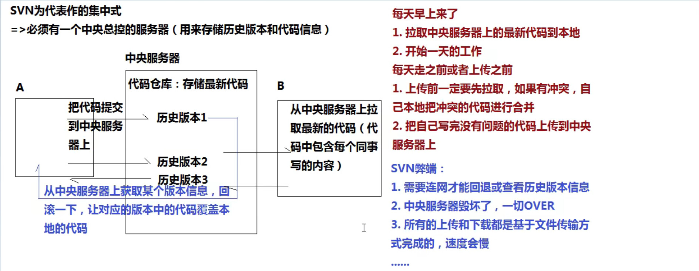
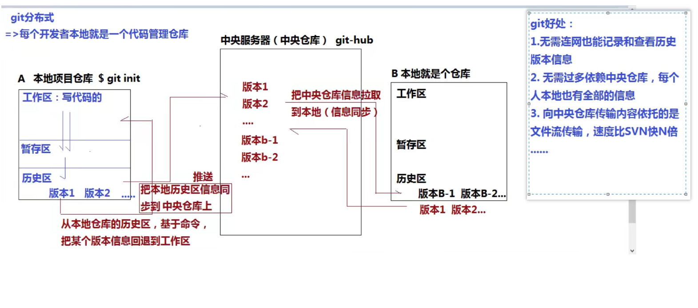
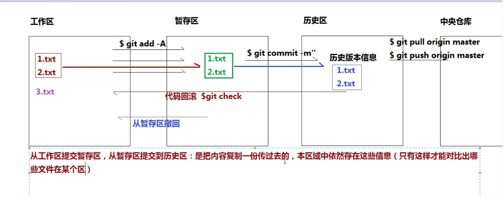

## GIT版本控制系统

> 版本控制系统 : 
>
> ​	1.记录历史版本信息 (记录每一次修改的记录)
>
> ​	2.方便团队相互之间协作开发
>
> ​	......
>
>  
>
> 常用的版本控制系统
>
> - cvs / svn : 集中式版本控制系统
> - git : 分布式版本控制系统

**svn**



**git**




### GIT工作原理

- 工作区 : 我们能看到的，并且用来写代码的区域
- 暂存区 : 临时存储用的
- 历史区 : 生成历史版本

工作区 -> 暂存区 -> 历史区



## GIT和GIT-HUB

### git的全局配置

> 第一次安装完成git后，我们在全局环境下配置基本信息 : 我是谁?

```shell
$ git config -l  查看配置信息
$ git config --global -l  查看全局配置信息

配置全局信息: 用户名和邮箱
$ git config --global user.name 'xxx'
$ git config --global user.email 'xxx@xx.xx'
```

### 创建本地仓库完成版本控制

> 创建本地git仓库

```shell
$ git init
//=>会生成一个隐藏文件夹 ".git" (这个文件夹千万不要删，因为暂存区和历史区还有一些其它的信息都在这里，删了就不是一个完整的git仓库)
```

> 在本地编写完成代码后，把一些文件提交到暂存区

```shell
$ git add xxx  把某一个文件或者文件夹提交到暂存区
$ git add *    添加新文件(new)和被修改(modified)文件，不包括被删除(deleted)文件；
$ git add -u   包含修改和删除的，但是不包含新增的
$ git add .    会把本地所有untrack的文件都加入暂存区，并且会根据.gitignore做过滤，但是git add * 会忽略.gitignore把任何文件都加入。 包含新增,修改(Git2.X 后包含删除)
$ git add -A   同时具备 * 和 -u 特征

$ git status   查看当前文件的状态 (红色代表在工作区，绿色代表在暂存区，看不见东西证明所有修改的信息都已经提交到历史区)
```

> 把暂存区内容提交到历史区

```shell
$ git commit -m '描述信息: 本次提交内容的一个描述'

# 添加并提交
$ git commit -a -m '描述信息: 本次提交内容的一个描述'   

# 查看历史版本信息 (历史记录)
$ git log 
$ git reflog  包含回滚的信息
$ git log --oneline  简单方式查看
```

### 文件误删除

```shell
$ git restore 文件名                 (删除文件后没有提交)
$ git reset --hard 078fla7(版本号)   (会把文件重置到， 078fla7这个版本号，这个版本号后面的版本号都没有了) 一般不使用
$ git revert 078fla7(需要恢复这个版本号的下一个版本号)  
```

### 分支操作

```shell
$ git branch 分支名字xxx      创建新的xxx分支
$ git branch -v              查看所有分支
$ git checkout 分支名字       切换分支
$ git checkout -b 分支名字    创建并切换分支
$ git branch -d 分支名字      删除分支
```

### 分支合并与冲突

```shell
# 需要把 某分支 合并到 master 分支中，需要首先切换到 master
$ git merge 某分支名称         合并分支
# 如果出现冲突，这需要手动把出现冲突的文件夹进行修改，然后重新 git add 和 commit
```

### 标签操作

```shell
# 版本号需要写完整的
$ git tag 标签名称 版本号         添加标签
$ git tag -d 标签名称             删除标签
```

### 远程仓库操作

> GIT-HUB : https://www.github.com
>
> 
>
> 一个网站 (一个开源的源代码管理平台) ，用户注册后，可以在自己账户下创建仓库，用来管理项目的源代码 (源代码是基于git传到仓库中)
>
> 
>
> 我们所熟知的插件、类库、框架等都在这个平台上有托管，我们可以下载观看和研究源码等

1. settings 用户设置
   + Profile     修改自己的基本信息
   + Account  可以修改用户名
   + Security  可以修改自己的密码
   + Emails     邮箱 (必须进行邮箱效验)
   + ...

 2. 创建仓库

    new repository  ->  填写信息  ->  Create repository

    + public   公共仓库作为开源的项目
    + private  私有仓库作为内部团队协作管理的项目

    Settings  ->  删除仓库Delete this repository

    ​                -> Collaborators  设置协作开发的人员

    Code  可以查看历史版本信息和分支信息

    

3. 把本地仓库信息提交到远程仓库

```shell
//=>建立本地仓库和远程仓库的链接
# 查看本地仓库和哪些远程仓库保持链接
$ git remote -v
# 让本地仓库和远程仓库新建一个链接 origin是随便起的一个链接名 (可以改成自己想要的，只不过一般都用这个名字)
$ git remote add origin [git远程仓库地址]
# 删除关联信息
$ git remote rm origin
```

```shell
# 提交之前最好先拉取
$ git pull origin master
# 把本地代码提交到远程仓库 (需要输入github的用户名密码)
$ git push origin master
```

```shell
$ git clone [远程仓库git地址] [别名: 可以不设置，默认是仓库名]
/*
 *	真实项目开发流程:
 *		1.组长或者负责人先创建中央仓库 (增加协作者)
 *		2.小组成员基于 $ git clone 把远程仓库及默认的内容克隆到本地一份 (解决了三个事情: 初始化一个本地仓库"git init"、和对应的远程仓库也保持了关联"git remote add"、把远程仓库默认内容拉取到本地"git pull")
 *		3.每个组员写完自己的程序后，基于"git add / git commit"把自己修改的内容存放到历史区，然后通过"git pull / git push"把本地信息和远程仓库信息保持同步即可 (可能涉及冲突的处理)
 */
```

## NPM

> node package manger : Node模块管理工具，根据npm我们可以快速安装、卸载所需要的资源文件 (例如 : JQuery、vue、vue-router...)
>
> 
>
> 去Node官网 : https://nodejs.org/zh-cn/ 下载Node (长期支持版)，安装Node后，npm也就跟着安装了
>
> $ node -v
>
> $ npm -v	出现版本号证明安装成功

### 基于npm进行模块管理

> https://www.npmjs.com/	基于npm是从npmjs.com平台上下载安装

```shell
$ npm install xxx		把模块安装在当前项目中 (node_modules)
$ npm install xxx -g	把模块安装在全局环境中
$ npm i xxx@1.0.0		安装指定版本号的模块
$ npm view xxx version > xxx.version.json	查看某个模块的版本信息(输出到指定JSON文件中)

/*
 *	什么情况下会把模块安装在全局?
 *		->可以使用"命令"对任何的项目进行操作
 *		->$ npm root -g 查看全局安装的目录
 *		->因为在安装目录下生成了 xxx.cmd 的文件，所以我们能够使用 xxx 的命令进行操作
 *	安装在本地项目中的模块
 *		->可以在项目中导入进来使用
 *		->但是默认不能基于命令来操作 (因为没有.cmd文件)
 *		->但是可以基于package.json中的scripts，配置一些npm可以执行命令，配置后通过 $ npm run xxx执行
 */


$ npm init -y			初始化当前项目的配置依赖清单 (项目文件夹的名字中不能出现中文、大写字母和特殊符号)	=>创建成功后在当前项目中生成 package.json 的清单文件
			dependencies : 生产依赖模块 (开发和项目部署的时候都需要)
			devDependencies : 开发依赖模块 (只有开发的时候需要)
			scripts : 配置本地可执行命令的
			
$ npm i xxx --save		把模块保存在清单生产依赖中
$ npm i xxx --save-dev	把模块保存在清单开发依赖中
$ npm install			跑环境，按照清单按照所需的模块

$ npm root -g			查看全局按照模块的目录
$ npm uninstall xxx
$ npm uninstall xxx -g	卸载安装过的模块
```

window操作系统 : 在某个文件夹下执行DOS命令

1. windows + r ->运行窗口中输入cmd

   ​	->磁盘符:	进入到指定磁盘

   ​	->cd xxx	进入到指定的目录

   ​	->cd 直接拖进想要进入的目录文件夹	直接进入

2. 在文件夹地址直接输入cmd即可

3. 在文件夹中"shift+鼠标右键" -> 在此处打开命令窗口

如果想查看当前目录中的文件内容

MAC : ls / ls -A

win: dir


**一个新项目的开始 :** 

1. 创建项目文件夹
2. 把他作为一个新的仓库进行代码管理 (可以基于 $ git clone 把远程仓库克隆下来即可)
3. 初始化模块配置清单 package.json : $ npm init -y
4. 安装所需要的模块 : $ npm i jquery bootstrap@3 less
5. 正常开发
6. 开发中 : 可能需要在本地配置命令去完成一些功能 (例如less文件编译，此时需要配置npm可执行的命令)

```json
"scripts": {
	"less": "lessc 1.less 1.min.css -x",
    "xxx" : "webpack"
}
```

​		需要编译的时候，执行 $ npm run xxx

​		...

7. 开发中我们需要基于git把文件进行管理 : 生成对应的历史版本

​		提交到暂存区、历史区、远程仓库的时候，项目中很多文件是无需处理和提交的，例如 : node_modules、 .idea...，不需要提交的，我们生成一个.gitignore忽略文件

```js
# dependencies
node_modules

# testing
/coverage

# production
/build

# misc
.DS_Store
.env.local
.env.development.local
.env.test.local
.env.production.local

npm-debug.log*
yarn-debug.log*
yarn-error.log*

# webStorm
.idea
```

8. 由于每次 git 提交的时候，我们都不去提交 node_modules，所以团队协作开发中，我们每当拉下来程序后，都需要"跑环境" : 执行 $ npm install ，按照项目中的 package.json 中的依赖项信息，把缺失的模块都安装一遍


### yarn

```shell
$ npm install yarn -g  
$ yarn inti / yarn install
$ yarn add xxx@x.xx.xx --dev
$ yarn remove xxx
...
yarn不能安装全局模块
```

### nrm

```shell
$ npm install nrm -g
$ nrm ls			查看所有可用的镜像源
$ nrm use xxx		将下包的镜像源切换为 xxx 镜像
$ nrm current 		显示当前使用的源
接下来继续使用npm命令即可
```

