# JavaScript 进阶 - 第1天

> 学习作用域、变量提升、闭包等语言特征，加深对 JavaScript 的理解，掌握变量赋值、函数声明的简洁语法，降低代码的冗余度。

- 理解作用域对程序执行的影响
- 能够分析程序执行的作用域范围
- 理解闭包本质，利用闭包创建隔离作用域
- 了解什么变量提升及函数提升
- 掌握箭头函数、解析剩余参数等简洁语法

## 作用域

> 了解作用域对程序执行的影响及作用域链的查找机制，使用闭包函数创建隔离作用域避免全局变量污染。

作用域（scope）规定了变量能够被访问的“范围”，离开了这个“范围”变量便不能被访问，作用域分为全局作用域和局部作用域。

### 局部作用域

局部作用域分为**函数作用域**和**块作用域**。

#### 函数作用域

在函数内部声明的变量只能在函数内部被访问，外部无法直接访问。

```html
<script>
  // 声明 counter 函数
  function counter(x, y) {
    // 函数内部声明的变量
    const s = x + y
    console.log(s) // 18
  }
  // 设用 counter 函数
  counter(10, 8)
  // 访问变量 s
  console.log(s)// 报错
</script>
```

总结：

1. 函数内部声明的变量，在函数外部无法被访问
2. 函数的参数也是函数内部的局部变量
3. 不同函数内部声明的变量无法互相访问
4. 函数执行完毕后，函数内部的变量实际被清空了

#### 块作用域

在 JavaScript 中使用 `{}` 包裹的代码称为**代码块**，代码块内部声明的变量外部将【<span style="color:red">有可能</span>】无法被访问。

```html
<script>
  {
    // age 只能在该代码块中被访问
    let age = 18;
    console.log(age); // 正常
  }
  
  // 超出了 age 的作用域
  console.log(age) // 报错
  
  let flag = true;
  if(flag) {
    // str 只能在该代码块中被访问
    let str = 'hello world!'
    console.log(str); // 正常
  }
  
  // 超出了 age 的作用域
  console.log(str); // 报错
  
  for(let t = 1; t <= 6; t++) {
    // t 只能在该代码块中被访问
    console.log(t); // 正常
  }
  
  // 超出了 t 的作用域
  console.log(t); // 报错
</script>
```

JavaScript 中除了变量外还有常量，常量与变量本质的区别是【常量必须要有值且不允许被重新赋值】，常量值为对象时其属性和方法允许重新赋值。

```html
<script>
  // 必须要有值
  const version = '1.0.0';

  // 不能重新赋值
  // version = '1.0.1';

  // 常量值为对象类型
  const user = {
    name: '小明',
    age: 18
  }

  // 不能重新赋值
  user = {};

  // 属性和方法允许被修改
  user.name = '小小明';
  user.gender = '男';
</script>
```

总结：

1. `let` 声明的变量会产生块作用域，`var` 不会产生块作用域
2. `const` 声明的常量也会产生块作用域
3. 不同代码块之间的变量无法互相访问
4. 推荐使用 `let` 或 `const`

注：开发中 `let` 和 `const` 经常不加区分的使用，如果担心某个值会不小被修改时，则只能使用 `const` 声明成常量。

### 全局作用域

`<script>` 标签和 `.js` 文件的【最外层】就是所谓的全局作用域，在此声明的变量在函数内部也可以被访问。

```html
<script>
  // 此处是全局
  
  function sayHi() {
    // 此处为局部
  }

  // 此处为全局
</script>
```

全局作用域中声明的变量，任何其它作用域都可以被访问，如下代码所示：

```html
<script>
    // 全局变量 name
    const name = '小明'
  
  	// 函数作用域中访问全局
    function sayHi() {
      // 此处为局部
      console.log('你好' + name)
    }

    // 全局变量 flag 和 x
    const flag = true
    let x = 10
  
  	// 块作用域中访问全局
    if(flag) {
      let y = 5
      console.log(x + y) // x 是全局的
    }
</script>
```

注意：

1. 为 `window` 对象动态添加的属性默认也是全局的，不推荐！
2. 函数中未使用任何关键字声明的变量为全局变量，不推荐！！！
3. 尽可能少的声明全局变量，防止全局变量被污染

JavaScript 中的作用域是程序被执行时的底层机制，了解这一机制有助于规范代码书写习惯，避免因作用域导致的语法错误。

### 作用域链

在解释什么是作用域链前先来看一段代码：

```html
<script>
  // 全局作用域
  let a = 1
  let b = 2
  // 局部作用域
  function f() {
    let c
    // 局部作用域
    function g() {
      let d = 'yo'
    }
  }
</script>
```

函数内部允许创建新的函数，`f` 函数内部创建的新函数 `g`，会产生新的函数作用域，由此可知作用域产生了嵌套的关系。

如下图所示，父子关系的作用域关联在一起形成了链状的结构，作用域链的名字也由此而来。

作用域链本质上是底层的**变量查找机制**，在函数被执行时，会**优先查找当前**函数作用域中查找变量，如果当前作用域查找不到则会依次**逐级查找父级作用域**直到全局作用域，如下代码所示：

```html
<script>
  // 全局作用域
  let a = 1
  let b = 2

  // 局部作用域
  function f() {
    let c
    // let a = 10;
    console.log(a) // 1 或 10
    console.log(d) // 报错
    
    // 局部作用域
    function g() {
      let d = 'yo'
      // let b = 20;
      console.log(b) // 2 或 20
    }
    
    // 调用 g 函数
    g()
  }

  console.log(c) // 报错
  console.log(d) // 报错
  
  f();
</script>
```

**总结**：

1. 嵌套关系的作用域串联起来形成了作用域链
2. 相同作用域链中按着从小到大的规则查找变量
3. 子作用域能够访问父作用域，父级作用域无法访问子级作用域

### 垃圾回收机制

<span style="color:red">垃圾回收机制 (Garbage Collection) 简称 GC</span>

JS中<span style="color:red">内存</span>的分配和回收都是<span style="color:red">自动完成</span>的，内存在不使用的时候会被<span style="color:red">垃圾回收器</span>自动回收

- **内存的生命周期**

  Js 环境中分配的内存，一般有如下<span style="color:red">生命周期</span>

  1. <span style="color:red">内存分配: </span> 当我们声明变量、函数、对象的时候，系统会自动为他们分配内存
  2. <span style="color:red">内存使用:  </span>即读写内存，也就是使用变量、函数等
  3. <span style="color:red">内存回收:  </span>使用完毕，由<span style="color:red">垃圾回收器</span>自动回收不再使用的内存

- **说明:**

  - 全局变量一般不会回收 (关闭页面回收)
  - 一般情况下<span style="color:red">局部变量的值</span>，不用了，会被<span style="color:red">自动回收</span>掉

- **内存泄漏: ** 程序中分配的<span style="color:red">内存</span>由于某种原因程序<span style="color:red">未释放</span>或<span style="color:red">无法释放</span>叫做<span style="color:red">内存泄漏</span>

堆栈空间分配的区别:

1. 栈 (操作系统) :  由<span style="color:red">操作系统自动分配释放</span>函数的参数值、局部变量等，基本数据类型放到栈里面。
2. 堆 (操作系统) :  一般由程序员分配释放，若程序员不释放，由<span style="color:red">垃圾回收机制</span>回收。<span style="color:red">复杂数据类型</span>放到堆里面。

两种常见的浏览器<span style="color:red">垃圾回收算法</span>  :  <span style="color:red">引用计数法</span>和<span style="color:red">标记清除法</span> 

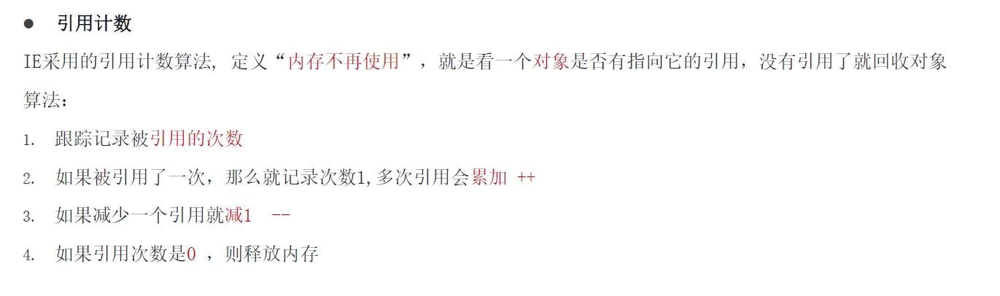

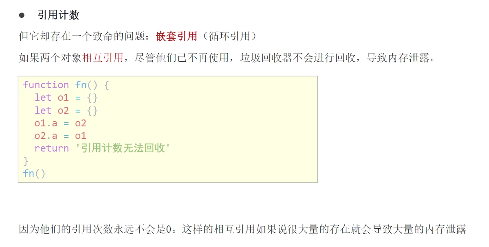

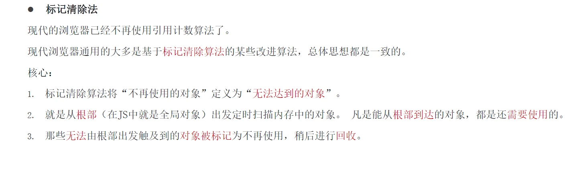

### 闭包

闭包是一种比较特殊和函数，使用闭包能够访问函数作用域中的变量。从代码形式上看闭包是一个做为返回值的函数，如下代码所示：

```html
<body>
  <script>
    // 1. 闭包 : 内层函数 + 外层函数变量
    // function outer() {
    //   const a = 1
    //   function f() {
    //     console.log(a)
    //   }
    //   f()
    // }
    // outer()

    // 2. 闭包的应用： 实现数据的私有。统计函数的调用次数
    // let count = 1
    // function fn() {
    //   count++
    //   console.log(`函数被调用${count}次`)
    // }

    // 3. 闭包的写法  统计函数的调用次数
    function outer() {
      let count = 1
      function fn() {
        count++
        console.log(`函数被调用${count}次`)
      }
      return fn
    }
    const re = outer()
    // const re = function fn() {
    //   count++
    //   console.log(`函数被调用${count}次`)
    // }
    re()
    re()
    // const fn = function() { }  函数表达式
    // 4. 闭包存在的问题： 可能会造成内存泄漏
  </script>
</body>
```

总结：

1.怎么理解闭包？

- **闭包 = 内层函数 + 外层函数的变量**

2.闭包的作用？

- 封闭数据，实现数据私有，外部也可以访问函数内部的变量
- 闭包很有用，因为它允许将函数与其所操作的某些数据（环境）关联起来

3.闭包可能引起的问题？

- 内存泄漏

### 变量提升

变量提升是 JavaScript 中比较“奇怪”的现象，它允许在变量声明之前即被访问，

```html
<script>
  // 访问变量 str
  console.log(str + 'world!');

  // 声明变量 str
  var str = 'hello ';
</script>
```

总结：

1. 变量在未声明即被访问时会报语法错误
2. 变量在声明之前即被访问，变量的值为 `undefined`
3. `let` 声明的变量不存在变量提升，推荐使用 `let`
4. 变量提升出现在相同作用域当中
5. <span style="color:red">实际开发中推荐先声明再访问变量</span>

注：关于变量提升的原理分析会涉及较为复杂的词法分析等知识，而开发中使用 `let` 可以轻松规避变量的提升，因此在此不做过多的探讨，有兴趣可[查阅资料](https://segmentfault.com/a/1190000013915935)。

## 函数

> 知道函数参数默认值、动态参数、剩余参数的使用细节，提升函数应用的灵活度，知道箭头函数的语法及与普通函数的差异。

### 函数提升

函数提升与变量提升比较类似，是指函数在声明之前即可被调用。

```html
<script>
  // 调用函数
  foo()
  // 声明函数
  function foo() {
    console.log('声明之前即被调用...')
  }

  // 不存在提升现象
  bar()  // 错误
  var bar = function () {
    console.log('函数表达式不存在提升现象...')
  }
</script>
```

总结：

1. 函数提升能够使函数的声明调用更灵活
2. 函数表达式不存在提升的现象
3. 函数提升出现在相同作用域当中

### 函数参数

函数参数的使用细节，能够提升函数应用的灵活度。

#### 默认值

```html
<script>
  // 设置参数默认值
  function sayHi(name="小明", age=18) {
    document.write(`<p>大家好，我叫${name}，我今年${age}岁了。</p>`);
  }
  // 调用函数
  sayHi();
  sayHi('小红');
  sayHi('小刚', 21);
</script>
```

总结：

1. 声明函数时为形参赋值即为参数的默认值
2. 如果参数未自定义默认值时，参数的默认值为 `undefined`
3. 调用函数时没有传入对应实参时，参数的默认值被当做实参传入

#### 动态参数

`arguments` 是函数内部内置的伪数组变量，它包含了调用函数时传入的所有实参。

```html
<script>
  // 求生函数，计算所有参数的和
  function sum() {
    // console.log(arguments)
    let s = 0
    for(let i = 0; i < arguments.length; i++) {
      s += arguments[i]
    }
    console.log(s)
  }
  // 调用求和函数
  sum(5, 10)// 两个参数
  sum(1, 2, 4) // 两个参数
</script>
```

总结：

1. `arguments` 是一个伪数组
2. `arguments` 的作用是动态获取函数的实参

#### 剩余参数

```html
<script>
  function config(baseURL, ...other) {
    console.log(baseURL) // 得到 'http://baidu.com'
    console.log(other)  // other  得到 ['get', 'json']
  }
  // 调用函数
  config('http://baidu.com', 'get', 'json');
</script>
```

总结：

1. `...` 是语法符号，置于最末函数形参之前，用于获取多余的实参
2. 借助 `...` 获取的剩余实参，是个真数组

**展开运算符** (...)

说明:

1. 不会修改原数组

```html
<script>
    const arr1 = [1,2,3]
    // 展开运算符，可以展开数组
    // console.log(...arr1)

    // ...arr1 === 1,2,3
    // 1.求数组最大值
    console.log(Math.max(...arr1))  // 3
    console.log(Math.min(...arr1))  // 1
    // 2.合并数组
    const arr2 = [3,4,5]
    const arr = [...arr1,...arr2]
    console.log(arr)  // [1, 2, 3, 3, 4, 5]
</script>
```


### 箭头函数

箭头函数是一种声明函数的简洁语法，它与普通函数并无本质的区别，差异性更多体现在语法格式上。

```html
<body>
  <script>
    // const fn = function () {
    //   console.log(123)
    // }
    // 1. 箭头函数 基本语法
    // const fn = () => {
    //   console.log(123)
    // }
    // fn()
    // const fn = (x) => {
    //   console.log(x)
    // }
    // fn(1)
    // 2. 只有一个形参的时候，可以省略小括号
    // const fn = x => {
    //   console.log(x)
    // }
    // fn(1)
    // // 3. 只有一行代码的时候，我们可以省略大括号
    // const fn = x => console.log(x)
    // fn(1)
    // 4. 只有一行代码的时候，可以省略return
    // const fn = x => x + x
    // console.log(fn(1))
    // 5. 箭头函数可以直接返回一个对象
    // const fn = (uname) => ({ uname: uname })
    // console.log(fn('刘德华'))

  </script>
</body>
```

总结：

1. 箭头函数属于表达式函数，因此不存在函数提升
2. 箭头函数只有一个参数时可以省略圆括号 `()`
3. 箭头函数函数体只有一行代码时可以省略花括号 `{}`，并自动做为返回值被返回

#### 箭头函数参数

箭头函数中没有 `arguments`，只能使用 `...` 动态获取实参

~~~html
<body>
  <script>
    // 1. 利用箭头函数来求和
    const getSum = (...arr) => {
      let sum = 0
      for (let i = 0; i < arr.length; i++) {
        sum += arr[i]
      }
      return sum
    }
    const result = getSum(2, 3, 4)
    console.log(result) // 9
  </script>
~~~

#### 箭头函数 this

箭头函数不会创建自己的this，它只会从自己的作用域链的上一层沿用this。

~~~html
 <script>
    // 以前this的指向：  谁调用的这个函数，this 就指向谁
    // console.log(this)  // window
    // // 普通函数
    // function fn() {
    //   console.log(this)  // window
    // }
    // window.fn()
    // // 对象方法里面的this
    // const obj = {
    //   name: 'andy',
    //   sayHi: function () {
    //     console.log(this)  // obj
    //   }
    // }
    // obj.sayHi()

    // 2. 箭头函数的this  是上一层作用域的this 指向
    // const fn = () => {
    //   console.log(this)  // window
    // }
    // fn()
    // 对象方法箭头函数 this
    // const obj = {
    //   uname: 'pink老师',
    //   sayHi: () => {
    //     console.log(this)  // this 指向谁？ window
    //   }
    // }
    // obj.sayHi()

    const obj = {
      uname: 'pink老师',
      sayHi: function () {
        console.log(this)  // obj
        let i = 10
        const count = () => {
          console.log(this)  // obj 
        }
        count()
      }
    }
    obj.sayHi()

  </script>
~~~

## 解构赋值

> 知道解构的语法及分类，使用解构简洁语法快速为变量赋值。

解构赋值是一种快速为变量赋值的简洁语法，本质上仍然是为变量赋值，分为数组解构、对象解构两大类型。

### 数组解构

**数组解构**是将数组的**单元值**快速批量**赋值**给一系列变量的**简洁语法**，如下代码所示：

```html
<script>
  // 普通的数组
  let arr = [1, 2, 3]
  // 批量声明变量 a b c 
  // 同时将数组单元值 1 2 3 依次赋值给变量 a b c
  let [a, b, c] = arr
  console.log(a); // 1
  console.log(b); // 2
  console.log(c); // 3
</script>
```

总结：

1. 赋值运算符 `=` 左侧的 `[]` 用于批量声明变量，右侧数组的单元值将被赋值给左侧的变量
2. 变量的顺序对应数组单元值的位置依次进行赋值操作
3. 变量的数量大于单元值数量时，多余的变量将被赋值为  `undefined`
4. 变量的数量小于单元值数量时，可以通过 `...` 获取剩余单元值，但只能置于最末位
5. 允许初始化变量的默认值，且只有单元值为 `undefined` 时默认值才会生效

注：支持多维解构赋值，比较复杂后续有应用需求时再进一步分析

### 对象解构

对象解构是将对象属性和方法快速批量赋值给一系列变量的简洁语法，如下代码所示：

```html
<script>
  // 普通对象
  const user = {
    name: '小明',
    age: 18
  };
  // 批量声明变量 name age
  // 同时将数组单元值 小明  18 依次赋值给变量 name  age
  const {name, age} = user

  console.log(name) // 小明
  console.log(age) // 18
</script>
```

总结：

1. 赋值运算符 `=` 左侧的 `{}` 用于批量声明变量，右侧对象的属性值将被赋值给左侧的变量
2. 对象属性的值将被赋值给与属性名<span style="color:red">相同的</span>变量
3. 对象中找不到与变量名一致的属性时变量值为 `undefined`
4. 允许初始化变量的默认值，属性不存在或单元值为 `undefined` 时默认值才会生效

注：支持多维解构赋值

~~~html
<body>
  <script>
    // 1. 这是后台传递过来的数据
    const msg = {
      "code": 200,
      "msg": "获取新闻列表成功",
      "data": [
        {
          "id": 1,
          "title": "5G商用自己，三大运用商收入下降",
          "count": 58
        },
        {
          "id": 2,
          "title": "国际媒体头条速览",
          "count": 56
        },
        {
          "id": 3,
          "title": "乌克兰和俄罗斯持续冲突",
          "count": 1669
        },

      ]
    }

    // 需求1： 请将以上msg对象  采用对象解构的方式 只选出  data 方面后面使用渲染页面
    // const { data } = msg
    // console.log(data)
    // 需求2： 上面msg是后台传递过来的数据，我们需要把data选出当做参数传递给 函数
    // const { data } = msg
    // msg 虽然很多属性，但是我们利用解构只要 data值
    function render({ data }) {
      // const { data } = arr
      // 我们只要 data 数据
      // 内部处理
      console.log(data)

    }
    render(msg)

    // 需求3， 为了防止msg里面的data名字混淆，要求渲染函数里面的数据名改为 myData
    function render({ data: myData }) {
      // 要求将 获取过来的 data数据 更名为 myData
      // 内部处理
      console.log(myData)

    }
    render(msg)

  </script>
~~~

## 综合案例

### forEach遍历数组

forEach() 方法用于调用数组的每个元素，并将元素传递给回调函数

**语法:** 

```js
被遍历的数组.forEach(function(当前数组元素,当前元素索引号){
	// 函数体
})
```

>注意：  
>
>1. forEach 主要是遍历数组
>
>2. 参数当前数组元素是必须要写的， 索引号可选。

~~~html
<body>
  <script>
    // forEach 就是遍历  加强版的for循环  适合于遍历数组对象
    const arr = ['red', 'green', 'pink']
    const result = arr.forEach(function (item, index) {
      console.log(item)  // 数组元素 red  green pink
      console.log(index) // 索引号
    })
    // console.log(result)
  </script>
</body>
~~~

### filter筛选数组

filter() 方法创建一个新的数组，新数组中的元素是通过检查指定数组中符合条件的所有元素

主要使用场景： <span style="color:red">筛选数组符合条件的元素</span>，**并返回筛选之后元素的新数组**

~~~html
<body>
  <script>
    const arr = [10, 20, 30]
    // const newArr = arr.filter(function (item, index) {
    //   // console.log(item)
    //   // console.log(index)
    //   return item >= 20
    // })
    // 返回的符合条件的新数组

    const newArr = arr.filter(item => item >= 20)
    console.log(newArr)
  </script>
</body>
~~~


# JavaScript 进阶 - 第2天

> 了解面向对象编程的基础概念及构造函数的作用，体会 JavaScript 一切皆对象的语言特征，掌握常见的对象属性和方法的使用。

- 了解面向对象编程中的一般概念
- 能够基于构造函数创建对象
- 理解 JavaScript 中一切皆对象的语言特征
- 理解引用对象类型值存储的的特征
- 掌握包装类型对象常见方法的使用

## 深入对象

> 了解面向对象的基础概念，能够利用构造函数创建对象。

### 创建对象

创建对象有三种方式: 

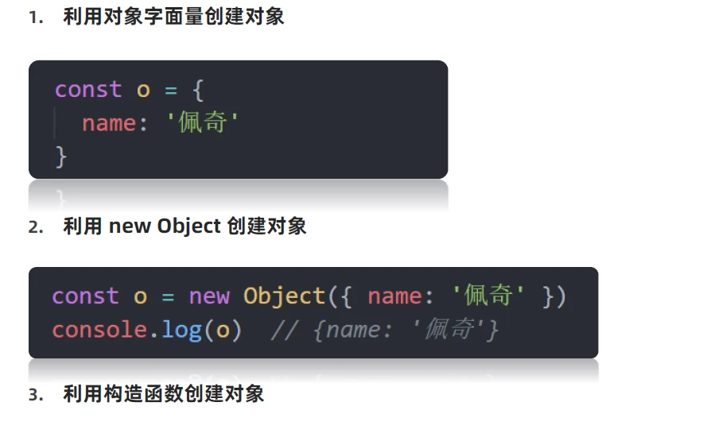

### 构造函数

**构造函数**是专门用于创建对象的函数，如果一个函数使用 `new` 关键字调用，那么这个函数就是构造函数。

```html
<script>
  // 定义函数
  function foo() {
    console.log('通过 new 也能调用函数...');
  }
  // 调用函数
  new foo;
</script>
```

总结：

1. 使用 `new` 关键字调用函数的行为被称为**实例化**

2. 实例化构造函数时没有参数时可以省略 `()`
3. 构造函数的返回值即为新创建的对象
4. 构造函数内部的 `return` 返回的值无效！所以不要写return
5. `new Object()`和 `new Date()`也是实例化构造函数

注：实践中为了从视觉上区分构造函数和普通函数，习惯将构造函数的**首字母大写**。

### 实例化过程

1. 创建新空对象
2. 构造函数this指向新对象
3. 执行构造函数代码，修改this，添加新的属性
4. 返回新对象

### 实例成员

通过构造函数创建的对象称为实例对象，<span style="color:red">实例对象中</span>的属性和方法称为<span style="color:red">实例成员</span> (实例属性和实例方法)。

```html
<script>
  // 构造函数
  function Person() {
    // 构造函数内部的 this 就是实例对象
    // 实例对象中动态添加属性
    this.name = '小明'
    // 实例对象动态添加方法
    this.sayHi = function () {
      console.log('大家好~')
    }
  }
  // 实例化，p1 是实例对象
  // p1 实际就是 构造函数内部的 this
  const p1 = new Person()
  console.log(p1)
  console.log(p1.name) // 访问实例属性
  p1.sayHi() // 调用实例方法
</script>
```

总结：

1. 构造函数内部 `this` 实际上就是实例对象，为其动态添加的属性和方法即为实例成员
2. 为构造函数传入参数，动态创建结构相同但值不同的对象

注：构造函数创建的实例对象彼此独立互不影响。

### 静态成员

在 JavaScript 中底层函数本质上也是对象类型，因此允许直接为函数动态添加属性或方法，构造函数的属性和方法被称为静态成员。

```html
<script>
  // 构造函数
  function Person(name, age) {
    // 省略实例成员
  }
  // 静态属性
  Person.eyes = 2
  Person.arms = 2
  // 静态方法
  Person.walk = function () {
    console.log('^_^人都会走路...')
    // this 指向 Person
    console.log(this.eyes)
  }
</script>
```

总结：

1. 静态成员指的是添加到构造函数本身的属性和方法
2. 一般公共特征的属性或方法静态成员设置为静态成员
3. 静态成员方法中的 `this` 指向构造函数本身

## 内置构造函数

> 掌握各引用类型和包装类型对象属性和方法的使用。

在 JavaScript 中**最主要**的数据类型有 6 种，分别是字符串、数值、布尔、undefined、null 和 对象，常见的对象类型数据包括数组和普通对象。其中字符串、数值、布尔、undefined、null 也被称为简单类型或基础类型，对象也被称为引用类型。

在 JavaScript 内置了一些构造函数，绝大部的数据处理都是基于这些构造函数实现的，JavaScript 基础阶段学习的 `Date` 就是内置的构造函数。

```html
<script>
  // 实例化
	let date = new Date();
  
  // date 即为实例对象
  console.log(date);
</script>
```

甚至字符串、数值、布尔、数组、普通对象也都有专门的构造函数，用于创建对应类型的数据。

### Object

`Object` 是内置的构造函数，用于创建普通对象。

```html
<script>
  // 通过构造函数创建普通对象
  const user = new Object({name: '小明', age: 15})

  // 这种方式声明的变量称为【字面量】
  let student = {name: '杜子腾', age: 21}
  
  // 对象语法简写
  let name = '小红';
  let people = {
    // 相当于 name: name
    name,
    // 相当于 walk: function () {}
    walk () {
      console.log('人都要走路...');
    }
  }

  console.log(student.constructor);
  console.log(user.constructor);
  console.log(student instanceof Object);
</script>
```

总结：

1. 推荐使用字面量方式声明对象，而不是 `Object` 构造函数

2. `Object.assign` 静态方法创建新的对象，经常使用给对象添加属性的场景

   **语法**: `Object.assign(target, ...sources)`

   **参数:** 

   - `target` 目标对象，接收源对象属性的对象，也是修改后的返回值。

   - `sources` 源对象，包含将被合并的属性。

   **返回值:** 目标对象

   ```js
   // 拷贝对象 把 o 拷贝给 obj
   const o = { name: '佩奇', age: 6 }
   const obj = {}
   const newObj = Object.assign(obj, o)
   console.log(obj)  // {name: '佩奇', age: 6}
   console.log(newObj)  // {name: '佩奇', age: 6}
   
   // 给 o 添加属性
   Object.assign(o,{ gender: '女' })
   console.log(o)  // {name: '佩奇', age: 6, gender: '女'}
   
   // 源对象存在目标对象相同的值，则会修改目标对象的该数据
   Object.assign(o,{name:'小猪佩奇'})
   console.log(o) // {name: '小猪佩奇', age: 6, gender: '女'}
   ```

3. `Object.keys` 静态方法获取对象中所有属性
  ```js
  const o = {uname:'pink',age:18}
  // 获得所有的属性名
  console.log(Object.keys(o))  //=>返回数组 ['uname', 'age']
  ```

  **注意:**  返回的是一个数组


4. `Object.values` 表态方法获取对象中所有属性值
	 ```js
   const o = {uname:'pink',age:18}
   // 获得所有的属性值
   console.log(Object.values(o)) //=>返回数组 ['pink', 18]
   ```

   **注意:**  返回的是一个数组

### Array

`Array` 是内置的构造函数，用于创建数组。

```html
<script>
  // 构造函数创建数组
  let arr = new Array(5, 7, 8);

  // 字面量方式创建数组
  let list = ['html', 'css', 'javascript']

</script>
```

数组赋值后，无论修改哪个变量另一个对象的数据值也会相当发生改变。

|  方法   |                  作用                   |                             说明                             |
| :-----: | :-------------------------------------: | :----------------------------------------------------------: |
| forEach | <span style="color:red">遍历</span>数组 | 不返回数组，经常用于<span style="color:red">查找遍历数组元素</span> |
| filter  | <span style="color:red">过滤</span>数组 | <span style="color:red">返回新数组</span>，返回的是<span style="color:red">筛选满足条件</span>的数组元素 |
|   map   | <span style="color:red">迭代</span>数组 | <span style="color:red">返回新数组，</span>返回的是<span style="color:red">处理之后</span>的数组元素，想要使用返回的新数组 |
| reduce  |  <span style="color:red">累计器</span>  |              返回累计处理的结果，经常用于求和等              |
|         |                                         |                                                              |
|         |                                         |                                                              |
|         |                                         |                                                              |
|         |                                         |                                                              |
|         |                                         |                                                              |

总结：

1. 推荐使用字面量方式声明数组，而不是 `Array` 构造函数

2. 实例方法 `forEach` 用于遍历数组，替代 `for` 循环 (重点)

3. 实例方法 `filter` 过滤数组单元值，生成新数组(重点)

4. 实例方法 `map` 迭代原数组，生成新数组(重点)

5. 实例方法 `join` 数组元素拼接为字符串，返回字符串(重点)

6. 实例方法  `find`  查找元素， 返回符合测试条件的<span style="color:red">第一个数组元素值</span>，如果没有符合条件的则返回 undefined(重点)

   ```js
   // const arr = ['red','blue','green']
   // const re = arr.find(function(item){
   //     return item === 'blue'
   // })
   // console.log(re) //=>blue
   
   const arr = [
       {
           name: '小米',
           price: 1999
       },
       {
           name: '华为',
           price: 3999
       }
   ]
   // 找小米 这个对象，并且返回这个对象
   const mi = arr.find(item => item.name === '小米')
   console.log(mi) //=>{name: '小米', price: 1999}
   ```

7. 实例方法`every` 检测数组所有元素是否都符合指定条件，如果**所有元素**都通过检测返回 true，否则返回 false(重点)

8. 实例方法`some` 检测数组中的元素是否满足指定条件   **如果数组中有**元素满足条件返回 true，否则返回 false

9. 实例方法 `concat`  合并两个数组，返回生成新数组

10. 实例方法 `sort` 对原数组单元值排序

11. 实例方法 `splice` 删除或替换原数组单元

12. 实例方法 `reverse` 反转数组

13. 实例方法 `findIndex`  查找元素的索引值


`reduce`

- **作用**: `reduce` 返回<span style="color:red">累计处理的结果</span>，经常用于<span style="color:red">求和等</span>

- **基本语法:** `arr.reduce(function(){}, 起始值)`

  `arr.reduce(function(上一次值, 当前值){}, 初始值)`

- **参数:**

  1. 如果<span style="color:red">有起始值</span>，则把初始值累加到里面

```js
const arr = [1, 5, 8]

// 1. 没有初始值
const total = arr.reduce(function (prev, current) {
        return prev + current
})
console.log(total)  //=>14
// 2.有初始值
const total1 = arr.reduce(function (prev, current) {
        return prev + current
}, 10)
console.log(total1) //=>24
// 3. 箭头函数的写法
const total2 = arr.reduce((prev, current) => prev + current, 10)
console.log(total2) //=>24
```

- reduce 执行过程
  1. 如果<span style="color:red">没有起始值</span>，则<span style="color:red">上一次值以</span>数组的<span style="color:red">第一个数组元素的值</span>
  2. 每一次循环，把<span style="color:red">返回值</span>给做为 下一次循环的<span style="color:red">上一次值</span>
  3. 如果<span style="color:red">有起始值</span>，则起始值做为<span style="color:red">上一次值</span>

`Array.from()`

> 把伪数组转换为真数组

```js
// Array.from(lis) 把伪数组转换为真数组
const lis = document.querySelectorAll('ul li')
// console.log(lis)
// lis.pop()  //报错
const liss = Array.from(lis)
liss.pop()
console.log(liss)
```


### 包装类型

在 JavaScript 中的字符串、数值、布尔具有对象的使用特征，如具有属性和方法，如下代码举例：

```html
<script>
  // 字符串类型
  const str = 'hello world!'
 	// 统计字符的长度（字符数量）
  console.log(str.length)
  
  // 数值类型
  const price = 12.345
  // 保留两位小数
  price.toFixed(2) // 12.34
</script>
```

之所以具有对象特征的原因是字符串、数值、布尔类型数据是 JavaScript 底层使用 Object 构造函数“包装”来的，被称为包装类型。

#### String

`String` 是内置的构造函数，用于创建字符串。

```html
<script>
  // 使用构造函数创建字符串
  let str = new String('hello world!');

  // 字面量创建字符串
  let str2 = '你好，世界！';

  // 检测是否属于同一个构造函数
  console.log(str.constructor === str2.constructor); // true
  console.log(str instanceof String); // false
</script>
```

总结：

1. 实例属性 `length` 用来获取字符串的度长(重点)

2. 实例方法 `split('分隔符')` 用来将字符串拆分成数组(重点)

   ```js
   // split 把字符串 转换为 数组  和 join()  相反
   const str = 'pink,red'
   const arr = str.split(',')
   console.log(arr)   //=> ['pink', 'red']
   const str1 = '2023-2-26'
   const arr1 = str1.split('-')
   console.log(arr1)  //=> ['2023', '2', '26']
   ```

3. 实例方法 `substring（需要截取的第一个字符的索引[,结束的索引号]）` 用于字符串截取(重点)

   ```js
   // 字符串的截取  substring(开始的索引号[,借宿的索引号])
   // 1. 如果省略 结束索引号，默认取到最后
   const str = '今天又要做核酸了'
   console.log(str.substring(5))  //=>核酸了
   // 2. 结束的索引号不包含想要截取的部分
   console.log(str.substring(5,6))  //=>核
   ```

4. 实例方法 `startsWith(检测字符串[, 检测位置索引号])` 检测是否以某字符开头(重点)

   ```js
   // startsWith 判断是不是以某个字符开头
   const str = 'pink老师上课中'
   console.log(str.startsWith('pink'))  //=>true
   ```

5. 实例方法 `includes(搜索的字符串[, 检测位置索引号])` 判断一个字符串是否包含在另一个字符串中，根据情况返回 true 或 false(重点)

   ```js
   // includes 判断某个字符是不是包含在一个字符里面
   const str = '我是pink老师'
   console.log(str.includes('pink')) //=>true
   ```

6. 实例方法 `toUpperCase` 用于将字母转换成大写

7. 实例方法 `toLowerCase` 用于将就转换成小写

8. 实例方法 `indexOf`  检测是否包含某字符

9. 实例方法 `endsWith` 检测是否以某字符结尾

10. 实例方法 `replace` 用于替换字符串，支持正则匹配

11. 实例方法 `match` 用于查找字符串，支持正则匹配

注：String 也可以当做普通函数使用，这时它的作用是强制转换成字符串数据类型。

- 转换为字符串 `String()`  `xxx.toString()`

```js
const num = 10
console.log(String(num))  //=>'10'
console.log(num.toString()) //=>'10'
```


#### Number

`Number` 是内置的构造函数，用于创建数值。

```html
<script>
  // 使用构造函数创建数值
  let x = new Number('10')
  let y = new Number(5)

  // 字面量创建数值
  let z = 20

</script>
```

总结：

1. 推荐使用字面量方式声明数值，而不是 `Number` 构造函数

2. 实例方法 `toFixed` 用于设置保留小数位的长度

   ```js
   // 数值类型
   const price = 12.345
   // 保留2位小数   四舍五入
   console.log(price.toFixed(2))   // 12.35
   // toFixed 方法可以让数字指定保留的小数位数
   const num = 10.123
   console.log(num.toFixed()) //=>10
   const num1 = 10.923
   console.log(num1.toFixed()) //=>11
   console.log(num1.toFixed(2)) //=>10.92
   const num2 = 10
   console.log(num2.toFixed(2))  //=> 10.00
   ```


# JavaScript 进阶 - 第3天笔记

> 了解构造函数原型对象的语法特征，掌握 JavaScript 中面向对象编程的实现方式，基于面向对象编程思想实现 DOM 操作的封装。

- 了解面向对象编程的一般特征
- 掌握基于构造函数原型对象的逻辑封装
- 掌握基于原型对象实现的继承
- 理解什么原型链及其作用
- 能够处理程序异常提升程序执行的健壮性

## 编程思想

> 学习 JavaScript 中基于原型的面向对象编程序的语法实现，理解面向对象编程的特征。

### 面向过程

<span style="color:red">面向过程</span>就是分析出解决问题所需要的步骤，然后用函数把这些步骤一步一步实现，使用的时候再一个一个的依次调用就可以了。

 举个栗子：蛋炒饭


### 面向对象

<span style="color:red">面向对象</span>是把事务分解成为一个个对象，然后由对象之间分工与合作。

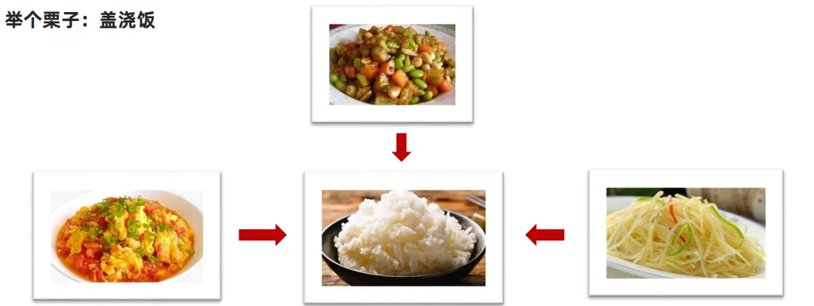

<span style="color:red">面向对象是以对象功能来划分问题，而不是步骤</span>


- 在面向对象程序开发思想中，每一个对象都是功能中心，具有明确分工。

- 面向对象编程具有灵活、代码可复用、容易维护和开发的优点，更适合多人合作的大型软件项目。

- 面向对象的特性：

  - 封装性
  - 继承性
  - 多态性

  

  

  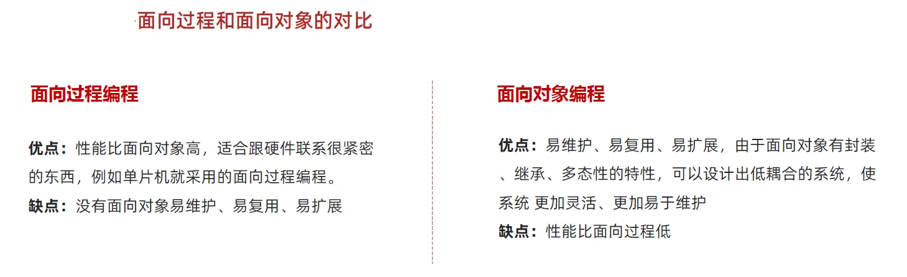

## 构造函数

对比以下通过面向对象的构造函数实现的封装：

```html
<script>
  function Person() {
    this.name = '佚名'
    // 设置名字
    this.setName = function (name) {
      this.name = name
    }
    // 读取名字
    this.getName = () => {
      console.log(this.name)
    }
  }

  // 实例对像，获得了构造函数中封装的所有逻辑
  let p1 = new Person()
  p1.setName('小明')
  console.log(p1.name)

  // 实例对象
  let p2 = new Person()
  console.log(p2.name)
</script>
```

- 封装是面向对象思想中比较重要的一部分，js面向对象可以通过构造函数实现的封装。

- 同样的将变量和函数组合到了一起并能通过 this 实现数据的共享，所不同的是借助构造函数创建出来的实例对象之间是彼此不影响的

>总结：
>
>1. 构造函数体现了面向对象的封装特性
>2. 构造函数实例创建的对象彼此独立、互不影响

- 封装是面向对象思想中比较重要的一部分，js面向对象可以通过构造函数实现的封装。

- 前面我们学过的构造函数方法很好用，但是 <span style="color:red">存在浪费内存的问题</span>

## 原型对象

> 构造函数通过原型分配的函数是所有对象所 <span style="color:red">共享的</span>。

- JavaScript 规定，<span style="color:red">每一个构造函数都有一个 prototype 属性</span>，指向另一个对象，所以我们也称为原型对象
- 这个对象可以挂载函数，对象实例化不会多次创建原型上函数，节约内存
- <span style="color:red">我们可以把那些不变的方法，直接定义在 prototype 对象上，这样所有对象的实例就可以共享这些方法。</span>
- <span style="color:red">构造函数和原型对象中的this 都指向 实例化的对象</span>

```html
<script>
  function Person() {
    
  }

  // 每个函数都有 prototype 属性
  console.log(Person.prototype)
</script>
```


了解了 JavaScript 中构造函数与原型对象的关系后，再来看原型对象具体的作用，如下代码所示：

```html
<script>
  function Person() {
    // 此处未定义任何方法
  }

  // 为构造函数的原型对象添加方法
  Person.prototype.sayHi = function () {
    console.log('Hi~');
  }
	
  // 实例化
  let p1 = new Person();
  p1.sayHi(); // 输出结果为 Hi~
</script>
```


构造函数 `Person` 中未定义任何方法，这时实例对象调用了原型对象中的方法 `sayHi`，接下来改动一下代码：

```html
<script>
	// 1. 公共的属性写到 构造函数里面
	function Person() {
		// 此处定义同名方法 sayHi
		this.sayHi = function () {
			console.log('嗨!');
		}
	}

	// 为构造函数的原型对象添加方法
	// 2. 公共的方法写到原型对象身上
	Person.prototype.sayHi = function () {
		console.log('Hi~');
	}

	let p1 = new Person();
	p1.sayHi(); // 输出结果为 嗨!
</script>
```

构造函数 `Person` 中定义与原型对象中相同名称的方法，这时实例对象调用则是构造函中的方法 `sayHi`。

通过以上两个简单示例不难发现 JavaScript 中对象的工作机制：**当访问对象的属性或方法时，先在当前实例对象是查找，然后再去原型对象查找，并且原型对象被所有实例共享。**

```html
<script>
	function Person() {
    // 此处定义同名方法 sayHi
    this.sayHi = function () {
      console.log('嗨!' + this.name)
    }
  }

  // 为构造函数的原型对象添加方法
  Person.prototype.sayHi = function () {
    console.log('Hi~' + this.name)
  }
  // 在构造函数的原型对象上添加属性
  Person.prototype.name = '小明'

  let p1 = new Person()
  p1.sayHi(); // 输出结果为 嗨!
  
  let p2 = new Person()
  p2.sayHi()
</script>
```

总结：**结合构造函数原型的特征，实际开发重往往会将封装的功能函数添加到原型对象中。**

### constructor 属性

**在哪里？** 每个原型对象里面都有个constructor 属性（constructor 构造函数）

**作用：**该属性<span style="color:red">指向</span>该原型对象的<span style="color:red">构造函数， 简单理解，就是指向我的爸爸，我是有爸爸的孩子</span>

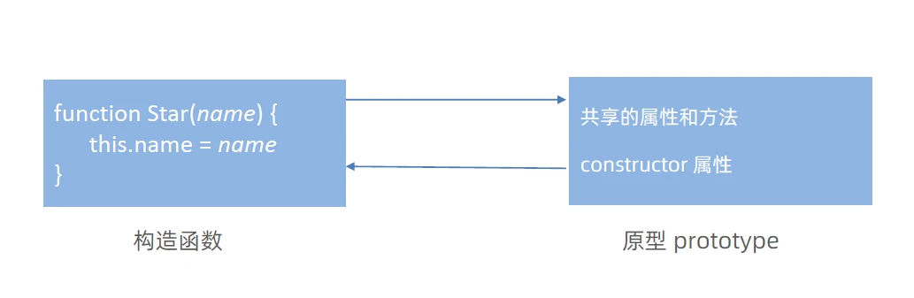

**使用场景：**

如果有多个对象的方法，我们可以给原型对象采取对象形式赋值.

但是这样就会覆盖构造函数原型对象原来的内容，这样修改后的原型对象 constructor 就不再指向当前构造函数了

此时，我们可以在修改后的原型对象中，添加一个 constructor 指向原来的构造函数。

```js
// constructor 单词 构造函数
function Star() {

}
// Star.prototype.sing = function(){
//   console.log('唱歌')
// }
// Star.prototype.dance = function(){
//   console.log('跳舞')
// }
console.log(Star.prototype)

Star.prototype = {
  // 重新指回创造这个原型对象的 构造函数
  constructor: Star,
  sing: function () {
    console.log('唱歌')
  },
  dance: function () {
    console.log('跳舞')
  }
}
console.log(Star.prototype)
```


### 对象原型

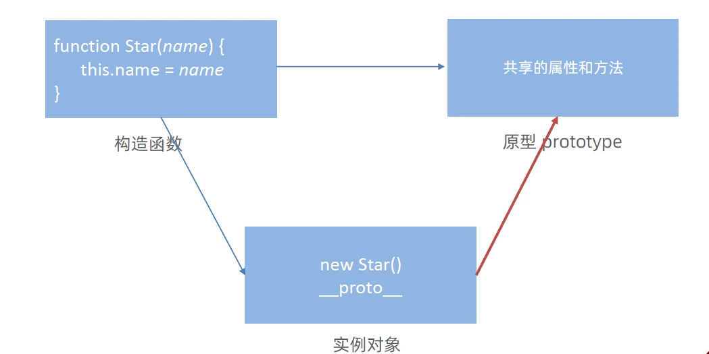

<span style="color:red">对象都会有一个属性 `__proto__`</span> 指向构造函数的 prototype 原型对象，之所以我们对象可以使用构造函数 prototype 原型对象的属性和方法，就是因为对象有 `__proto__` 原型的存在。

注意：

- `__proto__` 是JS非标准属性
- [[prototype]]和`__proto__`意义相同
- 用来表明当前实例对象指向哪个原型对象prototype
- `__proto__`对象原型里面也有一个 constructor属性，<span style="color:red">指向创建该实例对象的构造函数</span>

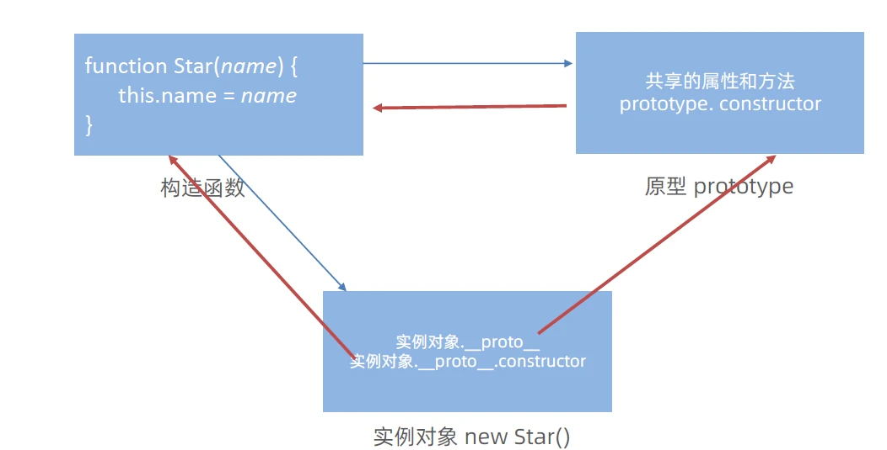

### 原型继承

继承是面向对象编程的另一个特征，通过继承进一步提升代码封装的程度，JavaScript 中大多是借助原型对象实现继承的特性。

龙生龙、凤生凤、老鼠的儿子会打洞描述的正是继承的含义。

```html
<body>
  <script>
    // 继续抽取   公共的部分放到原型上
    // const Person1 = {
    //   eyes: 2,
    //   head: 1
    // }
    // const Person2 = {
    //   eyes: 2,
    //   head: 1
    // }
    // 构造函数  new 出来的对象 结构一样，但是对象不一样
    function Person() {
      this.eyes = 2
      this.head = 1
    }
    // console.log(new Person)
    // 女人  构造函数   继承  想要 继承 Person
    function Woman() {

    }
    // Woman 通过原型来继承 Person
    // 父构造函数（父类）   子构造函数（子类）
    // 子类的原型 =  new 父类  
    Woman.prototype = new Person()   // {eyes: 2, head: 1} 
    // 指回原来的构造函数
    Woman.prototype.constructor = Woman

    // 给女人添加一个方法  生孩子
    Woman.prototype.baby = function () {
      console.log('宝贝')
    }
    const red = new Woman()
    console.log(red)
    // console.log(Woman.prototype)
    // 男人 构造函数  继承  想要 继承 Person
    function Man() {

    }
    // 通过 原型继承 Person
    Man.prototype = new Person()
    Man.prototype.constructor = Man
    const pink = new Man()
    console.log(pink)
  </script>
</body>
```

### 原型链

基于原型对象的继承使得不同构造函数的原型对象关联在一起，并且这种关联的关系是一种链状的结构，我们将原型对象的链状结构关系称为原型链。

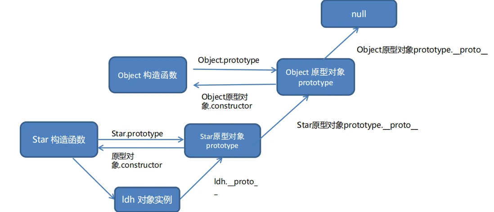

- 只要是对象就有`__proto__`对象原型 指向原型对象

- 只要是原型对象就有`constructor`指回 创造该原型对象的构造函数

```html
<body>
  <script>
    // function Objetc() {}
    console.log(Object.prototype)
    console.log(Object.prototype.__proto__)

    function Person() {

    }
    const ldh = new Person()
    // console.log(ldh.__proto__ === Person.prototype)
    // console.log(Person.prototype.__proto__ === Object.prototype)
    console.log(ldh instanceof Person)
    console.log(ldh instanceof Object)
    console.log(ldh instanceof Array)
    console.log([1, 2, 3] instanceof Array)
    console.log(Array instanceof Object)
  </script>
</body>
```

<span style="color:red">查找规则</span>

① 当访问一个对象的属性（包括方法）时，首先查找这个<span style="color:red">对象自身</span>有没有该属性。

② 如果没有就查找它的原型（也就是 `__proto__`指向的<span style="color:red"> prototype 原型对象</span>）

③ 如果还没有就查找原型对象的原型（<span style="color:red">Object的原型对象</span>）

④ 依此类推一直找到 Object 为止（<span style="color:red">null</span>）

⑤ `__proto__`对象原型的意义就在于为对象成员查找机制提供一个方向，或者说一条路线

⑥ 可以使用 `instanceof` 运算符用于检测构造函数的 prototype 属性是否出现在某个实例对象的原型链上

```js
function Person() {

}
const ldh = new Person()
console.log(ldh instanceof Person)  //=>true
console.log(ldh instanceof Object)  //=>true
console.log(ldh instanceof Array)   //=>false
console.log([1, 2, 3] instanceof Array) //=>true
console.log(Array instanceof Object)  //=>true
```

原型链其实就是一个查找规则，为对象成员查找机制提供一个方向。因为构造函数的 prototype 和其实例的 `__proto__` 都是指向原型对象的，所以可以通过 `__proto__` 查找当前的原型对象有没有该属性 ,没有就找原型的原型 , 依次类推一直找到 Object( null ) 为止，这种链式查找过程称之为原型链

# JavaScript 进阶 - 第4天

## 深浅拷贝

### 浅拷贝

首先浅拷贝和深拷贝只针对引用类型

浅拷贝：拷贝的是地址

**常见方法：**

1. 拷贝对象：Object.assgin() / 展开运算符 {...obj} 拷贝对象
2. 拷贝数组：Array.prototype.concat() 或者 [...arr]

>如果是简单数据类型拷贝值，引用数据类型拷贝的是地址 (简单理解： 如果是单层对象，没问题，如果有多层就有问题)

### 深拷贝

首先浅拷贝和深拷贝只针对引用类型

深拷贝：拷贝的是对象，不是地址

**常见方法：**

1. 通过递归实现深拷贝
2. lodash/cloneDeep
3. 通过JSON.stringify()实现

#### 递归实现深拷贝

**函数递归：**

<span style="color:red">如果一个函数在内部可以调用其本身，那么这个函数就是递归函数</span>

- 简单理解:函数内部自己调用自己, 这个函数就是递归函数
- 递归函数的作用和循环效果类似
- 由于递归很容易发生“栈溢出”错误（stack overflow），所以<span style="color:red">必须要加退出条件 return</span>

~~~html
<body>
  <script>
    const obj = {
      uname: 'pink',
      age: 18,
      hobby: ['乒乓球', '足球'],
      family: {
        baby: '小pink'
      }
    }
    const o = {}
    // 拷贝函数
    function deepCopy(newObj, oldObj) {
      debugger
      for (let k in oldObj) {
        // 处理数组的问题  一定先写数组 在写 对象 不能颠倒
        if (oldObj[k] instanceof Array) {
          newObj[k] = []
          //  newObj[k] 接收 []  hobby
          //  oldObj[k]   ['乒乓球', '足球']
          deepCopy(newObj[k], oldObj[k])
        } else if (oldObj[k] instanceof Object) {
          newObj[k] = {}
          deepCopy(newObj[k], oldObj[k])
        }
        else {
          //  k  属性名 uname age    oldObj[k]  属性值  18
          // newObj[k]  === o.uname  给新对象添加属性
          newObj[k] = oldObj[k]
        }
      }
    }
    deepCopy(o, obj) // 函数调用  两个参数 o 新对象  obj 旧对象
    console.log(o)
    o.age = 20
    o.hobby[0] = '篮球'
    o.family.baby = '老pink'
    console.log(obj)
    console.log([1, 23] instanceof Object)
    // 复习
    // const obj = {
    //   uname: 'pink',
    //   age: 18,
    //   hobby: ['乒乓球', '足球']
    // }
    // function deepCopy({ }, oldObj) {
    //   // k 属性名  oldObj[k] 属性值
    //   for (let k in oldObj) {
    //     // 处理数组的问题   k 变量
    //     newObj[k] = oldObj[k]
    //     // o.uname = 'pink'
    //     // newObj.k  = 'pink'
    //   }
    // }
  </script>
</body>
~~~

#### js库lodash里面cloneDeep内部实现了深拷贝

~~~html
<body>
  <!-- 先引用 -->
  <script src="./lodash.min.js"></script>
  <script>
    const obj = {
      uname: 'pink',
      age: 18,
      hobby: ['乒乓球', '足球'],
      family: {
        baby: '小pink'
      }
    }
    const o = _.cloneDeep(obj)
    console.log(o)
    o.family.baby = '老pink'
    console.log(obj)
  </script>
</body>
~~~

#### JSON序列化

~~~html
<body>
  <script>
    const obj = {
      uname: 'pink',
      age: 18,
      hobby: ['乒乓球', '足球'],
      family: {
        baby: '小pink'
      }
    }
    // 把对象转换为 JSON 字符串
    // console.log(JSON.stringify(obj))
    const o = JSON.parse(JSON.stringify(obj))
    console.log(o)
    o.family.baby = '123'
    console.log(obj)
  </script>
</body>
~~~

## 异常处理

> 了解 JavaScript 中程序异常处理的方法，提升代码运行的健壮性。

### throw

异常处理是指预估代码执行过程中可能发生的错误，然后最大程度的避免错误的发生导致整个程序无法继续运行

总结：

1. throw 抛出异常信息，程序也会终止执行
2. throw 后面跟的是错误提示信息
3. Error 对象配合 throw 使用，能够设置更详细的错误信息

```html
<script>
  function counter(x, y) {

    if(!x || !y) {
      // throw '参数不能为空!';
      throw new Error('参数不能为空!')
    }

    return x + y
  }

  counter()
</script>
```

总结：

1. `throw` 抛出异常信息，程序也会终止执行
2. `throw` 后面跟的是错误提示信息
3. `Error` 对象配合 `throw` 使用，能够设置更详细的错误信息

### try ... catch

```html
<script>
   function foo() {
      try {
        // 查找 DOM 节点
        const p = document.querySelector('.p')
        p.style.color = 'red'
      } catch (error) {
        // 拦截错误，提示浏览器提供的错误信息，但是不中断程序的执行
        // try 代码段中执行有错误时，会执行 catch 代码段
        // 查看错误信息
        console.log(error.message)
        // 终止代码继续执行
        return

      }
      finally {
          // 不管你程序对不对，一定会执行的代码
          alert('执行')
      }
      console.log('如果出现错误，我的语句不会执行')
    }
    foo()
</script>
```

总结：

1. `try...catch` 用于捕获错误信息
2. 将预估可能发生错误的代码写在 `try` 代码段中
3. 如果 `try` 代码段中出现错误后，会执行 `catch` 代码段，并截获到错误信息
4. `finally` 不管是否有错误，都会执行


### debugger

相当于断点调试

## 处理this

> 了解函数中 this 在不同场景下的默认值，知道动态指定函数 this 值的方法。

`this` 是 JavaScript 最具“魅惑”的知识点，不同的应用场合 `this` 的取值可能会有意想不到的结果，在此我们对以往学习过的关于【 `this` 默认的取值】情况进行归纳和总结。

### 普通函数

**普通函数**的调用方式决定了 `this` 的值，即【谁调用 `this` 的值指向谁】，如下代码所示：

```html
<script>
  // 普通函数
  function sayHi() {
    console.log(this)  
  }
  // 函数表达式
  const sayHello = function () {
    console.log(this)
  }
  // 函数的调用方式决定了 this 的值
  sayHi() // window
  window.sayHi()
	

// 普通对象
  const user = {
    name: '小明',
    walk: function () {
      console.log(this)
    }
  }
  // 动态为 user 添加方法
  user.sayHi = sayHi
  uesr.sayHello = sayHello
  // 函数调用方式，决定了 this 的值
  user.sayHi()
  user.sayHello()
</script>
```

注： 普通函数没有明确调用者时 `this` 值为 `window`，严格模式下没有调用者时 `this` 的值为 `undefined`。

### 箭头函数

**箭头函数**中的 `this` 与普通函数完全不同，也不受调用方式的影响，事实上箭头函数中并不存在 `this` ！箭头函数中访问的 `this` 不过是箭头函数所在作用域的 `this` 变量。

1. 箭头函数会默认帮我们绑定外层 `this` 的值，所以在箭头函数中 `this` 的值和外层的 `this` 是一样的
2. 箭头函数中的 `this` 引用的就是最近作用域中的 `this`
3. 向外层作用域中，一层一层查找 `this`，直到有 `this` 的定义

```html
<script>
    
  console.log(this) // 此处为 window
  // 箭头函数
  const sayHi = function() {
    console.log(this) // 该箭头函数中的 this 为函数声明环境中 this 一致
  }
  // 普通对象
  const user = {
    name: '小明',
    // 该箭头函数中的 this 为函数声明环境中 this 一致
    walk: () => {
      console.log(this)
    },
    
    sleep: function () {
      let str = 'hello'
      console.log(this)
      let fn = () => {
        console.log(str)
        console.log(this) // 该箭头函数中的 this 与 sleep 中的 this 一致
      }
      // 调用箭头函数
      fn();
    }
  }

  // 动态添加方法
  user.sayHi = sayHi
  
  // 函数调用
  user.sayHi()
  user.sleep()
  user.walk()
</script>
```

在开发中【使用箭头函数前需要考虑函数中 `this` 的值】，**事件回调函数**使用箭头函数时，`this` 为全局的 `window`，因此DOM事件回调函数不推荐使用箭头函数，如下代码所示：

```html
<script>
  // DOM 节点
  const btn = document.querySelector('.btn')
  // 箭头函数 此时 this 指向了 window
  btn.addEventListener('click', () => {
    console.log(this)
  })
  // 普通函数 此时 this 指向了 DOM 对象
  btn.addEventListener('click', function () {
    console.log(this)
  })
</script>
```

同样由于箭头函数 `this` 的原因，**基于原型的面向对象也不推荐采用箭头函数**，如下代码所示：

```html
<script>
  function Person() {
  }
  // 原型对像上添加了箭头函数
  Person.prototype.walk = () => {
    console.log('人都要走路...')
    console.log(this); // window
  }
  const p1 = new Person()
  p1.walk()
</script>
```

**总结:**

1. 函数内不存在 `this`，沿用上一级的，过程: 向外层作用域中，一层一层查找this，直到有this的定义
2. 不适用
   - 构造函数，原型函数，dom 事件函数等等
3. 适用
   - 需要使用上层 `this` 的地方
4. 使用正确的话，它会在很多地方带来方便，后面我们会大量使用慢慢体会

### 改变this指向

以上归纳了普通函数和箭头函数中关于 `this` 默认值的情形，不仅如此 JavaScript 中还允许指定函数中 `this` 的指向，有 3 个方法可以动态指定普通函数中 `this` 的指向：

#### call

> 使用 `call` 方法调用函数，同时指定函数中 `this` 的值

**语法:** `fun.call(thisArg, arg1, arg2, ...)`

- thisArg: 在 fun 函数运行时指定的 this 值
- arg1，arg2: 传递的其它参数
- 返回值就是函数的返回值，因为它就是调用函数

使用方法如下代码所示：

```html
<script>
  // 普通函数
  function sayHi() {
    console.log(this);
  }

  let user = {
    name: '小明',
    age: 18
  }

  let student = {
    name: '小红',
    age: 16
  }

  // 调用函数并指定 this 的值
  sayHi.call(user); // this 值为 user
  sayHi.call(student); // this 值为 student

  // 求和函数
  function counter(x, y) {
    return x + y;
  }

  // 调用 counter 函数，并传入参数
  let result = counter.call(null, 5, 10);
  console.log(result);
</script>
```

总结：

1. `call` 方法能够在调用函数的同时指定 `this` 的值
2. 使用 `call` 方法调用函数时，第1个参数为 `this` 指定的值
3. `call` 方法的其余参数会依次自动传入函数做为函数的参数

#### apply

>  使用 `apple` 方法**调用函数**，同时指定函数中 `this` 的值

**语法:** `fun.apply(thisArg, [argsArray])`

- thisArg: 在fun函数运行时指定的 `this` 的值
- argsArray: 传递的值，必须包含在`数组`里面
- 返回值就是函数的返回值，因为它就是调用函数
- 因此 apply 主要跟数组有关系，比如使用 Math.max() 求数组的最大值

使用方法如下代码所示：

```html
<script>
  // 普通函数
  function sayHi() {
    console.log(this)
  }

  let user = {
    name: '小明',
    age: 18
  }

  let student = {
    name: '小红',
    age: 16
  }

  // 调用函数并指定 this 的值
  sayHi.apply(user) // this 值为 user
  sayHi.apply(student) // this 值为 student

  // 求和函数
  function counter(x, y) {
    return x + y
  }
  // 调用 counter 函数，并传入参数
  let result = counter.apply(null, [5, 10])
  console.log(result)
</script>
```

总结：

1. `apply` 方法能够在调用函数的同时指定 `this` 的值
2. 使用 `apply` 方法调用函数时，第1个参数为 `this` 指定的值
3. `apply` 方法第2个参数为数组，数组的单元值依次自动传入函数做为函数的参数

#### bind

> `bind`方法并**不会调用函数**，而是创建一个指定了`this`值的新函数，能改变函数内部`this`指向

**语法:** `fun.bind(thisArg, arg1, arg2, ...)`

- thisArg: 在 fun 函数运行时指定的 this 值
- arg1，arg2: 传递的其它参数
- 返回由指定的 this 值和初始化参数改造的 `原函数拷贝 (新函数)`
- 因此当我们只是想改变 this 指向，并不想调用这个函数的时候，可以使用bind，比如改变定时器内部的 this 指向

使用方法如下代码所示：

```html
<script>
  // 普通函数
  function sayHi() {
    console.log(this)
  }
  let user = {
    name: '小明',
    age: 18
  }
  // 调用 bind 指定 this 的值
  let sayHello = sayHi.bind(user);
  // 调用使用 bind 创建的新函数
  sayHello()
</script>
```

注：`bind` 方法创建新的函数，与原函数的唯一的变化是改变了 `this` 的值。

## 防抖节流

### 防抖（debounce）

> 单位时间内，频繁触发事件，<span style="color:red">只执行最后一次</span>

所谓防抖，就是指触发事件后在 n 秒内函数只能执行一次，如果在 n 秒内又触发了事件，则会重新计算函数执行时间

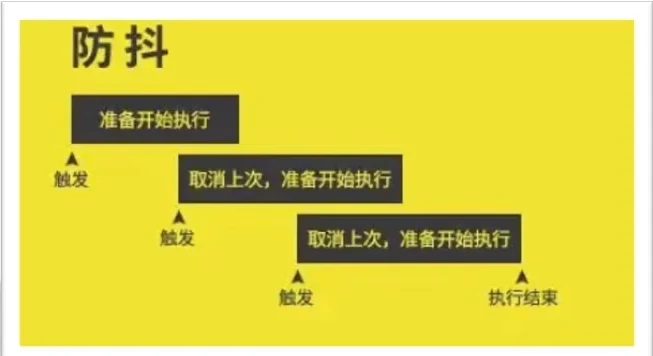

**利用lodash实现防抖**

```html
<body>
  <div class="box"></div>
  <script src="./lodash.min.js"></script>
  <script>
    // 利用防抖实现性能优化
    // 需求: 鼠标在盒子上移动，里面的数字就会变化 + 1
    const box = document.querySelector('.box')
    let i = 1
    function mouseMove() {
      box.innerHTML = i++
      // 如果里面存在大量消耗性能的代码，比如 dom 操作，比如数据处理，可能造成卡顿

    }
    // 添加事件
    // box.addEventListener('mousemove', mouseMove)

    // 利用lodash库实现防抖 - 500ms 之后采取 +1
    // 语法: _.debounce(fun, 时间)
    box.addEventListener('mousemove', _.debounce(mouseMove, 500))
  </script>
</body>
```

**手写一个防抖函数**

**核心思路:** 防抖的核心就是利用定时器(`setTimeout`)来实现

1. 声明一个定时器<span style="color:red">变量</span>
2. 当鼠标每次滑动都先判断<span style="color:red">是否有定时器</span>了，如果有定时器先<span style="color:red">清除以前</span>的定时器
3. 如果没有定时器则<span style="color:red">开启</span>定时器，记得<span style="color:red">存到变量</span>里面
4. 在<span style="color:red">定时器里面调用</span>要执行的函数

```html
<body>
  <div class="box"></div>
  <script>
    // 利用防抖实现性能优化
    // 需求: 鼠标在盒子上移动，里面的数字就会变化 + 1
    const box = document.querySelector('.box')
    let i = 1
    function mouseMove() {
      box.innerHTML = i++
      // 如果里面存在大量消耗性能的代码，比如 dom 操作，比如数据处理，可能造成卡顿

    }
    // 手写防抖函数
    // 核心是利用 setTimeout 定时器 来实现
    // 1. 声明定时器变量
    // 2. 每次鼠标移动 (事件触发) 的时候要先判断是否有定时器，如果有先清除以前的定时器
    // 3. 如果没有定时器，则开启定时器，存入到定时器变量里面
    // 4. 定时器里面写函数调用
    function debounce(fn, t) {
      // 1
      let timer
      // return 返回一个匿名函数
      return function () { //=>debounce(mouseMove,500) = function(){}
        // 2,3,4
        if (timer) clearTimeout(timer)
        timer = setTimeout(function () {
          fn()  // 加小括号调用 fn 函数 
        }, t)
      }
    }
    box.addEventListener('mousemove', debounce(mouseMove, 500))
  </script>
</body>
```


### 节流（throttle）

> 单位时间内，频繁触发事件，<span style="color:red">只执行一次</span>

所谓节流，就是指连续触发事件但是在 n 秒中只执行一次函数

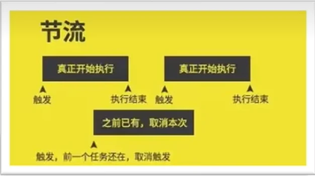

**利用lodash实现节流**

```html
<body>
  <div class="box"></div>
  <script src="./lodash.min.js"></script>
  <script>
    // 利用防抖实现性能优化
    // 需求: 鼠标在盒子上移动，里面的数字就会变化 + 1
    const box = document.querySelector('.box')
    let i = 1
    function mouseMove() {
      box.innerHTML = i++
      // 如果里面存在大量消耗性能的代码，比如 dom 操作，比如数据处理，可能造成卡顿

    }
    // 添加事件
    // box.addEventListener('mousemove', mouseMove)

    // 利用lodash库实现节流 - 500ms 之后采取 +1
    // 语法: _.throttle(fun, 时间)
    box.addEventListener('mousemove', _.throttle(mouseMove, 500))
  </script>
</body>
```

**手写一个节流函数**

**核心思路:** 节流的核心就是利用定时器(`setTimeout`)来实现

1. 声明一个定时器<span style="color:red">变量</span>
2. 当鼠标每次滑动都先判断<span style="color:red">是否有定时器</span>了，如果有定时器则<span style="color:red">不开启</span>新定时器
3. 如果没有定时器则<span style="color:red">开启</span>定时器，记得<span style="color:red">存到变量</span>里面
   - 定时器里面<span style="color:red">调用</span>执行的函数
   - 定时器里面要把定时器<span style="color:red">清空</span>

```html
<body>
  <div class="box"></div>
  <script>
    // 利用防抖实现性能优化
    // 需求: 鼠标在盒子上移动，里面的数字就会变化 + 1
    const box = document.querySelector('.box')
    let i = 1
    function mouseMove() {
      box.innerHTML = i++
      // 如果里面存在大量消耗性能的代码，比如 dom 操作，比如数据处理，可能造成卡顿

    }
    // 手写节流函数
    // 核心是利用 setTimeout 定时器 来实现
    // 1. 声明一个定时器变量
    // 2. 当鼠标每次滑动都先判断是否有定时器了，如果有定时器则不开启新定时器
    // 3. 如果没有定时器，则开启定时器，记得存到变量里面
    //    3.1 定时器里面调用执行的函数
    //    3.2 定时器里面要把定时器清空
    function throttle(fn, t) {
      let timer = null
      // return 返回一个匿名函数
      return function () { //=>debounce(mouseMove,500) = function(){}
        // 2,3,4
        if (!timer) {
          timer = setTimeout(function () {
            fn()  // 加小括号调用 fn 函数 
            // 清空定时器
            timer = null
          }, t)
        }
      }
    }
    box.addEventListener('mousemove', throttle(mouseMove, 500))
  </script>
</body>
```

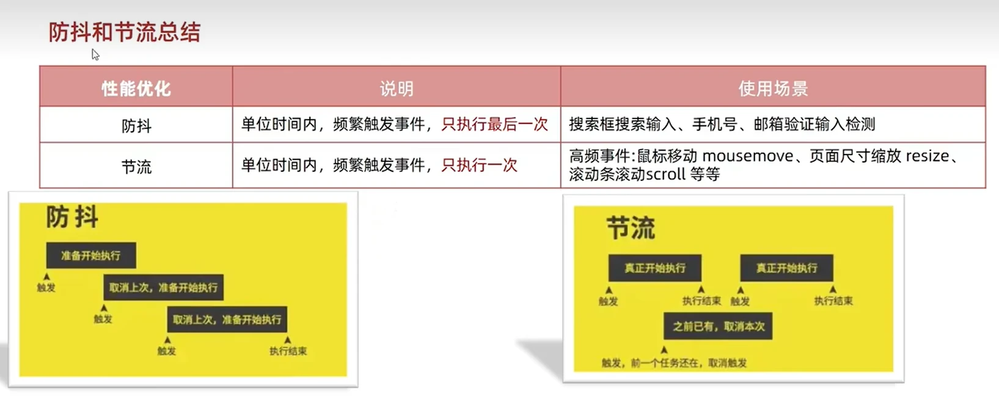


