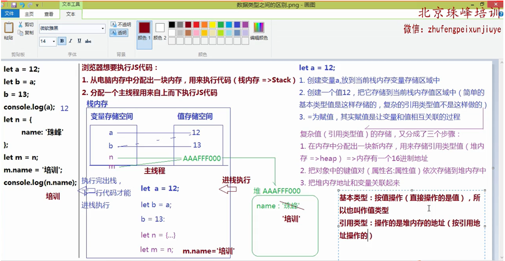
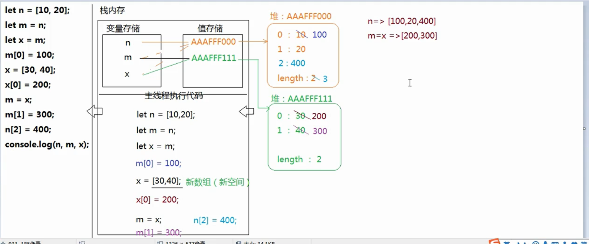
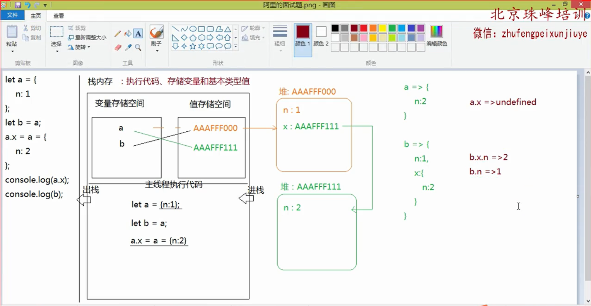
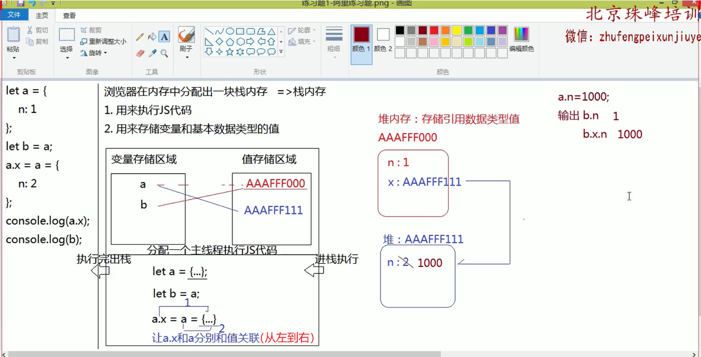
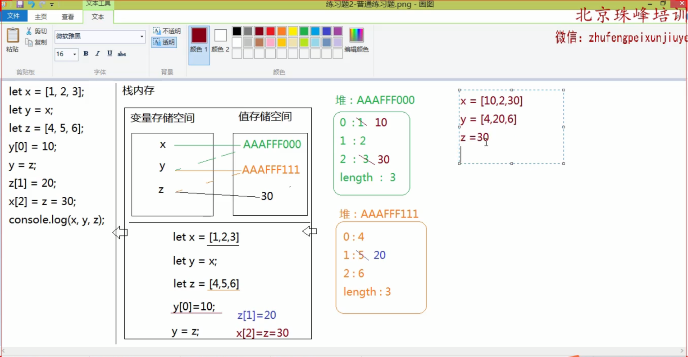
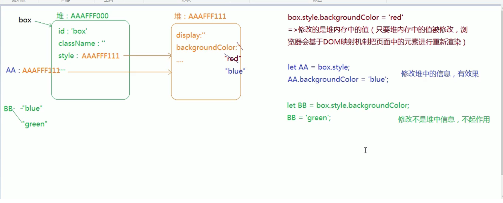
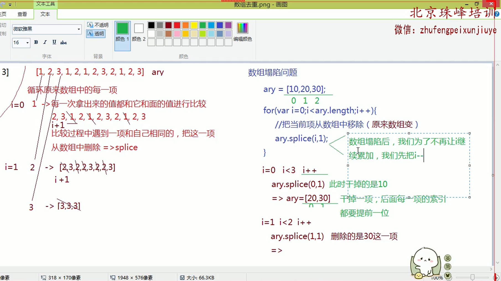
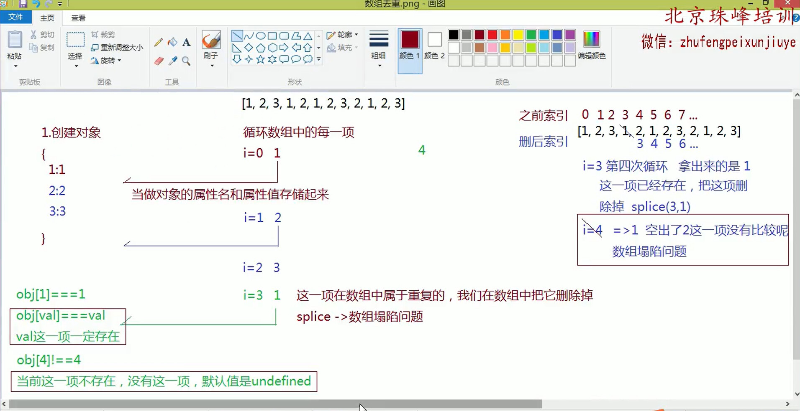

### 常用的浏览器
- webkit内核（V8引擎）
   + 谷歌Chrome
   + Safari
   + Opera >=V14
   + 国产浏览器
   + 手机浏览器
   + ...
- Gecko
   + 火狐Firefox
- Presto
   + Opera <=V14
- Trident
   + IE
   + IE EDGE开始采用双内核（其中包含Chrome迷你）

谷歌浏览器的控制台（F12）
- Elements：查看结构样式，可以修改这些内容
- Console：查看输出结果和报错信息，是JS调试的利器
- Sources：查看项目源码
- Network：查看当前网站所有资源的请求信息（包括和服务器传输的HTTP报文信息）、加载时间等（根据加载时间进行项目优化）
- Application：查看当前网站的数据存储和资源文件（可以盗图）

### JS做客户端语言
> 按照相关的JS语法，去操作页面中的元素，有时还要操作浏览器里面的一些功能
- ECMAScript3/5/6...：JS的语法规范（变量、数据类型、操作语句等等）
- DOM（document object model）：文档对象模型，提供一些JS的属性和方法，用来操作页面中的DOM元素
- BOM（browser object model）：浏览器对象模型，提供一些JS的属性和方法，用来操作浏览器的

### JS中的变量 variable
> 变量：可变的量，在编程语言中，变量其实就是一个名字，用来存储和代表不同值得东西

```javascript
    //ES3
    var a = 12;
    a = 13;
    console.log(a); //=>输出的是a代表的值是13
    
    //ES6
    let b = 100;
    b = 200;
    
    const c = 1000;
    c = 2000; //=>报错：const创建的变量，存储的值不能被修改（可以理解为叫做常量）
    
    //创建函数也相当于在创建变量
    function fn(){}
    
    //创建类也相当于创建变量
    class A{}
    
    //ES6的模块导入也可以创建变量
    import B from './B.js';
    
    //Symbol创建唯一值
    let n = Symbol(100);
    let m = Symbol(100);
```
```
var / let  创建变量
const      创建常量
function   创建函数
class      创建类
import     模块导入
```

### JS中的命名规范
- 严格区分大小写
```javascript
    let Test = 100;
    console.log(test);//=>无法输出，因为第一个字母小写了
```
- 使用数字、字母、下划线、$，数字不能作为开头
```javascript
    let $box; //=>一般用JQ获取的以$开头
    let _box; //=>一般公共变量都是_开头
    let 1box; //=>不可以，但是可以写box1
```
- 使用驼峰命名法：首字母些小，其余每一个有意义单词的首字母都要大写（命名尽可能语义化明显，使用英文单词）
```javascript
    let studentInformation;
    let studentInfo;
    //常用的缩写：add/insert/create/new(新增)、update（修改）、delete/del/remove/rm(删除)，sel/select/query/get(查询)、info（信息）...
    
    //不正确的写法
    let xueshengInfo;
    let xueshengxinxi;
    let xsxx;
```
- 不能使用关键字和保留字
```javascript
当下有特殊含义的是关键字，未来可能会成为关键字的叫做保留字（？）
    var let const function ...
    
    var var10 = 10; //=>肯定不行的
```
常用关键字和保留字
- 关键字
    + break
    + continue
    + if
    + else
    + for
    + var / let / const / function / class / import / export
    + instanceof
    + typeof
    + this
    + return
    + switch
    + case
    + do
    + while
    + delete
    + new
    + ...
- 保留字
    + boolean
    + float
    + int 
    + double
    + long
    + char
    + debugger
    + ...

//=>代码强迫症（代码洁癖）：良好的编程习惯，极客精神

### JS中常用的数据类型
- 基本数据类型
    + 数字number
        常规数字和NAN
    + 字符串string
        所有用单引号、双引号、反引号（撇）包起来的都是字符串
    + 布尔boolean
        true/false
    + 空对象指针null
    + 未定义undefined
- 引用数据类型
    + 对象数据类型object
        + {} 普通对象
        + []数组对象
        + `/^[+-]?(\d|([1-9]\d+))(\.\d+)?$/` 正则对象
        + Math数学函数对象
        + 日期对象
        + ...
    + 函数数据类型function

### number数字类型
> 包含：常规数字、NaN

### NaN
> not a number:不是一个数，但它率属于数字类型

NaN和任何值（包括自己）都不相等：NaN != NaN，所以我们不能用相等的方式判断是否为有效数字

### isNaN
> 检测一个值是否为非有效数字，如果不是有效数字返回TRUE，反之是有效数字返回FALSE

```javascript
    console.log(isNaN(10));//=>FALSE
    console.log(isNaN('AA'));//=TRUE
    /*
     * Number('AA')  =>NaN
     * isNaN(NaN) =>TRUE
     */
    console.log(isNaN('10'));//=>FALSE
    /*
     * Number('10')  =>10
     * isNaN(10) =>FALSE
     */
```
在使用isNaN进行检测的时候，首先会验证检测的值是否为数字类型，如果不是，先基于Number()这个方法，把值转换为数字类型，然后再检测

### 把其他类型值转换为数字类型
- Number([val])：它是按照浏览器底层机制，把其它数据类型转换为数字
    + 字符串：看到是否包含非有效数字字符，包含结果就是NaN； ''(空字符串)->0;
    + 布尔：true->1 false->0
    + null：->0
    + undefined：->NaN
    + 引用类型值都要先转换为字符串再转换为数字
        + {}/正则/函数等 ->NaN
        + [] ->'' -> 0
        + ['12'] ->'12' -> 12
        + [12,23] ->'12,23' ->NaN
```javascript
    //把字符串转换为数字，只要字符串中包含任意一个非有效数字字符（第一个点除外）结果都是NaN，空字符串会变为数字零
    console.log(Number('12.5'));//=>12.5
    console.log(Number('12.5px'));//=>NaN
    console.log(Number('12.5.5'));//=>NaN
    console.log(Number(''));//=>0
    
    //布尔转换为数字
    console.log(Number(true)); //=>1
    console.log(Number('false'));//=>0
    console.log(isNaN(false)); //=>false
    
    // null->0    undefined->NaN
    console.log(Number(null));//=>0
    console.log(Number(undefined)); //=>NaN
    
    //把引用数据类型转换为数字，是先把它基于toString方法转换为字符串，然后在转换为数字
    console.log(Number({name:'10'}));//=>NaN
    console.log(Number({}));//=>NaN
    //  {}/{xxx:'xxx'}.toString() => "[object Object]" =>NaN
    console.log(Number([]));//=>0
    //  [].toString() -> ''
    console.log(Number([12]));//=>12
    //  [12].toString() -> '12'
    console.log(Number([12,23]));//=>NaN
    //  [12,23].toString() -> '12,23'
```
- parseInt/parseFloat([val],[进制])：也是转换为数字的方法，对于字符串（传递的值一定是字符串，不是也要转换为字符串然后在查找 ）来说，它是从左到右依次查找有效数字字符，直到遇到非有效数字字符，停止查找（不管后面是否还有数字，都不再找了），把找到的当做数字返回
```javascript
    parseInt(undefined)  -> parseInt('undefined') ->NaN
    parseInt('') ->NaN // 因为没有找到有效数字
    let str = '12.5px';
    console.log(Number(str));//=>NaN
    console.log(parseInt(str));//=>12
    console.log(parseFloat(str));//=>12.5
    console.log(parseFloat('width:12.5px');//=>NaN
    parseFloat(true); //=>NaN
```
- ==进行比较的时候,可能要出现把其它类型值转换为数字
```javascript
    '10' == 10; //=>true
```

### String字符串数据类型
> 所有用单引号、双引号、反引号（撇 ES6模板字符串）包起来的都是字符串

#### 把其他类型值转换为字符串
- [val].toString()
```javascript
    let a = 12;
    console.log(a.toString()); //=>'12'
    console.log((NaN).toString()); //=>'NaN'
    
    // null和undefined是禁止直接toString的
    (null).toString(); //=>报错
    // 但是和undefined一样转换为字符串的结果就是'null'/'undefined'
    
    // 普通对象.toString()的结果是"[object Object]"  =>? =>Object.prototype.toString方法不是转换为字符串的，而是用来检测数据类型的
```
- 字符串拼接
```javascript
    // 四则运算法则中，除了加法之外，其余都是数学计算，只有加法可能存在字符串拼接（一旦遇到字符串，则不是数学运算，而是字符串拼接）
    console.log('10' + 10); //=>'1010'
    console.log('10' - 10); //=>'0'
    console.log('10px' - 10); //=>NaN 
    
    let a = 10 + null + true + [] + undefined + '珠峰' + null + [] + 10 + false;
    /*
     * 10 + null -> 10 + 0 -> 10
     * 10 + true -> 10 + 1 -> 11
     * 11 + [] -> 11 + '' -> '11' 空数组变为数字，先要经历变为空字符串，遇到字符串，啥也别想，直接变为字符串拼接
     * '11' + undefined -> '11undefined'
     * ...
     * '11undefined珠峰null10false'
     */
    console.log(a); //=>'11undefined珠峰null10false'
    
    //==========
    Js中的加减乘除本应是进行数学运算（如果遇到的值不是数字类型，也需要基于Number()方法把其转换为数字，在进行运算）；但是Js中加法有特殊情况：相加过程中遇到字符串直接变为字符串拼接
```

### boolean布尔数据类型
> 只有两个值 true/false

#### 把其他类型值转换为布尔类型
> 只有0、NaN、''、null、undefined 五个值转换为FALSE，其他的都转换为TRUE（而且没有任何的特殊情况）

- Boolean([val])
```javascript
    console.log(Boolean(0)); //=>false
    console.log(Boolean(''));//=>false
    console.log(Boolean(' '));//=>true
    console.log(Boolean(null));//=>false
    console.log(Boolean(undefined));//=>false
    console.log(Boolean([]));//=>true
    console.log(Boolean([12]));//=>true
    console.log(Boolean(-1));//=>true
```
- ! / !!
```javascript
    // !:取反（先转为布尔，然后取反）
    console.log(!1);//=>FALSE
    // !!:取反再取反，只相当于转换为布尔 <=> Boolean 
    console.log(!!1);//=>true
```
- 条件判断
```javascript
    // 如果条件只是一个值，不是==/===/!=/>= 等这些比较，是要把这个值先转换为布尔类型，然后验证真假
    if(1){
        console.log('哈哈');//=>哈哈
    }
    if('3px' + 3){
        //=>'3px3'
        console.log('嘿嘿');//=>嘿嘿
    }
    if('3px' - 3){
        //=>NaN -3 = NaN
        console.log('呵呵');//不会输出
    }
```

### null / undefined
> null和undefined都代表的是没有

- null：意料之中（一般都是开始不知道值，我们手动先设置为null，后期再给予赋值的操作 ）
```javascript
    let num = null; // let num = 0; 一般最好用null作为初始的空值，因为零不是空值，他在栈内存中有自己的存储空间（占了位置）
    ...
    num = 12;
```

- undefined：意料之外（不是我能决定的）
```javascript
    let num; //=>创建一个变量没有赋值，默认值是undefined
    ...
    num = 12;
```

### object对象数据类型-普通对象
> {[key]:[value],...} 任何一个对象都是由零到多组键值对（属性名：属性值）组成的（并且属性名不能重复）。一个对象的属性名只有两种格式：数字或者字符串（等基本类型值）

```javascript
    let person = {
        'name':'易烊千玺',
        age:40,
        height:'185cm',
        weight:'80kg',
        1:100
    };
    // 删除属性
        // =>真删除：把属性彻底干掉
        delete person[1];    
        // =>假删除：属性还在，值为空
        person.weight = null;
        console.log(person);
    
    //设置属性名属性值
    person.GF = '圆圆';
    person.name = '李易峰';
    console.log(person['GF']); //=>圆圆
    
    // =>属性名不能重复，如果属性名已经存在，不属于新增属于修改属性值
    console.log(person['name']); //=>李易峰
    
    // 获取属性名对应的属性值 
    // =>对象.属性名
    console.log(person.name); //=>易烊千玺
    
    // =>对象[属性名]  属性名是数字或者字符串格式的
    console.log(person['age']); //=>40
    
    // =>如果当前属性名不存在，默认的的属性值是undefined
    console.log(person.sex); //=>undefined
    
    // =>如果属性名是数字，则不能使用点的方式获取属性值
    console.log(person[1]); //=>100
    console.log(person.1); //=>SyntaxError:语法错误
    
    // 'age' 值 -> 代表本身
    // age 变量 -> 代表他存储的这个值
```

> 数组是特殊的对象数据类型

```JavaScript
    /*
     * 数组是特殊的对象
     *    1. 我们中括号中设置的是属性值，它的属性名是默认生成的数字，从零开始递增，而且这个数字代表每一项的位置，* 我们把其成为“索引” =>从零开始，连续递增，代表每一项位置的数字属性名
     *    2. 天生默认一个属性名 length ，存储数组的长度
     */
    let ary = [12,'哈哈',true,13];
    console.log(ary); 
    console.log(ary.length);  //=>4
    console.log(ary['length']);  //=>4
    console.log(ary[1]); //=>哈哈 
    
    // 第一项索引0  最后一项索引 ary.length-1
    console.log(ary[0]); //=>12
    console.log(ary[ary.length-1]); //=>13 
    
    // 向数组末尾追加内容
    ary[ary.length] = 100;
    console.log[ary];
```
> 数据类型之间的区别：基本数据类型按值操作，引用类型操作的是堆内存的空间地址

```javascript
    let a = 12;
    let b = a;
    b = 13;
    console.log(a); //=>12
    let n = {
        name:'珠峰'
    };
    let m = n;
    m.name = '培训';
    console.log(n.name); //=>培训
```


```javascript
   let n = [10,20];
   let m = n;
   let x = m;
   m[0] = 100;
   x = [30,40];
   x[0] = 200;
   m = x;
   m[1] = 300;
   n[2] = 400;
   console.log(n,m,x);
```


阿里面试题
```javascript
    let a = {
        n:1
    };
    let b = a;
    a.x = a = {
        n:2
    };
    console.log(a.x); //=>undefined
    console.log(b); //=>{n:1,{n:2}}
```




### JS中的数据类型检测
- typeof[val]：用来检测数据类型的运算符
```javascript
    /*
     * 基于typeof检测出来的结果
     *      1. 首先是一个字符串
     *      2. 字符串中包含对应的类型
     * 局限性：
     *      1. typeof null =>'object'  但是null并不是对象
     *      2. 基于typeof无法细分出当前值是普通对象还是数组对象等，因为只要是对象数据类型，返回的结果都是"object"
     */
     console.log(typeof 1); //=>'number'
     let a = NaN;
     console.log(typeof a); //=>'number'
     typeof true; // =>boolean
     
     console.log(typeof typeof typeof []); //=>typeof [] =>"object" => typeof "object" => "string" => ...=>"string" 
     //因为typeof检测的结果都是字符串，所以只要两个及以上同时检测，最后结果必然是"string"
```
- instanceof：用来检测当前实例是否属于某个类

> instanceof: 用来检测某个实例是否属于这个类
>
> 实例 instanceof 类，属于返回true，不属于返回false

```js
/* 
 *  instanceof: 用来检测某个实例是否属于这个类
 *      实例 instanceof 类，属于返回true，不属于返回false
 *  [局限性]
 *      1.要求检测的实例必须是对象数据类型的，基本数据类型的实例是无法基于它检测出来的
 */
let ary = [12, 23];
console.log(ary instanceof Array); //=>true
console.log(ary instanceof RegExp); //=>false
console.log(ary instanceof Object); //=>true
console.log(1 instanceof Number); //=>fasle
```

- constructor：基于构造函数检测数据类型（也是基于类的方式）
- Object.prototype.toString.call()：检测数据类型最好的办法

### JS中的操作语句：判断、循环

#### 逻辑或|| 和 逻辑与&&

```js
逻辑或|| 和逻辑与&& 在赋值操作中的意义
A||B: 先验证A的真假，如果A为真，返回的是A的值，如果A为假返回的是B的值
A&&B: A为真返回B的值，A为假返回A的值
&&的优先级高于||
    
let a = 0 || fasle;
console.log(a); //=>false
a = 1 || fasle;
console.log(a); //=>1

a = 1 && 100;
console.log(a); //=>100
a = 0 && 100;
console.log(a); //=>0

a = 0 || 1 && 2 || 3; //=>先算1&&2 =>0||2||3 =>再算0||2 =>2 =>最后2||3 =>2
console.log(a); //=>2
```

```js
function fn(x, callback) {
    //=> typeof x === 'undefined' ? x=0 : null;
    x = x || 0;
    
    // callback代表回调函数 (传递的是一个函数): 我们需要保证它是一个函数才能执行
    // typeof callback === 'function' ? callback() : null;
    callback && callback();
}
fn();
fn(10);
fn(10,function(){})
```


#### 判断
> 条件成立做什么？不成立做什么？

- if / else if / else
```javascript
    if(条件){       //条件可以多样性：等于、大于、小于的比较/一个值或者取反等 =>最后都是要计算出是TRUE还是FALSE
        条件2成立执行
    }else if(条件){
        条件2成立执行
    }
    ...
    else{
        以上条件都不成立
    }
```
- 三元运算符：简单if / else 的特殊处理方式
        条件 ? 条件成立处理的事情 : 不成立处理的事情;
```javascript
    let a =10;
    a >= 10 ? console.log('呵呵') : console.log('哈哈');
    
    /*
     *  条件 ? 条件成立处理的事情 : 不成立处理的事情;
     *  1.如果处理的事情比较多，我们用括号包起来，每一件事情用逗号分隔
     *  2.如果不需要处理事情，可以使用null / undefined占位
     */
     
    let a = 10;
    a>0 && a<20 ? (a++,console.log(a)) : null;
    /*
     *  if(a > 0 && a < 20){
     *          a++;
     *          console.log(a);
     *}
     *
     */
```
- switch case：一个量变在不同值情况下的不同操作
```javascript
    /*
     *  1.每一种case情况结束后
     *  2.default等价于else，以上都不成立干的事情
     *  3.每一种case情况的比较用的都是===“绝对相等”来完成的
     */
    let a = 10;
    switch(a){
        case 1:
            console.log('呵呵');
            break;
        case 5:                     //=>此处'5' case 5 =>false
            console.log('哈哈');
            break;
        case 10::
            console.log('呵呵');
            break;
        default: 
            console.log('嘻嘻');
    }
    
    // 不加break，当前条件成立执行完成后，后面的条件不论是否成立都要执行，直到遇到break为止（不加break可以实现变量在某些在某些值的情况下做相同的事情 => 编程开发人员要具备探索尝试之心）
    let b = 1;
    switch(b){
        case 1:
            b++;
        case 5:
            b += 2;
            break;
        default: 
            b--;
    }
    console.log(b); //4
```
- == VS ===
```javascript
    ==：相等（如果左右两边数据值类型不同，是默认先转换为相同的类型，然后比较）
    '5' == 5 =>true
    ===：绝对相等（如果类型不一样，肯定不相等，不会默认转换数据类型）
    '5' === 5 =>false
    
    // 项目中为了保证业务的严谨，推荐使用===
```
- i++ & ++i都会是数学运算中的累加1，区别是运算顺序
```javascript
    let i='10';
    i=i+1 =>'10'+1 =>'101'
    i+=1  =>'101'
    i++   =>i=11  i++和以上两种不完全一样，他是存粹的数学运算
    
    let i=i;
    5+(i++)   //=>先算5+i=6  然后i再加1(i=2)
    
    i=1;
    5+(++i)   //=>先i累加1，然后拿累加后的结果去和5运算  结果等于7
    
    // 出道题：
    let i = 3;
    console.log( 5+(++i)+(i++)+3-2+(--i)+(i--)-2 ); // => 20
    console.log(i); // =>3
```

#### 循环
> 重复做某些事情就是循环

- for循环

```javascript
    /*
     * 1.创建循环初始值
     * 2.设置（验证）循环执行的条件
     * 3.条件成立执行循环体中的内容
     * 4.当前循环结束执行步长累计操作
     */
     for(var i=0;i<5;i++){
         console.log(i); // 0 1 2 3 4
     }
     console.log(i); // 5
     
     // 循环体中的两个关键词
     // continue：结束当前这轮循环（continue后面的代码不再执行），继续执行下一轮循环
     // break：强制结束整个循环（break后面代码也不再执行），而且整个循环啥也不干直接结束
     
     for(var i=0;i<10;i++){
         if(i>=2){
             i += 2;
             continue;
         }
         if(i>=6){
             i--;
             break;
         }
         i++;
         console.log(i); // 1 
     }
     console.log(i); // 11 循环5次
```
- for in循环：用来循环遍历对象中的键值对的（continue和break同样适用）
```javascript
    var obj ={
        name:'春亮',
        age:52,
        friends:'王鹏,志刚',
        1:20,
        2:149,
        3:140
    };
    // for(var 变量(key) in 对象)
    // 对象中有多少组键值对，循环就执行几次（除非break结束）
    for(var key in obj){
        // 每一次循环key变量存储的值：当前对象的属性名
        // 获取属性值：obj[属性名] => obj[key]
        console.log('属性名：'+ key + '属性值：' + obj[key]);
    }
    // for in在遍历的时候，优先循环数字属性名（从小到大）
```
- for of循环（ES6新增）
- while循环
- do while循环



### 函数 function
> 函数就是一个方法或者一个功能体，函数就是把实现某个功能的代码放到一起进行分装，以后想要操作实现这个功能，只需要把函数执行即可 =>“封装”：减少页面中的冗余代码，提高代码重复率（低耦合高内聚）

洗衣机就是一个函数，生成洗衣机就是封装一个函数（把实现某些功能的代码封装进来），生产的时候，不知道用户洗衣服的时候放什么水、衣服、洗衣液，我们需要提供出入口（提供的入口在函数中叫做形参，执行的时候放的具体东西函数中叫做实参），洗完衣服需要能拿出来，洗衣机提供一个出口（在函数中叫做返回值：把函数处理后的结果能够返回给外面用）
- 创建函数
    + 形参
    + 返回值
- 执行函数
    + 实参
- arguments
- 函数底层运行机制
- ...

#### 创建函数
```javascript
    // =>ES5老方式
    function [函数名]([形参变量1],...){
        // 函数体：基于JS完成需要实现的功能
        return [处理后的结果];
    }
    
    [函数名]([实参1],...);
```
##### 形参
```javascript
    /*
     *  =>sum是函数名，代表这个函数
     *  =>sum()是函数执行，代表的是函数执行返回的结果
     *  =>n/m是形参，是变量，用来储存执行函数是传递的实参
     */
   function sum(n, m) {
       let result = n + m;
       result *= 10;
       result /= 2;
       console.log(result);
    }

    console.log(sum);
    // 10/20、25/27这都是传递给形参变量的值（实参）
    sum(10, 20);
    sum(25, 27);
    
    // 形参的细节：创建函数的时候，我们设置了形参变量，但如果执行的时候并没有给对应的实参值，那么形参变量默认的值是：undefined
    
    // 形参默认值处理：如果没有传递形参值，给予一个赋值
    if (n === undefined) {
        n = 0;
    }
    if (typeof m == 'undefined') { //一般多用这种方法
        m = 0;
    }
```
##### 返回值
> 函数执行的时候，函数体内部创建的变量我们是无法获取和操作的，如果想要获取内部的信息，我们需要基于return返回值机制把信息返回才可以

```javascript
    function sum(n,m){
        let result = n + m;
        // return一定是值：此处是把result变量存储的值返回给外面
        return result; // => return 30;
    }
    let AA = sum(10,20);
    console.log(AA);
    console.log(result); // =>Uncaught ReferenceError: result is not defined
    
    // 没有有写return，函数默认返回值是undefined
    function sum(n,m){
        let result = n + m;
    }
    let AA = sum1(10,20);
    console.log(AA); // =>undefined
    
    // 函数体中遇到return，后面代码则不在执行了
```
console.log(alert(1))
1. alert(1)：执行浏览器内置的alert方法，执行方法的时候弹出一个"1"(方法的功能），此方法没有返回值（默认返回值为undefined）
2. console.log(undefined)


##### 匿名函数
> 匿名函数值函数表达式：把一个函数本身作为值赋值给其它东西，这种函数一般不是手动触发执行，而且靠其它程序驱动触发执行（例如：触发某个事件的时候把它执行等）

```javascript
    document.body.onclick = =function () {}
    setTimeout(function(){},1000); //=>设置定时器，1000ms后执行匿名函数
    
    // 匿名函数之自执行函数：创建完一个匿名函数，紧接着就把当前函数加小括号执行
    (function(n){
        //n=>100
    })(100); // => A()
```

#### arguments 函数内置的实参集合
> 任意数求和（执行函数的时候，传递N个值实现求和）
>
>  
>
> 在js非严格模式下，arguments和形参存在映射关系 (一个改都会跟着变)，严格js模式下arguments和形参的映射机制就切断了

```javascript
    /* 
    *  任意数求和
    *      1、传递实参的个数不定
    *      2、传递的值是否为有效数字不定
    *  =>把传递的有效数字进行相加求和
    * 
    *  arguments：函数内置的实参集合
    *      1、类数组集合，集合中存储着所有函数执行时，传递的实参信息
    *      2、不论是否设置形参，arguments都存在
    *      3、不论是否传递实参，arguments也都存在
    *  arguments.callee：存储的是当前函数本身（一般不用，JS严格模式下禁止使用这些属性）
    */
    /* function sum(n, m) {
        console.log(arguments, n, m);
    } */
    function sum() {
        // console.log(arguments);
        let total = null;
        for (let i = 0; i < arguments.length; i++) {
            // 获取的每一项的结果都要先转换为数字（数学运算）
            let item = Number(arguments[i]);
            if (isNaN(item)) {
                continue;
            }
            total += item;
        }
        return total;
    }

    let total = sum(10, 20, 30, 40);
    console.log(total);

    total = sum(10, 20);
    console.log(total);

    total = sum(10, 20, '30');
    console.log(total);

    total = sum(10, 'AA');
    console.log(total);
```
#### arrow function箭头函数

> 简单（一个箭头相当于一个函数）

```javascript
/* function sum(n, m) {
    return n + m;
} */

// 改写成箭头函数
let sum = (n, m) => {
    return n + m;
};

// 如果函数体中只有一行return，可以省略return和大括号，一行搞定
let sum = (n, m) => n + m;

console.log(sum(10, 20));
```

```javascript
function fn(n) {
    return function(m) {
        return n + m;
    }
}
// 改写成箭头函数
let fn = n => m => n + m;
```

> 形参赋值默认值：当没有给形参传递实参的时候，执行默认值

```javascript
/* function sum(n, m) {
    if (typeof n === 'undefined') {
        n = 0;
    }
    if (typeof m === 'undefined') {
        m = 0;
    }
    return n + m;
} */
// 形参赋值默认值：当没有给形参传递实参的时候，执行默认值
let sum = (n = 0, m = 0) => n + m;
sum();
sum(10);
```

> 箭头函数中没有arguments

```javascript
/* let sum = () => {
    console.log(arguments); //=>Uncaught ReferenceError: arguments is not defined 箭头函数中没有arguments
} */

// 但是我们可以使用剩余运算符获取到传递的实参集合（它是数组，比arguments更好玩）
let sum = (...arg) => eval(arg.join('+'));
sum(1, 2, 3, 4);
```

> 箭头函数中的this某些场景也是方便我们操作的
>
> ......

###  一、Math

> 数学函数：但是它不是一个函数，它是一个对象，对象中存储了很多操作数字的属性方法，因此被称为数学函数

```javascript
console.log(typeof Math); //=>"object"
console.dir(Math);
/*
 *  Math = {
 *      PI:3.141592653589793,
 *      abs:function abs() { [native code] },
 *      ceil:function abs() { [native code] },
 *      ...
 *} 
 *
 *  Math.abs();
 *  Math.PI;
 */
```

#### Math中常用的属性和方法

1. Math.abs([number value])

> 获取绝对值（绝对值永远是正数或者零）

```javascript
console.log(Math.abs(-12.5)); //=>12.5
console.log(Math.abs(12)); //=>12
console.log(Math.abs(0)); //=>0
// 传递的不是数字类型的值:先基于Number()转换为数字再处理
console.log(Math.abs('1')); //=>1
console.log(Math.abs('-1px')); //=>NaN
console.log(Math.abs(true)); //=>1
```

2. Math.ceil / floor([number value])

> 把一个数向上取整 / 向下取整

```javascript
console.log(Math.ceil(12)); //=> 12
console.log(Math.ceil(12.1)); //=> 13
console.log(Math.ceil(12.9)); //=> 13
console.log(Math.ceil(-12.1)); //=> -12
console.log(Math.ceil(-12.9)); //=> -12

console.log(Math.floor(12)); //=> 12
console.log(Math.floor(12.1)); //=> 12
console.log(Math.floor(12.9)); //=> 12
console.log(Math.floor(-12.1)); //=> -13
console.log(Math.floor(-12.9)); //=> -13
```

3. Math.round([number value])

> 四舍五入（正数.5往上进，负数.5往下舍）

```js
console.log(Math.round(12)); //=> 12
console.log(Math.round(12.1)); //=> 12
console.log(Math.round(12.5)); //=> 13  正数中.5属于入
console.log(Math.round(12.9)); //=> 13
console.log(Math.round(-12.1)); //=> -12
console.log(Math.round(-12.5)); //=> -12 负数中.5属于舍
console.log(Math.round(-12.9)); //=> -13
```

4. Math.max / min ([val1],[val2],...)

>获取一堆数中的最大值和最小值

```js
console.log(Math.max(12, 5, 68, 23, 45, 3, 27)); //=> 68
console.log(Math.min(12, 5, 68, 23, 45, 3, 27)); //=> 3

// 思考题：如何基于Math.max/min获取数组中的最大值/最小值？
Math.max([12, 5, 68, 23, 45, 3, 27]); //=> NaN 此处是只传递一个值，是个数组，和内置的语法要求不符
```

5. Math.sqrt / pow()

> sqrt：给一个数开平方
>
> pow：计算一个数的多少次幂

```js
console.log(Math.sqrt(16)); //=> 4 符合N*N=M 这样的M才能整开平方
console.log(Math.sqrt(-16)); //=> NaN 负数开不了平方
console.log(Math.pow(2, 10)); //=> 1024
```

6. Math.random()

> 获取0~1之间的随机小数

```js
for (let i = 0; i <= 10; i++) {
    console.log(Math.random());
}
/* 
 *  0.0030904989639712888
 *  0.8112605913306559
 *  0.593915622417533
 *  ...
 */
```

扩展：获取[n~m]之间的随机整数

> 包含n也包含m
>
> n < m

```js
Math.round(Math.random()*(m-n)+n)
```


### 二、数组及数组中常用的方法

> 数组是对象数据类型的，它属于特殊的对象

```js
let ary = [12, 23, 34, 45];
console.log(typeof ary); //=> "object"
console.dir(ary);
/* 
 *  ary = {
 *      0:12,
 *      1:23,
 *      2:34,
 *      3:45,
 *      length:4
 * }
 *  数字作为索引（key属性名）
 *  length代表长度
 * 
 *  ary[0] 根据索引获取指定项的内容
 *  ary.length 获取数组的长度
 *  ary.length-1 最后一项的索引
 */
```

#### 数组中常用的方法

+ 方法的作用和含义
+ 方法的实参 ( 类型和含义 ) 
+ 方法的返回值
+ 原来的数组是否会发生改变

##### **1.实现数组增删改的方法**

> 这一部分都会修改原有的数组

`push`

```js
/* 
 *  push : 向数组末尾增加内容
 *  @params
 *		多个任意类型
 *  @return
 *		新增后数组的长度
 */
let ary = [10, 20];
let res = ary.push(30, 'AA');
console.log(res, ary);
// 基于原生Js操作键值对的方法，也可以向末尾追加一项新的内容
ary[ary.length] = 40;
console.log(res, ary); // => 4 [10,20,30,'AA',40]
```

`unshift`

```js
/* 
 *  unshift : 向数组开始位置增加内容
 *  @params
 *		多个任意类型
 *  @return
 *		新增后数组的长度
 */
let ary = [10, 20];
let res = ary.unshift(30, 'AA');
console.log(res, ary); //=> 4 [30,'AA',10,20]

// 基于原生ES6展开运算符，把原有的ary克隆一份，在新的数组中创建第一项，其余的内容使用原始ary中的信息即可，也算实现了向开始追加的效果
ary = [100, ...ary];
console.log(ary); // => [100,30,'AA',10,20]
```

`shift`

```js
/* 
 *  shift : 删除数组中的第一项
 *  @params
 *  @return
 *     删除的那一项
 */
let ary = [10, 20, 30, 40];
let res = ary.shift();
console.log(res, ary); //=> 10 [20, 30, 40]

// 基于原生Js中的delete，把数组当做普通的对象，确实可以删除掉某一项内容，但是不会影响数组本身的结构特点 (length长度不会跟着修改)，真实项目中杜绝这样的删除使用
delete ary[0];
console.log(ary); //=>{1:30,2:40,length:3}
```

`pop`

```js
/* 
 *  pop : 删除数组中的最后一项
 *  @params
 *  @return
 *     删除的那一项
 */
let ary = [10, 20, 30, 40];
let res = ary.pop();
console.log(res, ary); //=> 40 [10, 20, 30]

// 基于原生Js让数组长度干掉一位，默认干掉的就是最后一项
ary.length--; //=> ary.length = ary.length - 1;
console.log(ary); //=> [10, 20]
```

`splice`

``` js
/* 
 *  splice : 实现数组的增加、删除、修改
 *  @params
 *      n,m 都是数字    从索引n开始删除m个元素 (m不写,是删除到末尾)
 *  @return
 *     把删除的部分用新数组存储起来返回
 */
// 基于splice实现删除性能不好: 当前项被删后，后面每一项的索引都要向前提一位，如果后面内容过多，一定影响性能
let ary = [10, 20, 30, 40, 50, 60, 70, 80, 90];
let res = ary.splice(2, 4);
console.log(res, ary); //=> [ 30, 40, 50, 60] [10, 20, 70, 80, 90]

// 基于这种方法可以清空一个数组，把原始数组中的内容以新数组存储起来 (有点类似数组的克隆: 把原来数组克隆一份一模一样的给新数组)
/* res = ary.splice(0);
console.log(res, ary); //=> [10, 20, 70, 80, 90] [] */

// 删除最后一项
ary.splice(ary.length - 1);
// 删除第一项
ary.splice(0, 1);
console.log(ary);
```

```js
/* 
 *  splice : 实现数组的增加、修改
 *  @params
 *      n,m,x 都是数字    从索引n开始删除m个元素，用x占用删除的部分
 *      n,0,x 从索引n开始，一个都不删，把x放到索引n的前面
 *  @return
 *     把删除的部分用新数组存储起来返回
 */
let ary = [10, 20, 30, 40, 50];
let res = ary.splice(1, 2, '江冰', '哈哈哈');
console.log(res, ary); //=> [20, 30] [10, '江冰', '哈哈哈', 40, 50]

// 实现增加
ary.splice(3, 0, '呵呵呵');
console.log(ary); //=> [10, '江冰', '哈哈哈', '呵呵呵', 40, 50]

// 向数组末尾追加
ary.splice(ary.length, 0, 'AAA');
console.log(ary); //=> [10, '江冰', '哈哈哈', '呵呵呵', 40, 50, 'AAA']

// 向数组开始追加
ary.splice(0, 0, 'BBB');
console.log(ary); //=> ['BBB', 10, '江冰', '哈哈哈', '呵呵呵', 40, 50, 'AAA']
```

##### **2.数组的查询和拼接**

> 此组学习的方法，原来数组不会改变

`slice`

```js
/* 
 *  slice : 实现数组的查询
 *  @params
 *      n,m 都是数字    从索引n开始，找到索引为m的地方 (不包含m这一项)
 *  @return
 *     把找到的内容以一个新数组的形式返回
 */
let ary = [10, 20, 30, 40, 50];
let res = ary.slice(1, 3);
console.log(res); //=> [20, 30]

// m不写是找到末尾
res = ary.slice(1);
console.log(res); //=> [20, 30, 40, 50]

// 数组的克隆，参数0不写也可以
res = ary.slice(0);
console.log(res); //=> [10, 20, 30, 40, 50]

// 思考: 1.如果n / m 为负数会咋滴，如果n > m了会咋滴，如果是小数会咋滴，如果是非有效数字会咋滴，如果m或者n的值比最大索引都会咋滴?
//       2.这种克隆方式叫做浅克隆，可以回去先看看深度克隆如何处理!
```

`concat`

``` js
/* 
 *  concat : 实现数组拼接
 *  @params
 *      多个任意类型值
 *  @return
 *     拼接后的新数组 (原来数组不变)
 */
let ary1 = [10, 20, 30];
let ary2 = [40, 50, 60];
let res = ary1.concat('江冰', ary2)
console.log(res); //=> [10, 20, 30, '江冰', 40, 50, 60]
```

##### **3.把数组转化为字符串**

> 原有数组不变

`toString`

``` js
/* 
 *  toString : 把数组转换为字符串
 *  @params
 *  @return
 *     转换后的字符串，每一项用逗号分隔 (原来数组不变)
 */
let ary = [10, 20, 30];
let res = ary.toString();
console.log(res); //=>'10,20,30'
console.log([].toString()); //=>''
console.log([12].toString()); //=>'12'
```

`join`

```js
/* 
 *  join : 把数组转换为字符串
 *  @params
 *      指定的分隔符 (字符串格式)
 *  @return
 *      转换后的字符串，每一项用逗号分隔 (原来数组不变)
 */
let ary = [10, 20, 30];
let res = ary.join();
console.log(res); //=>'10,20,30'

res = ary.join('');
console.log(res); //=>'102030'

res = ary.join(' ');
console.log(res); //=>'10 20 30'

res = ary.join('|');
console.log(res); //=>'10|20|30'

res = ary.join('+');
console.log(res); //=>'10+20+30'
console.log(eval(res)); //=>60  eval把字符串变为Js表达式执行
```

##### **4.检测数组中的是否包含某一项**

`indexOf / lastIndexOf / includes`

```js
/* 
 *  indexOf / lastIndexOf : 检测当前项在数组中第一次或者最后一次出现位置的索引值 (在IE6~8中不兼容)
 *  @params
 *      要检索的这一项内容
 *  @return
 *      这一项出现的位置索引值 (数字)，如果数组中没有这一项，返回的结果是-1
 *      原来数组不变
 */
let ary = [10, 20, 30, 10, 20, 30];
console.log(ary.indexOf(20)); //=>1
console.log(ary.lastIndexOf(20)); //=>4

// 想验证ary中是否包含'江冰'
if (ary.indexOf('江冰') === -1) {
    // 不包含
}
// 也可以直接使用Es6新提供的includes方法判断
if (ary.includes('江冰')) {
    // 包含: 如果存在返回的是true
}
console.log(ary.includes(30)); //=>true
```

##### **5.数组的排序或者排列**

`reverse`

```js
/* 
 *  reverse : 把数组倒过来排列
 *  @params
 *  @return
 *      排列后的新数组
 *      原来数组改变
 */
let ary = [12, 15, 9, 28, 10, 22];
ary.reverse();
console.log(ary); //=>[22, 10, 28, 9, 15, 12]
```

`sort`

```js
/* 
 *  sort : 实现数组的排序
 *  @params
 *      可以没有，也可以是个函数
 *  @return
 *      排列后的新数组
 *      原来数组改变
 */
let ary = [7, 8, 5, 2, 4, 6, 9];
ary.sort();
console.log(ary); //=>[2, 4, 5, 6, 7, 8, 9]

// sort方法中，如果不传递参数，是无法处理10以上数字排序的 (它默认按照每一项第一个字符来排，不是我们想要的效果)
/* ary = [12, 15, 9, 28, 10, 22];
ary.sort();
console.log(ary); //=>[10, 12, 15, 22, 28, 9] */

// 想要实现多位数正常排序，需要给sort传递一个函数，函数中返回 a-b 实现升序，返回 b-a 实现降序 (为啥?需要先了解冒泡排序的机制)
ary = [12, 15, 9, 28, 10, 22];
// ary.sort(function(a,b){...});
// a和b是相邻的两项
ary
;
console.log(ary); //=>[9, 10, 12, 15, 22, 28]
```

##### **6.遍历数组中每一项的方法**

`forEach`

```js
/* 
 *  forEach : 遍历数组中的每一项内容
 *  @params
 *      回调函数
 *  @return
 *      原来数组不变
 */
let ary = [12, 15, 9, 28, 10, 22];

// 基于原生Js中的循环可以实现
/*for (let i = 0; i < ary.length; i++) {
    // i: 当前循环这一项的索引
    // ary[i]: 根据索引获取循环的这一项
    console.log('索引: ' + i + '内容: ' + ary[i]);
}*/

ary.forEach((item, index) => {
    // 数组中有多少项，函数就会被默认执行多少次
    // 每一次执行函数: item是数组中当前要操作的这一项，index是当前项的索引
    console.log('索引: ' + index + '内容: ' + item);
});
```


`map`

`filter`

`find`

`reduce`

`some`

`every`

......

Array.prototype在控制台查看数组中所有提供的方法，可以基于MDN网站去查询方法的用法


##### 7.数组去重

方案一

```js
/* 
 *  方案一:
 *      循环原有数组中的每一项，每拿到一项都往新数组中添加
 *      添加之前验证新数组中是否存在这一项，不存在再添加
 */
let newAry = [];
for (let i = 0; i < ary.length; i++) {
    // 循环获取原有数组中的每一项
    let item = ary[i];
    // 验证新数组中是否存在这一项
    if (newAry.includes(item)) {
        // 存在这一项，不在增加到新数组中，继续下一轮循环即可
        continue;
    }
    // 新数组中不存在这一项，我们加入到新数组中即可
    newAry.push(item);
}
console.log(newAry);
```

```js
// 简化代码
let newAry = [];
ary.forEach(item => {
    if (newAry.includes(item)) return;
    newAry.push(item);
})
console.log(newAry);
```

方案二

```js
/* 
 *  方案二:
 *      先分别拿出数组中的每一项A
 *      用这一项A和"它后面的每项"依次进行比较，如果遇到和当前项A相同的，则在原来数组中把这一项移除掉
 * 
 *      不用includes / indexOf (这样保证兼容性)
 */
var ary = [1, 2, 3, 1, 2, 1, 2, 3, 2, 1, 2, 3];
for (var i = 0; i < ary.length; i++) {
    // item: 每一次循环拿出来的当前项
    // i: 当前项的索引  i+1: 代表后一项
    var item = ary[i];
    // 让当前项和后面的每一项进行比较(循环)
    for (var j = i + 1; j < ary.length; j++) {
        // compare: 后面拿出来要比较的每一项
        var compare = ary[j];
        // 如果compare和item相等，说明这一项是重复的，我们把它删掉
        if (compare === item) {
            // j索引这一项要从数组中移除
            ary.splice(j, 1);
            // 数组塌陷了: j后面的每一项索引都提前了一位，下一次要比较的应该还是j这个索引的内容
            j--;
        }
    }
}
console.log(ary);
```



方案三

```js
/* 
 *  方案三:
 *      
 *      
 * 
 */
let ary = [1, 2, 3, 1, 2, 1, 2, 3, 2, 1, 2, 3];

// 1.创建一个空对象
let obj = {};
// 2.循环数组中的每一项，把每一项向对象中进行存储 => item:item
for (let i = 0; i < ary.length; i++) {
    let item = ary[i];
    // 3.每一次存储之前进行判断: 验证obj中是否存在这一项
    if (obj[item] !== undefined) {
        // 已经存在
        ary.splice(i, 1);
        i--;
        continue;
    }
    obj[item] = item;
}
console.log(ary, obj); // =>[1,2,3] {1: 1, 2: 2, 3: 3}
```

```js
// 基于splice实现删除性能不好: 当前项被删后，后面每一项的索引都要向前提一位，如果后面内容过多，一定影响性能

/* 
 *  unique: 实现数组去重的方法
 *  @params 
 *      ary [Array] 要去去重的数组
 *  @retrun
 *      [Array] 去重后的数组
 *  by 江冰 on 20220715
 */
function unique(ary) {
    let obj = {};
    for (let i = 0; i < ary.length; i++) {
        let item = ary[i];
        if (obj[item] !== undefined) {
            ary[i] = ary[ary.length - 1];
            ary.length--;
            i--;
            continue;
        }
        obj[item] = item;
    }
    return ary;
}
let aa = [12, 23, 12, 23, 12, 23, 12, 16, 15, 15, 12];
aa = unique(aa);
aa.sort((a, b) => a - b);
console.log(aa);
```



方案四

```js
基于正则表达式实现去重
let ary = [12, 23, 12, 15, 25, 23, 25, 14, 16];
ary.sort((a, b) => a - b);
let str = ary.join('@') + '@';
let reg = /(\d+@)\1*/g;
ary = [];
str.replace(reg, (n, m) => {
    m = Number(m.slice(0, m.length - 1));
    ary.push(m);
})
console.log(ary); // =>[12, 14, 15, 16, 23, 25]
```

方案五

```js
// 基于ES6的Set(对应的Map)实现去重
let ary = [12, 23, 12, 15, 25, 23, 25, 14, 16];
ary = [...new Set(ary)];
console.log(ary);
```

### 三、字符串中常用的方法

> 所有用 单引号、双引号、反引号 包起来的都是字符串

```js
let str = 'zhufengpeixunyangfanqihang';
// 每一个字符串都是零到多个字符组成的
str.length //=>字符串的长度
str[0] //=>获取索引为零(第一个)字符
str[str.length-1] //=>获取最后一个字符str.length-1最后一项索引
str[10000] //=>undefined 不存在这个索引

// 循环输出字符串中的每一个字符
for(let i=0;i<str.length;i++){
    let char = str[i];
    console.log(char);
}
```

`charAt / charCodeAt`

```js
/* 
 *  charAt: 根据索引获取指定位置的字符
 *  charCodeAt: 获取指定字符的ASII码值(Unicode编码值)
 *  @params
 *      n [number] 获取字符指定的索引
 *  @return
 *      返回查找到的字符串
 *      找不到返回的是空字符串不是undefined，或者对应的编码值
 *
 */
let str = 'zhufengpeixunyangfanqihang';
console.log(str.charAt(0)); //=> 'z'
console.log(str[0]); //=> 'z'
console.log(str.charAt(10000)); //=>''
console.log(str[10000]); //=> undefined
console.log(str.charCodeAt(0)); //=> 122
console.log(String.fromCharCode(122)); //=>'z'
```

`substr / substring / slice`

```js
/* 
 * 都是为了实现字符串的截取(在原来字符串中查找到自己想要的)
 *  substr(n,m): 从索引n开始截取m个字符，m不写截取到末尾(后面方法也是)
 *  substring(n,m): 从索引n开始找到索引为m处(不含m)
 *  slice(n,m): 和substring一样，都是找到索引为m处，但是slice可以支持负数为索引，其余两个方法是不可以的  
 */
let str = 'zhufengpeixunyangfanqihang';
console.log(str.substr(3, 7)); //=> 'fengpei'
console.log(str.substring(3, 7)); //=> 'feng'
console.log(str.substr(3)); //=> 'fengpeixunyangfanqihang' 截取到末尾
console.log(str.substring(3, 10000)); //=> 'fengpeixunyangfanqihang' 截取到末尾(超过索引的也只截取到末尾)

console.log(str.substring(3, 7)); //=>'feng'
console.log(str.slice(3, 7)); //=>'feng'
console.log(str.substring(-7, -3)); //=>'' substring不支持负数索引
console.log(str.slice(-7, -3)); //=>'nqih' slice支持负数索引  =>快捷查找: 负数索引，我们可以按照 str.length+负索引 的方式找  =>slice(26-7,26-3)  =>slice(19,23)
console.log(str.slice(19, 23)); //=>'nqih'
```

`indexOf / lastIndexOf / includes`

```js
/* 
 * 验证字符是否存在
 *  indexOf(x,y): 获取x第一次出现位置的索引，y是控制查找的起始位置索引
 *  lastIndexOf: 最后一次出现位置的索引
 *  =>没有这个字符，返回的结果是-1
 */
let str = 'zhufengpeixunyangfanqihang';
console.log(str.indexOf('n')); //=> 5
console.log(str.lastIndexOf('n')); //=> 24

console.log(str.indexOf('@')); //=> -1  不存在返回-1
if (str.indexOf('@') === -1) {
    // 字符串中不包含@这个字符
}

console.log(str.indexOf('feng')); //=> 3 验证整体第一次出现的位置，返回的索引是第一个字符所在位置的索引值
console.log(str.indexOf('peiy')); //=> -1

console.log(str.indexOf('n', 7)); //=> 12  查找字符串索引7及之后的字符串中，n第一次出现的位置索引

if (!str.includes('@')) {
    console.log('当前字符串不包含@');
}
```

`toUpperCase / toLowerCase`

```js
/* 
 * 字符串中字母的大小写转换
 *  toUpperCase(): 转大写
 *  toLowerCase(): 转小写
 */
let str = 'ZhuFengPeiXunYangFanQiHang';
str = str.toUpperCase();
console.log(str); //=>'ZHUFENGPEIXUNYANGFANQIHANG'

str = str.toLowerCase();
console.log(str); //=>'zhufengpeixunyangfanqihang'
// 实现首字母大写
str = str.substr(0, 1).toUpperCase() + str.substr(1);
console.log(str); //=>'Zhufengpeixunyangfanqihang' 
```

`split`

```js
/* 
 *  split([分隔符]): 把字符串按照指定的分隔符拆分成数组 (和数组中join对应)
 *
 *  split支持传递正则表达式
 */
// 需求: 把|分隔符变为，分隔符
let str = 'music|movie|eat|sport';
let ary = str.split('|'); //=>['music', 'movie', 'eat', 'sport']
str = ary.join(',');
console.log(str); //=>"music,movie,eat,sport"
```

`replace`

```js
/* 
 *  replace(老字符,新字符): 实现字符串的替换(经常伴随着正则而用)
 */
let str = '珠峰@培训@扬帆@起航';
// str = str.replace('@', '-');
// console.log(str); //=>"珠峰-培训@扬帆@起航" 在不使用正则表达式的情况下，执行一次replace只能替换一次字符

str = str.replace(/@/g, '-');
console.log(str); //=>珠峰-培训-扬帆-起航
```

`match`

`localCopmare`

`trim / trimLeft / trimRight`

...

控制台输出String.prototype查看所有字符串中提供的方法


#### 实现一些常用的需求

> 时间字符串的处理

```js
let time = '2022-7-17 00:38:25';
//=> 变为自己需要呈现的格式，例如:
// "2022年07月17日 00时38分25秒"
// "2022年07月17日"
// "07/17 00:38"
// ...
```

方案一

```js
// 方案一: 一路replace
let time = '2022-7-17 00:38:25';
time = time.replace('-', '年').replace('-', '月').replace(' ', '日 ').replace(':', '时').replace(':', '分') + '秒';
console.log(time); //=>"2022年7月17日 00时38分25秒" 
```

方案二

```js
// 方案二: 获取到年月日小时分钟秒这几个值后，最后想拼成什么效果就拼成什么
let time = '2022-7-17 00:38:25';

// 不足十位补零
/* let addZero = val => {
    if (val.length < 2) {
        val = '0' + val;
    }
    return val;
} */
let addZero = val => val.length < 2 ? '0' + val : val;

// 获取值得方法: 基于split且采用正则进行整体拆分
let ary = time.split(/(?: |-|:)/g); //=>['2022', '7', '17', '00', '38', '25']
time = ary[0] + '年' + addZero(ary[1]) + '月' + addZero(ary[2]) + '日';
console.log(time);

// 获取值得方法: 基于split一项项的拆分
 let n = time.split(' '); //=>['2022-7-17', '00:38:25']
let m = n[0].split('-'); //=>['2022', '7', '17']
let x = n[1].split(':'); //=>['00', '38', '25']
console.log(x) 


// 获取值得方法: 基于indexOf获取指定符号索引，基于substring一点点截取
let n = time.indexOf('-');
let m = time.lastIndexOf('-');
let x = time.indexOf(' ');
let y = time.indexOf(':');
let z = time.lastIndexOf(':');
let year = time.substring(0, n);
let month = time.substring(n + 1, m);
let day = time.substring(m + 1, x);
console.log(year, month, day);
console.log(time.substring(3, 0)); 
```

> 实现一个方法queryURLParameter获取一个URL地址问号后面传递的参数信息

```js
/* 
 *  queryURlParams: 获取URL地址中问号传参的信息和哈希值
 *      @params
 *          url [string] 要解析的URl字符串
 *      @return
 *          [object] 包含参数和哈希值信息的对象
 * by 江冰 on 2022/07/21 16:47:00
 */
function queryURLParams(url) {
    // 1.获取?和#后面的信息
    let askIn = url.indexOf('?'),
        wellIn = url.indexOf('#'),
        askText = '',
        wellText = '';
    // #不存在
    wellIn === -1 ? wellIn = url.length : null;
    // ?存在
    askIn >= 0 ? askText = url.substring(askIn + 1, wellIn) : null;
    wellText = url.substring(wellIn + 1);

    // 2.获取每一部分信息
    let result = {};
    wellText !== '' ? result['HASH'] = wellText : null;
    if (askText !== '') {
        let ary = askText.split('&');
        ary.forEach(item => {
            let itemAry = item.split('=');
            result[itemAry[0]] = itemAry[1];
        })
    }
    return result;
}

let url = 'http://www.zhufengpeixun.cn/index.html?lx=1&name=zhufeng&teacher=aaa#box';
let paramsObj = queryURLParams(url);
console.log(paramsObj);
```

```js 
// 基于正则封装的才是最完美的
function queryURLParams(url) {
    let result = {},
        reg1 = /([^?=&#]+)=([^?=&#]+)/g,
        reg2 = /#([^?=&#]+)/g;
    url.replace(reg1, (n, x, y) => result[x] = y);
    url.replace(reg2, (n, x) => result['HASH'] = x);
    return result;
}
```


> 实现一个最LOW的验证码: 数字+字母共四位
>
> 验证码目的: 防止外挂程序恶意批量注入的

```HTML
<!DOCTYPE html>
<html lang="en">

<head>
    <meta charset="UTF-8">
    <title>史上最LOW的验证码</title>
</head>

<body>
    <input type="text" id="codeInp">
    <br>
    <span id="codeBox"></span>
    <button id="changeCode">看不清换一张</button>

    <!-- IMPORT JS -->
    <script>
        let codeInp = document.getElementById('codeInp'),
            codeBox = document.getElementById('codeBox'),
            changeCode = document.getElementById('changeCode');

        /* 
         *  queryCode: 获取到四位随机的验证码，然后放到指定盒子中
         *      @params
         *      @return
         *  by 江冰 on 2022/07/22 10:58
         */
        function queryCode() {
            // 准备获取范围的字符串 0~61
            let area = 'ABCDEFGHIJKLMNOPQRSTUVWXYZabcdefghijklmnopqrstuvwxyz0123456789';
            let result = '';
            for (let i = 0; i < 4; i++) {
                // 每一次循环都获取一个随机的数字索引
                let ran = Math.round(Math.random() * 61);
                // 再根据获取的索引从范围字符串中找到对应的字符，把找到的字符拼接到最后的结果中
                result += area.charAt(ran);
            }
            // 放到盒子里面
            codeBox.innerHTML = result;
        }

        // 第一次加载页面粗腰执行方法，让其显示在页面中
        queryCode();

        // 点击看不清按钮，需要重新执行方法生成新的验证码
        changeCode.onclick = queryCode;

        // 文本框失去焦点的时候: 验证用户输入的内容和验证码是否相同，给予相关的提示，如果不一样需要重新生成验证码
        // onblur: 文本框失去焦点事件
        codeInp.onblur = function() {
            // 获取用户和验证码内容 (表单元素.value / 非表单元素.innerHTML 获取内容)
            let val = codeInp.value,
                code = codeBox.innerHTML;
            // 不区分大小写验证 (都转成小写)
            if (val.toLowerCase() === code.toLowerCase()) {
                alert('温馨提示: 验证码输入成功!');
            } else {
                alert('温馨提示: 验证码输入有误，请重试!');
                codeInp.value = '';
                // 重新生成验证码
                queryCode();
            }
        }
    </script>
</body>

</html>
```

#### 日期对象的基本操作

```js
let time = new Date();
/*
 *	获取当前客户端 (本机电脑) 本地的时间
 *		这个时间用户是可以自己修改的，所以不能作为重要的参考依据
 *
 *	Fri Jul 22 2022 22:04:09 GMT+0800 (中国标准时间)
 *		获取的结果不是字符串是对象数据类型的，属于日期对象(或者说是Date这个类的实例对象)
 */
typeof time //=>"object"
```

标准日期对象中提供了一些属性和方法，供我们操作日期信息

- getFullYear()  获取年
- getMonth()  获取月  结果是0~11代表第一月到第十二月
- getDate()  获取日  
- getDay()  获取星期  结果是0~6代表周日到周六
- getHours()  获取时
- getMinutes()  获取分
- getSeconds()  获取秒
- getMilliseconds()  获取毫秒
- getTime()  获取当前日期距离1970/1/1 00:00:00 这个日期之间的毫秒差
- toLocaleDateString()  获取年月日 (字符串)
- toLocaleString()  获取完整的日期字符串

案例: 小时钟

```html
<!DOCTYPE html>
<html>

<head>
    <meta charset="UTF-8">
    <title>小时钟</title>
    <!-- IMPORT CSS -->
    <style>
        * {
            margin: 0;
            padding: 0;
        }
        
        #clockBox {
            position: absolute;
            right: 0;
            top: 0;
            padding: 0 15px;
            line-height: 70px;
            font-size: 24px;
            color: darkred;
            /* 设置背景渐变色 */
            background: lightblue;
            background: -webkit-linear-gradient(top left, lightblue, lightcoral, lightcyan);
        }
    </style>
</head>

<body>
    <div id="clockBox">
        2022年7月23日 星期六 00:18:23
    </div>

    <!-- IMPORT JS -->
    <script>
        let clockBox = document.getElementById('clockBox');

        /* 
         *  addZero: 不足十位补充零
         *      @params
         *          val需要处理的值
         *      @return
         *          处理后的结果 (不足十位的补充零)
         *  by 江冰 on 2022-7-23 00:43:25
         */
        let addZero = (val) => Number(val) < 10 ? '0' + val : val;

        /* 
         *  queryDate: 获取当前的日期，把其转换为想要的格式
         *      @params
         *      @return
         *  by 江冰 on 2022-7-23 00:29:10
         */
        function queryDate() {
            // 1.获取当前日期及详细内容
            let time = new Date(),
                year = time.getFullYear(),
                month = time.getMonth() + 1,
                day = time.getDate(),
                week = time.getDay(),
                hours = time.getHours(),
                minutes = time.getMinutes(),
                seconds = time.getSeconds();
            let weekAry = ['日', '一', '二', '三', '四', '五', '六'];
            // 2.拼凑成我们想要的字符串
            let result = year + "年" + addZero(month) + "月" + addZero(day) + "日";
            result += " 星期" + weekAry[week] + " ";
            result += addZero(hours) + ":" + addZero(minutes) + ":" + addZero(seconds);
            // 3.把处理好的结果放到盒子中
            clockBox.innerHTML = result;
        }

        // 加载页面执行方法
        queryDate();

        // 定时器控制运动: 设置一个setInterval定时器 (到达指定时间干什么事情的东西就是定时器)，每隔1000ms执行queryDate方法
        setInterval(queryDate, 1000);
    </script>
</body>

</html>
```

> new Date() 除了获取本机时间，还可以把一个时间格式的字符串转换为标准的时间格式

```js
new Date("2022/7/23");
=>"Sat Jul 23 2022 00:00:00 GMT+0800 (中国标准时间)"

/*
 *	支持的格式
 *		yyyy/mm/dd
 *		yyyy/mm/dd hh:mm:ss
 *		yyyy-mm-dd 这种格式在IE下不支持
 */
```

**时间字符串格式化案例**

```js
// 不足十位补零
let addZero = val => {
	val = Number(val);
	return val < 10 ? '0' + val : val;
}

/* 
 *  字符串处理
 */
function formatTime(time) {
	let ary = time.split(' '),
		aryLeft = ary[0].split('-'),
		aryRight = ary[1].split(':');
		ary = aryLeft.concat(aryRight); //=>['2022', '7', '23', '22', '0', '0']
	// let ary = time.split(/(?: |-|:)/g);  正则的办法  (?:X)在正则中表示所匹配的子组X不作为结果输出

	// 2.拼接成为我们想用的格式
	let result = ary[0] + "年" + addZero(ary[1]) + "月" + addZero(ary[2]) + "日";
		result += " " + addZero(ary[3]) + ":" + addZero(ary[4]) + ":" + addZero(ary[5]);
	return result;
}
let time = '2022-7-23 22:0:0'; //=> 要使其变为"2022年7月23日 22:00:00"
time = formatTime(time);
console.log(time); //=>"2022年7月23日 22:00:00"
```

> 基于日期对象处理

```js
/* 
 *  基于日期对象处理
 */
function formatTime(time) {
	// 1.把时间字符串变为标准日期对象
	time = time.replace(/-/g, '/');
	time = new Date(time);
	// 2.基于方法获取年月日等信息
	let year = time.getFullYear(),
		month = addZero(time.getMonth() + 1),
		day = addZero(time.getDate()),
		hours = addZero(time.getHours()),
		minutes = addZero(time.getMinutes()),
		seconds = addZero(time.getSeconds());
	// 3.返回想要的结果
	time = year + "年" + month + "月" + day + "日" + " " + hours + ":" + minutes + ":" + seconds;
	return time;
}

let time = '2022-7-23 22:0:0'; //=> 要使其变为"2022年7月23日 22:00:00"
time = formatTime(time);
console.log(time);//=>"2022年7月23日 22:00:00"
```

```js
/* 
 *  封装一套公共的时间字符串格式化处理的方式
 */
String.prototype.formatTime = function formatTime(template) {
	typeof template === 'undefined' ? template = "{0}年{1}月{2}日 {3}:{4}:{5}" : null;

	// this: 我们要处理的字符串
	// 获取日期字符串中的数字信息
	let matchAry = this.match(/\d+/g); //=>['2022', '7', '23', '22', '0', '0']

	// 模板和数据的渲染 (引擎机制)
	template = template.replace(/\{(\d+)\}/g, (x, y) => {
		let val = matchAry[y] || '00';
		val.length < 2 ? val = '0' + val : null;
		return val;
	});
	return template;
}
let time = '2022-7-23 22:0:0';
console.log(time.formatTime("{1}-{2} {3}:{4}")); //=> "07-23 22:00"
```

### 四、DOM及其基础操作

> DOM: document object model 文档对象模型，提供一些属性和方法供我们操作页面中的元素

**获取DOM元素的方法**

- document.getElementById()  指定在文档中，基于元素的ID或者这个元素对象
- [context].getElementsByTagName()  在指定上下文 (容器) 中，通过标签名获取一组元素集合
- [context].getElementsByClassName()  在指定上下文中，通过样式类名获取一组元素集合 (不兼容IE6~8)
- document.getElementsByName()  在整个文档中，通过标签的name属性值获取一组节点集合 (在IE中只有表单元素的name才能识别，使用我们一般只应用于表单元素的处理)
- document.head / document.body / document.documentElement  获取页面中的head / body / html 三个元素
- [context].querySelector([selector])  在指定上下文中，通过选择器获取到指定的元素对象
- [context].querySelectorAll([selector])  在指定上下文中，通过选择器获取到指定的元素集合

```js 
//=> querySelector / querySelectorAll 不兼容IE6~8

let box = document.querySelector('#box');
let links = box.querySelectorAll('a');
// links = document.querySelectorAll('#box a')
let aas = document.querySelectorAll('.aa');
```

**Js中的节点和描述节点之间关系的属性**

> 节点 : Node ( 页面中所有东西都是节点 )
>
> 节点集合 : NodeList ( getElementsByName / querySelectorAll 获取的都是节点集合 ) 

- 元素节点 (元素标签)
  - nodeType : 1
  - nodeName : 大写的标签名
  - nodeValue : null

- 文本节点
  + nodeType : 3
  + nodeName : '#text'
  + nodeValue : 文本内容

- 注释节点
  + nodeType : 8
  + nodeName : '#commen'
  + nodeValue : 注释内容

- 文档节点 document
  + nodeType : 9
  + nodeName : '#document'
  + nodeValue : null
- ......

**描述这些节点之间关系的属性**

- childNodes : 获取所有的子节点
- children : 获取所有的元素子节点 (子元素标签集合)
- firstChild : 获取第一个子节点
- lastChild : 获取最后一个子节点
- firstElementChild / lastElementChild : 获取第一个和最后一个元素子节点 (不兼容IE6~8)
- previousSibling : 获取上一个哥哥节点
- nextSibling : 获取下一个弟弟节点
- previousElementSibling / nextElementSibling : 获取哥哥和弟弟元素节点 (不兼容IE6~8)
- ......

#### 在Js中动态增删改元素

`createElement 创建元素对象`

`createTextNode 创建文本对象` 

`appendChild 把元素添加到容器的末尾`

`insertBefore 把元素添加到指定容器中指定元素的前面`

```js
// 动态创建一个div元素对象，把其赋给box
let box = document.createElement('div');
box.id = 'boxActice';
box.style.width = '200px';
box.style.height = '200px';
box.className = 'RED';

// 动态创建一个文本
let text = document.createTextNode('江冰');

// 添加: 容器.appendChild(元素)
box.appendChild(text);
// document.body.appendChild(box);

// 放到指定元素前: 容器.insertBefore([新增元素],[指定元素])
let haha = document.getElementById('haha');
// haha.parentNode.insertBefore(...)
document.body.insertBefore(box, haha);
```

`cloneNode(true/false) 克隆元素或者节点`

`removeChild 移除容器中的某个元素`

```html
<script>
	let box1 = document.querySelector('.box');
	// 克隆第一份 (深克隆)
    let box2 = box1.cloneNode(true);
    box2.querySelector('span').innerText = '江冰2';
    // 克隆第二份 (浅克隆)
    let box3 = box1.cloneNode(false);
    box3.innerHTML = '<span>江冰3</span>';

    document.body.appendChild(box2);
    document.body.appendChild(box3);

    //===============
    // 移除: 容器.removeChild(元素)
    document.body.removeChild(box2);
</script>
```

`setAttribute / getAttribute / removeAttribute 设置获取/得到/移除元素的自定义属性信息 (这种方式是把自定义属性放到元素结构上)`

```html
<button>按钮1</button>
<button>按钮2</button>
<button>按钮3</button>

<!-- IMPORT Js -->
<script>
    var btnList = document.querySelectorAll('button');
    for (var i = 0; i < btnList.length; i++) {
        // 设置自定义属性: 元素对象.属性名 = 属性值 (原理是向元素对象对应的堆内存中添加一个属性)
        /* 
        	btnList[i].myIndex = i+1;
        	btnList[i].onclick = function() {
       			// 获取自定义属性: 元素对象.属性名 (原理是从堆内存中获取到对应的属性值)
       			alert(this.myIndex);
        	} 
        */

        // 设置自定义属性: 基于set-Attribute是把属性信息写到了元素标签的结构上(在结构中可以看到的)，并没有放到元素对象对应的堆内存中
        btnList[i].setAttribute('data-index', i + 1)
        btnList[i].onclick = function() {
            // 基于 get-Attribute可以把结构上存储的自定义属性值获取到
            alert(this.getAttribute('data-index'));
        }
    }
</script>
```


for in适合遍历对象，for of适合遍历数组。for in遍历的是数组的索引，对象的属性，以及原型链上的属性。


### 函数防抖与节流-------面试题

正常：事件触发非常频繁，而且每一次的触发，回调函数都要去执行（如果时间很短，而回调函数内部有计算，那么很可能出现浏览器卡顿）

防抖：前面的所有的触发都被取消，最后一次执行在规定的时间之后才会触发，也就是说如果连续快速的触发,只会执行最后一次

```js
//防抖: 用户操作很频繁，但是只是执行一次
//实现: 闭包+延迟器
```

节流：在规定的间隔时间范围内不会重复触发回调，只有大于这个时间间隔才会触发回调，把频繁触发变为少量触发

```js
//防抖: 用户操作很频繁，但是把频繁的操作变为少量操作 [可以给浏览器有充裕的时间解析代码]
//实现: 闭包+延迟器
```


### JSON

> JSON 是用于存储和传输数据的格式。
>
> JSON 是文本，文本可以在任何地方传输，并可通过任何编程语言读取。
>
> JavaScript 对象可以转换为 JSON，JSON 可以转换回 JavaScript 对象。
>
> 这样，我们可以将数据作为 JavaScript 对象使用，而无需复杂的解析或转换。

`JSON.parse()`

```js
/* 
 *  parse : 解析 JSON 字符串并返回 JavaScript 对象。
 *	语法: JSON.parse(string, function)
 *  @params
 *		string: 必需。以 JSON 格式写的字符串。
 *		reviver function: 可选。用于转换结果的函数。为每个项目调用该函数。任何嵌套对象都在父对象之前进行转换。如果此函数返回有效值，则将项目值替换为转换后的值。如果此函数返回 undefined，则删除该项目。
 *  @return
 *		JSON 对象，或数字。
 */

/* 把 "city" 值替换为大写：*/
var text = '{ "name":"Bill", "age":"19", "city":"Seattle"}';
var obj = JSON.parse(text, function (key, value) {
  if (key == "city") {
    return value.toUpperCase();
  } else {
    return value;
  }
});
console.log(obj);//=>{name: 'Bill', age: '19', city: 'SEATTLE'}
```

`JSON.stringify()`

```js
/* 
 *  stringify : 将 JavaScript 对象转换为 JSON 字符串。
 *	语法: JSON.stringify(obj, replacer, space)
 *  @params
 *		obj: 必需。要转换为字符串的值。
 *		replacer: 可选。用于转换结果的函数或数组。
 *		space:可选。字符串或数字值。指定缩进用的空白字符串，用于美化输出（pretty-print）。
 *  @return
 *		A String
 */

/* 把 "city" 值替换为大写：*/
var obj = { "name":"Bill", "age":"19", "city":"Seattle"};
var text = JSON.stringify(obj, function (key, value) {
  if (key == "city") {
    return value.toUpperCase();
  } else {
    return value;
  }
});
console.log(text);//=>'{"name":"Bill","age":"19","city":"SEATTLE"}'

/* 为每个空格插入 10 个空格字符：*/
var obj = { "name":"Bill", "age":"19", "city":"Seattle"};
var text = JSON.stringify(obj, null, 10);
console.log(text);//=>'{
          "name": "Bill",
          "age": "19",
          "city": "Seattle"
}'

/* 为每个空格插入单词 SPACE：*/
var obj = { "name":"Bill", "age":"19", "city":"Seattle"};
var text = JSON.stringify(obj, null, "SPACE");
console.log(text);//=>'{
SPACE"name": "Bill",
SPACE"age": "19",
SPACE"city": "Seattle"
}'
```

| 参数       | 描述                                                         |
| :--------- | :----------------------------------------------------------- |
| *obj*      | 必需。要转换为字符串的值。                                   |
| *replacer* | 可选。用于转换结果的函数或数组。如果该参数是函数，则在序列化过程中，被序列化的值的每个属性都会经过该函数的转换和处理；如果该参数是数组，则只有包含在这个数组中的属性名才会被序列化到最终的 JSON 字符串中；如果该参数为 null 或者未提供，则对象所有的属性都会被序列化。 |
| *space*    | 可选。字符串或数字值。指定缩进用的空白字符串，用于美化输出（pretty-print）。如果参数是个数字，它代表有多少的空格；上限为 10。该值若小于 1，则意味着没有空格；如果该参数为字符串（当字符串长度超过 10 个字母，取其前 10 个字母），该字符串将被作为空格；如果该参数没有提供（或者为 null），将没有空格。 |


### Event

参考: https://www.w3school.com.cn/jsref/dom_obj_event.asp

Event 对象

>  Event 对象代表事件的状态，比如事件在其中发生的元素、键盘按键的状态、鼠标的位置、鼠标按钮的状态。事件通常与函数结合使用，**函数不会在事件发生前被执行**！

事件句柄　(Event Handlers)

> HTML 4.0 的新特性之一是能够使 HTML 事件触发浏览器中的行为，比如当用户点击某个 HTML 元素时启动一段 JavaScript。下面是一些常用属性，可将之插入 HTML 标签以定义事件的行为。

1、单击事件 ---- onclick

```js
<input type="button" value="单击事件" onclick="demo1()">
```

2、双击事件 ---- ondblclick

```js
<input type="button" value="双击事件" ondblclick="demo1()">
```

3、鼠标事件

- onmouseover：鼠标放上事件
- onmouseout:鼠标离开事件
- onmousemove:鼠标移动事件


4、键盘事件

- onkeydown：键盘按下事件
- onkeyup：键盘弹起事件


5、焦点事件

- onfocus:获得焦点事件
- onblur：失去焦点事件
- onchange：失去焦点时内容改变事件


6、页面加载事件

- onload：页面加载完成时实现的页面。


**注：**调用多个函数时，只需要用分号隔开即可。

```js
<input type="button" value="单击事件" onclick="demo1();demo2();">
```


