## 预备知识

### 实例对象与函数对象

- 实例对象: new函数产生的对象，称为实例对象，简称对象
- 函数对象: 将函数作为对象使用时，称为函数对象

```js
function Fn{ //Fn只能称为函数
}
const fn = new Fn(); //Fn只有new过的才可以称为构造函数
//fn称为实例对象
console.log(Fn.prototype); //Fn作为对象使用时，才可以称为函数对象
Fn.bind({}) //Fn作为函数对象使用
$('#test'); //$作为函数使用
$.gey('/test'); //$作为函数对象使用
```

> ()左边是函数，点左边是对象 (函数对象、实例对象)

### 两种类型的回调函数

#### 同步回调

> 立即执行，完全执行完了才结束，不会放入回调队列中

数组遍历相关的回调 / Promise 的executor函数

```js
const arr = [1,2,3];
arr.forEach(item => { // 遍历回调，同步回调，不会放入队列，一上来就要执行
    console.log(item);
})
console.log('forEach()之后');
```


#### 异步回调

> 不会立即执行，会放入回调队列中将来执行

定时器回调 / ajax回调 / Promise成功或失败的回调

```js
//定时器回调
setTimeout(()=>{
    console.log('timeout callback()');
},0);
console.log('setTimeout()之后');
```

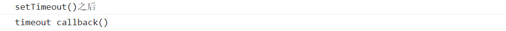

```js
// Promise成功与失败的回调
new Promise((resolve,reject)=>{
    resolve(1);
}).then(
	value => {console.log('value',value)},
    reason => {console.log('reason',reason)}
);
console.log('-----');
```


> js引擎先把初始化的同步代码都执行完成之后，才执行回调对列中的代码

### 异步编程

* fs 文件操作

```js
require('fs').readFile('./index.html',(err,data)=>{});
```

* 数据库操作
* Ajax

```js
$.get('/server',(data)=>{});
```

* 定时器

```js
setTimeout(()=>{},200);
```

### JS中的异常 error 处理

#### 错误的类型

`error`: 所有错误的父类型

`ReferenceError`: 引用的变量不存在

```js
console.log(a); //=>Uncaught ReferenceError: a is not defined
```

`TypeError`: 数据类型不正确

```js
let b;
console.log(b.xxx); 
//=>Uncaught TypeError: Cannot read properties of undefined (reading 'xxx')

let c = {};
c.xxx();
//=>Uncaught TypeError: c.xxx is not a function
```

`RangeError`: 数据值不再其所允许的范围内

```js
function fn(){
    fn();
}
fn();//=>Uncaught RangeError: Maximum call stack size exceeded
```

`SyntaxError`: 语法错误

```js
const c = """"; //=>Uncaught SyntaxError: Unexpected string
```

#### 错误处理 (捕获与抛出)

抛出错误: `throw error`

```js
function something(){
    if(Date.now()%2 === 1){
        console.log('当前时间为奇数，可以执行任务');
    }else{
		throw new Error('当前时间为偶数，无法执行任务');
    }
}
```

捕获错误 : `try ... catch`

```js
// 捕获处理异常
try {
  something();
} catch (error) {
  alert(error.message);
}
```

#### 错误对象

- message 属性 : 错误相关信息
- stack 属性 : 函数调用栈记录信息

```js
try{
	let d;
    console.log(d.xxx);
}catch(error){
    console.log(error.message);
    console.log(error.stack);
}
console.log('出错之后');
```

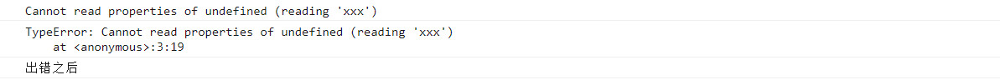

> 因为错误被捕获处理了，后面的代码才能运行下去，打印出 "出错之后"

## Promise的理解和使用

### Promise是什么

#### 理解Promise

- 抽象表达 :  `Promise`是JS中进行**异步编程**的新的解决方案 (旧方案是单纯使用回调函数)

- 具体表达 : 

  - 从语法上看: `Promise`是一个构造函数 (身上有`all`、`reject`、`resolve`这几个方法，原型上有`then`、`catch`等方法)
  - 从功能上看: `Promise`对象用来封装一个异步操作并可以获取其 成功 / 失败 的结果值

- 阮一峰的解释:

  所谓`Promise`，简单说就是一个容器，里面保存着某个未来才会结束的事件（通常是一个异步操作）的结果
  从语法上说，`Promise` 是一个对象，从它可以获取异步操作的消息
  `Promise` 提供统一的 API，各种异步操作都可以用同样的方法进行处理

#### Promise 的状态

实例对象中的一个属性 `PromiseState`

* `pending`  未决定的
* `resolved` | `fulfilled`  成功
* `rejected`  失败

第一种: `pending`变为 `resolved` / `fulfilled`

第二种: `pending` 变为 `rejected`

注意 

- 对象的状态不受外界影响
- 只有这两种，且一个`Promise`对象只能改变一次
- 一旦状态改变，就不会再改变，任何时候都可以得到这个结果
- 无论成功还是失败，都会有一个结果数据。成功的结果数据一般称为`value`，而失败的一般称为`reason`

#### Promise对象的值

实例对象`promise`的另一个值 `PromiseResult`

保存着异步任务(对象) 『成功 / 失败』的结果 (`value` / `reason`)

* resolve
* reject

`resolve` / `reject`可以修改值

#### Promise 的基本流程

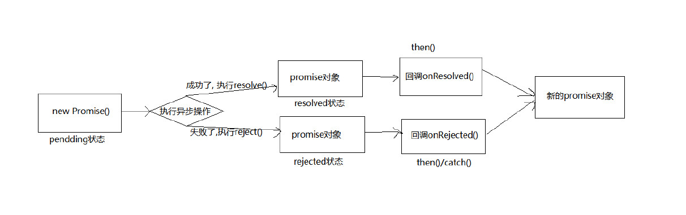

#### Promise的基本使用

```js
const promise = new Promise(function(resolve,reject){
    // ... some code
    if(/* 异步操作成功 */){
        resolve(value);
    }else{
        reject(reason);
    }
});
```

`Promise`构造函数接受**一个函数** (执行函数) 作为参数，该函数的**两个参数**分别是`resolve`和`reject`。它们是**两个函数**，由JavaScript引擎提供，不用自己部署。

`resolve`函数的作用是，将`Promise`对象的状态从"未完成"变为"成功" (即从`pending`变为`resolved`)，在**异步操作成功**时调用，并将异步操作的结果，作为`value`传递出去。

`reject`函数的作用是，将`Promise`对象的状态从"未完成"变为"失败" (即从`pending`变为`rejected`)，在**异步操作失败**时调用，并将异步操作报出的错误，作为参数 `error`/`reason`传递出去。

`Promise`实例生成以后，可以用`then`方法分别指定`resolved`状态和`rejected`状态的回到函数。

```js
promise.then(function(value){
    //success
}, function(reason){
    // failure
});
```

`then`方法可以接受**两个回调函数**作为参数

第一个回调函数`onResolved()`是`Promise`对象的状态变为`resolved`时调用

第二个回调函数`onRejected()`是`Promise`对象的状态变为`rejected`时调用

这两个函数都是可选的，不一定要提供。它们都接受`Promise`对象传出的值作为参数

- 一个例子

```js
// 创建一个新p的Promise对象
const p = new Promise((resolve,reject) =>{ // 执行器函数
    // 执行异步操作任务
    setTimeout(()=>{
        const time = Date.now();
        // 如果当前是偶数代表成功，否则失败
        if (time % 2 == 0){
            // 如果成功，调用resolve(value)
            resolve('成功的数据，time=' + time);
        }else{
            // 如果失败，调用reject(reason)
            reject('失败的数据，time=' + time);
        }
    },1000)
})
p.then(value=>{ // 接收得到成功的value数据 onResolved
    console.log('成功的回调',value); //成功的回调 成功的数据，time=1666974062186
},reason=>{
    console.log('失败的回调',reason); //失败的回调 失败的数据，time=1666973980641
})
```

> .then()和执行器(executor)同步执行，.then()中的回调函数异步执行

### 为什么要用 Promise

#### 指定回调函数的方式更加灵活

旧的: 必须在启动异步任务前指定

```js
// 1. 纯回调的形式
// 成功的回调函数
function successCallback(result){
    console.log("声音文件创建成功:"+result);
}
// 失败的回调函数
function failureCallback(reason){
    console.log("声音文件创建失败:"+reason);
}
// 必须现指定回调函数，再执行异步任务
createAudioFileAsync(audioSettings, successCallback, failureCallback) // 回调函数在执行异步任务（函数）前就要指定
```

Promise: 启动异步任务 => 返回promise对象 => 给promise对象绑定回调函数 (甚至可以在异步任务结束后指定)

```js
// 2.使用Promise
const promise = createAudioFileAsync(audioSettings); //执行2秒
setTimeout(()=>{
    promise.then(successCallback,failureCallback); // 也可以获取
},3000)
```

具体参考:

```js
// 1. 创建一个新的promise对象
const p = new Promise((resolve, reject) => { // 执行器函数 同步回调
    console.log('-------------执行 excutor 执行器函数---------------1') // 先执行
    // 2. 执行异步操作任务 
    setTimeout(() => {
        console.log('-------------异步任务中的回调函数 --------------3')
        const time = Date.now() // 如果当前时间是偶数就代表成功，否则就代表失败
        if (time%2 == 0){// 3.1 如果成功了，调用resolve(value)
            resolve('成功的数据 time=' + time)    // value = '成功的数据 time=' + time
        }else{// 3.2 如果失败了，调用reject(reason)
            reject('失败的数据 time=' + time)   // reason = '失败的数据 time=' + time
        }
    }, 1000);
});
console.log('-------------new Promise() 之后--------------2')

p.then(
    value => { // 接收得到成功的value数据  onResolved
        console.log('成功的回调', value)     // 成功的回调 成功的数据 time=1612949194514
    },
    reason => { // 接收得到失败的reason数据  onRejected
        console.log('失败的回调', reason)   // 失败的回调 失败的数据 time=1612949218973
    }
)
```

```js
// 1. 纯回调的形式
// 成功的回调函数
function successCallback(result) {
    console.log("声音文件创建成功：" + result);
}
// 失败的回调函数
function failureCallback(error) {
    console.log("声音文件创建失败：" + error);
}
// 必须先指定回调函数，再执行异步任务
createAudioFileAsync(audioSettings, successCallback, failureCallback) // 回调函数在执行异步任务（函数）前就要指定


// 2. 使用Promise
const promise = createAudioFileAsync(audioSettings);  // 执行2秒
setTimeout(() => {
    promise.then(successCallback, failureCallback) // 也可以获取
}, 3000);


// 3. 回调地狱
doSomething(function(result) {
    doSomethingElse(result, function(newResult) {
        doThirdThing(newResult, function(finalResult) {
            console.log('Got the final result: ' + finalResult);
        }, failureCallback);
    }, failureCallback);
}, failureCallback);


// 4. promise 链式回调
doSomething().then(function(result) {
    return doSomethingElse(result);
})
    .then(function(newResult) {
    return doThirdThing(newResult);
})
    .then(function(finalResult) {
    console.log('Got the final result: ' + finalResult);
})
    .catch(failureCallback);

// 使用箭头函数
doSomething()
    .then(result => doSomethingElse(result))
    .then(newResult => doThirdThing(newResult))
    .then(finalResult => {
    console.log(`Got the final result: ${finalResult}`);
})
    .catch(failureCallback);


// 回调地狱的终极解决方案 async/await
async function request() {
    try{
        const result = await doSomething()
        const newResult = await doSomethingElse(result)
        const finalResult = await doThirdThing(newResult)
        console.log('Got the final result:' + finalResult)
    } catch (error) {
        failureCallback(error)
    }
}
```

#### 支持链式调用，可以解决回调地狱问题

什么是回调地狱?

> 回调函数嵌套使用，外部回调函数异步执行的结果是其内部嵌套的回调函数执行的条件

```js
doSomething(function(result) {
    doSomethingElse(result, function(newResult) {
        doThirdThing(newResult, function(finalResult) {
            console.log('Got the final result: ' + finalResult);
        }, failureCallback);
    }, failureCallback);
}, failureCallback);
```

回调地狱的缺点?

- 不便于阅读
- 不便于异常处理

解决方案?

- promise 链式调用

使用promise的链式调用解决回调地狱

```js
doSomething().then(result => doSomethingElse(result))
.then(newResult => doThirdThing(newResult))
.then(finalResult => {console.log('Got the final result:' + finalResult)})
.catch(failureCallback);
```

终极解决方案?

- async / await

回调地狱的终极解决方案 async / await

```js
async function request(){
    try{
        const result = await doSomething();
        const newResult = await doSomethingElse(result);
        const finalResult = await doThirdThing(newResult);
        console.log('Got the final result:'+ finalResult);
    }catch(error){
        failureCallback(error);
    }
}
```

### 如何使用 Promise

#### Promise 构造函数: `Promise(executor) {}`

- `executor`函数: 同步执行 `(resolve,reject) => {}`
- `resolve`函数: 内部定义成功时调用的函数 `resolve(value)`
- `reject`函数: 内部定义失败时调用的函数 `reject(reason)`

说明: `executor`是执行器，会在 `Promise`内部立即同步回调，异步操作 `resolve`/`reject`就在`executor`中执行

#### Promise.prototype.then 方法: `p.then(onResolved,onRejected)`

指定两个回调 (成功 | 失败)

- `onResolved`函数: 成功的回调函数 `(value) => {}`
- `onRejected`函数: 失败的回调函数 `(reason) => {}`

说明: 指定用于得到成功 `value`的成功回调和用于得到失败 `reason`的失败回调，返回的是一个新的 `promise`对象

#### Promise.prototype.catch 方法: `p.catch(onRejected)`

指定失败的回调

- `onRejected`函数: 失败的回调函数 `(reason) => {}`

说明: 这是`then()`的语法糖，相当于`then(undefined,onRejected)`

```js
new Promise((resolve,reject)=>{ // executor执行器函数
    setTimeout(()=>{
        if(...){
        	resolve('成功的数据');   //resolve()函数
        }else{
        	reject('失败的数据');    //reject()函数   
        }
    },1000);
}).then(value=>{ // onResolved()函数
    console.log(value); //成功的数据
}).catch(reason=>{ // onRejected()函数
    console.log(reason); //失败的数据
});
```

#### Promise.resolve 方法: `Promise.resolve(value)`

`value`: 将被`Promise`对象解析的参数，也可以是一个成功或失败的`Promise`对象

返回: 返回一个带着给定值解析过的`Promise`对象，如果参数本身就是一个`Promise`对象，则直接返回这个`Promise`对象。

- 如果传入的参数为非`Promise`类型的对象，则返回的结果为成功`Promise`对象

```js
let p1 = Promise.resolve(521);
console.log(p1); // Promise {<fulfilled>: 521}
```


- 如果传入的参数为`Promise`对象，则参数的结果决定了`resolve`的结果

```js
let p2 = Promise.resolve(new Promise((resolve,reject)=>{
    // resolve('ok');  // 成功的Promise
    reject('Error');
}));
console.log(p2);
p2.catch(reason =>{
    console.log(reason);
});
```

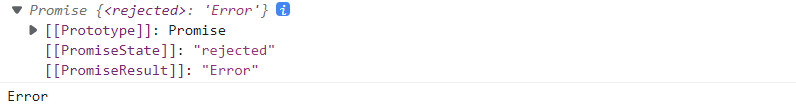

#### Promise.reject 方法: `Promise.reject(reason)`

`reason`: 失败的原因

说明: 返回一个失败的 `Promise`对象

```js
let p1 = Promise.reject(521);
let p2 = Promise.reject('iloveyou');
let p3 = Promise.reject(new Promise((resolve,reject) =>{
    resolve('ok');
}));

console.log(p1);
console.log(p2);
console.log(p3);
```

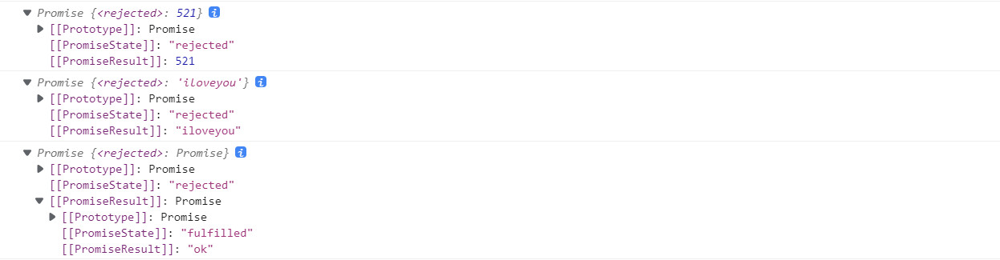

- `Promise.resolve()`/`Promise.reject()`方法就是一个语法糖
- 用来快速得到`Promise`对象

```js
//产生一个成功值为1的promise对象
new Promise((resolve, reject) => {
 resolve(1)
})
//相当于
const p1 = Promise.resolve(1)
const p2 = Promise.resolve(2)
const p3 = Promise.reject(3)

p1.then(value => {console.log(value)}) // 1
p2.then(value => {console.log(value)}) // 2
p3.catch(reason => {console.log(reason)}) // 3
```

#### Promise.all 方法: `Promise.all(iterable)`

`iterable`: 包含n个`Promise`的可迭代对象，如`Array`或`String`

说明: 返回一个新的`Promise`，只有所有的`promise`都成功才成功，只要有一个失败了就直接失败

```js
let p1 = new Promise((resolve,reject)=>{
	resolve('ok');
});
let p2 = Promise.resolve('Success');
let p3 = Promise.resolve('Oh Yeah');

const result = Promise.all([p1,p2,p3]);
console.log(result);
```

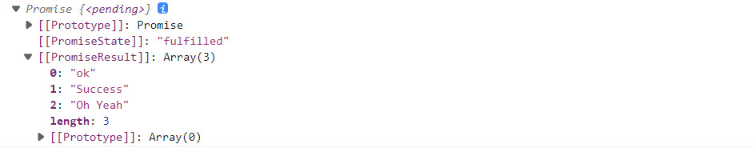

```js
let p1 = new Promise((resolve,reject)=>{
	resolve('ok');
});
let p2 = Promise.reject('Error');
let p3 = Promise.resolve('Oh Yeah');

const result = Promise.all([p1,p2,p3]);
console.log(result);
```


```js
const p1 = Promise.resolve(1);
const p2 = Promise.resolve(2);
const p3 = Promise.reject(3);

const pAll = Promise.all([p1, p2, p3]);
const pAll2 = Promise.all([p1, p2]);
//因为其中p3是失败所以pAll失败
pAll.then(value => {
   console.log('all onResolved()', value);
 },reason => {
   console.log('all onRejected()', reason);
});// all onRejected() 3
pAll2.then(values => {
   console.log('all onResolved()', values);
 },reason => {
   console.log('all onRejected()', reason);
}); // all onResolved() [1, 2]
```

#### Promise.race方法: `Promise.race(iterable)`

`iterable`: 包含n个`promise`的可迭代对象，如`Array`或`String`

说明: 返回一个新的`Promise`,第一个完成的`promise`的结果状态就是最终的结果状态

**谁先完成就输出谁(不管是成功还是失败)**

```js
//谁先完成就输出谁(不管是成功还是失败)
const p1 = new Promise((resolve,reject) => {
    setTimeout(()=>{
        resolve(1);
    },1000);
});
const p2 = Promise.resolve(2);
const p3 = Promise.reject(3);

const pRace = Promise.race([p1,p2,p3]);

pRace.then(value=>{
    console.log('race onResolved()',value);
},reason =>{
    console.log('race onRejected()',reason);
});
//=>race onResolved() 2
```

```js
let p1 = new Promise((resolve,reject) => {
    setTimeout(()=>{
        resolve('ok');
    },1000);
});
let p2 = Promise.resolve('Success');
let p3 = Promise.resolve('Oh Yeah');

// 调用
const result = Promise.race([p1,p2,p3]);
console.log(result);
```


## Promise的几个关键问题

### 如何改变 `Promise`的状态?

(1) `resolve(value)`: 如果当前是`pending`就会变为`resolved`

(2) `reject(reason)`: 如果当前是`pending`就会变为`rejected`

(3) 抛出异常: 如果当前是 `pending`就会变为`rejected`

```js
const p = new Promise((resolve,reject) => {
    //resolve(1); //=>promise变为resolved成功状态
    //reject(2);  //=>promise变为rejected失败状态
    throw new Error('出错了'); //抛出异常，promise变为rejected失败状态，reason为抛出的error
});
p.then(value=>{},reason=>{
    console.log('reason',reason);
}); // reason Error: 出错了
```

### 一个promise指定多个成功/失败回调函数，都会调用吗?

当`promise`**改变**为对应状态时**都会调用**

```js
const p = new Promise((resolve,reject)=>{
    //resolve(1);
    reject(2);
});
p.then(value=>{},reason=>{
	console.log('reason',reason);
});
p.then(value=>{},reason=>{
    console.log('reason2',reason);
});
//reason 2
//reason2 2
```

### 改变promise状态和指定回调函数谁先谁后?

> 都有可能，常规是先指定回调再改变状态，但也可以先改状态再指定回调

- 如果先改状态再指定回调?

(1) 在执行器中直接调用 `resolve()`/`reject()`

(2) 延迟更长时间才调用 `then()`

```js
let p = new Promise((resolve,reject)=>{
	//setTimeout(()=>{
        resolve('ok');
    //},1000); //=>有异步就先指定回调，否则先改变状态
});
p.then(value=>{
    console.log(value);
},reason=>{});
```

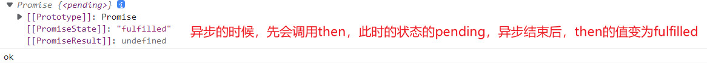

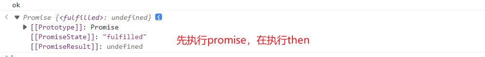

- 什么时候才能的到数据?

(1) 如果先指定的回调，那当状态发生改变时，回调函数就会调用得到的数据

(2) 如果先改变的状态，那当指定回调时，回调函数就会调用得到的数据

```js
new Promise((resolve,reject)=>{
    setTimeout(()=>{
        resolve(1);// 改变状态
    },1000);
}).then(value=>{},reason=>{});  //指定回调函数 (先指定)
```

此时，先指定回调函数，保存当前指定的回调函数; 后改变状态(同时指定数据)，然后异步执行之前保存的回调函数

```js
new Promise((resolve,reject)=>{
        resolve(1);// 改变状态
}).then(value=>{},reason=>{});  //指定回调函数
```

这种写法，先改变的状态(同时指定数据)，后指定回调函数(不需要再保存)，直接异步执行回调函数

### promise.then() 返回的新 promise 的结果状态由什么决定?

(1) 简单表达: 由 `then()`指定的回调函数执行的结果决定

```js
let p = new Promise((resolve,reject)=>{
    resolve('ok');
});
//执行then方法
let result = p.then(value=>{
    console.log(value);
},reason=>{
    console.warn(reason);
});
console.log(result);
```


(2) 详细表达: 

① 如果抛出异常，新`promise`变为`rejected`,`reason`为抛出的异常

```js
let p = new Promise((resolve,reject)=>{
    resolve('ok');
});
//执行 then 方法
let result = p.then(value=>{
    //1.抛出错误
    throw '出了问题';
},reason=>{
    console.warn(reason);
});
console.log(result);
```


② 如果返回的是非`promise`的任意值，新`promise`变为`resolved`,`value`为返回的值

```js
let p = new Promise((resolve,reject)=>{
    resolve('ok');
});
//执行 then 方法
let result = p.then(value=>{
    //2.返回结果是非 Promise 类型的对象
    return 521;
},reason=>{
    console.warn(reason);
});
console.log(result);
```


③ 如果返回的是另一个新`promise`，此`promise`的结果就会成为新 `promise`的结果

```js
let p = new Promise((resolve, reject) => {
  resolve('ok');
});
//执行 then 方法
let result = p.then(value => {
	//3. 返回结果是 Promise 对象
	return new Promise((resolve, reject) => {
		// resolve('success');
		reject('error');
	});
}, reason => {
  console.warn(reason);
});

console.log(result);
```


```js
new Promise((resolve, reject) => {
  resolve(1);
}).then(value => {
    console.log('onResolved1()', value);
},reason => {
    console.log('onRejected1()', reason);
}).then(value => {
    console.log('onResolved2()', value);
},reason => {
    console.log('onRejected2()', reason);
});
//onResolved1() 1
//onResolved2() undefined
```
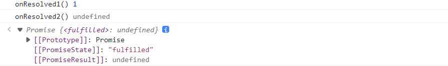

```js
new Promise((resolve, reject) => {
  resolve(1);
}).then(value => {
    console.log('onResolved1()', value);
    //return 2;                   // onResolved2() 2
    //return Promise.resolve(3);  // onResolved2() 3
    //return Promise.reject(4);   // onRejected2() 4
    //throw 5;                    // onRejected2() 5
},reason => {
    console.log('onRejected1()', reason);
}).then(value => {
    console.log('onResolved2()', value);
},reason => {
    console.log('onRejected2()', reason);
});
// onResolved1() 1
// onResolved2() undefined
// Promise {<fulfilled>: undefined}
// 对应输出如上所示
```

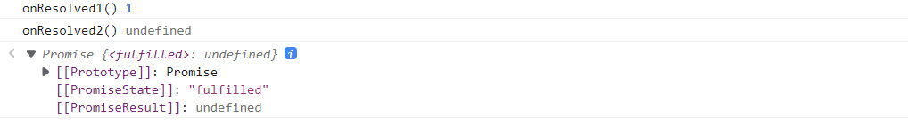

### promise 如何串联多个操作任务

(1) `promise`的`then()`返回一个新的`promise`，可以并成`then()`的链式调用

(2) 通过`then`的链式调用串联多个 同步 / 异步任务

```js
let p = new Promise((resolve,reject) =>{
    setTimeout(()=>{
        resolve('OK');
    },1000);
});
p.then(value=>{
    return new Promise((resolve,reject)=>{
        resolve('Success');
    });
}).then(value=>{
    console.log(value); //=>Success
}).then(value=>{
    console.log(value); //=>undefined
});
```

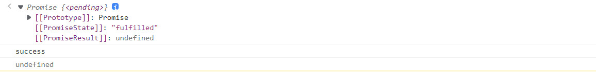

```js
new Promise((resolve,reject)=>{
    setTimeout(()=>{
        console.log('执行任务1(异步)');
        resolve(1);
    },1000);
}).then(value=>{
    console.log('任务1的结果',value);
    console.log('执行任务2(同步)')
    return 2;  // 同步任务直接return返回结果
}).then(value=>{
    console.log('任务2的结果',value);
    return new Promise((resolve,reject)=>{ // 异步任务需要包裹在Promise对象中
        setTimeout(()=>{
            console.log('执行任务3(异步)');
            resolve(3)
        },1000);
    });
}).then(value=>{
    console.log('任务3的结果',value);
});
```

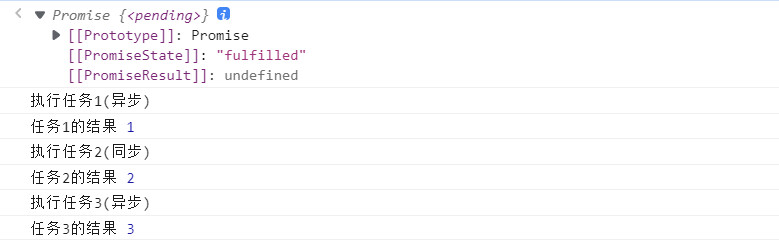

### Promise异常穿透(传透)

(1) 当使用`promise`的`then`链式调用时，可以在最后指定失败的回调

(2) 前面任何操作出了异常，都会传到最后失败的回调中处理

```js
new Promise((resolve,reject)=>{
    //resolve(1);
    reject(1);
}).then(value=>{
    console.log('onResolved1()',value);
    return 2;
}).then(value=>{
    console.log('onResolve2()',value);
    return 3;
}).then(value => {
    console.log('onResolved3()', value)
}).catch(reason => {
    console.log('onRejected1()', reason)
});
```

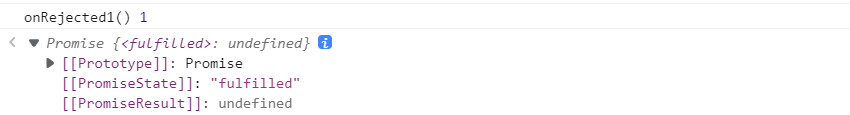

相当于这种写法: 多写了很多 `reason => {throw reason}`

```js
new Promise((resolve, reject) => {
   //resolve(1);
   reject(1);
}).then(value => {
    console.log('onResolved1()', value);
    return 2;
},reason => {
    throw reason; // 抛出失败的结果reason
}).then(value => {
    console.log('onResolved2()', value);
    return 3;
},reason => {
    throw reason; // 抛出失败的结果reason
}).then(value => {
    console.log('onResolved3()', value)
},reason => {
    throw reason; // 抛出失败的结果reason
}).catch(reason => {
    console.log('onRejected1()', reason);
});
// onRejected1() 1
```

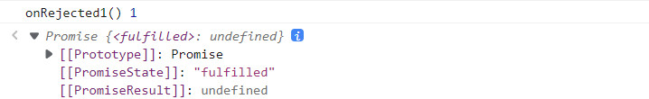

所以失败的结果是一层一层处理下来的，最后传递到`catch`中。

或者，将`reason => { throw reason; }`替换为 `reason => Promise.reject(reason)`也是一样的。

### 中断promise链?

当使用`promise`的`then`链式调用时，在中间中断，不再调用后面的回调函数

办法: 在回调函数中返回一个`pending`状态的`promise`对象

```js
new Promise((resolve, reject) => {
   //resolve(1);
   reject(1);
}).then(value => {
    console.log('onResolved1()', value);
    return 2;
}).then(value => {
    console.log('onResolved2()', value);
    return 3;
}).then(value => {
    console.log('onResolved3()', value);
}).catch(reason => {
    console.log('onRejected1()', reason);
}).then(value => {
    console.log('onResolved4()', value);
},reason => {
    console.log('onRejected2()', reason);
});
// onRejected1() 1
// onResolved4() undefined
```

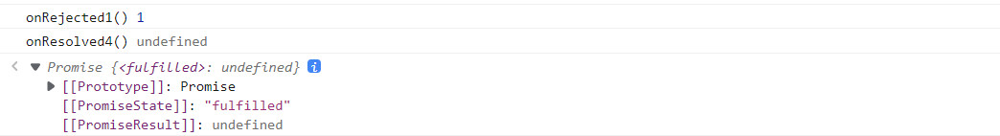

为了在 `catch` 中就中断执行，可以这样写：

```js
new Promise((resolve, reject) => {
   //resolve(1);
   reject(1);
}).then(value => {
    console.log('onResolved1()', value);
    return 2;
}).then(value => {
    console.log('onResolved2()', value);
    return 3;
}).then(value => {
    console.log('onResolved3()', value);
}).catch(reason => {
    console.log('onRejected1()', reason);
    return new Promise(() => {}); // 返回一个pending的promise
}).then(value => {
    console.log('onResolved4()', value);
},reason => {
    console.log('onRejected2()', reason);
});
// onRejected1() 1
```

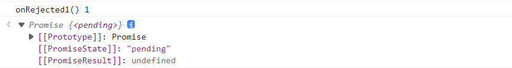

在`catch`中返回一个新的`promise`,且这个`promise`没有结果。

由于，返回的新的`promise`结果决定了后面`then`中的结果，所以后面的`then`中也没有结果

这就实现了中断`promise链`的效果。

## 用JavaScript简易模拟Promise

```js
function Promise(executor) {
    //添加属性
    this.PromiseState = 'pending';
    this.PromiseResult = null;
    //声明属性
    this.callbacks = [];
    //保存实例对象this的值
    var self = this;

    //resolve函数
    function resolve(data) {
        // 判断状态
        if (self.PromiseState !== 'pending') return;
        //1.修改对象的状态 (PromiseState)
        self.PromiseState = 'fulfilled';
        //2.设置对象结果值 (PromiseResult)
        self.PromiseResult = data;
        //调用成功的回调函数
        setTimeout(function() {
            self.callbacks.forEach(item => {
                item.onResolved();
            });
        });
    }
    //reject函数
    function reject(data) {
        // 判断状态
        if (self.PromiseState !== 'pending') return;
        //1.修改对象的状态 (PromiseState)
        self.PromiseState = 'rejected';
        //2.设置对象结果值 (PromiseResult)
        self.PromiseResult = data;
        //调用失败的回调函数
        setTimeout(function() {
            self.callbacks.forEach(item => {
                item.onRejected();
            });
        });
    }
    try {
        //同步调用 [执行器函数]
        executor(resolve, reject);
    } catch (error) {
        //修改 promise 对象状态为『失败』
        reject(error);
    }
}

//添加then方法
Promise.prototype.then = function(onResolved, onRejected) {
    // 此时this的指向是调用.then()方法的Promise对象p
    var that = this;
    return new Promise(function(resolve, reject) {
        //封装函数
        function callback(type) {
            if (type) {
                var result = type(that.PromiseResult);
                //判断 result是否为undefined和null，因为它们没有.constructor.name
                if (result) {
                    if (result.constructor.name === 'Promise') {
                        result.then(function(value) {
                            resolve(value);
                        }, function(reason) {
                            reject(reason);
                        });
                    } else {
                        //结果的对象状态为成功
                        resolve(result);
                    }
                } else {
                    resolve(result);
                }
            } else {
                resolve(that.PromiseResult);
            }
        }
        //使得then异步
        // setTimeout(function() {
        if (that.PromiseState === 'fulfilled') {
            callback(onResolved);
        }
        if (that.PromiseState === 'rejected') {
            callback(onRejected);
        }
        //判断 pending 状态
        if (that.PromiseState === 'pending') {
            //保存回调函数
            that.callbacks.push({
                onResolved: function() {
                    callback(onResolved);
                },
                onRejected: function() {
                    callback(onRejected);
                }
            });
        }

        // });
    });
}

//添加catch方法
Promise.prototype.catch = function(onRejected) {
    return this.then(undefined, onRejected);
}

//添加reject方法
Promise.reject = function(reason) {
    return new Promise(function(resolve, reject) {
        reject(reason);
    })
}

//添加resolve方法
Promise.resolve = function(value) {
    return new Promise(function(resolve, reject) {
        if (value) {
            if (value.constructor.name === 'Promise') {
                value.then(function(v) {
                    resolve(v);
                }, function(reason) {
                    reject(reason);
                });
            } else {
                //结果的对象状态为成功
                resolve(value);
            }
        } else {
            resolve(value);
        }
    })
}

//添加all方法
Promise.all = function(promises) {
    return new Promise((resolve, reject) => {
        //声明变量
        let count = 0;
        let arr = [];
        //遍历
        for (let i = 0; i < promises.length; i++) {
            //
            promises[i].then(v => {
                //得知对象的状态是成功
                //每个promise对象 都成功
                count++;
                //将当前promise对象成功的结果 存入到数组中
                arr[i] = v;
                //判断
                if (count === promises.length) {
                    //修改状态
                    resolve(arr);
                }
            }, r => {
                reject(r);
            });
        }
    });
}

//添加 race 方法
Promise.race = function(promises) {
    return new Promise((resolve, reject) => {
        for (let i = 0; i < promises.length; i++) {
            promises[i].then(v => {
                //修改返回对象的状态为 『成功』
                resolve(v);
            }, r => {
                //修改返回对象的状态为 『失败』
                reject(r);
            })
        }
    });
}
```

尚硅谷版本:

```js
//声明构造函数
function Promise(executor){
    //添加属性
    this.PromiseState = 'pending';
    this.PromiseResult = null;
    //声明属性
    this.callbacks = [];
    //保存实例对象的 this 的值
    const self = this;// self _this that
    //resolve 函数
    function resolve(data){
        //判断状态
        if(self.PromiseState !== 'pending') return;
        //1. 修改对象的状态 (promiseState)
        self.PromiseState = 'fulfilled';// resolved
        //2. 设置对象结果值 (promiseResult)
        self.PromiseResult = data;
        //调用成功的回调函数
        setTimeout(() => {
            self.callbacks.forEach(item => {
                item.onResolved(data);
            });
        });
    }
    //reject 函数
    function reject(data){
        //判断状态
        if(self.PromiseState !== 'pending') return;
        //1. 修改对象的状态 (promiseState)
        self.PromiseState = 'rejected';// 
        //2. 设置对象结果值 (promiseResult)
        self.PromiseResult = data;
        //执行失败的回调
        setTimeout(() => {
            self.callbacks.forEach(item => {
                item.onRejected(data);
            });
        });
    }
    try{
        //同步调用『执行器函数』
        executor(resolve, reject);
    }catch(e){
        //修改 promise 对象状态为『失败』
        reject(e);
    }
}

//添加 then 方法
Promise.prototype.then = function(onResolved, onRejected){
    const self = this;
    //判断回调函数参数
    if(typeof onRejected !== 'function'){
        onRejected = reason => {
            throw reason;
        }
    }
    if(typeof onResolved !== 'function'){
        onResolved = value => value;
        //value => { return value};
    }
    return new Promise((resolve, reject) => {
        //封装函数
        function callback(type){
            try{
                //获取回调函数的执行结果
                let result = type(self.PromiseResult);
                //判断
                if(result instanceof Promise){
                    //如果是 Promise 类型的对象
                    result.then(v => {
                        resolve(v);
                    }, r=>{
                        reject(r);
                    })
                }else{
                    //结果的对象状态为『成功』
                    resolve(result);
                }
            }catch(e){
                reject(e);
            }
        }
        //调用回调函数  PromiseState
        if(this.PromiseState === 'fulfilled'){
            setTimeout(() => {
                callback(onResolved);
            });
        }
        if(this.PromiseState === 'rejected'){
            setTimeout(() => {
                callback(onRejected);
            });
        }
        //判断 pending 状态
        if(this.PromiseState === 'pending'){
            //保存回调函数
            this.callbacks.push({
                onResolved: function(){
                    callback(onResolved);
                },
                onRejected: function(){
                    callback(onRejected);
                }
            });
        }
    })
}

//添加 catch 方法
Promise.prototype.catch = function(onRejected){
    return this.then(undefined, onRejected);
}

//添加 resolve 方法
Promise.resolve = function(value){
    //返回promise对象
    return new Promise((resolve, reject) => {
        if(value instanceof Promise){
            value.then(v=>{
                resolve(v);
            }, r=>{
                reject(r);
            })
        }else{
            //状态设置为成功
            resolve(value);
        }
    });
}

//添加 reject 方法
Promise.reject = function(reason){
    return new Promise((resolve, reject)=>{
        reject(reason);
    });
}

//添加 all 方法
Promise.all = function(promises){
    //返回结果为promise对象
    return new Promise((resolve, reject) => {
        //声明变量
        let count = 0;
        let arr = [];
        //遍历
        for(let i=0;i<promises.length;i++){
            //
            promises[i].then(v => {
                //得知对象的状态是成功
                //每个promise对象 都成功
                count++;
                //将当前promise对象成功的结果 存入到数组中
                arr[i] = v;
                //判断
                if(count === promises.length){
                    //修改状态
                    resolve(arr);
                }
            }, r => {
                reject(r);
            });
        }
    });
}

//添加 race 方法
Promise.race = function(promises){
    return new Promise((resolve, reject) => {
        for(let i=0;i<promises.length;i++){
            promises[i].then(v => {
                //修改返回对象的状态为 『成功』
                resolve(v);
            },r=>{
                //修改返回对象的状态为 『失败』
                reject(r);
            })
        }
    });
}
```

封装:

```js
class Promise{
    //构造方法
    constructor(executor){
        //添加属性
        this.PromiseState = 'pending';
        this.PromiseResult = null;
        //声明属性
        this.callbacks = [];
        //保存实例对象的 this 的值
        const self = this;// self _this that
        //resolve 函数
        function resolve(data){
            //判断状态
            if(self.PromiseState !== 'pending') return;
            //1. 修改对象的状态 (promiseState)
            self.PromiseState = 'fulfilled';// resolved
            //2. 设置对象结果值 (promiseResult)
            self.PromiseResult = data;
            //调用成功的回调函数
            setTimeout(() => {
                self.callbacks.forEach(item => {
                    item.onResolved(data);
                });
            });
        }
        //reject 函数
        function reject(data){
            //判断状态
            if(self.PromiseState !== 'pending') return;
            //1. 修改对象的状态 (promiseState)
            self.PromiseState = 'rejected';// 
            //2. 设置对象结果值 (promiseResult)
            self.PromiseResult = data;
            //执行失败的回调
            setTimeout(() => {
                self.callbacks.forEach(item => {
                    item.onRejected(data);
                });
            });
        }
        try{
            //同步调用『执行器函数』
            executor(resolve, reject);
        }catch(e){
            //修改 promise 对象状态为『失败』
            reject(e);
        }
    }

    //then 方法封装
    then(onResolved,onRejected){
        const self = this;
        //判断回调函数参数
        if(typeof onRejected !== 'function'){
            onRejected = reason => {
                throw reason;
            }
        }
        if(typeof onResolved !== 'function'){
            onResolved = value => value;
            //value => { return value};
        }
        return new Promise((resolve, reject) => {
            //封装函数
            function callback(type){
                try{
                    //获取回调函数的执行结果
                    let result = type(self.PromiseResult);
                    //判断
                    if(result instanceof Promise){
                        //如果是 Promise 类型的对象
                        result.then(v => {
                            resolve(v);
                        }, r=>{
                            reject(r);
                        })
                    }else{
                        //结果的对象状态为『成功』
                        resolve(result);
                    }
                }catch(e){
                    reject(e);
                }
            }
            //调用回调函数  PromiseState
            if(this.PromiseState === 'fulfilled'){
                setTimeout(() => {
                    callback(onResolved);
                });
            }
            if(this.PromiseState === 'rejected'){
                setTimeout(() => {
                    callback(onRejected);
                });
            }
            //判断 pending 状态
            if(this.PromiseState === 'pending'){
                //保存回调函数
                this.callbacks.push({
                    onResolved: function(){
                        callback(onResolved);
                    },
                    onRejected: function(){
                        callback(onRejected);
                    }
                });
            }
        })
    }

    //catch 方法
    catch(onRejected){
        return this.then(undefined, onRejected);
    }

    //添加 resolve 方法
    static resolve(value){
        //返回promise对象
        return new Promise((resolve, reject) => {
            if(value instanceof Promise){
                value.then(v=>{
                    resolve(v);
                }, r=>{
                    reject(r);
                })
            }else{
                //状态设置为成功
                resolve(value);
            }
        });
    }

    //添加 reject 方法
    static reject(reason){
        return new Promise((resolve, reject)=>{
            reject(reason);
        });
    }

    //添加 all 方法
    static all(promises){
        //返回结果为promise对象
        return new Promise((resolve, reject) => {
            //声明变量
            let count = 0;
            let arr = [];
            //遍历
            for(let i=0;i<promises.length;i++){
                //
                promises[i].then(v => {
                    //得知对象的状态是成功
                    //每个promise对象 都成功
                    count++;
                    //将当前promise对象成功的结果 存入到数组中
                    arr[i] = v;
                    //判断
                    if(count === promises.length){
                        //修改状态
                        resolve(arr);
                    }
                }, r => {
                    reject(r);
                });
            }
        });
    }

    //添加 race 方法
    static race (promises){
        return new Promise((resolve, reject) => {
            for(let i=0;i<promises.length;i++){
                promises[i].then(v => {
                    //修改返回对象的状态为 『成功』
                    resolve(v);
                },r=>{
                    //修改返回对象的状态为 『失败』
                    reject(r);
                })
            }
        });
    }
}   
```

[参考]([(10条消息) 【Promise】自定义 - 手写Promise - Promise.all - Promise(executor)_YK菌的博客-CSDN博客](https://blog.csdn.net/weixin_44972008/article/details/114134995))


