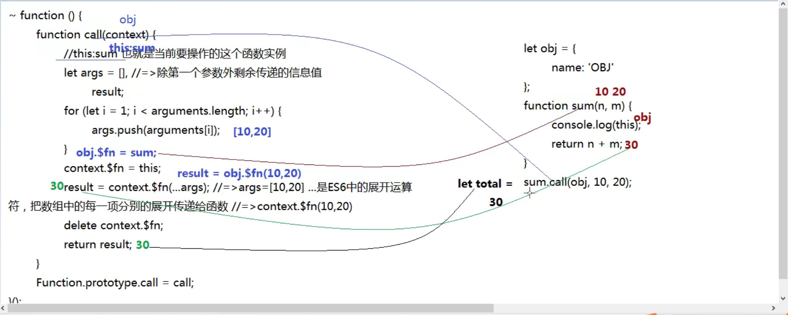
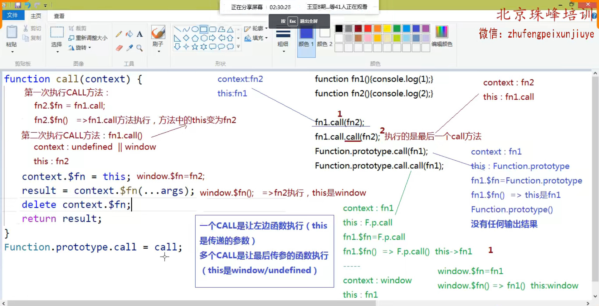

### this

> 每一个函数 (普通函数/构造函数/内置类) 都是Function这个内置类的实例，所以 : 函数.\_\_proto\_\_ === Function.prototype，函数可以直接调取Function原型上的方法

```js
//Function.prototype => function anonymous(){}
/*
 *	call / apply / bind	
 *		原型上提供的三个公有属性方法
 *		每一个函数都可以调用这个方法执行
 *		这些方法都是用来改变函数中的this指向的
 */
function fn(){}
fn.call(); //=>fn函数基于原型链找到Function.prototype上的call方法，并且让其执行 (执行的是call方法: 方法中的this是fn)
fn.call.call(); //=>fn.call就是Function.prototype上的call方法，也是一个函数，只要是函数就能用原型上的方法，所以可以继续调用call来执行

/*
Function.prototype.call = function $1(){
    //...
}
fn.call => $1
fn.call() => $1()	this:fn
fn.call.call() => $1.call() => 继续让call执行，this:$1

实例.方法():都是找到原型上的内置方法，让内置方法先执行 (只不过执行的时候做了一些事情会对实例产生改变，而这也是这些内置方法的作用)，内置方法中的this一般都是当前操作的实例
*/
```

#### call

> 语法 : 函数.call([context],[params1],....)
>
> 函数基于原型链找到 Function.prototype.call 这个方法，并且把它执行，在call方法执行的时候完成了一些功能
>
> - 让当前函数执行
> - 把函数中的this指向改为第一个传递给call的实参
> - 把传递给call其余的实参当做参数信息传递给当前函数
>
> 如果执行call一个实参都没有传递，非严格模式下是让函数中的this指向window，严格模式下指向的是undefined

```js
window.name = 'WINDOW';
let obj = { name: 'OBJ' };
function fn(n,m) {
    console.log(this.name);
};
fn(10,20); //=>this: window //=>'WINDOW'  严格下是undefined
fn.call(obj); //=>this:obj		n/m=undefined
fn.call(obj,10,20); //=>this:obj		n=10 m=20
fn.call(10,20); //=>this:10		n=20 m=undefined

fn.call(); //=>this:window 严格下是undefined
fn.call(null); //=>this: window  严格下是null (第一个参数传递的是null/undefined/不传，非严格模式下this指向window，严格模式下传递的是谁this就是谁，不传this是undefined)

Object.prototype.toString() //=>toString方法中的 this:Object.prototype
Object.prototype.toString.call(100) //=>toString方法中的 this:100

/* 
//=>我们的需求是想让fn执行的时候，方法中的this指向obj
obj.fn(); //=>Uncaught TypeError: obj.fn is not a function 
//=>因为此时obj中并没有fn这个属性

--------解决办法--------

obj.fn = fn;
obj.fn(); //=>this.obj //=>'OBJ'
delete obj.fn;
*/
```

**我们自己基于原生的js实现的内置的call方法**

```js
~ function() {
    /* 
     *  call: 改变函数中的this指向
     *      @params
     *          context 可以不传递，传递必须是引用类型值 (因为后面要给它加$fn的属性)
     */

    function call(context) {
        // this: fn也就是当前要操作的这个函数实例
        context = context || window;
        let args = [], //=>除第一个参数外剩余传递的信息值
            result;
        for (let i = 1; i < arguments.length; i++) {
            args.push(arguments[i]);
        }
        context.$fn = this;
        result = context.$fn(...args); //=>args=[10,20]  ...是ES6中的展开运算符，把数组中的每一项分别展开传递给函数 //=>context.$fn(10.20)
        delete context.$fn;
        return result;
    }

    /* 扩展到内置类的原型上 */
    Function.prototype.call = call;
}();
```



**规律**

> 一个call是让左边函数执行 ( this是传递的参数 )
>
> 多个call是让最后传参的函数执行 ( this 是 window/undefined )

```js
// 阿里的面试题
function fn1() { console.log(1); }

function fn2() { console.log(2); }
fn1.call(fn2); //=>1
fn1.call.call(fn2); //=>2
Function.prototype.call(fn1);
Function.prototype.call.call(fn1); //=>1
```



#### apply方法

> 和call方法一样，都是把函数执行，并且改变里面的this关键字的，唯一的区别就是传递给函数参数方式不同
>
> - call是一个个传参
> - apply是按照数组传参

```js
let obj = {name:'OBj'};
let fn = function (n,m){
    console.log(this.name);
}
//=>让fn方法执行，让方法中的this变为obj，并且传递 10/20
fn.call(obj,10,20);
fn.apply(obj,[10,20]);
```

#### bind方法

> 和 call/apply 一样，也是用来改变函数中的this关键字的，只不过基于bind改变this，当前方法并没有被执行，类似于预先改变this

```js
let obj = {name:'OBj'};
function fn(){
    console.log(this.name);
}
document.body.onclick = fn; //=>当事件触发，fn中的this:body
//=>点击body，让fn中的this指向obj
//document.body.onclick = fn.call(obj); //=>基于call/apply这样处理，不是把fn绑定给事件，而是把fn执行后的结果绑定给事件
document.body.onclick = function(){
    //this:body
    fn.call(obj);
}
document.body.onclick = fn.bind(obj); //=>bind的好处是: 通过bind方法只是预先把fn中的this修改为obj，此时fn并没有执行呢，当点击事件触发才会执行fn (call/apply都是改变this的同时立即把方法执行)
//=>在IE6~8中不支持bind方法  预先做啥事情的思想被称为"柯理化函数"
```

**拓展 : 获取数组中的最大值最小值**

```js
/* 获取数组中的最大值和最小值 */
let ary = [12, 24, 13, 8, 35, 15];

//=>解决方案一: 先排序，第一项和最后一项就是我们需要的
ary.sort(function(a, b) {
    return a - b;
});
let min = ary[0];
let max = ary[ary.length - 1];
console.log(min, max);

//=>解决方案二: Math.max/Math.min 
//=>Math.max/min要求我们传递的数据是一项项传递进来，获取一堆数中的最大最小，而不是获取一个数组中的最大最小
// let min = Math.min([12, 24, 13, 8, 35, 15]);
// console.log(min); //=>NaN
// let min = Math.min(12, 24, 13, 8, 35, 15);
// console.log(min); //=>8

//1.基于ES6的展开运算符
let min = Math.min(...ary);
console.log(min); //=>8

//2.利用apply来实现即可 (this无所谓，主要是利用apply给函数传参，需要写成一个数组的特征)
let min = Math.min.apply(Math, ary);
console.log(min); //=>8

//=>解决方案三: 假设法 (假设第一个是最大的，让数组中的每一项分别和当前假设的值比较，如果比假设的值大，则把最大的值设为新的假设值，继续向后比较即可)
let max = ary[0];
/* for (let i = 0; i < ary.length; i++) {
    let item = ary[i];
    item > max ? max = item : null;
} */
ary.forEach(item => {
    item > max ? max = item : null;
})
console.log(max); //=>35
```


### ES6中常用的基础知识

#### 1. let / const

> ES6中新增的用来创建变量和常量的

```js
let a = 12;
a = 13;
console.log(a); //=>13

const b = 12;
b = 13; //=>Uncaught TypeError: Assignment to constant variable.
//=>基于const创建变量，变量存储的值不能被修改 (常量)
console.log(b);
```

> let  和 var区别

- let 不存在变量提升 (当前作用域中，不能在let声明前使用变量)
- 同一个作用域中，let不允许重复声明
- let 解决了 typeof 的一个暂时性死区问题
- 全局作用域中，使用let声明的变量并没有给window加上对应的属性
- let 会存在块作用域 ( 除对象以外的大括号都可被看做块级私有作用域 )


#### 2. 箭头函数及this问题

> ES6中新增了创建函数的方式 : "箭头函数"
>
> 真实项目中是箭头函数和function这种普通函数混合使用

**箭头函数简化了创建函数的代码**

```js
//=>箭头函数的创建都是函数表达式方式 (变量=函数)，这种模式下，不存在变量提升，函数只能在创建完成后被执行(也就是创建代码之后执行)
const fn = ([形参])=>{
  //函数体  
};
fn([实参]);

//=>形参只有一个，小括号可以不加
const fn = n =>{}

//=>函数体中只有一句话，并且是 return xxx 的，可以省略大括号和return等
const fn = n => n*10;

/*
function fn(n){
    return function(m){
        return m+(++n);
    }
}*/
const fn = n => m => m+(++n);
```

**箭头函数中没有arguments，但是可以基于剩余运算符获取实参集合，而且ES6中是支持给形参设置默认值的**

```js
let obj = {};
let fn = (context = window, ...args) => {
    //console.log(arguments); //=>Uncaught ReferenceError: arguments is not defined  箭头函数中没有arguments
    // ...args: 剩余运算符 (把除第一项外的，其它传递的实参信息都存储到args这个数组集合中)
    console.log(args);
};
fn(obj, 10, 20, 30); //=>context:obj   arg:[10,20,30]
fn(); //=>context:window  arg:[]
```

**箭头函数中没有自己的 this，它里面用到的 this，都是自己所处上下文中 this (真实项目中，一旦涉及this问题，箭头函数慎用**

```js
window.name = "WIN";
let fn = n => {
    console.log(this.name);
};
let obj = {
    name: "OBJ",
    fn: fn
};
// fn所处的执行上下文中的this是window
fn(10); //=>this: window
fn.call(obj, 10); //=>this: window  不是我们预期的OBJ
document.body.onclick = fn; //=>this:window  不是我们预期的body
obj.fn(10); //=> this:window
```

真实项目中的应用

```js
let obj = {
    name: 'OBJ',
    fn: function() {
        //=>this:obj 
        //...
        //=>原本期望的需求是: 1s后把OBJ中的name改为'珠峰'
        setTimeout(() => {
            console.log(this); //=>obj
            this.name = '珠峰'
        }, 1000);
        
        /* window.setTimeout(function() {
            console.log(this); //=>window
            this.name = '珠峰'
        }, 1000); */

        /* let _this = this; //=>把需要的this提前用变量存储起来
        setTimeout(function() {
            _this.name = '珠峰'; //=>需要使用的时候拿出来用即可
        }, 1000); */
    }
};
obj.fn();
```

#### 解构赋值

> 让左侧出现和右侧值相同的结构，以此快速获取到我们需要的内容
>
> 真实项目中最常用的就是对数组和对象的解构赋值

```js
/* 数组的解构赋值 */
let ary = [10, 20, 30, 40, 50];
/* let n = ary[0],
    m = ary[1],
    x = ary.slice(2); */

//=>  ...x拓展运算符: 把剩下的内容存储到x中 (x是个数组)，但是它只能出现再最后
let [n, m, ...x] = ary;
console.log(n, m, x); //=>10 20 [30,40,50]
let [n, , m, , , x = 0] = ary; //=>如果没有这一项，我们可以基于等号赋值默认值
console.log(n, m, x); //=>10 30 0
//=>多维数组解构赋值
let ary = [10, [20, 30, [40, 50]]];
let [n, [, , [, m]]] = ary;
console.log(n, m); //=>10 50


/* 对象的解构赋值 */
let obj = {
    name: '王会峰',
    age: 79,
    sex: 'Boy',
    friends: ["唐明辉", '郭天罡', "王旭东", "郭辉"]
};
//=>多维对象获取
let {
    name,
    friends: [firstFriend]
} = obj;
console.log(name, firstFriend);

//=>创建的变量要和对象的属性名一致 (默认)
let {
    name,
    nianling,
    sex
} = obj;
console.log(name, sex, nianling); //=> "王会峰" "Boy" undefined

//=>冒号相当于给获取的结果设置了一个别名 (变量名): 创建了一个叫做nianling的变量存储于了obj.age的值
let {
    age: nianling
} = obj;
console.log(nianling); //=>79

//=>给获取的结果设置默认值 (没有这个属性走的是默认值)
let {
    height = "180cm"
} = obj;
console.log(height); //=>"180cm"
```

#### "..."的作用

- 拓展运算符 (多用在解构赋值中)
- 展开运算符 (多用在传递实参中)
- 剩余运算符 (多用在接收实参中)

```js
//=>解构赋值
let [n,...m] = [12,23,34];
//n:12
//m:[23,34]

//=>传递实参
let ary = [12,23,13,24,10,25];
let min = Math.min(...ary);
//数组克隆 (浅克隆)
let cloneAry = [...ary];
//对象克隆 (浅克隆)
let obj = {name:'圆圆',age:16};
let cloneObj = {...obj,sex:'girl',age:17};

//=>接收实参
let fn = (n,...arg) =>{
    //n:10
    //arg:[20,30]
};
fn(10,20,30)
```

#### class创建类

```js
//=>传统ES3/ES5中创建类的方法
let Fn = function(){
    this.x = 100;
};
Fn.prototype.getX = functon(){
	console.log(this.x);
};
var f1 = new Fn();
f1.getX();
//也可以把它当做普通函数执行
Fn();
//还可以把Fn当做普通的对象设置键值对
Fn.queryX = function(){};
Fn.queryX();
```

```js
//=>ES6中类的创建
class Fn{
    //等价于之前的构造函数体
    constructor(){
        this.x = 100;
    }
    //给实例设置的私有属性
    y=200
    
    //直接写的方法就是加在原型上的 === Fn.prototype.getX...
    getX(){
        console.log(this.x);
    }
    
    //前面设置static的: 把当前Fn当做普通对象设置的键值对
    static queryX(){}
    static z = 300
}
//也可以在外面单独这样写
Fn.prototype.getY = function(){}
Fn.prototype.y = 200;
Fn.z = 300;

let f = new Fn(10,20);
f.getX();
Fn.queryX();

Fn();//=>Uncaught TypeError: Class constructor Fn cannot be invoked without 'new'
//=>class创建的类只能new执行，不能当做普通函数执行
```

#### ES6中的模板字符串

```js
let year = '2022',
    month = '09',
    day = '04';
//=>"你好，小伙伴! 今天是2022年09月04日，今天天气很糟糕，马上就要下大雨了，呵呵呵~~~"
let res = "你好，小伙伴! 今天是"+year+"年"+month+"月"+day+"日，今天天气很糟糕，马上就要下大雨了，呵呵呵~~~";

let ID = "box";
let html = '<ul class="list clear" id="'+ID+'">';

//=>我们真实项目中会大量进行字符串拼接操作 (尤其是需要动态绑定数据: 把现有的HTML代码拼接成有数据的HTML字符串)，传统的ES3法语模式下字符串拼接是一个非常苦逼的任务 ┭┮﹏┭┮
```

```js
let year = '2022',
    month = '09',
    day = '04';
//=>反引号(撇) (ES6模板字符串语法)
//=> ${} 模板字符串中书写Js表达式的方式 (凡是有输出结果的都可以被称为js表达式，一般都是一行搞定的)
let res = `你好，小伙伴! 今天是${year}年${month}月${day}日，今天天气很糟糕，马上就要下大雨了，呵呵呵~~~`;

let ID = 'box';
let html = `<ul class="list clear" id="${ID}">`;
//传统方式拼接一套html字符串，还需要一行行的处理，非常麻烦
```

### this和面对对象的另外一种深入理解

```js
~function (){
    function myUnique(){
        //=>this:当前类的一个实例
        let obj = {};
        for(let i=0;i<this.length;i++){
            //...
        }
        obj = null;
    }
    Array.prototype.myUnique = myUnique;
}();

let ary = [12,13,12,13,23,13,12];
ary.myUnique();
//去重的代码是给this这个数组实现的去重 (需要保证this是个数组)

Array.prototype.myUnique(); //=>this:Array.prototype
```

```js
function sum(){
    //arguments:内置的实参集合 (箭头函数中没有)，不是数组是类数组 (它不是数组的实例，不能直接使用数组的方法	arguments.__proto__ === Object.prototype)
    let total = null;
    for(let i=0;i<arguments.length;i++){
        total += arguments[i];
    }
    return total;
}
let total = sum(10,20,30,40);
```

```js
//=>arg: 存储传递的实参信息 (数组)
//=>eval:把字符串转换为Js表达式
let sum = (...args) => eval(arg.join('+'));
let total = sum(10,20,30,40);
```

如果arguments是一个数组就好了~~~

```js
~function(){
    function slice(n){
        //=>n:0 把数组克隆一份新的出来
        let newAry = [];
        for(let i=n;i<this.length;i++){
            newAry.push(this[i]);
        }
        return newAry;
    }
    Array.prototype.slice = slice;
}();
let ary = [10,20,30,40];
let newAry = ary.slice(0); //=>数组克隆
//------------------------------------------
function sum(){
    //=>把arguments转换为数组:借用数组原型上的slice方法，只要让slice中的this指向arguments，就相当于把arguments转换为新数组
    //let arg = Array.prototype.slice.call(arguments,0);
    let arg = [].slice.call(arguments,0);
    //数组求和
    return eval(arg.join('+'));
}
let total = sum(10,20,30,40);
```

不仅仅是一个方法可以这样调用，很多数组的方法，类数组都能用~~~

```js
function sum(){
    let total = null;
    [].forEach.call(arguments,item=>{
        total += item;
    });
    return total;
}
let total = sum(10,20,30,40);
```


