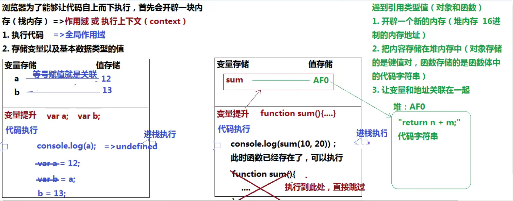

### 变量提升(声)

> 当浏览器开辟出供代码执行的栈内存后，代码并没有自上而下立即执行，而是继续做了一些事情 : **把当前作用域中所有带 var / function 关键字的进行提前的声明和定义 => 变量提升机制**
>
> - 带 var 的只是提前声明 ( declare )	"var a;" 如果只声明没有赋值，默认值是undefined
> - 带function的不仅声明，而且还定义了 ( defined )  "a=13"定义其实就是赋值，准确来说就是让变量和某个值进行关联
> - 不管条件是否成立都要进行变量提升

在全局作用域下，带 var/function 声明的全局变量相当于给 window 设置了对应的属性 (即是全局变量也是属性)，不带 var 等声明的只是给 window 设置了对应的属性，如果使用的是 let / const 声明的，只是全局变量，没有给 window 设置属性



```js
console.log(a);
var a = 12;
var b = a;
b = 13;
console.log(a) //=>12

/* console.log(sum(10, 20)); //=>30
function sum(n, m) {
    return n + m;
} */

// 函数表达式方式，由于使用 var 来创建 sum ，变量提升阶段只会声明变量，不会赋值，所以此时函数在前面执行，函数是没有值得，不能执行 (真实项目中这种方式最常用，因为它操作严谨)
console.log(sum); //=>undefined
// sum(10, 20); //=>Uncaught TypeError: sum is not a function
var sum = function(n, m) {
    return n + m;
}
// let sum = (n,m)=>n+m;
console.log(sum(10, 20));
```

**1.带var和不带var的区别**

```js
//=>在全局作用域下的区别
/*
 *	不带var的: 相当于给全局对象window设置了一个属性a
 *		window.a = 13;
 */
a = 13;
console.log(a); //=>window.a

/*
 *	栈内存变量存储空间
 *		b
 *	带var的: 是在全局作用域下声明了一个变量b (全局变量)，但是在全局下声明的变量也同样相当于给window增加了一个对应的属性 (只有全局作用域具备这个特点)
 */
var b =14; //=>创建变量b & 给window设置了一个属性b
console.log(b); //=>14
console.log(window.b); //=>14
```

### 词法解析

> 已经知道了在当前私有栈中有一个"let a"，此时的私有栈中出现的A都是私有的
>
> 

### 闭包作用域

1. 创建函数 
   + 开辟一个堆内存
   + 把函数体中的代码当做字符串存储进去
   + 把堆内存的地址赋值给 函数名/变量名
   + **函数在哪创建，那么它执行时候所需要查找的上级作用域就是谁**  

2. 函数执行
   - 形成一个全新的私有作用域、执行上下文、私有栈内存 (执行一次形成一个，多个之间也不会产生影响)
   - 形参赋值 & 变量提升
   - 代码执行 (把所属堆内存中的代码字符串拿出来一行行执行)
   - **遇到一个变量，首先看它是否为私有变量 (形参和在私有作用域中声明的变量是私有变量)，是私有的就操作自己的变量即可，不是私有的则向上级作用域中查找...一直找到全局作用域为止 =>作用域链查找机制**
   - 私有变量和外界的变量没有必然的关系，可以理解为被私有栈内存保护起来了，这种机制其实就是 **闭包的保护机制**

3. 关于堆栈内存释放问题 (以谷歌webkit内核为例子)

> 函数执行就会形成栈内存 (从内存中分配的一块空间)，如果内存都不销毁释放，很容易就会导致栈内存溢出 (内存爆满，电脑就卡死了)，堆栈内存的释放问题是学习Js的核心知识之一

- 堆内存释放问题

```js
//=>创建一个引用类型值，就会产生一个堆内存
//=>如果当前创建的堆内存不被其它东西所占用了 (浏览器会在空闲的时候，查找每一个内存的引用状况，不被占用的都会给回收释放掉)，则会释放
let obj = {
	name : 'zhufeng'
};
let oop = obj;
//此时obj和oop都占用着对象的堆内存，想要释放堆内存，需要手动解除变量和值的关联 (null:空对象指针)
obj = null;
oop = null;
```

- 栈内存释放

```js
//=>打开浏览器形成到的全局作用域是栈内存
//=>手动执行函数形成的私有作用域是栈内存
//=>基于ES6中的 let/const 形成的块作用域也是栈内存
//=>....

/*
 *	全局栈内存: 关掉页面的时候才会销毁
 *	私有栈内存:
 *		1.一般情况下，函数只要执行完成，形成的私有栈内存就会被销毁释放掉 (排除出现无线极递归的模式、出现死循环的模式)
 *		2.但是一旦栈内存中的某个东西 (一般都是堆地址) 被私有作用域以外的事物给占用了，则当前私有栈内存不能立即被释放销毁 (特点: 私有作用域中的私有变量等信息也保留下来了) =>市面上认为的闭包: 函数执行形成不能被释放的私有栈内存，这样的才是闭包
 */
function fn(){
    //...
}
fn(); //=>函数执行形成栈内存，执行完成栈内存销毁

function X(){
    return function(){
        //...
    }
}
let f = X(); //=>f占用了X执行形成的栈内存中的一个东西 (返回小函数对应的堆)，则X执行形成的栈内存不能被释放了
```

#### 闭包的两个作用

> 从性能角度讲，我们真实项目中应该减少对闭包的使用 (因为闭包会产生不释放的栈内存，过多使用容易导致内存溢出或者降低性能)

```js
闭包的两大作用:
	1.保护 (私有变量和外界没有必然联系)
	2.保存 (形成不销毁的栈内存，里面的私有变量等信息保存下来了)
```


- 保护
- 保存

1. jQuery (JQ) 前端非常经典的类库: 提供了大量的方法供开发人员使用

​		=>为了防止全局变量污染 (解释: 导入JQ后，它里面有大量的方法，如果这些方法不保护起来，用户编写的方法很容易和JQ方法名字相同产生冲突，产生冲突可以理解为全局变量污染)，JQ中的方法和变量需要用闭包保护起来

```js
/*=====jQuery源码剖析======*/
(function(global,factory){
    //...
    //typeof window!=="undefined"?widow:this 验证当前所处环境的全局对象是window还是global等
    //factory=>function zhufeng(window,noGlobal){}
    factory(global); //=>zhufeng(window)
})(typeof window!=="undefined"?widow:this,function zhufeng(window,noGlobal){
    //...
    var jQuery = function(selector,context){
        //...
	};
    
    //=>通过给全局对象增加属性: jquery和$，把私有的jQuery方法暴露到全局作用域下，供外面使用(等价于 return JQuery)  (外界需要使用函数中的私有内容，我们可以基于window.xxx和return xxx两种方式实现这个需求)
    window.jQuery = window.$ = jQuery;
});

//=>开始使用jquery
jQuery(); //=>window.jQuery()
$();
```

在真实项目中，我们一般都要把自己写的内容放到一个闭包中，这样可以有效防止自己的代码和别人代码产生冲突 (全局变量污染 : 真实项目中是要尽可能减少对全局变量的使用的 ); 如果需要把自己的东西给别人用，基于 return和window.xxx等方式暴露给别人即可

```js
//=>原生Js
var xxx = (function(){
    //....A自己写的代码
    
    return xxx;
})();
(function(){
    //...B自己写的代码
    window.xxx = xxx
})();

//=>JQuery
$(function(){
   //...这样写在某些角度上也是为了减少全局变量 
});

.....
```

2. 基于 let/const/class 等创建变量，会把所在的大括号 (除对象的大括号之外) 当做一个全新的私有块级作用域
   - 函数执行会产生私有的栈内存 (作用域/执行上下文)
   - let等也会产生私有的块作用域 (var不会)

在当前作用域下 (全局、私有、块作用域)，如果创建变量使用的是 let / const 等，一定不能在创建代码的前面使用这些变量，否则会报错 : ReferenceError: Cannot access 'a' before initialization

```js
if(1===1){
    var a=10;
}
console.log(a); //=>10  a是全局作用域
```

```js
if(1===1){
    //=>let会有块作用域 (现在大括号就是一个私有作用域)
    //=>a是私有变量
    let a=10;
}
console.log(a); //=>Uncaught ReferenceError: a is not defined
```


### let / const 和 var 的区别

`1.let和const不存在变量提升机制 (但是在词法解析阶段也得知某个变量是否是私有变量)`

> 创建变量的六种方式中 : var / function 有变量提升，而 let / const / class / import 都不存在这个机制

`2.var允许重复声明，而let是不允许的`

> - 如果使用 var / function 关键词声明变量并且重复声明，是不会有影响的 (声明第一次之后，之后再遇到就不再重复声明了)
> - 但是使用 let / const 就不行，浏览器会校验当前作用域中是否已经存在这个变量了，如果已经存在了，则再次基于 let 等重新声明就会报错

```js
//=>在浏览器开辟栈内存供代码自上而下执行之前，不仅有变量提升的操作，还有很多其它的操作 =>"词法解析"或者"词法检测": 就是检测当前即将要执行的代码是否会出现"语法错误 SyntaxError"，如果出现错误，代码将不会再执行 (第一行都不会执行)
console.log(1); //=>这行代码就已经不会再执行了
let a = 12;
console.log(a);
let a = 13; //=>Uncaught SyntaxError: Identifier 'a' has already been declared
console.log(a);

//================================================
console.log(1); //=>1
console.log(a); //=>Uncaught ReferenceError: Cannot access 'a' before initialization
let a = 12; 
```

```js
//=>所谓重复是: 不管之前通过什么办法，只要当前栈内存中存在这个变量，我们使用 let / const等重复再声明这个变量就是语法错误
console.log(a);
var a = 12;
let a = 13; //=>Uncaught SyntaxError: Identifier 'a' has already been declared
console.log(a);
```

```js
fn(); //=>5

function fn() { console.log(1); }
fn(); //=>5

function fn() { console.log(2); }
fn(); //=>5

var fn = function fn() { console.log(3); }
f(); //=>3

function fn() { console.log(4); }
fn(); //=>3

function fn() { console.log(5); }
fn(); //=>3
```


`3.let能解决typeof检测时出现的暂时性死区问题(let 比 var 更严谨)`

https://es6.ruanyifeng.com/#README

```js
//console.log(a); //=>Uncaught ReferenceError: a is not defined
//console.log(typeof a); //=>"undefined" 这是浏览器的bug，本应该是报错的，因为没有a(暂时性死区)

/* 
 *  词法解析
 */
console.log(typeof a); //=>Uncaught ReferenceError: Cannot access 'a' before initialization
let a;
```

`4.let创建的全局变量没有给window设置对应的属性`

`5.let会产生块级作用域`

....


`in`

> [property] in [object] 验证当前属性是否属于这个对象 

```js
//=> [property] in [object] 验证当前属性是否属于这个对象
let obj = {
    name: '吴镇宇',
    age: 21,
    GF: null
};
console.log("name" in obj); //=>true  
console.log("GF" in obj); //=>true 
console.log("BF" in obj); //=>fasle 
```

```js
/* 
 *  全局作用域
 *      1.变量提升
 *          不管条件是否成立都要进行变量提升
 *          var a; //=>创建一个全局变量a =>window.a
 *      2.代码执行
 */
console.log(a); //=>undefined
if (!('a' in window)) { //=>'a' in window =>true
    var a = 13;
}
console.log(a); //=>undefined


/* 
 *  全局作用域
 *      1.变量提升
 *          但是做函数的有特殊性: 在老版本浏览器中，确实不论条件是否成立，函数也是提前声明或者定义的，但是新版本浏览器  中，为了兼容ES6严谨的语法规范，条件中的函数在变量提升阶段只能提前声明，不能提前定义
 *          function fn();
 *      2.代码执行
 */
console.log(fn); //=>undefined
// fn(); //=>Uncaught TypeError: fn is not a function
if (('fn' in window)) {  //=>true
    // 条件成立，进来后的第一件事是给fn赋值，然后再代码执行
    fn(); //=>'哈哈哈'
    function fn() {
        console.log('哈哈哈');
    }
}
fn(); //=>'哈哈哈'
```

### 自执行函数

```js
//=> 自执行函数: 前面加的()或者!、-、~、+只有一个目的，让语法符合而已
//=> 自执行函数本身不进行变量提升 (没名字)
(function(n){})(10);
~function(n){}(10);
-function(n){}(10);
!function(n){}(10);
+function(n){}(10);


/*
 *	全局作用域
 *		1.变量提升
 *		2.代码执行
 */
f = function (){return true;} //=> window.f=....
g = function (){return false;}
~function () {
    /*
     *	函数执行会形成一个私有作用域
     *		1.变量提升	function g;
     *		2.代码执行
     */
    if(g() && [] == ![]){ //=>Uncaught TypeError: g is not a function
        f = function (){return false;}
        function g() {return true;}
    }
}();
console.log(f());
console.log(g());
```

### 私有作用域下的变量提升

```js
私有栈内存中代码执行的时候，如果遇到一个变量:
	1.首先看是否为自己家的，是自己的以后操作都用自己的，不是自己的去上级作用域中查找...一直找到全局作用域为止
	2.找到拿来用，找不到可能会报错
    
私有栈中先进行形参赋值，再进行变量提升
```


```js
作用域链查找机制，关键在于如何查找上级作用域:
	1.从函数创建开始，作用域就已经指定好了
    2.当前函数是在哪个作用域(N)下创建的，那么函数执行形成的作用域(M)的上级作用域就是N，"和函数在哪里执行的没有关系，只和创建的地方有关系"
```


### this

> 函数执行的主体 (不是上下文) : 意思是谁把函数执行的，那么执行主体就是谁
>
> this是谁和函数在哪创建的或者在哪执行的都没有必然的练习
>
> this非常的不好理解，以后遇到this，想一句话 : "你以为你以为的就是你以为的"

1. 给元素的某个事件绑定方法，当事件触发方法执行的时候，方法中的this是当前操作的元素本身

```js
document.body.onclick = function (){
    //this:body
}
```

2. 如何确定执行主体(this)是谁? 当方法执行的时候，我们看方法前面是否有点，没有点this是window或者undefined; 有点，点前面是谁this就是谁;

```js
var name = '珠峰培训';
function fn(){
	console.log(this.name);
}
var ob = {
    name:"你好世界",
    fn:fn
};
obj.fn(); //=>this:obj
fn(); //=>this:window(非严格模式"use strict"，严格模式下是undefined) window.fn()把window.省略了

(function(){
    //自执行函数中的this是window或undefined
})();
```

思考?

```js
//=>hasOwnProperty方法中的this: ary.__proto__.__proto__
ary.__proto__.__proto__.hasOwnProperty()

let obj={
    fn:(function(n){
        //把自执行函数执行的返回结果赋值给fn
        //this:window
        return function(){
            //=>fn等于这个放回的小函数
            //this:obj
        }
    })(10)
}
obj.fn();


function fn(){
    //this:window
    console.log(this);
}
document.body.onclick = function (){
    //this:document.body
    fn();
}
```


```js
var name = 'window';
var Tom = {
    name: "Tom",
    show: function() {
        console.log(this.name);
    },
    wait: function() {
        // this:Tom
        var fun = this.show; //=>Tom.show
        fun(); //=>this:window =>console.log(window.name) =>"window"
    }
};
Tom.wait();
```


3. 在构造函数模式执行中，函数体中的this是当前类的实例

```js
function Fn(){
    // this:f这个实例
    this.name = 'xxx';
}
let f = new Fn();
console.log(f.name);
```

