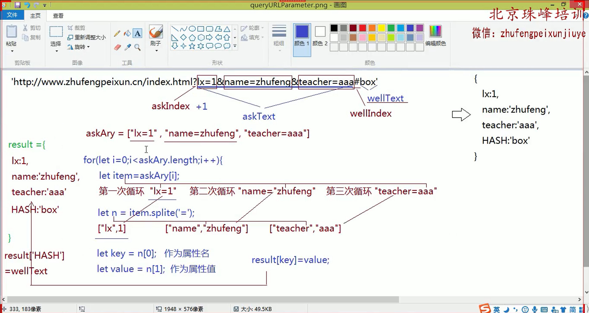

## 数组及数组中常用的方法

> 数组是对象数据类型的，它属于特殊的对象

```js
let ary = [12, 23, 34, 45];
console.log(typeof ary); //=> "object"
console.dir(ary);
/* 
 *  ary = {
 *      0:12,
 *      1:23,
 *      2:34,
 *      3:45,
 *      length:4
 * }
 *  数字作为索引（key属性名）
 *  length代表长度
 * 
 *  ary[0] 根据索引获取指定项的内容
 *  ary.length 获取数组的长度
 *  ary.length-1 最后一项的索引
 */
```

### 数组中常用的方法

+ 方法的作用和含义
+ 方法的实参 ( 类型和含义 ) 
+ 方法的返回值
+ 原来的数组是否会发生改变

#### 实现数组增删改的方法

> 这一部分都会修改原有的数组

##### `push`

```js
/* 
 *  push : 向数组末尾增加内容
 *  @params
 *		多个任意类型
 *  @return
 *		新增后数组的长度
 */
let ary = [10, 20];
let res = ary.push(30, 'AA');
console.log(res, ary);
// 基于原生Js操作键值对的方法，也可以向末尾追加一项新的内容
ary[ary.length] = 40;
console.log(res, ary); // => 4 [10,20,30,'AA',40]
```

##### `unshift`

```js
/* 
 *  unshift : 向数组开始位置增加内容
 *  @params
 *		多个任意类型
 *  @return
 *		新增后数组的长度
 */
let ary = [10, 20];
let res = ary.unshift(30, 'AA');
console.log(res, ary); //=> 4 [30,'AA',10,20]

// 基于原生ES6展开运算符，把原有的ary克隆一份，在新的数组中创建第一项，其余的内容使用原始ary中的信息即可，也算实现了向开始追加的效果
ary = [100, ...ary];
console.log(ary); // => [100,30,'AA',10,20]
```

##### `shift`

```js
/* 
 *  shift : 删除数组中的第一项
 *  @params
 *  @return
 *     删除的那一项
 */
let ary = [10, 20, 30, 40];
let res = ary.shift();
console.log(res, ary); //=> 10 [20, 30, 40]

// 基于原生Js中的delete，把数组当做普通的对象，确实可以删除掉某一项内容，但是不会影响数组本身的结构特点 (length长度不会跟着修改)，真实项目中杜绝这样的删除使用
delete ary[0];
console.log(ary); //=>{1:30,2:40,length:3}
```

##### `pop`

```js
/* 
 *  pop : 删除数组中的最后一项
 *  @params
 *  @return
 *     删除的那一项
 */
let ary = [10, 20, 30, 40];
let res = ary.pop();
console.log(res, ary); //=> 40 [10, 20, 30]

// 基于原生Js让数组长度干掉一位，默认干掉的就是最后一项
ary.length--; //=> ary.length = ary.length - 1;
console.log(ary); //=> [10, 20]
```

##### `splice`

``` js
/* 
 *  splice : 实现数组的增加、删除、修改
 *  @params
 *      n,m 都是数字    从索引n开始删除m个元素 (m不写,是删除到末尾)
 *  @return
 *     把删除的部分用新数组存储起来返回
 */
// 基于splice实现删除性能不好: 当前项被删后，后面每一项的索引都要向前提一位，如果后面内容过多，一定影响性能
let ary = [10, 20, 30, 40, 50, 60, 70, 80, 90];
let res = ary.splice(2, 4);
console.log(res, ary); //=> [ 30, 40, 50, 60] [10, 20, 70, 80, 90]

// 基于这种方法可以清空一个数组，把原始数组中的内容以新数组存储起来 (有点类似数组的克隆: 把原来数组克隆一份一模一样的给新数组)
/* res = ary.splice(0);
console.log(res, ary); //=> [10, 20, 70, 80, 90] [] */

// 删除最后一项
ary.splice(ary.length - 1);
// 删除第一项
ary.splice(0, 1);
console.log(ary);
```

```js
/* 
 *  splice : 实现数组的增加、修改
 *  @params
 *      n,m,x 都是数字    从索引n开始删除m个元素，用x占用删除的部分
 *      n,0,x 从索引n开始，一个都不删，把x放到索引n的前面
 *  @return
 *     把删除的部分用新数组存储起来返回
 */
let ary = [10, 20, 30, 40, 50];
let res = ary.splice(1, 2, '江冰', '哈哈哈');
console.log(res, ary); //=> [20, 30] [10, '江冰', '哈哈哈', 40, 50]

// 实现增加
ary.splice(3, 0, '呵呵呵');
console.log(ary); //=> [10, '江冰', '哈哈哈', '呵呵呵', 40, 50]

// 向数组末尾追加
ary.splice(ary.length, 0, 'AAA');
console.log(ary); //=> [10, '江冰', '哈哈哈', '呵呵呵', 40, 50, 'AAA']

// 向数组开始追加
ary.splice(0, 0, 'BBB');
console.log(ary); //=> ['BBB', 10, '江冰', '哈哈哈', '呵呵呵', 40, 50, 'AAA']
```

#### 数组的查询和拼接

> 此组学习的方法，原来数组不会改变

##### `slice`

```js
/* 
 *  slice : 实现数组的查询
 *  @params
 *      n,m 都是数字    从索引n开始，找到索引为m的地方 (不包含m这一项)
 *  @return
 *     把找到的内容以一个新数组的形式返回
 */
let ary = [10, 20, 30, 40, 50];
let res = ary.slice(1, 3);
console.log(res); //=> [20, 30]

// m不写是找到末尾
res = ary.slice(1);
console.log(res); //=> [20, 30, 40, 50]

// 数组的克隆，参数0不写也可以
res = ary.slice(0);
console.log(res); //=> [10, 20, 30, 40, 50]

// 思考: 1.如果n / m 为负数会咋滴，如果n > m了会咋滴，如果是小数会咋滴，如果是非有效数字会咋滴，如果m或者n的值比最大索引都会咋滴?
//       2.这种克隆方式叫做浅克隆，可以回去先看看深度克隆如何处理!
```

##### `concat`

``` js
/* 
 *  concat : 实现数组拼接
 *  @params
 *      多个任意类型值
 *  @return
 *     拼接后的新数组 (原来数组不变)
 */
let ary1 = [10, 20, 30];
let ary2 = [40, 50, 60];
let res = ary1.concat('江冰', ary2)
console.log(res); //=> [10, 20, 30, '江冰', 40, 50, 60]
```

#### 把数组转化为字符串

> 原有数组不变

##### `toString`

``` js
/* 
 *  toString : 把数组转换为字符串
 *  @params
 *  @return
 *     转换后的字符串，每一项用逗号分隔 (原来数组不变)
 */
let ary = [10, 20, 30];
let res = ary.toString();
console.log(res); //=>'10,20,30'
console.log([].toString()); //=>''
console.log([12].toString()); //=>'12'
```

##### `join`

```js
/* 
 *  join : 把数组转换为字符串
 *  @params
 *      指定的分隔符 (字符串格式)
 *  @return
 *      转换后的字符串，每一项用逗号分隔 (原来数组不变)
 */
let ary = [10, 20, 30];
let res = ary.join();
console.log(res); //=>'10,20,30'

res = ary.join('');
console.log(res); //=>'102030'

res = ary.join(' ');
console.log(res); //=>'10 20 30'

res = ary.join('|');
console.log(res); //=>'10|20|30'

res = ary.join('+');
console.log(res); //=>'10+20+30'
console.log(eval(res)); //=>60  eval把字符串变为Js表达式执行
```

#### 检测数组中的是否包含某一项

##### `indexOf / lastIndexOf / includes`

```js
/* 
 *  indexOf / lastIndexOf : 检测当前项在数组中第一次或者最后一次出现位置的索引值 (在IE6~8中不兼容)
 *  @params
 *      要检索的这一项内容
 *  @return
 *      这一项出现的位置索引值 (数字)，如果数组中没有这一项，返回的结果是-1
 *      原来数组不变
 */
let ary = [10, 20, 30, 10, 20, 30];
console.log(ary.indexOf(20)); //=>1
console.log(ary.lastIndexOf(20)); //=>4

// 想验证ary中是否包含'江冰'
if (ary.indexOf('江冰') === -1) {
    // 不包含
}
// 也可以直接使用Es6新提供的includes方法判断
if (ary.includes('江冰')) {
    // 包含: 如果存在返回的是true
}
console.log(ary.includes(30)); //=>true
```

#### 数组的排序或者排列

##### `reverse`

```js
/* 
 *  reverse : 把数组倒过来排列
 *  @params
 *  @return
 *      排列后的新数组
 *      原来数组改变
 */
let ary = [12, 15, 9, 28, 10, 22];
ary.reverse();
console.log(ary); //=>[22, 10, 28, 9, 15, 12]
```

##### `sort`

```js
/* 
 *  sort : 实现数组的排序
 *  @params
 *      可以没有，也可以是个函数
 *  @return
 *      排列后的新数组
 *      原来数组改变
 */
let ary = [7, 8, 5, 2, 4, 6, 9];
ary.sort();
console.log(ary); //=>[2, 4, 5, 6, 7, 8, 9]

// sort方法中，如果不传递参数，是无法处理10以上数字排序的 (它默认按照每一项第一个字符来排，不是我们想要的效果)
/* ary = [12, 15, 9, 28, 10, 22];
ary.sort();
console.log(ary); //=>[10, 12, 15, 22, 28, 9] */

// 想要实现多位数正常排序，需要给sort传递一个函数，函数中返回 a-b 实现升序，返回 b-a 实现降序 (为啥?需要先了解冒泡排序的机制)
ary = [12, 15, 9, 28, 10, 22];
// ary.sort(function(a,b){...});
// a和b是相邻的两项
ary
;
console.log(ary); //=>[9, 10, 12, 15, 22, 28]
```

#### 遍历数组中每一项的方法

##### `forEach`

```js
/* 
 *  forEach : 遍历数组中的每一项内容
 *  @params
 *      回调函数
 *  @return
 *      原来数组不变
 *	回调函数接受3个参数 项目值、项目索引、数组本身
 */
let ary = [12, 15, 9, 28, 10, 22];

// 基于原生Js中的循环可以实现
/*for (let i = 0; i < ary.length; i++) {
    // i: 当前循环这一项的索引
    // ary[i]: 根据索引获取循环的这一项
    console.log('索引: ' + i + '内容: ' + ary[i]);
}*/

ary.forEach((item, index) => {
    // 数组中有多少项，函数就会被默认执行多少次
    // 每一次执行函数: item是数组中当前要操作的这一项，index是当前项的索引
    console.log('索引: ' + index + '内容: ' + item);
});
```

#### 如何识别数组

```js
var ary = [1, 2, 3, 4];
typeof ary; //=>返回 object

//方法一: 为了解决这个问题，ECMAScript 5 定义了新方法 Array.isArray()
Array.isArray(ary);  //=>返回 true

//方法二: 自定义isArray()方法
function isArray(x) {
    return x.constructor.toString().indexOf("Array") > -1;
}

//方法三: 使用instanceof运算符
ary instanceof Array //=> true
```

#### 其它方法

##### `map`

```js
/* 
 *  map : 通过对每个数组元素执行函数来创建新数组，且不会对没有值的数组元素执行函数
 *  @params
 *      回调函数
 *  @return
 *      原来数组不变，返回执行函数创建的新数组
 *	回调函数接受3个参数 项目值、项目索引、数组本身 (value,index,array)
 */

var numbers1 = [45, 4, 9, 16, 25];
var numbers2 = numbers1.map(myFunction);

function myFunction(value, index, array) {
  return value * 2;
}
console.log(numbers2); //=>[90, 8, 18, 32, 50]
```

##### `filter`

```js
/* 
 *  filter : 过滤器
 *  @params
 *      回调函数
 *  @return
 *      原来数组不变，创建一个包含通过测试的数组元素的新数组
 *	回调函数接受3个参数 项目值、项目索引、数组本身 (value,index,array)
 */

let numbers = [45, 4, 9, 16, 25];
let over18 = numbers.filter( (value, index, array) => value>18 );
console.log(over18); //=>[45, 25]
console.log(numbers); //=>[45, 4, 9, 16, 25]
```

##### `reduce / reduceRight`

```js
/* 
 *  reduce : 对数组中的每个元素按序执行一个由您提供的 reducer 函数，每一次运行 reducer 会将先前元素的计算结果作为参数传入，最后将其结果汇总为单个返回值。(从左到右工作)
 *  @params
 *      回调函数
 *  @return
 *      原来数组不变，创建一个包含通过测试的数组元素的新数组
 *	回调函数接受4个参数 总数（初始值/先前返回的值）、项目值、项目索引、数组本身   
 *							(total,value,index,array)
 *
 *	注意:第一次执行回调函数时，不存在“上一次的计算结果”。如果需要回调函数从数组索引为 0 的元素开始执行，则需要传递初始值。否则，数组索引为 0 的元素将被作为初始值 initialValue，迭代器将从第二个元素开始执行（索引为 1 而不是 0）。
 */

var numbers1 = [45, 4, 9, 16, 25];
var sum = numbers1.reduce((total, value, index, array)=> {
  return total + value;
});
console.log(sum); //=>99
```

```js
reduce : 从右到左工作
```

##### `find`

```js
/* 
 *  find : 查找通过测试函数的第一个数组元素的值
 *  @params
 *      回调函数
 *  @return
 *      通过测试函数的第一个数组元素的，否则返回undefined
 *	回调函数接受3个参数 项目值、项目索引、数组本身		(value,index,array)
 *
 *	备注： 如果用一个空数组进行测试，在任何情况下它返回的都是false。
 */

var numbers = [45, 4, 9, 16, 25];
var frist = numbers.find((value,index,array)=>{
    return value > 18;
});
console.log(frist); //=>45
```

##### `some`

```js
/* 
 *  some : 测试数组中是不是至少有 1 个元素通过了被提供的函数测试
 *  @params
 *      回调函数
 *  @return
 *      一个布尔值
 *	回调函数接受3个参数 项目值、项目索引、数组本身		(value,index,array)
 *
 *	备注： 如果用一个空数组进行测试，在任何情况下它返回的都是false。
 */

var numbers = [45, 4, 9, 16, 25];
var allOver18 = numbers.some((value,index,array)=>{
    return value > 18;
});
console.log(allOver18); //=>true
```

##### `every`

```js
/* 
 *  every : 测试一个数组内的所有元素是否都能通过某个指定函数的测试
 *  @params
 *      回调函数
 *  @return
 *      一个布尔值
 *	回调函数接受3个参数 项目值、项目索引、数组本身		(value,index,array)
 *
 *	备注： 若收到一个空数组，此方法在任何情况下都会返回 true。
 */

var numbers = [45, 4, 9, 16, 25];
var allOver18 = numbers.every((value,index,array)=>{
    return value > 18;
});
console.log(allOver18); //=>false
```

##### `flat`

```js
/* 
 *  flat : 按照一个可指定的深度递归遍历数组，并将所有元素与遍历到的子数组中的元素合并为一个新数组返回。
 *  @params
 *      depth: 指定要提取嵌套数组的结构深度，默认值为 1。
 *  @return
 *      一个包含将数组与子数组中所有元素的新数组。
 */

var arr1 = [1, 2, [3, 4]];
arr1.flat(); //=>[1, 2, 3, 4]

var arr2 = [1, 2, [3, 4, [5, 6]]];
arr2.flat();//=>[1, 2, 3, 4, [5, 6]]

var arr3 = [1, 2, [3, 4, [5, 6]]];
arr3.flat(2);//=> [1, 2, 3, 4, 5, 6]

//使用 Infinity，可展开任意深度的嵌套数组
var arr4 = [1, 2, [3, 4, [5, 6, [7, 8, [9, 10]]]]];
arr4.flat(Infinity);//=> [1, 2, 3, 4, 5, 6, 7, 8, 9, 10]

/flat() 方法会移除数组中的空项：
var arr4 = [1, 2, , 4, 5];
arr4.flat();//=>[1, 2, 4, 5]
```

##### `fill`

```js
/* 
 *  fill : 用一个固定值填充一个数组中从起始索引到终止索引内的全部元素。不包括终止索引。
 *  @params
 *      value: 用来填充数组元素的值。
 *		start: 可选起始索引，默认值为 0。
 *		end :  终止索引，默认值为 arr.length。
 *  @return
 *      修改后的数组。
 *
 *	注:如果 start 是个负数，则开始索引会被自动计算成为 length + start，其中 length 是 this 对象的 length 属性值。如果 end 是个负数，则结束索引会被自动计算成为 length + end。
 */

[1, 2, 3].fill(4);               // [4, 4, 4]
[1, 2, 3].fill(4, 1);            // [1, 4, 4]
[1, 2, 3].fill(4, 1, 2);         // [1, 4, 3]
[1, 2, 3].fill(4, 1, 1);         // [1, 2, 3]
[1, 2, 3].fill(4, 3, 3);         // [1, 2, 3]
[1, 2, 3].fill(4, -3, -2);       // [4, 2, 3]
[1, 2, 3].fill(4, NaN, NaN);     // [1, 2, 3]
[1, 2, 3].fill(4, 3, 5);         // [1, 2, 3]
Array(3).fill(4);                // [4, 4, 4]
[].fill.call({ length: 3 }, 4);  // {0: 4, 1: 4, 2: 4, length: 3}

// Objects by reference.
const arr = Array(3).fill({}) // [{}, {}, {}];
// 需要注意如果 fill 的参数为引用类型，会导致都执行同一个引用类型
// 如 arr[0] === arr[1] 为 true
arr[0].hi = "hi"; // [{ hi: "hi" }, { hi: "hi" }, { hi: "hi" }]
```


......

Array.prototype在控制台查看数组中所有提供的方法，可以基于MDN网站去查询方法的用法


## 字符串中常用的方法

> 所有用 单引号、双引号、反引号 包起来的都是字符串

```js
let str = 'zhufengpeixunyangfanqihang';
// 每一个字符串都是零到多个字符组成的
str.length //=>字符串的长度
str[0] //=>获取索引为零(第一个)字符
str[str.length-1] //=>获取最后一个字符str.length-1最后一项索引
str[10000] //=>undefined 不存在这个索引

// 循环输出字符串中的每一个字符
for(let i=0;i<str.length;i++){
    let char = str[i];
    console.log(char);
}
```

### `charAt / charCodeAt`

```js
/* 
 *  charAt: 根据索引获取指定位置的字符
 *  charCodeAt: 获取指定字符的ASII码值(Unicode编码值)
 *  @params
 *      n [number] 获取字符指定的索引
 *  @return
 *      返回查找到的字符串
 *      找不到返回的是空字符串不是undefined，或者对应的编码值
 *
 */
let str = 'zhufengpeixunyangfanqihang';
console.log(str.charAt(0)); //=> 'z'
console.log(str[0]); //=> 'z'
console.log(str.charAt(10000)); //=>''
console.log(str[10000]); //=> undefined
console.log(str.charCodeAt(0)); //=> 122
console.log(String.fromCharCode(122)); //=>'z'
```

### `substr / substring / slice`

```js
/* 
 * 都是为了实现字符串的截取(在原来字符串中查找到自己想要的)
 *  substr(n,m): 从索引n开始截取m个字符，m不写截取到末尾(后面方法也是)
 *  substring(n,m): 从索引n开始找到索引为m处(不含m)
 *  slice(n,m): 和substring一样，都是找到索引为m处，但是slice可以支持负数为索引，其余两个方法是不可以的  
 */
let str = 'zhufengpeixunyangfanqihang';
console.log(str.substr(3, 7)); //=> 'fengpei'
console.log(str.substring(3, 7)); //=> 'feng'
console.log(str.substr(3)); //=> 'fengpeixunyangfanqihang' 截取到末尾
console.log(str.substring(3, 10000)); //=> 'fengpeixunyangfanqihang' 截取到末尾(超过索引的也只截取到末尾)

console.log(str.substring(3, 7)); //=>'feng'
console.log(str.slice(3, 7)); //=>'feng'
console.log(str.substring(-7, -3)); //=>'' substring不支持负数索引
console.log(str.slice(-7, -3)); //=>'nqih' slice支持负数索引  =>快捷查找: 负数索引，我们可以按照 str.length+负索引 的方式找  =>slice(26-7,26-3)  =>slice(19,23)
console.log(str.slice(19, 23)); //=>'nqih'
```

### `indexOf / lastIndexOf / includes`

```js
/* 
 * 验证字符是否存在
 *  indexOf(x,y): 获取x第一次出现位置的索引，y是控制查找的起始位置索引
 *  lastIndexOf: 最后一次出现位置的索引
 *  =>没有这个字符，返回的结果是-1
 */
let str = 'zhufengpeixunyangfanqihang';
console.log(str.indexOf('n')); //=> 5
console.log(str.lastIndexOf('n')); //=> 24

console.log(str.indexOf('@')); //=> -1  不存在返回-1
if (str.indexOf('@') === -1) {
    // 字符串中不包含@这个字符
}

console.log(str.indexOf('feng')); //=> 3 验证整体第一次出现的位置，返回的索引是第一个字符所在位置的索引值
console.log(str.indexOf('peiy')); //=> -1

console.log(str.indexOf('n', 7)); //=> 12  查找字符串索引7及之后的字符串中，n第一次出现的位置索引

if (!str.includes('@')) {
    console.log('当前字符串不包含@');
}
```

### `toUpperCase / toLowerCase`

```js
/* 
 * 字符串中字母的大小写转换
 *  toUpperCase(): 转大写
 *  toLowerCase(): 转小写
 */
let str = 'ZhuFengPeiXunYangFanQiHang';
str = str.toUpperCase();
console.log(str); //=>'ZHUFENGPEIXUNYANGFANQIHANG'

str = str.toLowerCase();
console.log(str); //=>'zhufengpeixunyangfanqihang'
// 实现首字母大写
str = str.substr(0, 1).toUpperCase() + str.substr(1);
console.log(str); //=>'Zhufengpeixunyangfanqihang' 
```

### `split`

```js
/* 
 *  split([分隔符]): 把字符串按照指定的分隔符拆分成数组 (和数组中join对应)
 *
 *  split支持传递正则表达式
 */
// 需求: 把|分隔符变为，分隔符
let str = 'music|movie|eat|sport';
let ary = str.split('|'); //=>['music', 'movie', 'eat', 'sport']
str = ary.join(',');
console.log(str); //=>"music,movie,eat,sport"
```

### `replace`

```js
/* 
 *  replace(老字符,新字符): 实现字符串的替换(经常伴随着正则而用)
 */
let str = '珠峰@培训@扬帆@起航';
// str = str.replace('@', '-');
// console.log(str); //=>"珠峰-培训@扬帆@起航" 在不使用正则表达式的情况下，执行一次replace只能替换一次字符

str = str.replace(/@/g, '-');
console.log(str); //=>珠峰-培训-扬帆-起航
```

`match`

`localCopmare`

### `trim `

```js
/*
 *	trim() 方法从字符串的两端清除空格，返回一个新的字符串，而不修改原始字符串。
 *	此上下文中的空格是指所有的空白字符（空格、tab、不换行空格等）以及所有行终止符字符（如 LF、CR 等）。
 *	@return
 *		一个表示 str 去掉了开头和结尾的空白字符后的新字符串。
 */

const orig = "   foo  ";
console.log(orig.trim()); // 'foo'
```

` trimLeft / trimRight`


...

控制台输出String.prototype查看所有字符串中提供的方法


### 实现一些常用的需求

> 时间字符串的处理

```js
let time = '2022-7-17 00:38:25';
//=> 变为自己需要呈现的格式，例如:
// "2022年07月17日 00时38分25秒"
// "2022年07月17日"
// "07/17 00:38"
// ...
```

方案一

```js
// 方案一: 一路replace
let time = '2022-7-17 00:38:25';
time = time.replace('-', '年').replace('-', '月').replace(' ', '日 ').replace(':', '时').replace(':', '分') + '秒';
console.log(time); //=>"2022年7月17日 00时38分25秒" 
```

方案二

```js
// 方案二: 获取到年月日小时分钟秒这几个值后，最后想拼成什么效果就拼成什么
let time = '2022-7-17 00:38:25';

// 不足十位补零
/* let addZero = val => {
    if (val.length < 2) {
        val = '0' + val;
    }
    return val;
} */
let addZero = val => val.length < 2 ? '0' + val : val;

// 获取值得方法: 基于split且采用正则进行整体拆分
let ary = time.split(/(?: |-|:)/g); //=>['2022', '7', '17', '00', '38', '25']
time = ary[0] + '年' + addZero(ary[1]) + '月' + addZero(ary[2]) + '日';
console.log(time);

// 获取值得方法: 基于split一项项的拆分
 let n = time.split(' '); //=>['2022-7-17', '00:38:25']
let m = n[0].split('-'); //=>['2022', '7', '17']
let x = n[1].split(':'); //=>['00', '38', '25']
console.log(x) 


// 获取值得方法: 基于indexOf获取指定符号索引，基于substring一点点截取
let n = time.indexOf('-');
let m = time.lastIndexOf('-');
let x = time.indexOf(' ');
let y = time.indexOf(':');
let z = time.lastIndexOf(':');
let year = time.substring(0, n);
let month = time.substring(n + 1, m);
let day = time.substring(m + 1, x);
console.log(year, month, day);
console.log(time.substring(3, 0)); 
```

> 实现一个方法queryURLParameter获取一个URL地址问号后面传递的参数信息

```js
/* 
 *  queryURlParams: 获取URL地址中问号传参的信息和哈希值
 *      @params
 *          url [string] 要解析的URl字符串
 *      @return
 *          [object] 包含参数和哈希值信息的对象
 * by 江冰 on 2022/07/21 16:47:00
 */
function queryURLParams(url) {
    // 1.获取?和#后面的信息
    let askIn = url.indexOf('?'),
        wellIn = url.indexOf('#'),
        askText = '',
        wellText = '';
    // #不存在
    wellIn === -1 ? wellIn = url.length : null;
    // ?存在
    askIn >= 0 ? askText = url.substring(askIn + 1, wellIn) : null;
    wellText = url.substring(wellIn + 1);

    // 2.获取每一部分信息
    let result = {};
    wellText !== '' ? result['HASH'] = wellText : null;
    if (askText !== '') {
        let ary = askText.split('&');
        ary.forEach(item => {
            let itemAry = item.split('=');
            result[itemAry[0]] = itemAry[1];
        })
    }
    return result;
}

let url = 'http://www.zhufengpeixun.cn/index.html?lx=1&name=zhufeng&teacher=aaa#box';
let paramsObj = queryURLParams(url);
console.log(paramsObj);
```

```js 
// 基于正则封装的才是最完美的
function queryURLParams(url) {
    let result = {},
        reg1 = /([^?=&#]+)=([^?=&#]+)/g,
        reg2 = /#([^?=&#]+)/g;
    url.replace(reg1, (n, x, y) => result[x] = y);
    url.replace(reg2, (n, x) => result['HASH'] = x);
    return result;
}
```



> 实现一个最LOW的验证码: 数字+字母共四位
>
> 验证码目的: 防止外挂程序恶意批量注入的

```HTML
<!DOCTYPE html>
<html lang="en">

<head>
    <meta charset="UTF-8">
    <title>史上最LOW的验证码</title>
</head>

<body>
    <input type="text" id="codeInp">
    <br>
    <span id="codeBox"></span>
    <button id="changeCode">看不清换一张</button>

    <!-- IMPORT JS -->
    <script>
        let codeInp = document.getElementById('codeInp'),
            codeBox = document.getElementById('codeBox'),
            changeCode = document.getElementById('changeCode');

        /* 
         *  queryCode: 获取到四位随机的验证码，然后放到指定盒子中
         *      @params
         *      @return
         *  by 江冰 on 2022/07/22 10:58
         */
        function queryCode() {
            // 准备获取范围的字符串 0~61
            let area = 'ABCDEFGHIJKLMNOPQRSTUVWXYZabcdefghijklmnopqrstuvwxyz0123456789';
            let result = '';
            for (let i = 0; i < 4; i++) {
                // 每一次循环都获取一个随机的数字索引
                let ran = Math.round(Math.random() * 61);
                // 再根据获取的索引从范围字符串中找到对应的字符，把找到的字符拼接到最后的结果中
                result += area.charAt(ran);
            }
            // 放到盒子里面
            codeBox.innerHTML = result;
        }

        // 第一次加载页面粗腰执行方法，让其显示在页面中
        queryCode();

        // 点击看不清按钮，需要重新执行方法生成新的验证码
        changeCode.onclick = queryCode;

        // 文本框失去焦点的时候: 验证用户输入的内容和验证码是否相同，给予相关的提示，如果不一样需要重新生成验证码
        // onblur: 文本框失去焦点事件
        codeInp.onblur = function() {
            // 获取用户和验证码内容 (表单元素.value / 非表单元素.innerHTML 获取内容)
            let val = codeInp.value,
                code = codeBox.innerHTML;
            // 不区分大小写验证 (都转成小写)
            if (val.toLowerCase() === code.toLowerCase()) {
                alert('温馨提示: 验证码输入成功!');
            } else {
                alert('温馨提示: 验证码输入有误，请重试!');
                codeInp.value = '';
                // 重新生成验证码
                queryCode();
            }
        }
    </script>
</body>

</html>
```

### 日期对象的基本操作

```js
let time = new Date();
/*
 *	获取当前客户端 (本机电脑) 本地的时间
 *		这个时间用户是可以自己修改的，所以不能作为重要的参考依据
 *
 *	Fri Jul 22 2022 22:04:09 GMT+0800 (中国标准时间)
 *		获取的结果不是字符串是对象数据类型的，属于日期对象(或者说是Date这个类的实例对象)
 */
typeof time //=>"object"
```

标准日期对象中提供了一些属性和方法，供我们操作日期信息

- getFullYear()  获取年
- getMonth()  获取月  结果是0~11代表第一月到第十二月
- getDate()  获取日  
- getDay()  获取星期  结果是0~6代表周日到周六
- getHours()  获取时
- getMinutes()  获取分
- getSeconds()  获取秒
- getMilliseconds()  获取毫秒
- getTime()  获取当前日期距离1970/1/1 00:00:00 这个日期之间的毫秒差
- toLocaleDateString()  获取年月日 (字符串)
- toLocaleString()  获取完整的日期字符串

案例: 小时钟

```html
<!DOCTYPE html>
<html>

<head>
    <meta charset="UTF-8">
    <title>小时钟</title>
    <!-- IMPORT CSS -->
    <style>
        * {
            margin: 0;
            padding: 0;
        }
        
        #clockBox {
            position: absolute;
            right: 0;
            top: 0;
            padding: 0 15px;
            line-height: 70px;
            font-size: 24px;
            color: darkred;
            /* 设置背景渐变色 */
            background: lightblue;
            background: -webkit-linear-gradient(top left, lightblue, lightcoral, lightcyan);
        }
    </style>
</head>

<body>
    <div id="clockBox">
        2022年7月23日 星期六 00:18:23
    </div>

    <!-- IMPORT JS -->
    <script>
        let clockBox = document.getElementById('clockBox');

        /* 
         *  addZero: 不足十位补充零
         *      @params
         *          val需要处理的值
         *      @return
         *          处理后的结果 (不足十位的补充零)
         *  by 江冰 on 2022-7-23 00:43:25
         */
        let addZero = (val) => Number(val) < 10 ? '0' + val : val;

        /* 
         *  queryDate: 获取当前的日期，把其转换为想要的格式
         *      @params
         *      @return
         *  by 江冰 on 2022-7-23 00:29:10
         */
        function queryDate() {
            // 1.获取当前日期及详细内容
            let time = new Date(),
                year = time.getFullYear(),
                month = time.getMonth() + 1,
                day = time.getDate(),
                week = time.getDay(),
                hours = time.getHours(),
                minutes = time.getMinutes(),
                seconds = time.getSeconds();
            let weekAry = ['日', '一', '二', '三', '四', '五', '六'];
            // 2.拼凑成我们想要的字符串
            let result = year + "年" + addZero(month) + "月" + addZero(day) + "日";
            result += " 星期" + weekAry[week] + " ";
            result += addZero(hours) + ":" + addZero(minutes) + ":" + addZero(seconds);
            // 3.把处理好的结果放到盒子中
            clockBox.innerHTML = result;
        }

        // 加载页面执行方法
        queryDate();

        // 定时器控制运动: 设置一个setInterval定时器 (到达指定时间干什么事情的东西就是定时器)，每隔1000ms执行queryDate方法
        setInterval(queryDate, 1000);
    </script>
</body>

</html>
```

> new Date() 除了获取本机时间，还可以把一个时间格式的字符串转换为标准的时间格式

```js
new Date("2022/7/23");
=>"Sat Jul 23 2022 00:00:00 GMT+0800 (中国标准时间)"

/*
 *	支持的格式
 *		yyyy/mm/dd
 *		yyyy/mm/dd hh:mm:ss
 *		yyyy-mm-dd 这种格式在IE下不支持
 */
```

**时间字符串格式化案例**

```js
// 不足十位补零
let addZero = val => {
	val = Number(val);
	return val < 10 ? '0' + val : val;
}

/* 
 *  字符串处理
 */
function formatTime(time) {
	let ary = time.split(' '),
		aryLeft = ary[0].split('-'),
		aryRight = ary[1].split(':');
		ary = aryLeft.concat(aryRight); //=>['2022', '7', '23', '22', '0', '0']
	// let ary = time.split(/(?: |-|:)/g);  正则的办法  (?:X)在正则中表示所匹配的子组X不作为结果输出

	// 2.拼接成为我们想用的格式
	let result = ary[0] + "年" + addZero(ary[1]) + "月" + addZero(ary[2]) + "日";
		result += " " + addZero(ary[3]) + ":" + addZero(ary[4]) + ":" + addZero(ary[5]);
	return result;
}
let time = '2022-7-23 22:0:0'; //=> 要使其变为"2022年7月23日 22:00:00"
time = formatTime(time);
console.log(time); //=>"2022年7月23日 22:00:00"
```

> 基于日期对象处理

```js
/* 
 *  基于日期对象处理
 */
function formatTime(time) {
	// 1.把时间字符串变为标准日期对象
	time = time.replace(/-/g, '/');
	time = new Date(time);
	// 2.基于方法获取年月日等信息
	let year = time.getFullYear(),
		month = addZero(time.getMonth() + 1),
		day = addZero(time.getDate()),
		hours = addZero(time.getHours()),
		minutes = addZero(time.getMinutes()),
		seconds = addZero(time.getSeconds());
	// 3.返回想要的结果
	time = year + "年" + month + "月" + day + "日" + " " + hours + ":" + minutes + ":" + seconds;
	return time;
}

let time = '2022-7-23 22:0:0'; //=> 要使其变为"2022年7月23日 22:00:00"
time = formatTime(time);
console.log(time);//=>"2022年7月23日 22:00:00"
```

```js
/* 
 *  封装一套公共的时间字符串格式化处理的方式
 */
String.prototype.formatTime = function formatTime(template) {
	typeof template === 'undefined' ? template = "{0}年{1}月{2}日 {3}:{4}:{5}" : null;

	// this: 我们要处理的字符串
	// 获取日期字符串中的数字信息
	let matchAry = this.match(/\d+/g); //=>['2022', '7', '23', '22', '0', '0']

	// 模板和数据的渲染 (引擎机制)
	template = template.replace(/\{(\d+)\}/g, (x, y) => {
		let val = matchAry[y] || '00';
		val.length < 2 ? val = '0' + val : null;
		return val;
	});
	return template;
}
let time = '2022-7-23 22:0:0';
console.log(time.formatTime("{1}-{2} {3}:{4}")); //=> "07-23 22:00"
```

## 对象中常用的方法

###  `Object.assign()`

```js
/* 
 *  assign : 将所有可枚举（Object.propertyIsEnumerable() 返回 true）的自有（Object.hasOwnProperty() 返回 true）属性从一个或多个源对象复制到目标对象，返回修改后的对象。
 *	语法: Object.assign(target, ...sources)
 *  @params
 *		target:目标对象，接收源对象属性的对象，也是修改后的返回值。
 *		sources:源对象，包含将被合并的属性。
 *  @return
 *		目标对象。
 */

const obj = { a: 1 };
const copy = Object.assign({}, obj);
console.log(copy); // { a: 1 }
```

