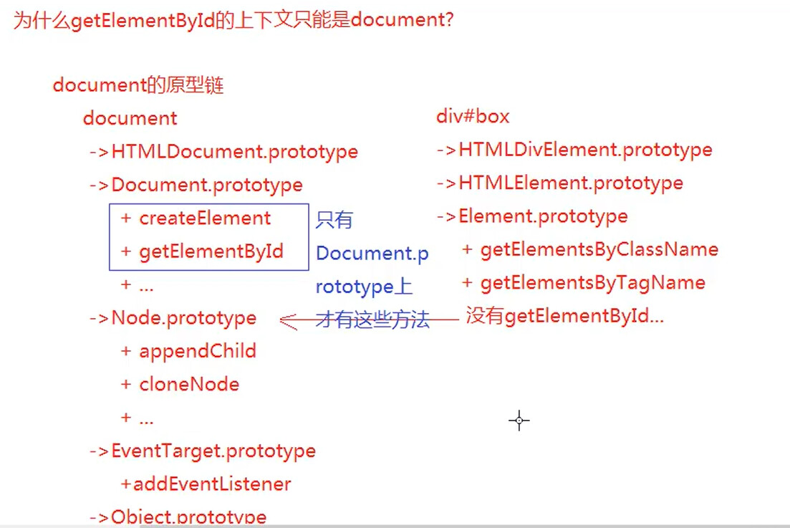

## 面向对象

> 标记语言 : html5 / css3
>
> 编程语言 : 编程思想
>
> - 面向过程 C
> - 面向对象 JAVA、PHP、C#(ASP.NET)、JavaScript...

### 单例设计模式 (Single Pattern)

```js
let name='和冉';
let age = 18;
let sex = '美女';

let name = '小璐璐';
let age = 81;
let sex = '看着办';

//=>把描述当前事务特征的信息进行分组归类 (减少全局变量的污染)
//=>这就是JS中的单例设计模式
/*
 *	beautifulGirl不仅仅被叫做变量 (对象名)，也被称为"命名空间"
 *		单例模式: 把描述事务的信息放到一个命名空间中进行归组，防止全局变量的污染
 */
let beautifulGirl={
    name:'和冉',
    age:18
};
let oldMan = {
    name:'小璐璐',
  	age:81
};
```

为了让单例模式变的高大上一些，真实项目中的单例模式都这样处理

```js
let namespace = (function(){
    //创建一些方法 (闭包中的私有方法)
    let fn = function(){
       //.... 
    };
    ...
    return {
        name:'xxx',
        fn:fn
    }
})();
namespace.name
namespace.fn()
```

例如 : 完成一个需要团队协作开发的案例 (百度首页)

```js
/*
 *	公共模块
 */
let utils = (function(){
    let queryElement = function (){...}
    return {
		//queryElement:queryElement
        queryElement
    }
})();

/*
 *	王城负责的页卡模块
 */
let pageTabModule = (function(){
    //=>获取元素 (调取其他命名空间下的方法)
    let tabBox = untils.queryElement('.tabBox');
    let show = function(){...}
    ...
    return {
        init:function(){
            //调用自己模块下的方法
            show();
        }
    }
})();
pageTabModule.init();
    
....
```

### 工厂模式(Factory Pattern)

> 批量化生产 : 把实现某个功能的代码进行封装，后期在想实现这个功能，我们直接执行函数即可
>
> - 低耦合 : 减少页面中冗余的代码
> - 高内聚 : 提高代码的重复使用率

```js
function createPerson(name,age){
    let person = {};
    person.name=name;
    person.age=age;
    return person;
}
let beautifulGirl = createPerson('和冉',18);
let oldMan = createPerson('小璐璐',81);
beautiful.name
oldMan.name
...
```


### 构造原型模式(正统面向对象编程)

> 自己能够创造出自定义类和对应实例，构建起一套完整的面向对象模型

```js
/* function CreatePerson(name, age) {
    this.name = name;
    this.age = age;
}
// CreatePerson('张三', 25); //=>this:window 普通函数执行
let person1 = new CreatePerson('和冉', 18); */
/* 
 *  new CreatePerson() 执行和普通函数执行的联系
 *      1.new这种执行方式叫做 "构造函数执行模式"，此时的CreatePerson不仅仅是一个函数名，被称为 "类"，而返回的结果(赋值给person1的)是一个对象，我们称之为 "实例"，而函数体中出现的this都是这个实例
 *      2.
 * 
 */

function CreatePerson(name, age) {
    this.name = name;
    this.age = age;
    // return 100; //=>返回的还是实例
    /* return {
        xxx:'xxx'
    }; */ 
    //=>如果手动return的是一个基本值，对返回的实例无影响，如果手动return的是一个引用类型的值，会把默认返回的实例给替换掉 (索引在构造函数模式执行下，我们一般都不要手动写return，防止把返回的实例给替换)
}
let person1 = new CreatePerson('和冉', 18);
console.log(person1);

/* 
 *  instanceof: 用来检测某个实例是否属于这个类
 *      实例 instanceof 类，属于返回true，不属于返回false
 *  [局限性]
 *      1.要求检测的实例必须是对象数据类型的，基本数据类型的实例是无法基于它检测出来的
 */
// console.log(preson1 instanceof CreatePerson); //=>true
let ary = [12, 23];
console.log(ary instanceof Array); //=>true
console.log(ary instanceof RegExp); //=>false
console.log(ary instanceof Object); //=>true
console.log(1 instanceof Number); //=>fasle

/* 
 *  基本数据类型在js中的特殊性
 *      1.一定是自己所属类的实例
 *      2.但是不一定是对象数据类型的
 */
// 字面量创建方式 (也是Number类的实例，也可以调取内置的公有方法)
let n = 10;
console.log(n.toFixed(2));
console.log(typeof n); //=>"number"

// 构造函数创建模式
let m = new Number("10");
console.log(typeof m); //=>"object"
console.log(m.toFixed(2)); //=>"10.00"
```


```js
//==========================
// 构造函数执行，因为也具备普通函数执行的特点
// 1.和实例有关系的操作一定是 this.xxx = xxx，因为this是当前类创造出来的实例
// 2.私有变量和实例没有必然的联系
function Fn(n) {
    let m = 10;
    this.total = n + m;
    this.say = function() {
        u
        console.log(this.total);
    }
}
let f1 = new Fn(10);
let f2 = new Fn(20);
let f3 = new Fn; //=>new的时候不论是否加小括号，都相当于把Fn执行了，也创建了对应的实例，只不过不加小括号是不能传递实参的(当前案例中的形参 n=undefined)

console.log(f1.m); //=>undefined
console.log(f2.n); //=>undefined
console.log(f1.total); //=20
f2.say(); //=>this:f2 (因为say执行前面有点) console.log(f2.total)=>30
console.log(f1 === f2); //=>false (因为是两个不同的实例对象，也就是不同的堆地址)
```

**总结**

```js
/* 
 *  类: 函数数据类型
 *  实例: 对象数据类型的
 */
function Fn() {
    /* 
     *  new执行也会把类当做普通函数执行 (当然也有类执行的一面)
     *      1.创建一个私有的栈内存
     *      2.形参赋值 & 变量提升
     *      3.浏览器创建一个对象出来 (这个对象就是当前类的一个新实例)，并且让函数中的 this 指向这个实例对象 => "构造函数模式中，方法中的 this 是当前类的实例"
     *      4.代码执行
     *      5.在我们不设置 return 的情况下，浏览器会把创建的实例对象默认返回
     */
    this.x = 100;
    this.y = 200;
}
let f1 = new Fn();
let f2 = new Fn();
```

## 原型及原型链模式

1. 每一个函数数据类型的值，都有一个天生自带的属性 : prototype ( 原型 )，这个属性的属性值是一个对象 ("用来存储实例公共的属性和方法的")
   - 普通的函数
   - 类 (自定义类和内置类)

2. 在prototype这个对象中，有一个天生自带的属性 : constructor，这个属性存储的是当前函数本身

```js
Fn.prototype.constructor === Fn
```

3. 每一个对象数据类型的值，也有一个天生自带的属性 : \__proto__，这个属性指向"所属类的原型prototype"
   - 普通对象、数组、正则、Math、日期、类数组等等
   - 实例也是对象数据类型的值
   - 函数的原型prototype属性的值也是对象类型的
   - 函数也是对象数据类型的值


### 原型链查找机制

> 1.先找自己私有的属性，有则调用使用，没有继续找
>
> 2.基于\_\_proto\_\_ 找到所属类原型上方法 ( Fn.prototype )，如果还没有则继续基于  \_\_proto\_\_ 往上找...一直找到Object.prototype为止





### constructor

```js
//=>基于constructor实现数据类型检测就是这样来玩的
// 但是这种方式有很大的弊端: 因为用户可以去随意修改对应的constructor值或手动给ary增加一个私有的constructor属性等
let ary = [];
console.log(ary.constructor === Array); //=>true
```


### hasOwnProperty

> 检测某一个属性名是否为当前对象的私有属性
>
> "in" : 检测这个属性是否属于某个对象 ( 不管是私有属性还是公有属性，只要是它的属性，结果就为true )

```js
let ary = [10,20,30];
console.log('0' in ary);  //=>true
console.log('push' in ary); //=>true
console.log(ary.hasOwnProperty('0')); //=>true
console.log(ary.hasOwnProperty('push')); //=>false  "push"是公有属性，不是私有的

console.log(Array.prototype.hasOwnProperty('push')); //=>true 是公有还是私有属性，需要相对谁来说的
console.log(Array.prototype.hasOwnProperty('hasOwnProperty')); //=>false
console.log(object.prototype.hasOwnProperty('hasOwnProperty')); //=>true
//=>自己堆中有的就是私有属性，需要基于__proto__查找的就是公有属性 (__proto__在IE浏览器中(edge除外)给保护起来了，不让我们在代码中操作它)
```

> 检测某个属性是否为对象的公有属性 : hasPubProperty
>
> 方法: 是它的属性，但是不是私有的

```js
//基于内置类原型扩展方法
Object.prototype.hasPubProperty = function(property) {
    //=>验证传递的属性名合法性 (一般只能是数字或字符串等基本值)
    let x = ["string","number","boolean"],
        y = typeof property;
    if(!x.includes(y)) return false;
    //=>开始效验是否为公有的属性 (方法中的this就是要校验的对象)
    let n = property in this,
        m = this.hasOwnProperty(property);
    return n && !m;
    
}
console.log(Array.prototype.hasPubProperty('push')); //=>fasle
console.log([].hasPubProperty('push')); //=>true
```

### this在原型上的应用

```js
/* 
 *  面向对象中有关 私有/公有 方法中的this问题
 *      1.方法执行，看前面是否有点，点前面是谁 this 就是谁
 *      2.把方法中的 this 进行替换
 *      3.再基于原型链查找的方法确定结果即可
 */

function Fn() {
    //=>this: f1这个实例
    this.x = 100;
    this.y = 200;
    this.say = function() {
        console.log(this.x);
    }
}
Fn.prototype.say = function() {
    console.log(this.y);
}
Fn.prototype.eat = function() {
    console.log(this.x + this.y);
}
Fn.prototype.write = function() {
    this.z = 1000;
}
let f1 = new Fn;
f1.say(); //=>this:f1 =>console.log(f1.x) =>100
f1.eat(); //=>this:f1 =>console.log(f1.x + f1.y) =>300
f1.__proto__.say(); //=>this:f1.__proto__ =>console.log(f1.__proto__.y) =>undefined
Fn.prototype > eat(); //=>this:Fn.prototype =>console.log(Fn.prototype.x + Fn.prototype.y); =>NaN
f1.write(); //=>this:f1 =>f1.z=1000 =>给f1设置一个私有的属性 z=1000
Fn.prototype.write(); //=>this:Fn.prototype => Fn.prototype.z = 1000 =>给原型上设置一个属性z=1000 (属性是实例的公有属性)
```

### 基于内置类的原型扩展方法

```js
/* 
 *  基于内置类的原型扩展方法
 *      在内置类原型上的方法，类所对应的实例可以直接调取使用，例如: 实例.方法() ary.push()
 *      如果我们也把自己写的方法放到原型上，那么当前类的实例也可以直接这样调取使用了，很方便
 * 
 *  但是也有需要注意的地方
 *      1.自己扩展的方法不能影响原有内置的方法 (我们自己设置的方法最好加前缀: my)
 *      2.扩展方法中的 this 一般都是当前类的实例 (也就是要操作的值): 实例.方法()
 */
~ function() {
    /* 
     *  myUnique : 实现数组去重
     *      @params
     *      @return
     *          [Array] 去重后的数组
     *  by 江冰 on 2022-9-3 10:57:41
     */
    function myUnique() {
        //此时没有传递要操作的ary进来，但是方法中的 this 是当前要操作的数组: ary.myUnique()
        let obj = {};
        for (let i = 0; i < this.length; i++) {
            let item = this[i];
            if (typeof obj[item] !== 'undefined') {
                this[i] = this[this.length - 1];
                this.length--;
                i--;
                continue;
            }
            obj[item] = item;
        }
        obj = null;
        // 保证当前方法执行完返回的结果依然是 Array类的一个实例
        return this;
    }
    //=>扩展到内置类的原型上
    Array.prototype.myUnique = myUnique;
}();
let ary = [12, 23, 13, 12, 23, 24, 34, 12, 23];
// ary.myUnique();  返回去重后的新数组 (也是array类的实例)
// ary.sort((a, b) => a - b);
//=>链式写法 (保证返回值依然是当前类的实例 一般都会 return this)
//ary.myUnique().sort((a, b) => a - b).reverse().slice(2).push('珠峰').concat(12); //=>Uncaught TypeError: ary.myUnique(...).sort(...).reverse(...).slice(...).push(...).concat is not a function
//=>执行完push返回的是一个数字 (新增后数组的长度)，不是数组了，不能在继续使用数组的方法
ary.myUnique().sort((a, b) => a - b).reverse();
console.log(ary);
```

```js
~ function() {
    //=>x:需要加减的数字 (必须是有效数字)
    function checkX(x) {
        x = Number(x);
        return isNaN(x) ? 0 : x;
    }

    function plus(x) {
        // this: 我们要操作的原始值数字 (this = xxx 我们不能给 this 手动赋值)
        x = checkX(x);
        return this + x;
    }

    function minus(x) {
        x = checkX(x);
        return this - x;
    }

    /* 扩展到内置类的原型上 */
    Number.prototype.plus = plus;
    Number.prototype.minus = minus;
}();
let n = 10;
let m = n.plus(10).minus(5);
console.log(m); //=>15 (10+10-5=15)
```


### 重构类的原型

```js
/* 
 *  重构类的原型: 让某个类的原型指向新的堆内存地址 (重定向指向)
 *      问题: 重定向后的空间中不一定有constructor属性 (只有浏览器默认给prototype开辟的堆内存中才存在constructor)，这样导致类和原型机制不完整; 所以需要我们手动再给新的原型空间设置constructor属性;
 *      问题: 在重新指向之前，我们需要确保原有原型的堆内存中没有设置属性和方法，因为重定向后，原有的属性和方法就没啥用了 (如果需要克隆到新的原型堆内存中，我们还需要额外的处理)	=>但是内置类的原型，由于担心这样的改变会让内置的方法都消失，所以禁止了我们给内置类原型的空间重定向，例如: Array.prototype={...}这样没有用，如果想加方法 Array.prototype.xxx=function(){...}可以这样处理
 */
function Fn() {
    //...
}
Fn.prototype.xxx = function() {}
    //=>批量给原型设置属性方法的时候: 重构类的原型
Fn.prototype = {
    constructor: Fn,
    getA: function() {},
    getB: function() {}
};

/* //=>批量给原型设置属性方法的时候: 设置别名
let proto = Fn.prototype;
proto.getA = function() {}
proto.getB = function() {}
proto.getC = function() {}
proto.getD = function() {} */
```


## 函数的三种角色

```js
/* 
 *  函数数据类型:
 *      1.普通函数
 *      2.类 (内置类 or 自定义类)
 *  对象数据类型:
 *      1.{}普通对象    []数组对象  /^$/正则对象    日期对象    Math数学函数对象    arguments等类数组对象   HTMLCollection/NodeList元素或者节点集合类数组对象...
 *      2.实例也是对象数据类型的
 *      3.类的prototype也是对象数据类型的 (Function.prototype除外，它是一个匿名空函数)
 *      4.函数也是对象
 * 
 * ================================
 *  函数有三种角色
 *      1.普通的函数
 *          + 形参、实参、arguments、return、箭头函数
 *          + 私有作用域 (栈内存、执行上下文)
 *          + 形参赋值 & 变量提升
 *          + 作用域链
 *          + 栈内存的释放和不释放 (闭包)
 *          + ...
 *      2.构造函数 (类)
 *          + 类和实例
 *          + prototype 和 __proto__ 原型和原型链
 *          + instanceof
 *          + constructor
 *          + hasOwnProperty
 *          + ...
 *      3.普通的对象
 *          + 它是由键值对组成的
 *          + ...
 *      函数中的 this 也是重点需要学习的内容
 */
function Fn(n, m) {
    this.x = n + m;
    this.y = n - m;
    let total = n * m;
    return total;
}
Fn.prototype.say = function() {
    console.log('say');
}

//=>普通函数
let total = Fn(20, 10);
//=>构造函数执行
let f = new Fn(20, 10);
//=>普通对象
Fn.total = 1000;
```


阿里面试题

```js
function Foo(){
    getName = function (){
        console.log(1);
    }
    return this;
}
Foo.getName = function (){
    console.log(2);
};
Foo.prototype.getName = function (){
    console.log(3);
};
var getName = function (){
    console.log(4);
};
function getName(){
    console.log(5);
}
Foo.getName();
getName();
Foo().getName();
getName();
new Foo.getName();//=>首先找到 Foo.getName:输出2这个方法 (AF2) =>再new AF2()
new Foo().getName();//=>首先 new Foo()创造一个实例 =>再 实例.getName()执行
new new Foo().getName();//=>第一步: let f = new Foo() 创建Foo类的实例
//=>第二步: f.getName =>AF3
//=>第三步: new AF3() 创建AF3类的实例(我们这里有用的还是像普通函数执行这一套，执行的是AF3)

new Fn();
Fn.aa 成员访问
new Fn;
```

