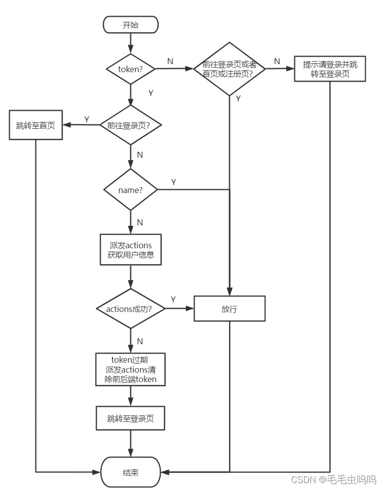
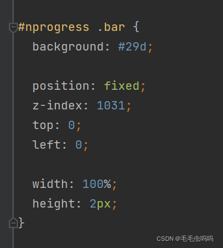
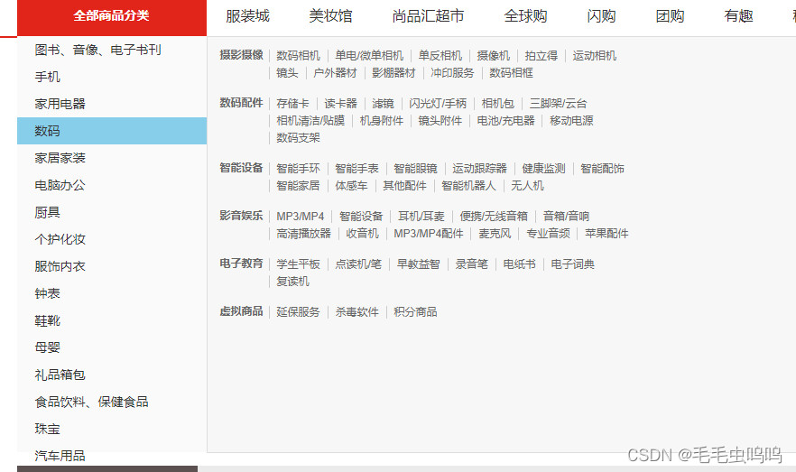
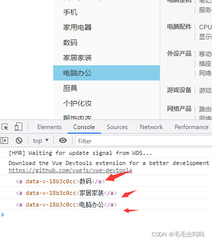
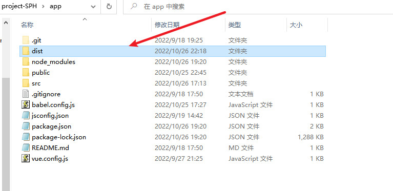
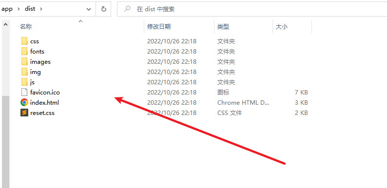
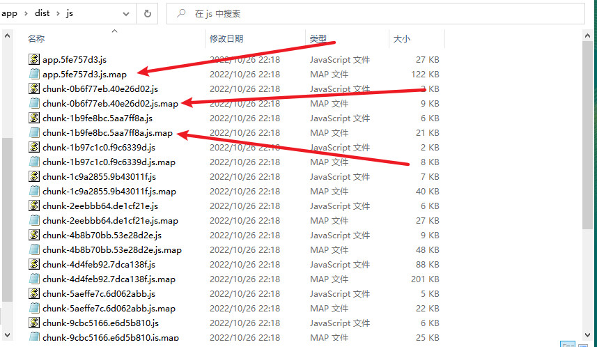

## 脚手架使用

1. vue init webpack 项目的名字

2. vue create 项目名称

3. 脚手架目录:

 ```js
 node_modules:放置项目依赖的地方
 
 public:一般放置一些共用的静态资源，打包上线的时候，public文件夹里面资源原封不动打包到dist文件夹里面
 pubilc/index.html是一个模板文件，作用是生成项目的入口文件，webpack打包的js,css也会自动注入到该页面中。我们浏览器访问项目的时候就会默认打开生成好的index.html。
 
 src：程序员源代码文件夹
 	assets文件夹：经常放置一些静态资源（图片），assets文件夹里面资源webpack会进行打包为一个模块	                   （js文件夹里面）
 	components文件夹:一般放置非路由组件（或者项目共用的组件）
     App.vue 唯一的根组件
     main.js 入口文件【程序最先执行的文件】
 babel.config.js:babel配置文件
 package.json：看到项目描述、项目依赖、项目运行指令
 package-lock.json: 缓存性文件（各种包的来源）
 README.md:项目说明文件
 ```

## 项目配置

1. 浏览器自动打开

```json
//=>在package.json文件中
"scripts": {
    "serve": "vue-cli-service serve --open",
    "build": "vue-cli-service build",
    "lint": "vue-cli-service lint"
},
```

2. 关闭eslint校验工具 （不关闭会有各种规范，不按照规范就会报错）

- 根目录下创建vue.config.js,进行配置

```js
module.exports = {
    //关闭eslint
    lintOnSave: false
}
```

3. src文件夹的别名的设置

因为项目大的时候src（源代码文件夹）：里面目录会很多，找文件不方便，设置src文件夹的别名的好处，找文件会方便一些

- 根目录下创建vue.config.js,进行配置

```js
{
    "compilerOptions": {
        "baseUrl": "./",
            "paths": {
            //用@/代替src/
                "@/*": [
                    "src/*"
                ]
            }
    },
	//exclude表示不可以使用该别名的文件
    "exclude": [
        "node_modules",
        "dist"
    ]
}
```

3. 组件页面样式

- 组件页面的样式使用的是less样式，浏览器不识别该样式，需要下载相关依赖
  `npm install --save less less-loader@5`
- 如果想让组件识别less样式，则在组件中设置
  `<script scoped lang="less">`


## 路由

### 路由理解

- KV：K--->URL  V---->相应的组件

### 路由的一个分析

- 确定项目结构顺序:上中下 -----只有中间部分的V在发生变化，中间部分应该使用的是路由组件
  2个非路由组件|四个路由组件
- 两个非路由组件：Header 、Footer
- 路由组件:Home、Search、Login（没有底部的Footer组件，带有二维码的）、Register（没有底部的Footer组件，带二维码的）

### 创建非路由组件

非路由组件使用分为几步:

- 第一步：定义
- 第二步：引入
- 第三步：注册
- 第四步:使用

### 路由组件和非路由组件区别：

- 非路由组件放在components中，路由组件放在pages或views中
- 非路由组件通过标签使用，路由组件通过路由使用
- 在main.js注册玩路由，所有的路由和非路由组件身上都会拥有$router $route属性
- $router：一般进行编程式导航进行路由跳转
- $route： 一般获取路由信息（name path params等）

### 路由跳转方式   

- 声明式导航router-link标签 `<router-link to="path">`,可以把router-link理解为一个a标签，它也可以加class修饰
- 编程式导航 ：声明式导航能做的编程式都能做，而且还可以处理一些业务

### 路由传参 

1. query、params

- query、params两个属性可以传递参数 
- params参数：路由需要占位，程序就崩了，属于URL当中一部分
- query参数：路由不需要占位，写法类似于ajax当中query参数

```js
query参数：不属于路径当中的一部分，类似于get请求，地址栏表现为 /search?k1=v1&k2=v2
query参数对应的路由信息:  path: "/search"

params参数：属于路径当中的一部分，需要注意，在配置路由的时候，需要**占位** ,地址栏表现为 /search/v1/v2 
params参数对应的路由信息要修改为 `path: "/search/:keyword"`  这里的/:keyword就是一个params参数的占位符  
```

2. params传参问题 

①、如何指定params参数可传可不传  

```js
如果路由path要求传递params参数,但是没有传递,会发现地址栏URL有问题，详情如下：
  Search路由项的path已经指定要传一个keyword的params参数，如下所示：
  path: "/search/:keyword",
  执行下面进行路由跳转的代码：
  this.$router.push({name:"Search",query:{keyword:this.keyword}})
  当前跳转代码没有传递params参数
  地址栏信息：http://localhost:8080/#/?keyword=asd
  此时的地址信息少了/search
  正常的地址栏信息: http://localhost:8080/#/search?keyword=asd
  
  解决方法：可以通过改变path来指定params参数可传可不传 
  path: "/search/:keyword?",?表示该参数可传可不传
```
​		参考连接：https://blog.csdn.net/weixin_44867717/article/details/109773945 
②、由①可知params可传可不传，但是如果传递的时空串，如何解决 。

```js
 this.$router.push({name:"Search",query:{keyword:this.keyword},params:{keyword:''}})
 出现的问题和①中的问题相同,地址信息少了/search
 解决方法： 加入||undefined，当我们传递的参数为空串时地址栏url也可以保持正常
 this.$router.push({name:"Search",query:{keyword:this.keyword},params:{keyword:''||undefined}})
```
③、路由组件能不能传递props数据？ 
		可以，但是只能传递params参数,具体知识为props属性 。

3. 传参方法

- 字符串形式 
this.$router.push("/search/"+this.params传参+"?k="+this.query传参)
- 模板字符串 
this.$router.push("/search/+${this.params传参}?k=${this.query传参}") 
**注意**： 上面字符串的传参方法可以看出params参数和'/'结合，query参数和？结合 
`http://localhost:8080/#/search/asd?keyword=asd` 
上面url中asd为params的值，keyword=asd为query传递的值。
- 对象（常用） 
this.$router.push({name:"路由名字",params:{传参},query:{传参})。
以对象方式传参时，如果我们传参中使用了params，只能使用name，不能使用path，如果只是使用query传参，可以使用path。


<span style="color: red">编程式导航路由跳转到当前路由(参数不变), 多次执行会抛出NavigationDuplicated的警告错误?</span>

```js
注意:编程式导航（push|replace）才会有这种情况的异常，声明式导航是没有这种问题，因为声明式导航内部已经解决这种问题。
这种异常，对于程序没有任何影响的。
为什么会出现这种现象:
由于vue-router最新版本3.5.2，引入了promise，当传递参数多次且重复，会抛出异常，因此出现上面现象,
第一种解决方案：是给push函数，传入相应的成功的回调与失败的回调
第一种解决方案可以暂时解决当前问题，但是以后再用push|replace还是会出现类似现象，因此我们需要从‘根’治病；

第二种解决方案: 重写VueRouter原型对象上的push方法和replace方法
// 先把VueRouter原型对象的push方法，先保存一份
let originPush = VueRouter.prototype.push;
let originReplace = VueRouter.prototype.replace;

//重写push| replace
// 第一个参数: 告诉原来push方法，你往哪里跳转 (传递那哪些参数)
// 第二个参数: 成功回调
// 第三个参数: 失败的回调
VueRouter.prototype.push = function(location, resolve, reject) {
    if (resolve && reject) {
        // call | apply
        // 相同点，都可以调用函数一次，都可以篡改函数的上下文一次
        //不同点: call与apply传递参数: call传递参数用逗号隔开，apply方法执行，传递数组
        originPush.call(this, location, resolve, reject);
    } else {
        originPush.call(this, location, () => {}, () => {});
    }
}
VueRouter.prototype.replace = function(location, resolve, reject) {
    if (resolve && reject) {
        // call | apply
        // 相同点，都可以调用函数一次，都可以篡改函数的上下文一次
        //不同点: call与apply传递参数: call传递参数用逗号隔开，apply方法执行，传递数组
        originReplace.call(this, location, resolve, reject);
    } else {
        originReplace.call(this, location, () => {}, () => {});
    }
}
```

### 滚动行为


## 面试题：v-show与v-if区别?

v-show:通过样式display控制
v-if：通过元素上树与下树进行操作
面试题:开发项目的时候，优化手段有哪些?
1:v-show|v-if
2:按需加载
8)首页|搜索底部是有Footer组件，而登录注册是没有Footer组件
Footer组件显示|隐藏，选择v-show|v-if
路由元信息


## 路由传递参数先关面试题

1. 路由传递参数（对象写法）path是否可以结合params参数一起使用?

```js
答: 路由跳转传参的时候，对象的写法可以是name、path形式，但是需要注意的是，path这种写法不能与params参数一起使用
```

2. 如何指定params参数可传可不传?

```js
如果路由要求传递params参数，但是你就不传递params参数，URL就会有问题
比如:配置路由的时候，占位了(params参数)，但是路由跳转的时候就不传递
路径就会出现问题:
http://localhost:8080/#/?k=QWE
http://localhost:8080/#/search?k=QWE (正常情况下)

如何指定params参数可以传递、或者不传递，在配置路由的时候，在占位的后面加上一个问号[params可以传递或者不传递]
```

3. params参数可以传递也可以不传递，但是如果传递的是空串，如何解决?

```js
使用undefined解决: params参数可以传递、不传递(空的字符串)
this.$router.push({
    name:'search',
    params:{
        keyword:'' || undefined
    },
    query:{
        k:this.keyword.toUpperCase()
    }
});
```

4. 路由组件能不能传递props数据?

```js
可以总共有三种写法:
布尔值写法: params
props: true,
对象写法:额外的给路由组件传递一些props
props: { a: 1, b: 2 },
函数写法: 可以params参数、query参数，通过props传递给路由组件
props: ($route) => {
    return {
        keyword: $route.params.keyword,
        k: $route.query.k
    }
}
```

​     

## axios二次封装

axios中文文档，包含详细信息。
[https://www.kancloud.cn/yunye/axios/234845](https://www.kancloud.cn/yunye/axios/234845)
在根目录下创建api文件夹，创建request.js文件。
内容如下，当前文件代码还比较少，后续有需求可以增添内容。

```js
import axios from "axios";
//1、对axios二次封装
const requests = axios.create({
    //基础路径，requests发出的请求在端口号后面会跟改baseURl
    baseURL:'/api',
    timeout: 5000,
})
//2、配置请求拦截器
requests.interceptors.request.use(config => {
    //config内主要是对请求头Header配置
    //比如添加token
    
    return config;
})
//3、配置相应拦截器
requests.interceptors.response.use((res) => {
    //成功的回调函数
    return  res.data;
},(error) => {
    //失败的回调函数
    console.log("响应失败"+error)
    return Promise.reject(new Error('fail'))
})
//4、对外暴露
export default requests;
```

## 前端通过代理解决跨域问题

**跨域:** 如果多次请求协议、域名、端口号有不同的地方，称之为跨域
**解决办法:** JSONP、CROS、代理

```js
/在根目录下的vue.config.js中配置,proxy为通过代理解决跨域问题。
我们在封装axios的时候已经设置了baseURL为api,所以所有的请求都会携带/api，这里我们就将/api进行了转换。如果你的项目没有封装axios，或者没有配置baseURL，建议进行配置。要保证baseURL和这里的代理映射相同，此处都为'/api'。
module.exports = {
    //关闭eslint
    lintOnSave: false,
    devServer: {
        // true 则热更新，false 则手动刷新，默认值为 true
        inline: false,
        // development server port 8000
        port: 8001,
        //代理服务器解决跨域
        proxy: {
            //会把请求路径中的/api换为后面的代理服务器
            '/api': {
                //提供数据的服务器地址
                target: 'http://39.98.123.211',

            }
        },
    }
}
```

[webpack官网相关知识解读](https://webpack.docschina.org/configuration/dev-server/#devserverproxy)

网站中的webpack.config.js就是vue.config.js文件

## 请求接口统一封装

在文件夹api中创建index.js文件，用于封装所有请求
**将每个请求封装为一个函数，并暴露出去，组件只需要调用相应函数即可，这样当我们的接口比较多时，如果需要修改只需要修改该文件即可。**

如下所示：
```js
//当前模块，API进行统一管理，即对请求接口统一管理
import requests from "@/api/request";

//首页三级分类接口
export const reqCateGoryList = () => {
    return  requests({
        url: '/product/getBaseCategoryList',
        method: 'GET'
    })
}
```
当组件想要使用相关请求时，只需要导入相关函数即可，以上图的reqCateGoryList 为例:
```js
import {reqCateGoryList} from './api'
//发起请求
reqCateGoryList();
```

## nprogress进度条插件

打开一个页面时，往往会伴随一些请求，并且会在页面上方出现进度条。它的原理时，在我们发起请求的时候开启进度条，在请求成功后关闭进度条，所以只需要在request.js中进行配置。
如下图所示，我们页面加载时发起了一个请求，此时页面上方出现蓝色进度条

对应的request.js设置

```js
import axios from "axios";
//引入进度条
import nprogress from 'nprogress';
//引入进度条样式
import "nprogress/nprogress.css";
//1、对axios二次封装
const requests = axios.create({
    //基础路径，requests发出的请求在端口号后面会跟改baseURl
    baseURL:'/api',
    timeout: 5000,
})
//2、配置请求拦截器
requests.interceptors.request.use(config => {
    //config内主要是对请求头Header配置
    //比如添加token

    //开启进度条
    nprogress.start();
    return config;
})
//3、配置相应拦截器
requests.interceptors.response.use((res) => {
    //成功的回调函数

    //响应成功，关闭进度条
    nprogress.done()
    return  res.data;
},(error) => {
    //失败的回调函数
    console.log("响应失败"+error)
    return Promise.reject(new Error('fail'))
})
//4、对外暴露
export default requests;
```
可以通过修改nprogress.css文件的background来修改进度条颜色。


## vuex

>  当项目比较大，组件通信数据比较复杂，这种情况在使用vuex
>
>   Vuex是插件，通过vuex仓库进行存储项目的数据

首先确保安装了vuex,根目录创建store文件夹，文件夹下创建index.js，内容如下：
```js
import Vue from 'vue'
import Vuex from 'vuex'

Vue.use(Vuex)

//对外暴露store的一个实例
export default new Vuex.Store({
    state:{},
    mutations:{},
    actions:{},
    
})
```
如果想要使用vuex，还要再main.js中引入
main.js: 
(1) 引入文件
(2) 注册store
**但凡是在main.js中的Vue实例中注册的实体，在所有的组件中都会有（this.$.实体名）属性**

```js
import store from './store'
new Vue({
  render: h => h(App),
  //注册路由，此时组件中都会拥有$router $route属性
  router,
  //注册store,此时组件中都会拥有$store
  store
}).$mount('#app')
```

### vuex模块式开发【modules】

- 由于项目体积比较大，你向服务器发请求的接口过多，服务器返回的数据也会很多，如果还用以前的方式存储数据，导致vuex中的state数据格式比较复杂。采用vuex模块式管理数据。
  Vuex核心概念:state、actions、mutations、getters、modules

<span style="color:red">getters计算属性，在项目当中，为了简化数据而生</span>

<span style="color:red">仓库当中的state的数据格式，不能瞎写、胡写、乱写，数据格式取决于服务器返回的数据</span>

以前基础课程的时候，发请求操作如下：在组件的mounted中书写axios.get||post,获取到数据存储到组件的data当中进行使用


你们写项目的时候发请求在哪里发呀？
mounted|created:都可以

mounted：模板已经变为真是DOM【只不过没有数据，显示空白】，因为ajax是异步，需要时间的。
created：稍微好那么一丢丢（不算啥）


## 函数防抖与节流-----面试题

- 正常：事件触发非常频繁，而且每一次的触发，回调函数都要去执行（如果时间很短，而回调函数内部有计算，那么很可能出现浏览器卡顿）

- 防抖：前面的所有的触发都被取消，最后一次执行在规定的时间之后才会触发，也就是说如果连续快速的触发,只会执行最后一次

- 节流：在规定的间隔时间范围内不会重复触发回调，只有大于这个时间间隔才会触发回调，把频繁触发变为少量触发

- 防抖与节流的原理-----通过JS实现【闭包 + 延迟器】

### loadsh插件防抖和节流

在进行窗口的resize、scroll，输入框内容校验等操作时，如果事件处理函数调用的频率无限制，会加重浏览器的负担，导致用户体验非常糟糕。此时我们可以采用debounce（防抖）和throttle（节流）的方式来减少调用频率，同时又不影响实际效果。 
安装lodash插件，该插件提供了防抖和节流的函数，我们可以引入js文件，直接调用。当然也可以自己写防抖和节流的函数
[lodash官网](https://www.lodashjs.com/)
[防抖函数](https://www.lodashjs.com/docs/lodash.debounce)
[节流函数](https://www.lodashjs.com/docs/lodash.throttle)
防抖：用户操作很频繁，但是只执行一次，减少业务负担。
节流：用户操作很频繁，但是把频繁的操作变为少量的操作，使浏览器有充分时间解析代码
[防抖和节流简述](https://www.jianshu.com/p/c8b86b09daf0)
例如：下面代码就是将changeIndex设置了节流，如果操作很频繁，限制50ms执行一次。这里函数定义采用的键值对形式。throttle的返回值就是一个函数，所以直接键值对赋值就可以，函数的参数在function中传入即可。

```js
import {throttle} from 'lodash'

methods: {
    //鼠标进入修改响应元素的背景颜色
    //采用键值对形式创建函数，将changeIndex定义为节流函数，该函数触发很频繁时，设置50ms才会执行一次
    changeIndex: throttle(function (index){
        this.currentIndex = index
    },50),
        //鼠标移除触发时间
        leaveIndex(){
        this.currentIndex = -1
    }
}
```


## 编程式导航+事件委托实现路由跳转


如上图所示，三级标签列表有很多，每一个标签都是一个页面链接，我们要实现通过点击表现进行路由跳转。
路由跳转的两种方法：导航式路由，编程式路由。

> 	对于导航式路由，我们有多少个a标签就会生成多少个router-link标签，这样当我们频繁操作时会出现卡顿现象。
> 	对于编程式路由，我们是通过触发点击事件实现路由跳转。同理有多少个a标签就会有多少个触发函数。虽然不会出现卡顿，但是也会影响性能。

上面两种方法无论采用哪一种，都会影响性能。我们提出一种：编程时导航+事件委派 的方式实现路由跳转。事件委派即把子节点的触发事件都委托给父节点。这样只需要一个回调函数goSearch就可以解决。
**事件委派问题：**
（1）如何确定我们点击的一定是a标签呢？如何保证我们只能通过点击a标签才跳转呢？
（2）如何获取子节点标签的商品名称和商品id(**我们是通过商品名称和商品id进行页面跳转的**)

**解决方法：**
对于问题1：为三个等级的a标签添加自定义属性date-categoryName绑定商品标签名称来标识a标签（其余的标签是没有该属性的）。

对于问题2：为三个等级的a标签再添加自定义属性data-category1Id、data-category2Id、data-category3Id来获取三个等级a标签的商品id，用于路由跳转。
我们可以通过在函数中传入event参数，获取当前的点击事件，通过event.target属性获取当前点击节点，再通过dataset属性获取节点的属性信息。
```html
<div class="all-sort-list2" @click="goSearch" @mouseleave="leaveIndex">
    <div class="item"  v-for="(c1,index) in categoryList" v-show="index!==16" :key="c1.categoryId" :class="{cur:currentIndex===index}">
        <h3 @mouseenter="changeIndex(index)"  >
            <a :data-categoryName="c1.categoryName" :data-category1Id="c1.categoryId" >{{c1.categoryName}}</a>
        </h3>
        <div class="item-list clearfix" :style="{display:currentIndex===index?'block':'none'}">
            <div class="subitem" v-for="(c2,index) in c1.categoryChild" :key="c2.categoryId">
                <dl class="fore">
                    <dt>
                        <a :data-categoryName="c2.categoryName" :data-category2Id="c2.categoryId">{{c2.categoryName}}</a>
                    </dt>
                    <dd>
                        <em v-for="(c3,index) in c2.categoryChild"  :key="c3.categoryId">
                            <a :data-categoryName="c2.categoryName" :data-category3Id="c3.categoryId">{{c3.categoryName}}</a>
                        </em>
                    </dd></dl></div></div></div></div>
```
**注意**：event是系统属性，所以我们只需要在函数定义的时候作为参数传入，在函数使用的时候不需要传入该参数。
```js
//函数使用
<div class="all-sort-list2" @click="goSearch" @mouseleave="leaveIndex">
    //函数定义
    goSearch(event){
    console.log(event.target)
}
```

对应的goSearrch函数
```js
goSearch(event){
      let element = event.target
      //html中会把大写转为小写
      //获取目前鼠标点击标签的categoryname,category1id,category2id,category3id，
      // 通过四个属性是否存在来判断是否为a标签，以及属于哪一个等级的a标签
      let {categoryname,category1id,category2id,category3id} = element.dataset


      //categoryname存在，表示为a标签
      if(categoryname){
        //category1id一级a标签
        //整理路由跳转的参数
        let location = {name:'Search'}//跳转路由name
        let query = {categoryName:categoryname}//路由参数

        if(category1id){
          query.category1Id = category1id
        }else if(category2id){
        //category2id二级a标签
          query.category2Id = category2id
        }else if(category3id){
        //category3id三级a标签
          query.category3Id = category3id
        }
        //整理完参数
        location.query = query
        //路由跳转
        this.$router.push(location)

      }
    },
```

## 过渡动画效果

**过渡动画:** 前提 组件|元素 务必要有 v-if|v-show 指令才可以进行过渡动画


## Mock.js

> mock数据 (模拟) : 如果你想mock数据，需要用到一个插件mockjs

使用步骤:

- 在项目当中src文件夹中创建mock文件夹
- 第二步准备JSON数据 (mock文件夹中创建相应的JSON文件) ----格式化一下，别留有空格(跑不起来的)
- 把mock数据需要的图片放置到public文件夹中 [public文件夹在打包的时候，会把相应的资源原封不动打包到dist文件夹中]
- 第四步，开始mock (虚拟的数据了)，创建mockServer.js通过mockjs插件实现模拟数据
- mockServer.js文件在入口文件中引入 (至少需要执行一次，才能模拟数据)


## Swiper

安装Swiper插件: 安装的是swiper@5 `npm i --save swiper@5`

使用方法: 

- 第一步: 引包 (相应的JS|CSS)
- 第二步: 页面中结构务必要有
- 第三步: (页面当中务必要有结构) : new Swiper实例 [轮播图添加动态效果]

轮播图实例问题的解决方案

```js
直接把放到new Swiper放在mouted中?

在new Swiper实例之前，页面中结构必须的有 (现在把new Swiper实例放到mounted这里发现不行)
为什么? 因为dispatch当中涉及到异步语句，导致v-for遍历的时候结构还不完整，因此不行
```

```js
把放到new Swiper放在mouted中?
    可以，但是每次更新数据都会重新new Swiper 不推荐!!!
```

```js
使用延时器?
    可以解决问题，但是如果数据庞大加载会变得缓慢，不推荐
setTimeout(() => {
    var mySwiper = new Swiper(".swiper-container", {
        // direction: 'vertical', // 垂直切换选项

        loop: true, // 循环模式选项

        // 如果需要分页器
        pagination: {
            el: ".swiper-pagination",
            //点击小球的时候也切换图片
            clickable:true
        },

        // 如果需要前进后退按钮
        navigation: {
            nextEl: ".swiper-button-next",
            prevEl: ".swiper-button-prev",
        },
    });
},200);
```

```js
最完美的解决方案:
watch: 数据监听: 监听已有数据的变化
+ $nextTick:在下次Dom更新  循环结束之后  执行延迟回调。在  修改数据之后  立即使用这个方法，获取更新后的Dom。
$nextTick: 可以保证页面中的结构一定是有的，经常和很多插件一起使用 (都需要Dom存在的插件)
```


## 组件通信的方式有哪些

- props : 用于父子组件通信
- 自定义事件 : @on @emit 可以实现子给父通信
- 全局事件总线 : $bus 全能
- pubsub-js : vue当中几乎不用  全能
- 插槽
- vuex


<span style="color:red">切记: 以后在开发项目的时候，如果看到某一个组件在很多地方都使用，你把它变成全局组件，在main.js中注册一次，可以在任意地方使用，共用的组件 | 非路由组件放到components文件夹中</span>


Search模块开发?

- 先写静态页面 + 静态组件拆分出来
- 发请求 (API)
- Vuex(三连环)
- 组件获取仓库数据，动态展示


## 分页功能实现

为什么很多项目采用分页功能: 比如电商平台同时展示的数据有很多(1w+)，所以需要采用分页功能

ElementUI是有相应的分页组件，使用起来超级简单，但是前台项目目前不用 (掌握自定义分页功能)

**分页器的展示需要哪些数据(条件)?**

- 需要知道当前是第几个: pageNo字段代表当前页数
- 需要知道每一页需要展示多少条数据: pageSize字段进行代表
- 需要知道整个分页器一共有多少条数据: total字段进行代表---(获取另外一条信息: 一共多少页)
- 需要知道分页器连续页面个数: 5 | 7  (奇数)，因为奇数对称(好看)

​	**总结:** 对于分页器而言，自定义前提需要知道四个前提条件

- pageNo : 当前第几页
- pageSize : 代表每一页展示多少条数据
- total : 代表整个分页一共要展示多少条数据
- continues : 代表分页连续页码个数


自定义分页器，在开发的时候先自己传递假的数据进行调试，调试成功之后再用服务器数据。

**对于分页器而言，很重要的一个地方即为 (算出: 连续页面起始数字和结束数字)**

> 当前页是第8页
>
> 6 7   8   9 10


**分页器动态展示? 分为上中下 (中间部分)**

v-for : 数组 | 数字 | 字符串 | 对象


## 详情页面

- 静态组件

当点击商品的图片的时候，跳转到详情页面，在路由跳转的时候需要带上产品的Id给详情页面

- 发请求
- vuex
- 动态展示组件


## 本地存储和会话存储

**本地存储:** 持久化的-----5M(存储上限)

**会话存储:** 并非持久-----会话结束就消失


## 购物车

根据api接口文档封装请求函数

```js
export const reqGetCartList = () => {
return requests({
	url:'/cart/cartList',
	method:'GET'
})}
```

但是如果想要获取详细信息，还需要一个用户的uuidToken，用来验证用户身份。但是该请求函数没有参数，所以我们只能把uuidToken加在请求头中。

创建utils工具包文件夹，创建生成uuid的js文件，对外暴露为函数（记得导入uuid  => `npm install uuid`）。
**生成临时游客的uuid（随机字符串）,每个用户的uuid不能发生变化，还要持久存储**

```js
import {v4 as uuidv4} from 'uuid'
//生成临时游客的uuid（随机字符串）,每个用户的uuid不能发生变化，还要持久存储
export const getUUID = () => {
    //1、判断本地存储是否由uuid
    let uuid_token = localStorage.getItem('UUIDTOKEN')
    //2、本地存储没有uuid
    if(!uuid_token){
        //2.1生成uuid
        uuid_token = uuidv4()
        //2.2存储本地
        localStorage.setItem("UUIDTOKEN",uuid_token)
    }
    //当用户有uuid时就不会再生成
    return uuid_token
}
```

用户的uuid_token定义在store中的detail模块

```js
const state =  {
    goodInfo:{},
    //游客身份
    uuid_token: getUUID()
}
```

在request.js中设置请求头

```js
import store from '@/store';
requests.interceptors.request.use(config => {
    //config内主要是对请求头Header配置

    //1、先判断uuid_token是否为空
    if(store.state.detail.uuid_token){
        //2、userTempId字段和后端统一
        config.headers['userTempId'] = store.state.detail.uuid_token
    }
    //比如添加token

    //开启进度条
    nprogress.start();
    return config;
})
```

注意this.$store只能在组件中使用，不能再js文件中使用。如果要在js中使用，需要引入`import store from '@/store';`


## 登录与注册

assets文件夹----放置全部组件共用静态资源

在css样式中也可以使用**@**符号 (src别名)，切记在前面加上**~**

**1、ES6  const新用法**

```js
const {comment,index,deleteComment} = this 
```

上面的这句话是一个简写，最终的含义相当于:

```js
const  comment = this.comment
const  index = this.index
const   deleteComment = this.deleteComment
```

**2、用户注册模块**
actions部分(验证码部分省略)

```js
//用户注册
async userRegister({commit},data){
    let result = await reqPostRegister(data)
    if(result.code === 200){
        return 'ok'
    }else{
        return Promise.reject(new Error(result.message))
    }
}
```

methods注册功能
注册成功跳转到登陆页面，并且携带用户账号（个人完善）

```js
async userRegister(){
    const{phone,password,code} = this
    try{
        phone && password && code && await this.$store.dispatch('userRegister',{phone,password,code})
        //注册成功跳转到登陆页面，并且携带用户账号
        await this.$router.push({path:'/login',query:{name:this.phone}})
    }catch (error){
        alert(error)
    }
},
```

`this.$store.dispatch('userRegister',{phone,password,code})`因为K 、V相同，所以只传K
3、登录模块
前端部分内容

```html
<form >
    <div class="input-text clearFix">
        <span></span>
        <input type="text" placeholder="邮箱/用户名/手机号" v-model="phone">
    </div>
    <div class="input-text clearFix">
        <span class="pwd"></span>
        <input type="password" placeholder="请输入密码" v-model="password">
    </div>
    <div class="setting clearFix">
        <label class="checkbox inline">
            <input name="m1" type="checkbox" value="2" checked="">
            自动登录
        </label>
        <span class="forget">忘记密码？</span>
    </div>
    <button class="btn" @click.prevent="goLogin">登&nbsp;&nbsp;录</button>
</form>
```

由于登录按钮的父节点是一个form表单，如果使用@click触发登录事件，form表单会执行默认事件action实现页面跳转。这里我们使用`@click.prevent`，它可以阻止自身默认事件的执行。

actions登陆函数

```js
//登录
async userLogin({commit},data){
    let result = await reqPostLogin(data)
    //服务器会返回token
    if(result.code === 200){
        //token存入vuex
        commit("SETUSERTOKEN",result.data.token)
        //持久化存储token
        localStorage.setItem('TOKEN',result.data.token)
        return 'ok'
    }else{
        return Promise.reject(new Error(result.message))
    }
},
```

mutations设置用户token

```js
//设置用户token
SETUSERTOKEN(state,token){
    state.token = token
}
```

登陆组件methods登陆函数

```js
async goLogin(){
    try{
        //会将this中的phone,password以对象的形式返回
        const {phone,password} = this
        phone && password && await this.$store.dispatch('userLogin',{phone,password})
        //路由跳转到home首页
        this.$router.push('/home')
    }catch (error){
        alert(error)
    }
}
```

登陆成功后获取用户信息
actions函数

```js
async getUserInfo({commit}){
    let result = await reqGetUserInfo();
    //将用户信息存储到store中
    if(result.code === 200){
        //vuex存储用户信息
        commit('SETUSERINFO',result.data)
        return  'ok'
    }else{
        return Promise.reject(new Error(result.message))
    }
},
```

mutations存储用户信息

```js
//存储用户信息
SETUSERINFO(state,data){
    state.userInfo = data
},
```


## 导航守卫

导航: 表示路由正在发生改变，进行路由跳转

守卫: 你把它当成"紫禁城守卫"

- 全局守卫 : 项目当中，只要发生路由变化，守卫就能监听到。
  - 全局前置守卫 : `router.beforeEach()`
  
  ```js
  const router = new VueRouter({ ... });
  router.beforeEach((to,from,next)=>{
      //to: 可以获取到你要跳转到哪个路由信息
      //from: 可以获取到你从哪个路由而来的信息
      //next: 放行函数    next()放行   next(path)放行到指定路由   next(false);
  });
  ```
  
  - 全局解析守卫
  - 全局后置钩子
- 路由独享守卫 : 
- 组件内守卫 : 

比如: 用户已经登录，用户不应该还能回login页面


思路：直接看流程图
为什么要判断name？

> 因为store中的token是通过localStorage获取的，token有存放在本地。当页面刷新时，本地token不会消失，所以store中的token也不会消失。但是，store中的其他数据（用户信息等）会清空，此时会出现用户信息不存在，但是有token，这种情况是不可以访问其他页面的，必须先去获取用户信息。由于用户信息是一个对象，所以我们通过它的一个属性name判断用户信息是否存在。
> 所以不仅要判断token,还要判断用户信息


router index.js全局前置守卫代码

```js
//设置全局导航前置守卫
router.beforeEach(async(to, from, next) =>  {
    let token = store.state.user.token
    let name = store.state.user.userInfo.name
    //1、有token代表登录，全部页面放行
    if(token){
        //1.1登陆了，不允许前往登录页
        if(to.path==='/login'){
            next('/home')
        } else{
            //1.2、因为store中的token是通过localStorage获取的，token有存放在本地
            // 当页面刷新时，token不会消失，但是store中的其他数据会清空，
            // 所以不仅要判断token,还要判断用户信息

            //1.2.1、判断仓库中是否有用户信息，有放行，没有派发actions获取信息
            if(name)
                next()
            else{
                //1.2.2、如果没有用户信息，则派发actions获取用户信息
                try{
                    await store.dispatch('getUserInfo')
                    next()
                }catch (error){
                    //1.2.3、获取用户信息失败，原因：token过期
                    //清除前后端token，跳转到登陆页面
                    await store.dispatch('logout')
                    next('/login')
                }
            }
        }
    }else{
        //2、未登录，首页或者登录页可以正常访问
        if(to.path === '/login' || to.path === '/home' || to.path==='/register')
            next()
        else{
            alert('请先登录')
            next('/login')
        }
    }
})
```

## qrcode

> 二维码生成

安装 :  `npm install --save qrcode`

## ES6/ES7

```js
import QRCode from 'qrcode'

// With promises
QRCode.toDataURL('I am a pony!')
  .then(url => {
    console.log(url)
  })
  .catch(err => {
    console.error(err)
  })

// With async/await
const generateQR = async text => {
  try {
    console.log(await QRCode.toDataURL(text))
  } catch (err) {
    console.error(err)
  }
}
```

[参考地址](https://www.npmjs.com/package/qrcode)

## 路由独享的守卫(*****)

全局导航守卫已经帮助我们限制未登录的用户不可以访问相关页面。但是还会有一个问题。
例如：

> 用户已经登陆，用户在home页直接通过地址栏访问trade结算页面，发现可以成功进入该页面，正常情况，用户只能通过在shopcart页面点击去结算按钮才可以到达trade页面。我们可以通过路由独享守卫解决该问题

路由独享的守卫：只针对一个路由的守卫，所以该守卫会定义在某个路由中。
以上面问题为例，我们可以通过路由独享的守卫解决。
在trade路由信息中加入路由独享守卫

```js
//交易组件
    {
        name: 'Trade',
        path: '/trade',
        meta: {show:true},
        component:  () => import('@/pages/Trade'),
        //路由独享首位
        beforeEnter: (to, from, next) => {
          
            if(from.path ===  '/shopcart' ){
                next()
            }else{
                next(false)
            }
        }
    },
```

上面的代码已经实现了trade路由只能从shopcart路由跳转。`next(false)`指回到from路由。
但是，上面的代码还会有bug，就是当我们在shopcart页面通过地址栏访问trade时还是会成功。正常情况应该是只有当我们点击**去结算按钮**后才可以进入到trade页面。（这只是我个人观点）
**解决办法：**
在shopcart路由信息**meta**中加一个**flag**，初始值为false。当点击去结算按钮后，将flag置为true。在trade的独享路由守卫中判断一下flag是否为true，当flag为true时，代表是通过点击去结算按钮跳转的，所以就放行。
shopcart路由信息

```js
 //购物车
    {
        path: "/shopcart",
        name: 'ShopCart',
        component: ()=> import('../pages/ShopCart'),
        meta:{show: true,flag: false},
    },
```

shopcart组件去结算按钮触发事件

```js
toTrade(){
        this.$route.meta.flag = true
        this.$router.push('/trade')
      }
```

trade路由信息

```js
//交易组件
    {
        name: 'Trade',
        path: '/trade',
        meta: {show:true},
        component:  () => import('@/pages/Trade'),
        //路由独享首位
        beforeEnter: (to, from, next) => {
            if(from.path ===  '/shopcart' && from.meta.flag === true){
                from.meta.flag = false
                next()
            }else{
                next(false)
            }
        }
    },
```

**注意，判断通过后，在跳转之前一定要将flag置为false。**

## Vue图片引入

因为在引入我们个人支付二维码图片遇到了一些问题，所以这里就介绍一下图片引入的方式。
图片引入分两种：js内引入图片，非js内引入图片。

**非js内引入图片（html）**：一般都是通过路径引入，例如：``。

**js内引入图片**: 可分为通过路径引入和不通过路径引入。
1、如果想要通过**路径方式**在vue中的js引入图片，**必须require引入**。
例如：js中引入个人支付二维码可以通过下面方式实现

```js
this.$alert(``, '请使用微信扫码', {
    dangerouslyUseHTMLString: true,
    showCancelButton: true,
    center: true
});
```

2、当然也可以不使用require，如果使用require，就不能通过路径方式引入。有两种方式：
（1）直接引入网页图片链接（前面引入个人收款码就是通过该方法实现）
（2）在< script >中通过import导入图片，然后在js中使用

```js
<script>
    import payImg  from '@/assets/pay.jpg'
export default {
    methods:{
        //点击支付按钮，弹出支付二维码1
        async opens(){
            this.$alert(``, '请使用微信扫码', {
                dangerouslyUseHTMLString: true,
                showCancelButton: true,
                center: true
            });
        }
    }
    </script>
```

## vee-validate 基本使用

```js
使用步骤：
1：安装vee-valadite，别安装最新版本@2
2：在plugins文件夹中创建一个validate.js[专门注册vee-valadite]
3: 注册插件
4：注册插件的时候，用中文，以及需要验证的字段【用中文显示提示形式】
5：在入口文件需要引入执行一次
6: 使用vee-valadiate插件
```

```js
第一步：插件安装与引入
npm i vee-validate@2 --save  安装的插件安装2版本的

import VeeValidate from 'vee-validate'
import zh_CN from 'vee-validate/dist/locale/zh_CN'   // 引入中文 message
Vue.use(VeeValidate)

第二步：提示信息
VeeValidate.Validator.localize('zh_CN', {
messages: {
...zh_CN.messages,
is: (field) => `${field}必须与密码相同` // 修改内置规则的 message，让确认密码和密码相同
},
attributes: { // 给校验的 field 属性名映射中文名称
phone: '手机号',
code: '验证码',
password:'密码',
password1:'确认密码',
agree:'协议'
}
})

第三步：基本使用
<input
          placeholder="请输入你的手机号"
          v-model="phone"
          name="phone"
          v-validate="{ required: true, regex: /^1\d{10}$/ }"
          :class="{ invalid: errors.has('phone') }"
        />
<span class="error-msg">{{ errors.first("phone") }}</span>

const success = await this.$validator.validateAll(); //全部表单验证
//自定义校验规则
//定义协议必须打勾同意
VeeValidate.Validator.extend('agree', {
validate: value => {
return value
},
getMessage: field => field + '必须同意'
})
```

## 路由懒加载

> 特点: 高效!!

当打包构建应用时，JavaScript 包会变得非常大，影响页面加载。如果我们能把不同路由对应的组件分割成不同的代码块，然后当路由被访问的时候才加载对应组件，这样就更加**高效**了。
[路由懒加载链接](https://router.vuejs.org/zh/guide/advanced/lazy-loading.html)
我还是喜欢下面的写法，不太喜欢官网的写法。
代码示例：

```js
  //详情页面组件
    {
        //需要params传参（产品id）
        path: "/detail/:skuId",
        name: 'Detail',
        component: ()=> import('../pages/Detail'),
        meta:{show: true},
    },
    //添加购物车成功
    {
        path: "/addcartsuccess",
        name: 'AddCartSuccess',
        component: ()=> import('../pages/AddCartSuccess'),
        meta:{show: true},
    },
```

## 打包项目

项目到此基本就完成了，接下来就是打包上线。在项目文件夹下执行`npm run build`。会生成dist打包文件。

dist就是我们打包好的项目文件

dist文件下的js文件存放我们所有的js文件，并且经过了加密，并且还会生成对应的map文件。

**map文件作用**：因为代码是经过加密的，如果运行时报错，输出的错误信息无法准确得知时那里的代码报错。有了map就可以向未加密的代码一样，准确的输出是哪一行那一列有错。

当然map文件也可以去除（map文件大小还是比较大的）
在vue.config.js配置`productionSourceMap: false`即可。
注意：vue.config.js配置改变，需要重启项目


## nginx

1. xshell进入根目录 /etc

2. 进入etc目录，这个目录下有一个nginx目录，进入到这个目录 (已经安装过nginx)

3. 安装nginx: `yum install nginx`

4. 安装完nginx服务器以后，在nginx目录下，多了一个nginx.conf文件，在这个文件中进行配置

5. vim nginx.conf进行编辑，主要添加如下两项

   - 解决的第一个问题:

   ```conf
   location / {
       root /root/SPH/www/shangguigu/dist;
       index index.html;
       try_files $url $url/ /index.html;
   }
   ```

   - 解决的第二个问题:

   ```js
   location /api{
       proxy_pass http://gmall-h5-api.atguigu.cn;
   }
   ```
   wq进行保存
6. nginx服务器运行起来 `server nginx start`

​							     停下来 `server nginx stop`

​								     重启 `server nginx restart`