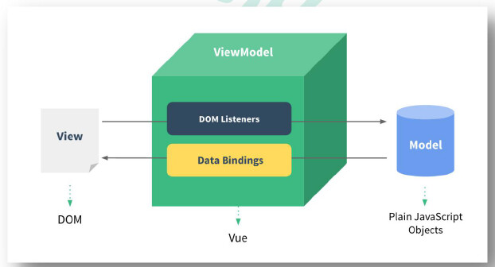
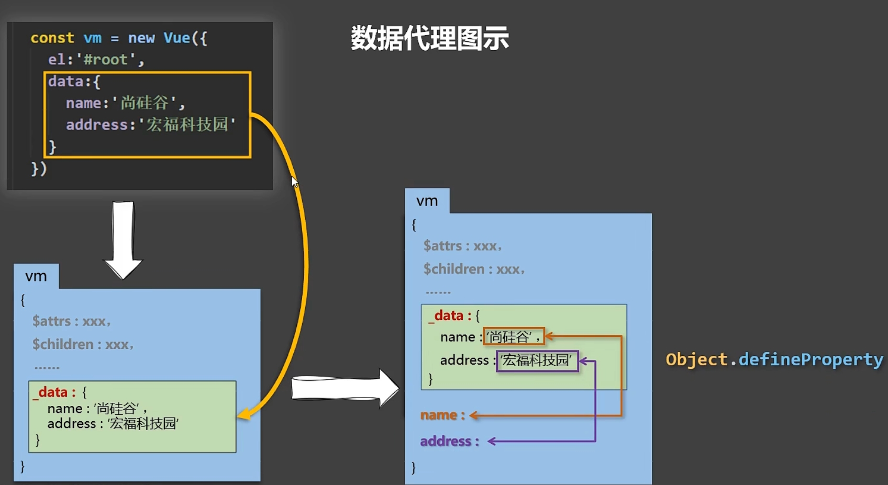
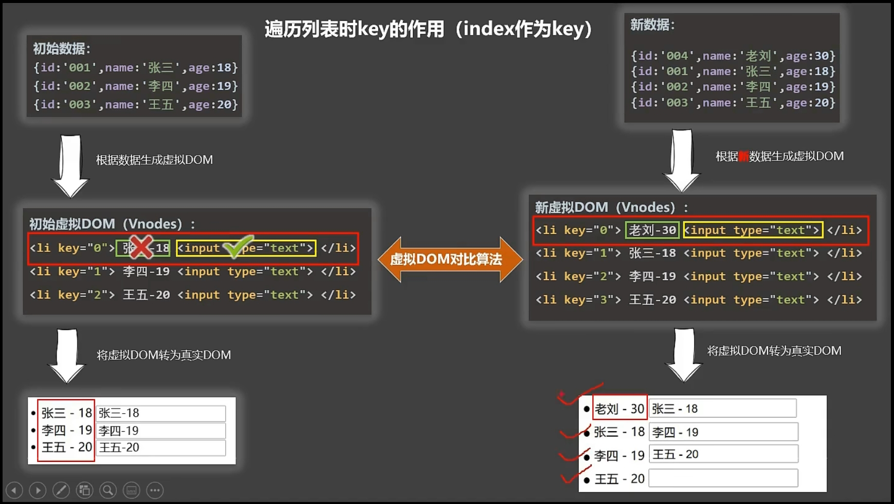
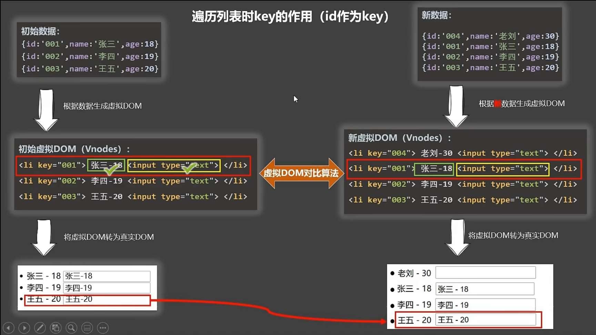
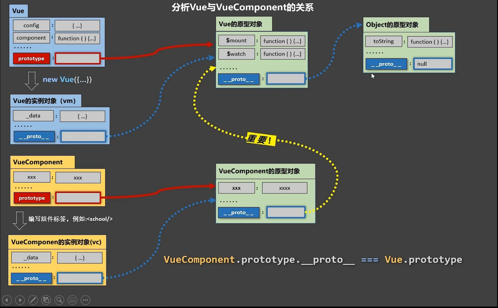

## 初识Vue

```js
初识Vue：
	1.想让Vue工作，就必须创建一个Vue实例，且要传入一个配置对象；
	2.root容器里的代码依然符合html规范，只不过混入了一些特殊的Vue语法；
	3.root容器里的代码被称为【Vue模板】；
	4.Vue实例和容器是一一对应的；
	5.真实开发中只有一个Vue实例，并且会配合着组件一起使用；                       
	6.{{xxx}}中的xxx要写js表达式，且xxx可以自动读取到data中的所有属性；
	7.一旦data中的数据发生改变，那么页面中用到该数据的地方也会自动更新；

	注意区分：js表达式 和 js代码(语句)
		1.表达式：一个表达式会产生一个值，可以放在任何一个需要值的地方：
			(1). a
			(2). a+b
			(3). demo(1)
			(4). x === y ? 'a' : 'b'

		2.js代码(语句)
			(1). if(){}
			(2). for(){}
			
//创建Vue实例
new Vue({
	el: '#demo', //el用于指定当前Vue实例为哪个容器服务，值通常为css选择器字符串。
    data: { //data中用于存储数据，数据供el所指定的容器去使用，值我们暂时先写成一个对象。
    	name: 'atguigu',
        address: '北京'
    }
})

Vue.config.productionTip = false //阻止 vue 在启动时生成生产提示。
```

## Vue模板语法

```js
html 中包含了一些JS 语法代码，语法分为两种，分别为：
	1. 插值语法（双大括号表达式）
	2. 指令（以v-开头）
Vue模板语法有2大类:
	1.插值语法:
		功能: 用于解析标签体内容
       	写法: {{xxx}}，xxx是js表达式，且可以直接读取到data中的所有属性
    2.指令语法:
		功能: 用于解析标签(包括: 标签属性、标签体内容、绑定事件......)
		举例: v-bind:href="xxx" 或 简写为 :href="xxx"，xxx同样要写js表达式，
        		且可以直接读取到data中的所有属性
        备注: Vue中有很多的指令，且形式都是: v-????，此处我们只是拿v-bind举个例子
```

## 数据绑定

```html
Vue中有2种数据绑定的方式:
	1.单向绑定(v-bind): 数据只能从data流向页面
    2.双向绑定(v-model): 数据不仅能从data流向页面，还可以从页面流向data
    备注:
		1.双向绑定一般都应用在表单元素上(如:input、select等)
		2.v-model: value可以简写为 v-model，因为v-model默认收集的就是value值

<!-- 准备好一个容器-->
<div id="root">
	<!-- 普通写法 -->
    <!-- 单向数据绑定：<input type="text" v-bind:value="name"><br/>
		 双向数据绑定：<input type="text" v-model:value="name"><br/> -->

	<!-- 简写 -->
    单向数据绑定：<input type="text" :value="name"><br/> 
    双向数据绑定：<input type="text" v-model="name"><br/>

    <!-- 如下代码是错误的，因为v-model只能应用在表单类元素（输入类元素）上 (自能用在表单上)-->
    <!-- <h2 v-model:x="name">你好啊</h2> -->
</div>
```

## el与data的两种写法

```js
el与data的2种写法
	1.el有2种写法
    	(1).new Vue时候配置el属性
    	(2).先创建Vue实例，随后再通过vm.$mount('#root')指定el的值
    2.data有2种写法
    	(1).对象式
		(2).函数式
		如何选择: 目前哪种写法都可以，以后学习到组件时，data必须使用函数式，否则会报错
	3.一个重要的原则:
		有Vue管理的函数，一定不要写箭头函数，一旦写了箭头函数，this就不再是Vue实例了
        
//el的两种写法
const v = new Vue({
	//el:'#root', //第一种写法
	data:{
		name:'尚硅谷'
	}
})
v.$mount('#root') //第二种写法

//data的两种写法
new Vue({
	el:'#root',
	//data的第一种写法：对象式
	/* data:{
			name:'尚硅谷'
	} */

	//data的第二种写法：函数式
	data(){
		console.log('@@@',this) //此处的this是Vue实例对象
		return{
			name:'尚硅谷'
		}
	}
})
```

## MVVM模型

```js
MVVM模型
	1.M: 模型(Model): data中的数据
    2.V: 视图(View): 模板代码
    3.VM:视图模型(ViewModel): Vue实例
观察发现:
	1.data中所有的属性，最后都出现在了vm身上
    2.vm身上所有的属性及Vue原型上所有属性，在Vue模板中都可以直接使用
```



## 数据代理

### Object.defineproperty方法

```js
let number = 18
let person = {
    name: '张三',
    sex: '男',
}

Object.defineProperty(person, 'age', {
    // value:18,
    // enumerable:true, //控制属性是否可以枚举，默认值是false
    // writable:true, //控制属性是否可以被修改，默认值是false
    // configurable:true //控制属性是否可以被删除，默认值是false

    //当有人读取person的age属性时，get函数(getter)就会被调用，且返回值就是age的值
    get() {
        console.log('有人读取age属性了')
        return number
    },

    //当有人修改person的age属性时，set函数(setter)就会被调用，且会收到修改的具体值
    set(value) {
        console.log('有人修改了age属性，且值是', value)
        number = value
    }

})

// console.log(Object.keys(person))

console.log(person)
```

### Vue中的数据代理

> 数据代理: 通过一个对象代理对另一个对象中属性的操作 (读/写)

```js
let obj = {x:100}
let obj2 = {y:200}

Object.defineProperty(obj2,'x',{
    get(){
        return obj.x
    },
    set(value){
        obj.x = value
    }
})
```

```js
1.Vue中的数据代理:
	通过vm对象来代理data对象中属性的操作 (读/写)
2.Vue中数据代理的好处:
	更加方便的操作data中的数据
3.基本原理:
	通过Object.defineProperty()把data对象中所有属性添加到vm上
    为每一个添加到vm上的属性，都指定一个getter/setter
	在getter/setter内部去操作(读/写)data中对应的属性
```



## 事件处理

### 事件的基本使用

```js
事件的基本使用:
	1.使用v-on:xxx 或 @xxx 绑定事件，其中xxx是事件名;
	2.事件的回调需要配置在methods对象中，最终会在vm上;
	3.methods中配置的函数，不要用箭头函数! 否则this就不是vm了;
	4.methods中配置的函数，都是被Vue所管理的函数，this的指向是 vm 或 组件实例对象;
    5.@click="demo" 和@click="demo($event)" 效果一致，但后者可以传参;
```

### 修饰符

```html
Vue中的事件修饰符:
	1.prevent: 阻止默认事件(常用);
	2.stop: 阻止事件冒泡(常用);
	3.once: 事件只触发一次(常用);
	4.capture: 使用事件的捕获模式;(先捕获再冒泡)
		  ① 冒泡是从里往外冒，捕获是从外往里捕。
		  ② 当捕获存在时，先从外到里的捕获，剩下的从里到外的冒泡输出。
	5.self: 只有event.target是当前操作的元素时才触发事件;
	6.passive: 事件的默认行文立即执行，无需等待时间回调执行完毕;

<!-- 准备好一个容器-->
<div id="root">
    <h2>欢迎来到{{name}}学习</h2>
    <!-- 阻止默认事件（常用） -->
    <a href="http://www.atguigu.com" @click.prevent="showInfo">点我提示信息</a>

    <!-- 阻止事件冒泡（常用） -->
    <div class="demo1" @click="showInfo">
        <button @click.stop="showInfo">点我提示信息</button>
        <!-- 修饰符可以连续写 -->
        <!-- <a href="http://www.atguigu.com" @click.prevent.stop="showInfo">点我提示信息</a> -->
    </div>

    <!-- 事件只触发一次（常用） -->
    <button @click.once="showInfo">点我提示信息</button>

    <!-- 使用事件的捕获模式 -->
    <div class="box1" @click.capture="showMsg(1)">
        div1
        <div class="box2" @click="showMsg(2)">
            div2
        </div>
    </div>

    <!-- 只有event.target是当前操作的元素时才触发事件； -->
    <div class="demo1" @click.self="showInfo">
        <button @click="showInfo">点我提示信息</button>
    </div>

    <!-- 事件的默认行为立即执行，无需等待事件回调执行完毕； -->
    <ul @wheel.passive="demo" class="list">
        <li>1</li>
        <li>2</li>
        <li>3</li>
        <li>4</li>
    </ul>

</div>
```

### 键盘事件

```js
1.Vue中常用的按键别名:
	回车 => enter
	删除 => delete (捕获"删除"和"退格"键)
	退出 => esc
	空格 => space
	换行 => tab (特殊，必须配合keydown去使用)
	上  =>  up
	下  =>  down
	左  =>  left
    右  =>  right
2.Vue未提供别名的按键，可以使用按键原始的key去绑定，但是注意要转为kebab-case (短横线命名)
3.系统修饰符(用法特殊): ctrl、alt、shift、meta
	(1).配合keyup使用: 按下修饰按键的同时，再按下其他键，随后释放其他键，事件才触发
	(2).配合keydown使用: 正常触发事件
4.也可以使用keyCode去指定具体的按键(不推荐)
5.Vue.config.keyCodes.自定义键名 = 键码，可以去定制按键别名
```

## 计算属性

```js
计算属性:
	1.定义: 要用的属性不存在，要通过已有属性计算得来
    2.原理: 底层借助了Object.defineproperty方法提供的getter和setter
	3.get函数什么时候执行?
        (1).初次读取时会执行一次
		(2).当依赖的数据发生改变时会被再次调用
	4.优势: 与methods实现相比，内部有缓存机制(复用)，效率更高，调试方便
    5.备注:
		1.计算属性最终会出现在vm上，直接读取使用即可
        2.如果计算属性要被修改，那必须写set函数去响应修改，且set中要引起计算时依赖的数据发生改变
   
computed:{
    fullName:{
        //get有什么作用？当有人读取fullName时，get就会被调用，且返回值就作为fullName的值
        //get什么时候调用？1.初次读取fullName时。2.所依赖的数据发生变化时。
        get(){
            console.log('get被调用了')
            // console.log(this) //此处的this是vm
            return this.firstName + '-' + this.lastName
        },
        //set什么时候调用? 当fullName被修改时。
        set(value){
        	console.log('set',value)
            const arr = value.split('-')
            this.firstName = arr[0]
            this.lastName = arr[1]
        }
    }
}

//完整写法
/* fullName:{
	get(){
		console.log('get被调用了')
		return this.firstName + '-' + this.lastName
	},
	set(value){
		console.log('set',value)
		const arr = value.split('-')
		this.firstName = arr[0]
		this.lastName = arr[1]
	}
} */
//简写
//注意:如果计算属性要被修改，那必须写set函数去响应修改，且必须使用完整写法
fullName(){
    console.log('get被调用了')
    return this.firstName + '-' + this.lastName
}
```

## 监视属性

```js
监视属性watch:
	1.当被监视的属性变化时，回调函数自动调用，进行相关操作
    2.监视的属性必须存在，才能进行监视!!
    3.监视的两种写法:
		(1).new Vue时传入watch配置
        (2).通过vm.$watch监视

//第一种写法
watch:{
    isHot:{
        immediate:true, //初始化时让handler调用一下
        //handler什么时候调用？当isHot发生改变时。
        handler(newValue,oldValue){
        console.log('isHot被修改了',newValue,oldValue)
    }
}

//第二种写法
vm.$watch('isHot',{
	immediate:true, //初始化时让handler调用一下
    //handler什么时候调用？当isHot发生改变时。
    handler(newValue,oldValue){
    	console.log('isHot被修改了',newValue,oldValue)
    }
})
```

```js
深度监视:
	(1).Vue中的watch默认不监测对象内部值的改变(一层)
	(2).配置deep:true可以监测对象内部值改变(多层)
备注:
	(1).Vue自身可以监测对象内部值的改变，但Vue提供的watch默认不可以!
    (2).使用watch时根据数据的具体结构，决定是否采用深度监视

watch:{
    //正常写法
    /* isHot:{
		// immediate:true, //初始化时让handler调用一下
		// deep:true,//深度监视
		handler(newValue,oldValue){
			console.log('isHot被修改了',newValue,oldValue)
		}
	}, */
    //简写
    /* isHot(newValue,oldValue){
		console.log('isHot被修改了',newValue,oldValue,this)
	} */
}
```

### computed和watch之间的区别

```js
computed和watch之间的区别:
	1.computed能完成的功能，watch都可以完成
    2.watch能完成的功能，computed不一定能完成，例如: watch可以进行异步操作
两个重要的小原则:
	1.所被Vue管理的函数，最好写成普通函数，这样this的指向才是 vm 或 组件实例对象
    2.所有不被Vue所管理的函数(定时器的回调函数、ajax的回调函数、Promise的回调函数)，最好写成箭头函数，这样的this的指向才是 vm 或 组件实例对象
```

## 绑定样式

```html
绑定样式:
	1.class样式
    	写法 :class="xxx"	xxx可以是字符串、对象、数组
        	字符串写法适用于: 类名不确定，要动态获取
            对象写法适用于: 要绑定多个样式，个数不确定，名字也不确定
            数组写法适用于: 要绑定多个样式，个数确定，名字也确定，但不确定用不用
	2.style样式
    	:style="{fontSize: xxx}" 其中xxx是动态值
        :style="[a,b]" 其中a、b是样式对象
        
<!-- 准备好一个容器-->
<div id="root">
    <!-- 绑定class样式--字符串写法，适用于：样式的类名不确定，需要动态指定 -->
    <div class="basic" :class="mood" @click="changeMood">{{name}}</div> <br/><br/>

    <!-- 绑定class样式--数组写法，适用于：要绑定的样式个数不确定、名字也不确定 -->
    <div class="basic" :class="classArr">{{name}}</div> <br/><br/>

    <!-- 绑定class样式--对象写法，适用于：要绑定的样式个数确定、名字也确定，但要动态决定用不用 -->
    <div class="basic" :class="classObj">{{name}}</div> <br/><br/>

    <!-- 绑定style样式--对象写法 -->
    <div class="basic" :style="styleObj">{{name}}</div> <br/><br/>
    <!-- 绑定style样式--数组写法 -->
    <div class="basic" :style="styleArr">{{name}}</div>
</div>
<script type="text/javascript">
    Vue.config.productionTip = false

    const vm = new Vue({
        el: '#root',
        data: {
            name: '尚硅谷',
            mood: 'normal',
            classArr: ['atguigu1', 'atguigu2', 'atguigu3'],
            classObj: {
                atguigu1: false,
                atguigu2: false,
            },
            styleObj: {
                fontSize: '40px',
                color: 'red',
            },
            styleObj2: {
                backgroundColor: 'orange'
            },
            styleArr: [{
                fontSize: '40px',
                color: 'blue',
            }, {
                backgroundColor: 'gray'
            }]
        },
        methods: {
            changeMood() {
                const arr = ['happy', 'sad', 'normal']
                const index = Math.floor(Math.random() * 3)
                this.mood = arr[index]
            }
        },
    })
</script>
```

## 条件渲染

```js
条件渲染:
	1.v-if
    	写法:
			(1).v-if="表达式"
			(2).v-else-if="表达式"
			(3).v-else="表达式"
		适用于: 切换频率较低的场景
        特点: 不展示的Dom元素直接被移除
        注意: v-if可以和v-else-if、v-else一起使用，但要求结构不能被"打断"
	2.v-show
		写法: v-show="表达式"
		适用于: 切换频率较高的场景
        特点: 不展示的DOM元素未被移除，仅仅是使用样式隐藏掉
    3.备注: 使用v-if的时候，元素可能无法获取到，而使用v-show一定可以获取到
```

## 列表渲染

### 基本列表

```js
v-for指令:
	1.用于展示列表数据
    2.语法: v-for="(item,index) in xxx" :key="yyy"
	3.可遍历: 数组、对象、字符串(用的很少)、指定次数(用的很少)
	注意:在v-for中in与of在使用中没有区别，都可以遍历数组和对象，在遍历数组时，key与index的值相同，一般会略去key只写（item，index）;
```

### key的原理

```js
面试题: react、vue中的key有什么作用? (key的内部原理)
	1.虚拟DOM中key的作用:
		key是虚拟DOM对象的标识，当数据发生变化时，vue会根据[新数据]生成[新的虚拟DOM]，
        随后Vue进行[新虚拟DOM]与[旧虚拟DOM]的差异比较，比较规则如下:
	2.对比规则:
		(1).旧虚拟DOM中找到了与新虚拟DOM相同的key:
        	①.若虚拟DOM中内容没变，直接使用之前的真实DOM!
            ②.若虚拟DOM中内容变了，则生成新的真实DOM，随后替换掉页面中之前的真实DOM
		(2).旧虚拟DOM中未找到与新虚拟DOM相同的key
			创建新的真实DOM，随后渲染到页面
	3.用index作为key可能引发的问题:
		(1).若对数据进行: 逆序添加、逆序删除等破坏顺序操作:
							会产生没有必要的真实DOM更新 ===> 界面效果没问题，但效率低
		(2).如果结构中还包含输入类的DOM:
                            会产生错误DOM更新 ===> 界面有问题
	4.开发中如何选择key?
        (1).最好使用每条数据的唯一标识作为key，比如id、手机号码、身份证号、学号等唯一值
		(2).如果不存在对数据的逆序添加、逆序删除等破坏顺序操作，仅用于渲染列表用于展示，
			使用index作为key是没有问题的
```





### 列表过滤

```js
//用watch实现
new Vue({
    el:'#root',
    data:{
        keyWord:'',
        persons:[
            {id:'001',name:'马冬梅',age:19,sex:'女'},
            {id:'002',name:'周冬雨',age:20,sex:'女'},
            {id:'003',name:'周杰伦',age:21,sex:'男'},
            {id:'004',name:'温兆伦',age:22,sex:'男'}
        ],
        filPerons:[]
    },
    watch:{
        keyWord:{
            immediate:true,
            handler(val){
                this.filPerons = this.persons.filter((p)=>{
                    return p.name.indexOf(val) !== -1
                })
            }
        }
    }
}) 

//用computed实现
new Vue({
    el:'#root',
    data:{
        keyWord:'',
        persons:[
            {id:'001',name:'马冬梅',age:19,sex:'女'},
            {id:'002',name:'周冬雨',age:20,sex:'女'},
            {id:'003',name:'周杰伦',age:21,sex:'男'},
            {id:'004',name:'温兆伦',age:22,sex:'男'}
        ]
    },
    computed:{
        filPerons(){
            return this.persons.filter((p)=>{
                return p.name.indexOf(this.keyWord) !== -1
            })
        }
    }
}) 
```

### Vue监视数据的原理

```js
Vue监视数据的原理:
	1.vue会监视data中所有层次的数据
    2.如何监测对象中的数据?
        通过setter实现监视，且要在new Vue时就要传入要监测的数据
    		(1).对象中后追加的属性，Vue默认不做响应式处理
            (2).如需给后添加的属性做响应式，请使用如下API:
            	Vue.set(target, propertyName/index, value) 或
                vm.$set(target, propertyName/index，value)
	3.如何监测数组中的数据?
        通过包裹数组更新元素的方法实现，本质就是做了两件事:
			(1).调用原生对应的方法对数组进行更新
			(2).重新解析模板，进而更新页面
	4.在Vue修改数组中的某个元素一定要用如下方法:
		(1).使用这些API:push()、pop()、shift()、unshift()、splice()、sort()、reverse()
		(2).Vue.set() 或 vm.$set()
	特别注意: Vue.set() 和 vm.$set() 不能给 vm 或 vm的根数据对象 添加属性!!!
```

## 收集表单数据

```html
收集表单数据:
	若: <input type="text"/>，则v-model收集的是value的值，用户输入的就是value值
	若: <input type="radio"/>，则v-model收集的是value值，且要给标签配置value值
	若: <input type="checkbox"/>
        1.没有配置input的value属性，那么收集的就是checked (勾选 or 未勾选，是布尔值)
		2.配置input的value属性:
			(1).v-model的初始值是非数组，那么收集的就是checked (勾选 or 未勾选，是布尔值)
			(2).v-model的初始值是数组，那么收集的就是value组成的数组
	备注: v-model的三个修饰符
			lazy: 失去焦点再收集数据
            number: 输入字符串转为有效的数字
            trim: 输入首位空格过滤

<!-- 准备好一个容器-->
<div id="root">
    <form @submit.prevent="demo">
        账号：<input type="text" v-model.trim="userInfo.account"> <br/><br/>
        密码：<input type="password" v-model="userInfo.password"> <br/><br/>
        年龄：<input type="number" v-model.number="userInfo.age"> <br/><br/>
        性别：
        男<input type="radio" name="sex" v-model="userInfo.sex" value="male">
        女<input type="radio" name="sex" v-model="userInfo.sex" value="female"> <br/><br/>
        爱好：
        学习<input type="checkbox" v-model="userInfo.hobby" value="study">
        打游戏<input type="checkbox" v-model="userInfo.hobby" value="game">
        吃饭<input type="checkbox" v-model="userInfo.hobby" value="eat">
        <br/><br/>
        所属校区
        <select v-model="userInfo.city">
            <option value="">请选择校区</option>
            <option value="beijing">北京</option>
            <option value="shanghai">上海</option>
            <option value="shenzhen">深圳</option>
            <option value="wuhan">武汉</option>
        </select>
        <br/><br/>
        其他信息：
        <textarea v-model.lazy="userInfo.other"></textarea> <br/><br/>
        <input type="checkbox" v-model="userInfo.agree">阅读并接受<a href="http://www.atguigu.com">《用户协议》</a>
        <button>提交</button>
    </form>
</div>
</body>

<script type="text/javascript">
    Vue.config.productionTip = false

    new Vue({
        el:'#root',
        data:{
            userInfo:{
                account:'',
                password:'',
                age:18,
                sex:'female',
                hobby:[],
                city:'beijing',
                other:'',
                agree:''
            }
        },
        methods: {
            demo(){
                console.log(JSON.stringify(this.userInfo))
            }
        }
    })
</script>
```

过滤器

```js
过滤器:
	定义: 对要显示的数据进行特定格式化后再显示 (适用于一些简单逻辑的处理)
	语法:
		1.注册过滤器: Vue.filter(name,callback) 或 new Vue({filters:{}})
		2.使用过滤器: {{ xxx | 过滤器名}} 或 v-bind:属性= "xxx | 过滤器名"
	备注:
		1.过滤器也可以接收额外参数、多个过滤器也可以串联
        2.并没有改变原本的数据，是产生新的对应的数据
        
//全局过滤器
Vue.filter('mySlice',function(value){
	return value.slice(0,4)
})

//局部过滤器
filters:{
    timeFormater(value,str='YYYY年MM月DD日 HH:mm:ss'){
        // console.log('@',value)
        return dayjs(value).format(str)
    }
}
```

## 内置指令

### v-text

```js
我们学过的指令:
	v-bind : 单向绑定解析表达式, 可简写为 :xxx
    v-model : 双向数据绑定
    v-for : 遍历数组/对象/字符串
	v-on : 绑定事件监听, 可简写为 @
    v-if : 条件渲染 (动态控制节点是否存在)
	v-else : 条件渲染 (动态控制节点是否存在)
	v-show : 条件渲染 (动态控制节点是否展示)
v-text指令:
	1.作用: 向其所在的节点中渲染文本内容
    2.与插值语法的区别: v-text会替换掉节点中的内容，{{xxx}}则不会
```

### v-html

```js
v-html指令: 
	1.作用: 向指定节点中渲染包含html结构的内容
    2.与插值语法的区别:
		(1).v-html会替换掉节点中所有的内容，{{xxx}}则不会
        (2).v-html可以识别html结构
	3.严重注意: v-html有安全性问题!!!
        (1).在网站上动态渲染任意HTML是非常危险的，容易导致XSS攻击
		(2).一定要在可信的内容上使用v-html，永远不要用在用户提交的内容上!
```

### v-cloak

```js
v-cloak指令 (没有值):
	1.本质上是一个特殊属性，Vue实例创建完毕并接管容器后，会删掉v-cloak属性
	2.使用css配合v-cloak可以解决网速慢时页面展示出{{xxx}}的问题
```

### v-once

```js
v-once指令:
	1.v-once所在节点在初始动态渲染后，就视为静态内容了
	2.以后数据的改变不会引起v-once所在结构的更新，可以用于优化性能
```

### v-pre

```js
v-pre指令:
	1.跳过其所在节点的编译过程
    2.可利用它跳过: 没有使用指令语法、没有使用插值语法的节点，会加快编译
```

## 自定义指令

```html
自定义指令总结:
	一、定义语法:
		(1).局部指令:
        	new Vue({								new Vue({
                directives:{指令名:配置对象}	或			directives:{指令名:回调函数}	
			})										})
		(2).全局指令:
        	Vue.directive(指令名,配置对象) 或 Vue.directive(指令名,回调函数)
	二、配置对象中常用的3个回调:
		(1).bind: 指令与元素成功绑定时调用
        (2).inserted: 指令所在元素被插入页面时调用
        (3).updata: 指令所在模板结构被重新解析时调用
	三、备注:
		1.指令定义时不加v-，但使用时要加v-
        2.指令名如果是多个单词，要使用kebab-case命名方式，不要用camelCase命名

<div id="root">
    <h2>{{name}}</h2>
    <h2>当前的n值是：<span v-text="n"></span> </h2>
    <!-- <h2>放大10倍后的n值是：<span v-big-number="n"></span> </h2> -->
    <h2>放大10倍后的n值是：<span v-big="n"></span> </h2>
    <button @click="n++">点我n+1</button>
    <hr/>
    <input type="text" v-fbind:value="n">
</div>
<script type="text/javascript">
    Vue.config.productionTip = false

    //定义全局指令
    /* Vue.directive('fbind',{
    	//指令与元素成功绑定时（一上来）
    	bind(element,binding){
    		element.value = binding.value
    	},
    	//指令所在元素被插入页面时
    	inserted(element,binding){
    		element.focus()
    	},
    	//指令所在的模板被重新解析时
    	update(element,binding){
    		element.value = binding.value
    	}
    }) */

    new Vue({
        el: '#root',
        data: {
            name: '尚硅谷',
            n: 1
        },
        directives: {
            //big函数何时会被调用？1.指令与元素成功绑定时（一上来）。2.指令所在的模板被重新解析时。
            /* 'big-number'(element,binding){
            	// console.log('big')
            	element.innerText = binding.value * 10
            }, */
            big(element, binding) {
                console.log('big', this) //注意此处的this是window
                // console.log('big')
                element.innerText = binding.value * 10
            },
            fbind: {
                //指令与元素成功绑定时（一上来）
                bind(element, binding) {
                    element.value = binding.value
                },
                //指令所在元素被插入页面时
                inserted(element, binding) {
                    element.focus()
                },
                //指令所在的模板被重新解析时
                update(element, binding) {
                    element.value = binding.value
                }
            }
        }
    })
</script>
```

## 生命周期
```js
生命周期:
	1.又名: 生命周期回调函数、生命周期函数、生命周期钩子
    2.是什么: Vue在关键时刻帮我们调用的一些特殊名称的函数
    3.生命周期函数的名字不可更改，但函数的具体内容是程序员根据需求编写的
    4.生命周期函数中this指向是vm 或 组件实例对象
```

```js
//Vue完成模板的解析并把初始的真实DOM元素放入页面后（挂载完毕）调用mounted
mounted(){
    console.log('mounted',this)
    setInterval(() => {
        this.opacity -= 0.01
        if(this.opacity <= 0) this.opacity = 1
    },16)
}
```

```js
常用的生命周期钩子:
	1.mounted: 发送ajax请求、启动定时器、绑定自定义事件、订阅消息等[初始化工作]
	2.beforeDestroy: 清楚定时器、解绑自定义事件、取消订阅消息等[收尾工作]
关于销毁Vue实例:
	1.销毁后借助Vue开发者工具看不到任何信息
    2.销毁后自定义事件会失效，但原生DOM事件依然有效
    3.一般不会再beforeDestroy操作数据，因为即便操作数据，也不会再触发更新流程了 
```

## 非单文件组件

```html
Vue中使用组件的三大步骤:
	一、定义组件(创建组件)
	二、注册组件
    三、使用组件(写组件标签)

一、如何定义一个组件?
    使用Vue.extend(options)创建，其中options和new Vue(options)时传入的那个options几乎一样，但也有点区别:
	区别如下:
		1.el 不要写，为什么? --- 最终所有的组件都要经过一个vm管理，由vm中的el决定服务哪个容器
		2.data必须写成函数，为什么? --- 避免组件被复用时，数据存在引用关系
	备注:使用template可以配置组件结构

二、如何注册组件?
    1.局部注册: 靠new Vue的时候传入components选项
    2.全局注册: 靠Vue.component('组件名',组件)
三、编写组件标签:
	<school></school>

```

```html
几个注意的点:
	1.关于组件名:
		一个单词组成:
			第一种写法(首字母小写): school
            第二种写法(首字母大写): School
    	多个单词组成:
			第一种写法(kebab-case命名): my-school
			第二种写法(CamelCase命名): MySchool (需要脚手架支持)
		备注:
			(1).组件名尽可能回避HTML中已有的元素名称，例如: h2、H2都不行
            (2).可以使用name配置项指定组件在开发者工具中呈现的名字
	2.关于组件标签:
		第一种写法: <school></school>
		第二种写法: <school/>
		备注: 不使用脚手架时，<school/>会导致后续组价不能渲染
	3.一个简写方式:
		const school = Vue.extend(options) 可简写为: const school = options
```

### Component

```html
关于Vue Component:
	1.school组件本质是一个名为VueComponent的构造函数，且不是程序员定义的，是Vue.extend生成的
	2.我们只需要写<school/>或<school></school>，Vue解析时会帮我们创建school组件的实例对象，
		即Vue帮我们执行的: new VueComponent(options)
	3.特别注意: 每次调用Vue.extend，返回的都是一个全新的VueComponent !!!!
	4.关于this指向:
		(1).组件配置中:
			data函数、methods中的函数、watch中的函数、computed中的函数 它们的this均是
			[VueComponent实例对象]
		(2).new Vue(options)配置中:
			data函数、methods中的函数、watch中的函数、computed中的函数 它们的this均是
			[Vue实例对象]
	5.VueComponent的实例对象，以后简称vc (也可称之为: 组件实例对象)
```

### 内置关系

```js
1.一个重要的内置关系: VueComponent.prototype.__proto__ === Vue.prototype
2.为什么要有这个关系: 让组件实例对象(vc)可以访问到Vue原型上的属性、方法

prototype 与__proto__ 的关系就是：你的__proto__来自你构造函数的prototype
```




