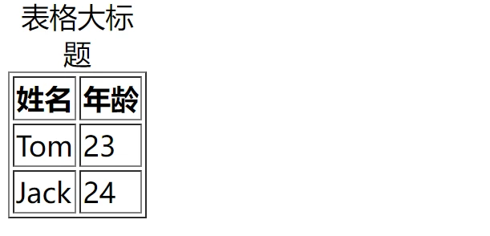
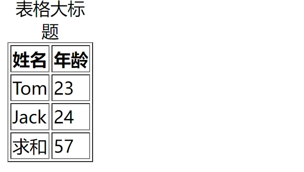
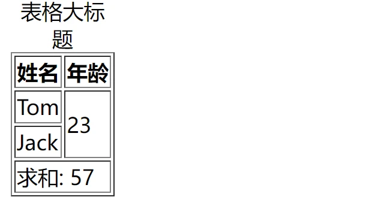
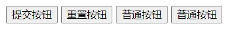
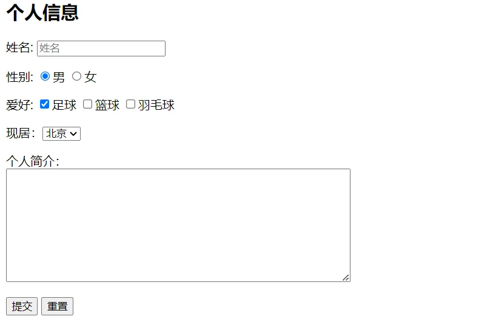

# HTML 基本认知

## 常见 5 大浏览器

- IE
- 火狐 FireFox
- 谷歌 Chrome
- Safari
- 欧朋 Opera

## 渲染引擎

| 浏览器       | 内核    |
| ------------ | ------- |
| IE           | Trident |
| FireFox      | Gecko   |
| Safari       | Webkit  |
| Chrome/Opera | Blink   |

## Web 标准

保证不同浏览器打开页面显示效果一样

| 构成 | 语言       | 说明                                                         |
| ---- | ---------- | ------------------------------------------------------------ |
| 结构 | HTML       | <span style="color:red">页面元素</span>和内容                |
| 表现 | CSS        | 网页元素的外观和位置等<span style="color:red">页面样式</span>(如: 颜色、大小等) |
| 行为 | JavaScript | 网页模型的定义与<span style="color:red">页面交互</span>      |

## HTML

Hyper Text Markup Language 超文本标记语言

## hello world

需要设置显示`文件扩展名`

文件扩展名：`.html`

index.html

```html
<strong>hello world</strong>
```

**hello world**

## HTML 骨架

```html
<html>
  <head>
    <title>网页的标签</title>
  </head>  
  <body>
    网页的主体
  </body>
</html>
```

- html 最外层标签
- head 头部
- title 标题
- body 主体

## 开发工具

- Visual Studio Code （首选）
- WebStorm
- Sublime Text
- DreamWeaver
- HBuilder

## VS Code 使用

快速生成 html 网页结构：

- `! + Tab` 多了一行代码`<!DOCTYPE html>`
- `doc + Tab`

快捷键

- 浏览器打开：`Alt + B` 
- ÏLive Server 打开：`[ctrl + L, ctrl + O]`

## 注释

```html
<!-- 注释内容 -->
```

- 浏览器中不显示注释内容
- 添加和取消注释快捷键：`ctrl+ /`

## 标签结构

- 双标签 `<开始标签>内容</结束标签>`, 例如：`<strong>内容</strong>`
- 单标签 `<标签 />`, 例如：`<br>`

## 标签关系

- 父子关系（嵌套关系）

```html
<html>
  <head></head>
</html> 
```

- 兄弟关系（并列关系）

```html
<head></head>
<body></body>
```


# HTML 标签元素

## 标题标签 Heading

```html
h1~h6
<h1>一级标题</h1>
<h2>二级标题</h2>
<h3>三级标题</h3>
<h4>四级标题</h4>
<h5>五级标题</h5>
<h6>六级标题</h6> 
```

一级标题二级标题三级标题四级标题五级标题六级标题

同时选中下一个相同字符：`ctrl+ D`

特点：

- 独占一行
- 文字加粗
- 文字变大，h1->h6 文字逐渐变小

## 段落标签 Paragraph

```html
<p>内容</p> 
```

内容

特点：

- 段落之间存在间隙
- 独占一行

## 排版标签

（1）换行符 Line Break

```html
第一行文本<br />第二行文本 
```

第一行文本
第二行文本

特点

- 单标签
- 让文字强制换行

（1）水平分割线 Horizontal Rule

```html
<hr /> 
```


## 文本格式化标签

推荐使用后者

- b/strong 加粗
- u/ins 下划线
- i/em 倾斜
- s/del 删除线

```html
<b>加粗</b>
<strong>加粗</strong>

<u>下划线</u>
<ins>下划线</ins>

<i>倾斜</i>
<em>倾斜</em>

<s>删除线</s>
<del>删除线</del> 
```

**加粗** **加粗**

<u>下划线</u>  <ins>下划线</ins>

*倾斜* *倾斜*

<s>删除线</s>  <del>删除线</del> 

## 媒体标签

（1）图片标签 Image

```html
 
```

标签属性：属性名=属性值

注: 

- width 和 height 属性只需要给出一个值，另一个等比例缩放---好处就是图片不变形

## 资源路径

（1）当前路径

```html


<!-- 推荐使用./ -->
 
```

（2）下级路径

```html
 
```

（3）上级路径

```html
 
```

## 音频标签

```html
<audio
  src="音频地址"
  controls 显示播放控件
  autoplay 自动播放（部分浏览器不支持）
  loop 循环播放
</audio> 
```

支持的格式 Mp3 Wav Ogg

## 视频标签

```html
<video src="视频地址"
  controls 显示播放控件
  autoplay 自动播放（谷歌浏览器需要配合muted静音播放）
  muted 静音播放
  loop 循环播放
</video> 
```

支持的格式 Mp4 WebM Ogg

## 链接标签 Anchor

```html
<!-- href: 跳转地址 -->
<a href="目标地址">文字内容</a>

<!-- eg: -->
<a href="https://www.baidu.com/">百度</a> 
<!-- 当开发网站初期，我们还不知道跳转地址的时候，href的值书写#(空链接) -->
```

[百度](https://www.baidu.com/)

属性：

- target: _self 当前窗口打开（默认） / _blank 新窗口打开

Tips: chrome 地址栏双击可以看到完整地址

网站的默认首页 index.html

## 列表

- 无序列表
- 有序列表
- 自定义列表

（1）无序列表 Unordered List

| 标签名 |                    说明                    |
| :----: | :----------------------------------------: |
|   ul   |     表示无序列表的整体，用于包裹li标签     |
|   li   | 表示无序列表的每一项，用于包含每一行的内容 |

列表项 List Item

```html
<ul>
  <li>苹果</li>
  <li>香蕉</li>
  <li>桃子</li>
</ul> 
```

<ul><li>苹果</li><li>香蕉</li><li>桃子</li></ul>

（2）有序列表 Ordered List

| 标签名 |                    说明                    |
| :----: | :----------------------------------------: |
|   ol   |     表示有序列表的整体，用于包裹li标签     |
|   li   | 表示无序列表的每一项，用于包含每一行的内容 |

```html
<ol>
  <li>苹果</li>
  <li>香蕉</li>
  <li>桃子</li>
</ol> 
```

<ol>
  <li>苹果</li>
  <li>香蕉</li>
  <li>桃子</li>
</ol>

（3）自定义列表 Description List

| 标签名 |                  说明                   |
| :----: | :-------------------------------------: |
|   dl   | 表示自定义列表的整体，用于包裹dt/dd标签 |
|   dt   |          表示自定义列表的主题           |
|   dd   |  表示自定义列表的针对主题的每一项内容   |

```html
<dl>
  <dt>水果</dt>
  <dd>苹果</dd>
  <dd>香蕉</dd>
  <dd>桃子</dd>
</dl> 
```

<dl>
  <dt>水果</dt>
  <dd>苹果</dd>
  <dd>香蕉</dd>
  <dd>桃子</dd>
</dl>

标签含义

- dt Description Term
- dd Description Details

显示特点:

- dd前会默认显示缩进效果

注意点:

- dl标签中只允许包含dt/dd标签
- dt/dd标签可以包含任意内容

## 表格

（1）基本元素

| 标签名 |            说明            |
| :----: | :------------------------: |
| table  | 表格整体，可用于包裹多个tr |
|   tr   |   表格每行，可用于包裹td   |
|   td   | 表格单元格，可用于包裹内容 |

标签含义

- caption 表格大标题  书写在table标签内部

- tr Table Row
- th Table Header   th标签书写在tr标签内部 (用于替换td标签)
- td Table Data

table 属性：

- border 边框宽度
- width 表格宽度
- height 表格高度

```html
<table border="1">
    <caption>
        表格大标题
    </caption>
    
    <tr>
        <th>姓名</th>
        <th>年龄</th>
    </tr>
    <tr>
        <td>Tom</td>
        <td>23</td>
    </tr>
    <tr>
        <td>Jack</td>
        <td>24</td>
    </tr>
</table> 
```



（2）表格结构，可以省略

- thead 表格头部
- tbody 表格主体
- tfoot 表格底部

```html
<table border="1">
    <caption>
        表格大标题
    </caption>

    <thead>
        <tr>
            <th>姓名</th>
            <th>年龄</th>
        </tr>
    </thead>

    <tbody>
        <tr>
            <td>Tom</td>
            <td>23</td>
        </tr>
        <tr>
            <td>Jack</td>
            <td>24</td>
        </tr>
    </tbody>
    
    <tfoot>
        <tr>
            <td>求和</td>
            <td>57</td>
        </tr>
    </tfoot>
</table> 
```



（3）合并单元格

- 跨行合并（垂直）rowspan
- 跨列合并（水平）colspan

**左上原则**

- 上下合并，保留最上，删除其他
- 左右合并，保留最左，删除其他

> Tips: 不能跨结构合并

```html
<table border="1">
    <caption>
        表格大标题
    </caption>

    <thead>
        <tr>
            <th>姓名</th>
            <th>年龄</th>
        </tr>
    </thead>
    
    <tbody>
        <tr>
            <td>Tom</td>
            <td rowspan="2">23</td>
        </tr>
        <tr>
            <td>Jack</td>
        </tr>
    </tbody>

    <tfoot>
        <tr>
            <td colspan="2">求和: 57</td>
        </tr>
    </tfoot>
</table> 
```



## 表单

输入框 input

| type 属性 | 输入框类型 |                   说明                   |
| --------- | ---------- | :--------------------------------------: |
| text      | 文本框     |         文本框，用于输入单行文本         |
| password  | 密码框     |           密码框，用于输入密码           |
| radio     | 单选框     |            单选框，用于多选一            |
| checkbox  | 多选框     |            多选框，用于多选多            |
| file      | 文件选择   |          文件选择，用于上传文件          |
| submit    | 提交按钮   |            提交按钮，用于提交            |
| reset     | 重置按钮   |            重置按钮，用于重置            |
| button    | 普通按钮   | 普通按钮，默认无功能，之后配合js添加功能 |

（1）text 文本框

placeholder 占位符，提示用户输入内容的文本

```html
<input type="text" placeholder="文本框占位符" /> 
```


（2）password 密码框

placeholder 占位符

```html
<input type="password" placeholder="密码框占位符" /> 
```


（3）radio 单选框

name 属性分组，一个分组只能有一个值被选中

checked 默认选中

```html
<input type="radio" name="sex" value="1" />男
<input type="radio" name="sex" value="2" checked />女 
```

男 女

（4）checkbox 多选框

checked 默认选中

```html
<input type="checkbox" name="city" value="beijing" />北京
<input type="checkbox" name="city" value="shanghai" checked />上海 
```

北京 上海

（5）file 文件选择

multiple 多选(按住 ctrl 多选)

```html
<input type="file" /> <input type="file" multiple /> 
```

 

（6）按钮

- submit 提交按钮
- reset 重置按钮
- button 普通按钮

需要配合 form 表单域使用

属性 value 修改按钮显示的值

```html
<input type="submit" value="xxx"/>
<input type="reset" value="xxx"/>
<input type="button" value="普通按钮" /> 
```

 

### button 按钮标签

type 取值

- submit 提交按钮
- reset 重置按钮
- button 普通按钮(默认)

```html
<button type="submit">提交按钮</button>
<button type="reset">重置按钮</button>
<button type="button">普通按钮</button>
<button>普通按钮</button> 
```



### select 下拉菜单

```html
<select>
  <option>北京</option>
  <option>上海</option>
  <option selected>广州</option>
  <select></select>
</select> 
```

<select>
  <option>北京</option>
  <option>上海</option>
  <option selected>广州</option>
  <select></select>
</select> 

option 选项

默认选中第一项，可以指定默认选中 selected

### textarea 多行文本域

属性

- cols 宽度 列数
- rows 高度 行数

```html
<textarea></textarea> 
```


### label 标签

点击文字也可选中选项

两种使用方式等效

```html
<input type="radio" name="sex" id="man" />
<label for="man">男</label>

<label><input type="radio" name="sex" />女</label> 
```

 男 女

### 无语义标签

- div 块级标签，独占一行
- span 行内标签

### 语义化标签

手机端常用

- header 网页头部
- nav 网页导航
- footer 网页底部
- aside 网页侧边栏
- section 网页区块
- article 网页文章

以上标签和 div 等效，多了语义化

### 字符实体

在网页中显示特殊字符

- 空格 ` `
- 版权符 `©`

```html
<!-- 单词之间有5个空格，最后只显示一个空格 -->
hello world

<!-- 实现单词之间有5个空格 -->
hello&nbsp;&nbsp;&nbsp;&nbsp;&nbsp;world

<!-- 版权符号 -->
&copy; 
```

hello world

hello   world

©

### 综合案例

```html
<!DOCTYPE html>
<html lang="en">

<head>
<meta charset="UTF-8">
<meta http-equiv="X-UA-Compatible"
      content="IE=edge">
<meta name="viewport"
      content="width=device-width, initial-scale=1.0">
<title>Form Demo</title>
</head>

<body>
<h2>个人信息</h2>
<form action="">
    <p>姓名:
        <input type="text"
               placeholder="姓名">
    </p>
    <p>性别:
        <label><input type="radio"
                   name="sex"
                   checked>男</label>
        <label><input type="radio"
                   name="sex">女</label>
    </p>
    <p>爱好:
        <label><input type="checkbox"
                   checked>足球</label>
        <label><input type="checkbox">篮球</label>
        <label><input type="checkbox">羽毛球</label>
    </p>

    <p>现居：<select>
            <option value="">北京</option>
            <option value="">上海</option>
            <option value="">广州</option>
            <option value="">深圳</option>
        </select>
    </p>

    <p>个人简介：
        <br />
        <textarea cols="60"
                  rows="10"></textarea>
    </p>

    <input type="submit"
           value="提交">
    <button type="reset">重置</button>
</form>
</body>

</html> 
```


