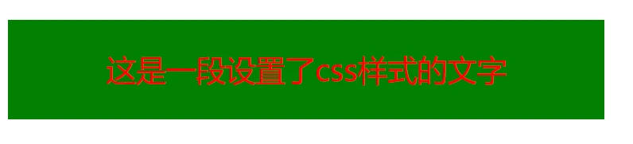

# CSS 层叠样式表

Cascading style sheets

## 语法规则

```css
选择器 {
    属性名: 属性值
} 
```

## 书写位置

```html
<head>
    <title></title>

    <style>
        /* 这里写css */
    </style>
<head> 
```

## CSS 引入方式

| 引入方式 | 书写位置                   | 作用范围 | 使用场景     |
| -------- | -------------------------- | -------- | ------------ |
| 内嵌式   | style 标签                 | 当前页面 | 小案例       |
| 外链式   | link 标签引入单独 css 文件 | 多个页面 | 项目中       |
| 行内式   | 标签 style 属性中          | 当前标签 | 配合 js 使用 |

（1）内嵌式

- CSS 写在 style 标签中
- style 标签可以写在页面任意位置，一般放在 `head` 标签中

```html
<!DOCTYPE html>
<html lang="en">

<head>
    <meta charset="UTF-8">
    <meta http-equiv="X-UA-Compatible"
          content="IE=edge">
    <meta name="viewport"
          content="width=device-width, initial-scale=1.0">
    <title>Document</title>

    <style>
        p {
            /* 这里是注释，快捷键ctrl + /  */
            /* 文字颜色设置为红色 */
            color: red;

            /* 字体大小设置为30像素 */
            font-size: 30px;

            /* 背景颜色 */
            background-color: green;

            /* 设置宽度和高度 */
            width: 600px;
            height: 100px;
            line-height: 100px;
            text-align: center;
        }
    </style>

</head>

<body>
    <p>这是一段设置了css样式的文字</p>
</body>

</html> 
```



（2）外链式

- CSS 写在单独的`.css`文件中
- 通过 link 标签引入到网页中

```css
/* css-2.css */

p {
  color: red;
}
 
<!DOCTYPE html>
<html lang="en">

<head>
	<!-- 关系: 样式表 -->
    <link rel="stylesheet" href="./css-2.css">
</head>

<body>
    <p>这是一段设置了css样式的文字</p>
</body>

</html> 
```

<p style="color:red">这是一段设置了css样式的文字</p>

（3）行内式

- CSS 写在标签 style 属性中

```html
<div style="color: green; background-color: #f1f1f1;">
  这是一段设置了css样式的文字
</div> 
```

<div style="color: green; background-color: #f1f1f1;">
  这是一段设置了css样式的文字
</div> 

## 基础选择器

- 标签选择器
- 类选择器
- id 选择器
- 通配符选择器

（1）标签选择器

```
标签名 {
    属性名：属性值;
} 
<style>
    p {
        color: red;
    }
</style>


<p>你好，世界</p> 
```

<p style="color:red">你好，世界</p> 

（2）类选择器

```
.类名{
    属性名：属性值;
} 
```

- 合法的类名：数字、字母、下划线、中划线
- 一个元素可以有多个类名，空格隔开

```html
<style>
    .red {
        color: red;
    }

    .size {
        font-size: 60px;
    }
</style>

<div class="red">你好，世界</div>
<div class="red size">你好，世界</div> 
```


（3）id 选择器

```
#元素id{
    属性名：属性值;
} 
```

- 页面中唯一，不能重复
- 一个标签只能有一个 id
- id 选择器一般与 js 配合使用

```html
<style>
    #name {
        color: green;
    }
</style>

<div id="name">你好，世界</div> 
```

<div style="color:green">你好，世界</div> 

（4）通配符选择器

```
*{
   属性名：属性值;
} 
```

- 选中页面所有标签
- 一般用于统一设置页面样式

```css
/* 清除内外边距 */
* {
  margin: 0;
  padding: 0;
  box-sizing: border-box;
}
```


# CSS 字体和文本样式

## 字体大小

```css
/* 浏览器默认字体大小 16px */
font-size: 16px; 
<div style="font-size: 16px;">Hello World!</div>
<div style="font-size: 26px;">Hello World!</div> 
```

<div style="font-size: 16px;">Hello World!</div>
<div style="font-size: 26px;">Hello World!</div> 

## 字体粗细

```css
font-weight: 400; 
```

| 属性值 | 数值 | 效果 |
| ------ | ---- | ---- |
| normal | 400  | 正常 |
| bold   | 700  | 加粗 |

```html
<div style="font-weight: normal">Hello World!</div>
<div style="font-weight: bold">Hello World!</div> 
```

<div style="font-weight: normal">Hello World!</div>
<div style="font-weight: bold">Hello World!</div> 

## 字体样式

```css
font-style: normal; 
```

| 属性值 | 效果 |
| ------ | ---- |
| normal | 正常 |
| italic | 倾斜 |

```html
<div style="font-style: normal;">Hello World!</div>
<div style="font-style: italic;">Hello World!</div> 
```

<div style="font-style: normal;">Hello World!</div>
<div style="font-style: italic;">Hello World!</div> 

## 字体系列

```css
/* 优先使用：微软雅黑 > 黑体 */
/* 如果用户电脑没有安装微软雅黑，就按黑体显示文字 */
/* 如果电脑没有安装黑体，就按任意一种非衬线字体系列显示 */
font-family: 微软雅黑, 黑体, sans-serif; 
```

| 操作系统 | 默认字体    |
| -------- | ----------- |
| windows  | 微软雅黑    |
| Mac      | PingFang SC |

常见字体系列

| 常见字体系列             | 特点                               | 场景         | 该系列常见字体        |
| ------------------------ | ---------------------------------- | ------------ | --------------------- |
| 无衬线字体（sans-serif） | 文字笔画粗细均匀，并且首尾无装饰   | 网页         | 黑体、Arial           |
| 衬线字体（serif）        | 文字笔画粗细不均匀，并且首尾有装饰 | 报刊书籍     | 宋体、Times New Roman |
| 等宽字体（monospace）    | 每个字母或文字的宽度相等           | 程序代码编写 | Consolas、 fira Code  |

```html
<div style="font-family: 微软雅黑, 黑体, sans-serif;">Hello World!</div>
<div style="font-family: 宋体, Times New Roman, serif;">Hello World!</div>
<div style="font-family: Consolas, fira Code, monospace;">Hello World!</div> 
```

<div style="font-family: 微软雅黑, 黑体, sans-serif;">Hello World!</div>
<div style="font-family: 宋体, Times New Roman, serif;">Hello World!</div>
<div style="font-family: Consolas, fira Code, monospace;">Hello World!</div> 

## 文本缩进

```css
/* 首行缩进2个字符 */
text-indent: 2em; 
```

取值

- 数字 + px
- 数字 + em(推荐：1em = 当前标签的 font-size 大小)

```html
<p>Hello World!</p>
<p style="text-indent: 2em;">Hello World!</p> 
```

<p>Hello World!</p>
<p style="text-indent: 2em;">Hello World!</p> 

## 文本水平对齐方式

```css
text-align: center; 
```

| 属性值 | 效果           |
| ------ | -------------- |
| left   | 左对齐（默认） |
| center | 居中对齐       |
| right  | 右对齐         |

可居中的标签

- 文本
- span标签 、a标签
- input标签 、img标签

注意: 内容居中需要给`父元素`设置居中属性

```html
<p>Hello World!</p>
<p style="text-align: center;">Hello World!</p> 
```

<p>Hello World!</p>
<p style="text-align: center;">Hello World!</p> 

## 文本修饰

```css
/* 常用于清除a标签默认下划线 */
text-decoration: none; 
```

| 属性值       | 效果              |
| ------------ | ----------------- |
| underline    | 下划线 (常用)     |
| line-through | 删除线 (不常用)   |
| overline     | 上划线 (几乎不用) |
| none         | 无装饰线 (常用)   |

```html
<p style="text-decoration: none;">Hello World!</p>
<p style="text-decoration: underline;">Hello World!</p>
<p style="text-decoration: line-through;">Hello World!</p>
<p style="text-decoration: overline;">Hello World!</p> 
```

<p style="text-decoration: none;">Hello World!</p>
<p style="text-decoration: underline;">Hello World!</p>
<p style="text-decoration: line-through;">Hello World!</p>
<p style="text-decoration: overline;">Hello World!</p> 

注意: 开发中会使用`text-decoration : none;` 清除a标签默认的下划线

## 行高

```css
line-height: 1.5; 
```

取值

- 数字 + px
- 倍数（当前标签 font-size 的倍数）

文本高度

- 上间距
- 文本高度
- 下间距

应用：3

- 让`单行文本`垂直居中：`line-height=元素父元素高度`
- 取消上下间距：`line-height=1`

```html
<p style="line-height: 1">Hello World!</p>
<p style="line-height: 1.5;">Hello World!</p>
<p style="line-height: 3;">Hello World!</p> 
```

<p style="line-height: 1">Hello World!</p>
<p style="line-height: 1.5;">Hello World!</p>
<p style="line-height: 3;">Hello World!</p> 

## font 属性简写

层叠性：后面的样式覆盖前面的样式

复合属性

```css
font: [font-style font-weight] font-size/line-height font-family; 
```

省略要求: 只能省略前面两个，如果省略了相当于设置了默认值

在线配置 font 简写形式

https://developer.mozilla.org/en-US/docs/Web/CSS/font#live_sample

```html
<!-- font: style weight size 字体 -->
<div style="font: italic normal 700 24px/3 sans-serif;">Hello World!</div> 
```

<div style="font: italic normal 700 24px/3 sans-serif;">Hello World!</div> 

## 颜色取值文字颜色 color

- 背景颜色 background-color

| 颜色表示方式   | 表示含义                      | 属性值             |
| -------------- | ----------------------------- | ------------------ |
| 关键词         | 预定义的颜色名                | red、green、blue   |
| rbg 表示法     | 红绿蓝三原色，取值 0-255      | rgb(0,0,0)         |
| rgba 表示法    | 红绿蓝三原色+透明度，取值 0-1 | rgba(0, 0, 0, 0.5) |
| 十六进制表示法 | #开头                         | #000000 简写 #000  |

```html
<p style="color: green;">Hello World!</p>
<p style="color: rgb(0, 255, 0);">Hello World!</p>
<p style="color: rgba(0, 255, 0, 0.5);">Hello World!</p>
<p style="color: #00FF00;">Hello World!</p>
<p style="color: #0F0;">Hello World!</p>
```

Hello World!

Hello World!

Hello World!

Hello World!

Hello World!

## 水平居中

```css
margin: 0 auto;
```

div、p、h 需要设置元素的宽度，否则会自动撑满父元素

```html
<div style="margin: 0 auto; width:200px; border: 1px solid #cccccc; text-align: center;">Hello World!</div>
```

<div style="margin: 0 auto; width:200px; border: 1px solid #cccccc; text-align: center;">Hello World!</div>

**设置div标签居中**

```html
<style>
    div{
		width: 300px;
         height: 300px;
         background-color: pink;
         margin: 0 auto;
    }
</style>
<body>
	<div></div>
</body>
```

<div style="width: 300px;
         height: 300px;
         background-color: pink;
         margin: 0 auto;"></div>


