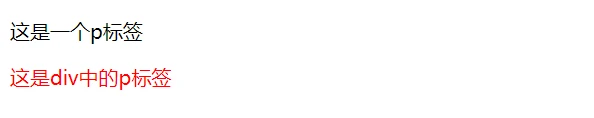

# CSS 选择器

## 选择器

### 复合选择器

（1）后代选择器

> 作用：根据 HTML 标签的嵌套关系，选择父元素`后代中`满

- 后代包括: 儿子、孙子、重孙子 ...
- 后代选择器中，选择器与选择器之前通过`空格`隔开

```css
父选择器 后代选择器 {
}
```

示例：

```html
<style>
    /* 找到div中的儿子p设置文字颜色是红色 */
    div p {
        color: red;
    }
</style>

<body>
    <!-- 后代: 儿子，孙子，重孙子... -->
    <p>这是一个p标签</p>
    <div>
        <p>这是div中的p标签</p>
    </div>
</body>
```



（2）子代选择器

> 根据 HTML 标签的嵌套关系，选择父元素<span style="color:red">子代中</span>满足条件的元素

```
父选择器 > 子代选择器 {
}
```

示例：

```html
<style>
    div>a {
        color: red;
    }
</style>
<body>
<div>
    父级
    <a href="#">这是div里面的a</a>
    <p>
        <a href="#">这是div里面的p里面的a</a>
    </p>
</div>
</body>
```


```html
<style>
    div a {
        color: red;
    }
</style>
<body>
<div>
    父级
    <a href="#">这是div里面的a</a>
    <p>
        <a href="#">这是div里面的p里面的a</a>
    </p>
</div>
</body>
```


### 并集选择器

> 作用: 同时选择多组标签，设置相同的样式

```css
选择器1, 选择器2 {
}
```

示例：

```html
<style>
    p,
    span {
        color: green;
    }
</style>

<div>
    <span>Hello World!</span>
    <p>Hello World!</p>
</div>
```

<span style="color:green">Hello World!</span>
<p style="color:green">Hello World!</p>

### 交集选择器

> 作用: 选中页面中`同时满足`多个选择器的标签

```
选择器1选择器2 { }
```

示例：

```html
<style>
    span.title {
        color: green;
    }
</style>

<div>
    <p class="title">Hello World!</p>
    <span class="title">Hello World!</span>
</div>
```

<p>Hello World!</p>

<span style="color:green">Hello World!</span>

注:

- 交集选择器中的选择器是紧挨着的，没有东西分隔
- 交集选择器中如果有标签选择器，标签选择器必须写在最前面

### hover 伪类选择器

> 作用: 选中鼠标`悬停`在元素上的`状态`，设置样式

```css
选择器:hover {
}
```

示例：

```html
<style>
    p:hover {
        color: green;
    }
</style>

<div>
    <!-- 任何标签都可以添加伪类，任何一个标签都可以鼠标悬停 -->
    <p>Hello World!</p>
    <span>Hello World!</span>
</div>
```

<iframe src="https://mouday.github.io/coding-tree/blog/front-end-learn/demo/css-selector-5.html" height="100" style="-webkit-font-smoothing: antialiased; -webkit-tap-highlight-color: transparent; text-size-adjust: none; box-sizing: border-box; font-size: 16px; border: 1px solid rgb(238, 238, 238); width: 1px; min-width: 100%; margin: 1em 0px; color: rgb(52, 73, 94); font-family: &quot;Source Sans Pro&quot;, &quot;Helvetica Neue&quot;, Arial, sans-serif; font-style: normal; font-variant-ligatures: normal; font-variant-caps: normal; font-weight: 400; letter-spacing: normal; orphans: 2; text-align: start; text-indent: 0px; text-transform: none; white-space: normal; widows: 2; word-spacing: 0px; -webkit-text-stroke-width: 0px; background-color: rgb(255, 255, 255); text-decoration-thickness: initial; text-decoration-style: initial; text-decoration-color: initial;"></iframe>

### Emmet 语法

- 简写语法，快速生成代码
- VS Code 等代码编辑器自带

| 语法       | 示例        | 效果                                      |
| ---------- | ----------- | ----------------------------------------- |
| 标签名     | div         | `<div></div>`                             |
| 类选择器   | .red        | `<div class="red"></div>`                 |
| id 选择器  | #one        | `<div id="one"></div>`                    |
| 交集选择器 | p.red#one   | `<p class="red" id="one"></p>`            |
| 子代选择器 | ul>li       | `<ul><li></li></ul>`                      |
| 内部文本   | ul>li{内容} | `<ul><li>Hello</li></ul>`                 |
| 创建多个   | ul>li*3     | `<ul><li></li><li></li><li></li></ul>`    |
| 创建自增   | ul>li{$}*3  | `<ul><li>1</li><li>2</li><li>3</li></ul>` |
| 同级       | div+p       | `<div></div><p></p>`                      |

css 提示

| 单词首字母 | 效果                          |
| ---------- | ----------------------------- |
| fw         | font-weight                   |
| w          | width                         |
| h          | height                        |
| bgc        | backgroud-color               |
| lh         | line-height                   |
| w300+h200  | `width: 300px;height: 200px;` |


# CSS 背景相关属性

## 背景颜色

```css
/* 默认背景色是透明；背景色在背景图之下*/
background-color: transparent;
```

## 背景图片

```css
background-image: url('图片路径');
```

注意: 

- 背景图片中 url 中可以省略引号
- 背景图片默认是在水平和垂直方向铺的
- 背景图片仅是指给盒子起到装饰效果，类似于颜色，不能撑开盒子的 

示例：

```html
<style>
    .box {
        width: 100%;
        /* 元素必须给一个尺寸才能显示背景图 */
        height: 500px;
        width: 500px;
        background-color: pink;
        background-image: url(https://cn.bing.com/th?id=OHR.FanjingStairs_ZH-CN0360402048_UHD.jpg&rf=LaDigue_UHD.jpg&w=300&h=300&c=8&rs=1&o=3&r=0);
    }
</style>

<div class="box"></div>
```


## 背景平铺

属性名: `background-repeat`  (bgr)

| 取值      | 效果                           |
| :-------- | :----------------------------- |
| repeat    | （默认值）水平和垂直方向都平铺 |
| no-repeat | 不平铺                         |
| repeat-x  | 水平方向平铺（x 轴）           |
| repeat-y  | 垂直方向平铺（y 轴）           |

示例：

```html
<style>
    .box {
        width: 100%;
        /* 元素必须给一个尺寸才能显示背景图 */
        height: 500px;
        width: 500px;
        background-color: pink;
        background-image: url(https://cn.bing.com/th?id=OHR.FanjingStairs_ZH-CN0360402048_UHD.jpg&rf=LaDigue_UHD.jpg&w=300&h=300&c=8&rs=1&o=3&r=0);
        background-repeat: no-repeat;
    }
</style>

<div class="box"></div>
```


## 背景位置

属性名: `background-position`(bgp)

```css
background-position: 水平方向位置 垂直方向位置;
```

属性值

方位名词（最多只能表示 9 个位置）

- 水平方向：left center right
- 垂直方向：top center bottom

数字+px（坐标）

- 坐标轴 原点(0,0) 盒子的左上角
- x 轴 水平方向
- y 轴 垂直方向
- 图片左上角与坐标原点重合

**注意:**

- 正数: 向右向下移动; 负数: 向左向右移动
- 背景色和背景图只显示在盒子里面

示例：

```html
<style>
    .box {
        width: 100%;
        /* 元素必须给一个尺寸才能显示背景图 */
        height: 500px;
        width: 500px;
        background-color: pink;
        background-image: url(https://cn.bing.com/th?id=OHR.FanjingStairs_ZH-CN0360402048_UHD.jpg&rf=LaDigue_UHD.jpg&w=300&h=300&c=8&rs=1&o=3&r=0);
        background-repeat: no-repeat;
        background-position: center;
    }
</style>

<div class="box"></div>
```


## 背景属性连写

```css
/* 不分先后顺序 */
background: color image repeat position;
```

示例：

```html
<style>
    .box {
        width: 100%;
        /* 元素必须给一个尺寸才能显示背景图 */
        height: 500px;
        width: 500px;
        /*
        两种写法等价
        background-color: pink;
        background-image: url(https://cn.bing.com/th?id=OHR.FanjingStairs_ZH-CN0360402048_UHD.jpg&rf=LaDigue_UHD.jpg&w=300&h=300&c=8&rs=1&o=3&r=0);
        background-repeat: no-repeat;
        background-position: center;
        */
        background: pink url(https://cn.bing.com/th?id=OHR.FanjingStairs_ZH-CN0360402048_UHD.jpg&rf=LaDigue_UHD.jpg&w=300&h=300&c=8&rs=1&o=3&r=0) no-repeat center;
    }
</style>

<div class="box"></div>
```


## img 标签和背景图片区别

img

- 不设置高宽会默认显示
- 重要突出的图使用 img

background-image

- 需要设置元素尺寸
- 装饰性图片使用背景图


## 元素显示模式

- 块级
- 行内
- 行内块

## 块级元素 (block)

- 自动换行

- 独占一行 (一行只能显示一个)
- 宽度默认为父元素的100% ；高度默认由内容撑开
- 可以设置宽度和高度

代表标签

```
div p h ul li dl dt dd form
header nav footer
```


**注意: **

- 块级元素可以嵌套任意元素
- 块级文字元素中不能放入其他块级元素，比如： p中不要嵌套div、p、h

## 行内元素 (inline)

- 一行显示多个
- 宽度和高度默认由内容撑开
- **不可以设置宽度和高度**
- 行内元素的padding可以设置
- margin只能够设置水平方向的边距，即：margin-left和margin-right，设置margin-top和margin-bottom无效

代表标签

```
a span b u i s strong ins em del
```


注意: 行内元素尽量只放行内元素与行内块元素，链接里边不能再放链接，**特殊情况a可以嵌套任意元素**。

## 行内块元素 (inline-block)

> 综合块级元素与行内元素的特性，可设宽高（默认是内容宽高），也可以设置内外边距

- 一行显示多个
- 可以设置宽度和高度 (加宽高生效)

代表标签

```
input textarea button select td img
```

注: img标签有行内块元素特点，但是Chrome调试工具中显示的结果是inline

## 元素显示模式转换

```css
display: block;
```

| 属性值       | 效果       |
| ------------ | ---------- |
| block        | 块级元素   |
| inline-block | 行内块元素 |
| inline       | 行内元素   |

注意：当元素浮动（float）时会转化成行内块元素特点。

## HTML 嵌套规范注意点

- 块级元素一般作为大容器;
- 可以嵌套文本、块级元素、行内元素、行内块元素

> p 标签中不要嵌套 div p h 等块级元素

- a 标签内部可以嵌套任意内容

> a 标签不能嵌套 a 标签


