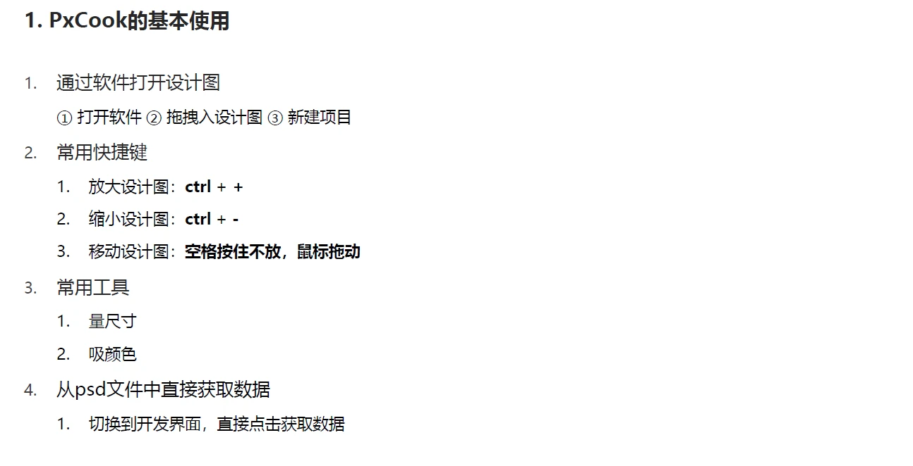
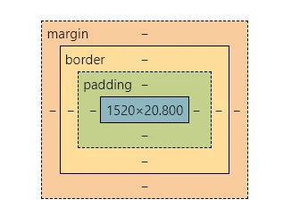
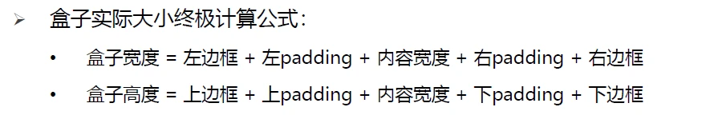
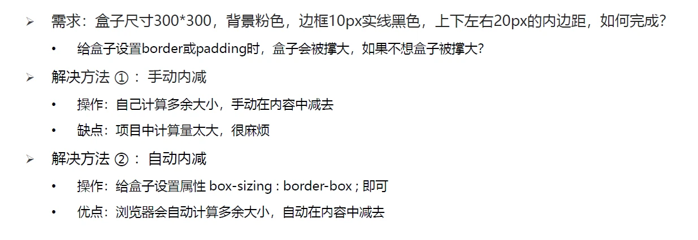
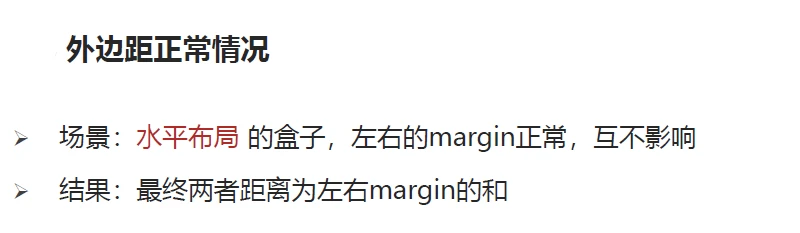
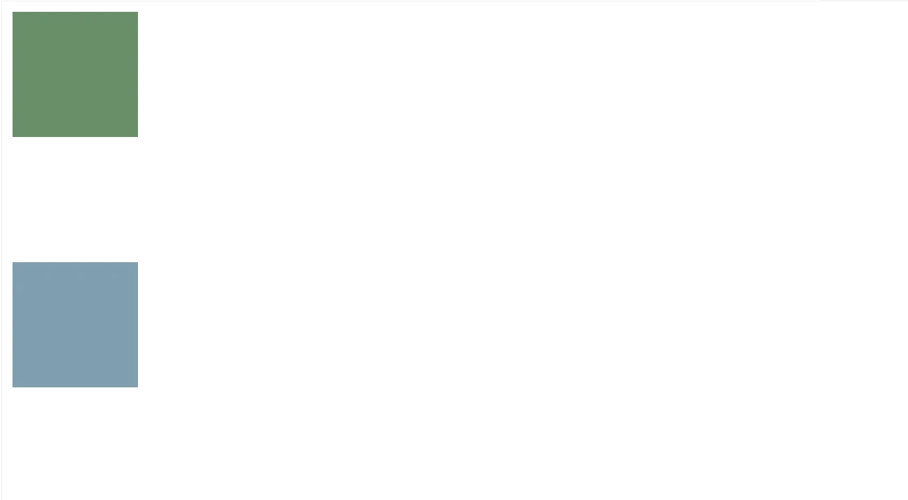
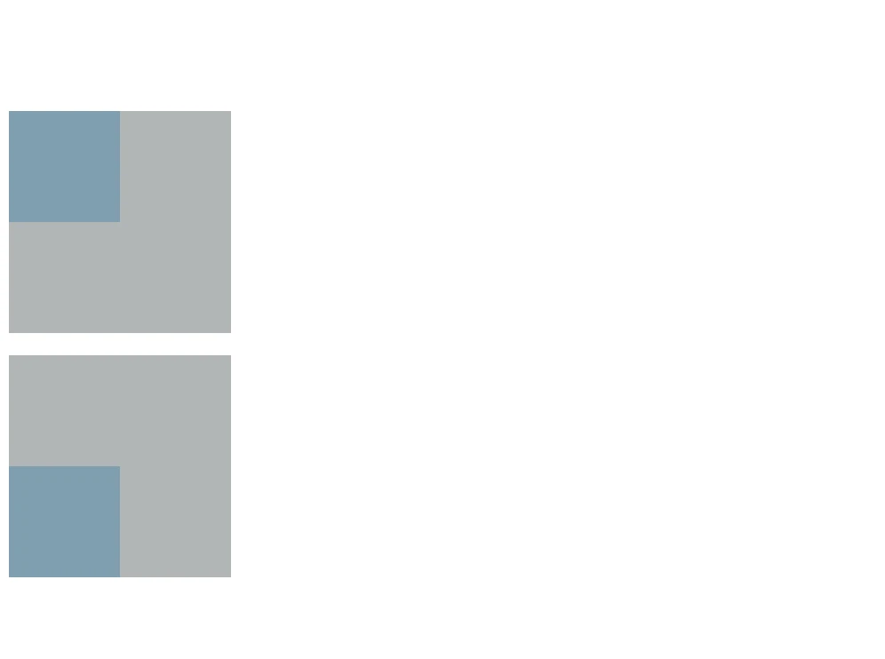
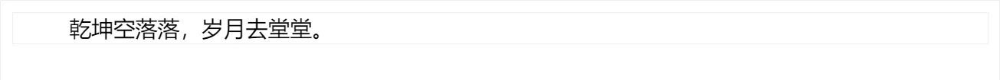

# CSS 盒模型

工具：PxCook https://www.fancynode.com.cn/pxcook



## 盒子模型

（1）盒子的概念

- 页面中的每一个标签，都可看做是一个<span style="color:red">"盒子"</span>，通过盒子的视角更方便的进行布局
- 浏览器在渲染 (显示) 网页时，会将网页中的元素看做是一个个的矩形区域，我们也形象的称之为 <span style="color:red">盒子</span>

（2）盒子模型：css中规定每个盒子分别由: <span style="color:red">内容区域 (content)、内边距区域 (padding)、边框区域 (border)、外边距区域 (margin)</span>构成，这就是<span style="color:red">盒子模型</span>

- 外边距区域 margin
- 边框区域 border
- 内边距区域 padding
- 内容区域 content



（3）盒子内容(content)的宽高

- width
- height

```css
.box {
  width: 100px;
  height: 100px;
}
```

## 边框 border

```css
/* 粗细 线条样式 颜色（不分先后顺序）*/
/* 默认4个方向都有*/
border: 10px solid red;

/* 单个方向 */
border-top: 10px solid red;
border-bottom: 10px solid red;
border-left: 10px solid red;
border-right: 10px solid red;

/* 单个属性 */
border-width: 边框粗细
border-style: 边框样式 (实线、虚线、点线)
border-color: 边框颜色
```

线条可选样式

- solid 实线
- dashed 虚线
- dotted 点线

**布局顺序：**

- 从外到内: 先宽高背景色，放内容，调节内容的位置，最后控制文字细节
- 从上到下

## 导航实例

```html
<style>
    .box {
        border-top: 3px solid #ff8500;
        border-bottom: #edeef0;
    }

    .box a {
        /* 先写盒子大小 */
        display: inline-block;
        width: 80px;
        height: 40px;

        /* 推荐先写上背景，便于查看盒子大小 */
        /* background-color: #edeef0; */

        /* 再写文字样式 */
        line-height: 40px;
        text-align: center;
        color: #4c4c4c;
        font-size: 12px;
        text-decoration: none;
    }

    /* 鼠标悬停效果 */
    .box a:hover {
        background-color: #edeef0;
        color: #ff8044;
    }
</style>

<div class="box">
    <a href="#">首页</a>
    <a href="#">文章</a>
    <a href="#">分类</a>
    <a href="#">标签</a>
</div>
```

<iframe src="https://mouday.github.io/coding-tree/blog/front-end-learn/demo/css-box-1.html" height="70" style="-webkit-font-smoothing: antialiased; -webkit-tap-highlight-color: transparent; text-size-adjust: none; box-sizing: border-box; font-size: 16px; border: 1px solid rgb(238, 238, 238); width: 1px; min-width: 100%; margin: 1em 0px; color: rgb(52, 73, 94); font-family: &quot;Source Sans Pro&quot;, &quot;Helvetica Neue&quot;, Arial, sans-serif; font-style: normal; font-variant-ligatures: normal; font-variant-caps: normal; font-weight: 400; letter-spacing: normal; orphans: 2; text-align: start; text-indent: 0px; text-transform: none; white-space: normal; widows: 2; word-spacing: 0px; -webkit-text-stroke-width: 0px; background-color: rgb(255, 255, 255); text-decoration-thickness: initial; text-decoration-style: initial; text-decoration-color: initial;"> </iframe>

## 内边距 padding

> 作用：设置 `边框` 与 `内容区域` 之间的距离

```css
/* 可取 4 个值、3 个值、2 个值、1 个值 */
padding: 上 右 下 左;
padding: 上 左右 下;
padding: 上下 左右;
padding: 上下左右;

/* 单个方向 */
padding-top: 10px;
padding-bottom: 10px;
padding-left: 10px;
padding-right: 10px;
```

规律：**从上开始赋值，然后顺时针赋值，如果没有设置赋值的，看对面的!!**

## 盒子尺寸计算





```
box-sizing: content-box 默认
盒子最终宽度 = width(content) + padding + border

box-sizing: border-box
盒子最终宽度 = width = padding + border + content
```

## 外边距 margin

设置值的方式和 padding 类似

```css
/* 可取 4 个值、3 个值、2 个值、1 个值 */
margin: 上 右 下 左;
margin: 上 左右 下;
margin: 上下 左右;
margin: 上下左右;

/* 单个方向 */
margin-top: 10px;
margin-bottom: 10px;
margin-left: 10px;
margin-right: 10px;
```

使用 margin 让元素居中

```css
.box {
  width: 100px;
  height: 100px;
  background-color: #ccc;
  margin: 0 auto;
}
```

## 清除浏览器默认样式

京东

```css
* {
  margin: 0;
  padding: 0;
}
```

淘宝

```css
blockquote,
body,
button,
dd,
dl,
dt,
fieldset,
form,
h1,
h2,
h3,
h4,
h5,
h6,
hr,
input,
legend,
li,
ol,
p,
pre,
td,
textarea,
th,
ul {
  margin: 0;
  padding: 0;
}
```

常用的清除样式

```css
* {
  margin: 0;
  padding: 0;
  box-sizing: border-box;
}
```

去掉列表前的符号

```css
ul {
  list-style: none;
}
```

## 外边距折叠现象

- 合并现象
- 塌陷现象



### 合并现象

- 场景：`垂直布局`的`块级元素`，上下的 margin 会合并
- 结果：最终两者距离为 margin 的最大值
- 解决方法：只给其中一个盒子设置 margin

```html
<style>
    .box-1 {
        width: 100px;
        height: 100px;
        background-color: #698e6a;
        margin-bottom: 50px;
    }

    .box-2 {
        margin-top: 100px;
        width: 100px;
        height: 100px;
        background-color: #7f9faf;
    }
</style>

<div class="box-1"></div>
<div class="box-2"></div>
```



### 塌陷现象

- 场景：`互相嵌套`的`块级元素`，子元素的 `margin-top` 会作用在父元素上
- 结果：导致父元素一起往下移动
- 解决方法：

1. 给父元素设置 border-top 或者 padding-top(分隔父子元素的 margin-top)
2. 给父元素设置 overflow:hidden;
3. 转换为行内块元素
4. 设置浮动

```html
<style>
    .box-father {
        width: 200px;
        height: 200px;
        background-color: #b2b6b6;
    }

    .box-child {
        width: 100px;
        height: 100px;
        background-color: #7f9faf;
        margin-top: 100px;
    }

    .resolve {
        overflow: hidden;
        margin-top: 20px;
    }
</style>

<div class="box-wrap">
    <!-- 元素的margin-top 作用在了父元素上 -->
    <div class="box-father">
        <div class="box-child"></div>
    </div>

    <!-- [完美解决方案]给父元素设置 overflow:hidden; -->
    <div class="box-father resolve">
        <div class="box-child"></div>
    </div>

</div>
```



## 行内标签的 margin/padding

> 如果想要通过 margin / padding 改变行内标签的<span style="color:red">垂直位置</span>，无法生效

即，行内标签的 margin-top 和 bottom 不生效

行内标签的 padding-top 和 bottom 不生效


行内标签使用行高 `line-height` 实现垂直位置

```html
<style>
    .box {
        border: 1px solid #eee;
    }

    .box span {
        margin: 20px;
        padding: 20px;
    }
</style>

<div class="box">
    <span>乾坤空落落，岁月去堂堂。</span>
</div>
```

