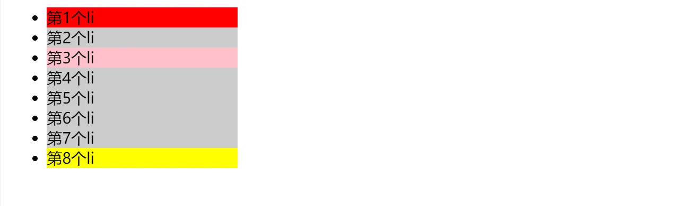
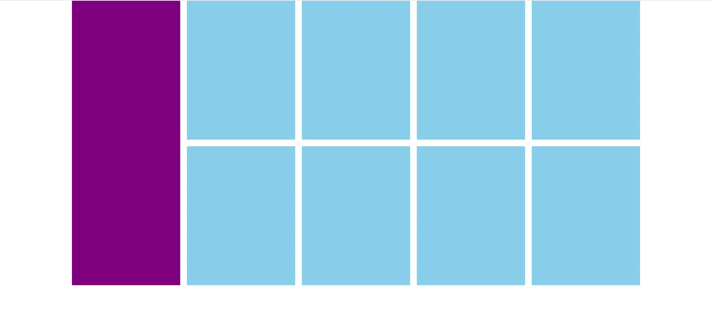
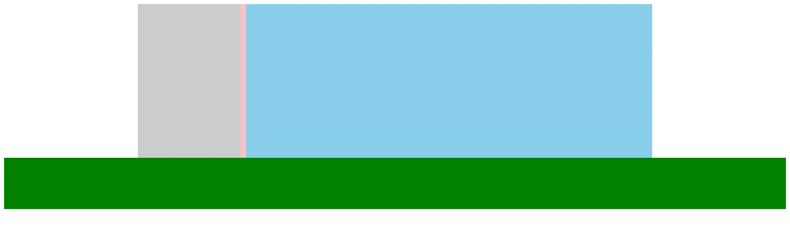

# 浮动

## 结构伪类选择器

- 作用：根据元素在 HTML 中的结构关系查找元素
- 优势：减少对 HTML 中类的依赖，有利于保持代码整洁
- 场景：常用于查找某父级选择器中的子元素

| 选择器                   | 说明                              |
| ------------------------ | --------------------------------- |
| `E:first-child {}`       | 匹配父元素中的第一个子元素 E      |
| `E:last-child {}`        | 匹配父元素中的最后一个子元素 E    |
| `E:nth-child(n) {}`      | 匹配父元素中的第 n 个子元素 E     |
| `E:nth-last-child(n) {}` | 匹配父元素中的倒数第 n 个子元素 E |

n 可以写公式

n 可取值：0 1 2 3 4...

| 功能              | 公式            |
| ----------------- | --------------- |
| 偶数              | 2n、even        |
| 奇数              | 2n+1、2n-1、odd |
| 找到前 5 个       | -n+5            |
| 找到从第 5 个往后 | n+5             |

示例：

```html
<style>
    ul li {
        background-color: #ccc;
        width: 200px;
    }

    ul li:first-child {
        background-color: red;
    }

    ul li:last-child {
        background-color: yellow;
    }

    ul li:nth-child(3) {
        background-color: pink;
    }
</style>

<!-- ul>li{第$个li}*8 -->
<ul>
    <li>第1个li</li>
    <li>第2个li</li>
    <li>第3个li</li>
    <li>第4个li</li>
    <li>第5个li</li>
    <li>第6个li</li>
    <li>第7个li</li>
    <li>第8个li</li>
</ul>
```



## 伪元素

- 元素：HTML 设置的标签
- 伪元素：由CSS 模拟出的标签效果，装饰性内容

| 伪元素     | 作用                             |
| ---------- | -------------------------------- |
| `::before` | 在父元素内容的最前添加一个伪元素 |
| `::after`  | 在父元素内容的最后添加一个伪元素 |

注意点：

- 必须设置 content 属性才能生效
- 伪元素默认是**行内元素**

```css
.box::before {
  content: ''; // 必须加属性
}
```

## 标准流

> 标准流：又称为<span style="color:red">文档流</span>，是浏览器在渲染显示网页内容时默认采用的一套排版规则，规定了应该以何种方式排列元素

常见标准流的排版规则: 

- 块级元素：从上往下，<span style="color:red">垂直布局</span>，独占一行
- 行内元素或行内块元素：从左往右，<span style="color:red">水平布局</span>，空间不够自动折行

## 浮动

- 早期：图文环绕
- 现在：网页布局

```css
float: left/right;
```

行内元素或行内块元素换行书写会产生一个空格

**浮动的特点**

- 浮动的标签默认顶对齐，可使用 margin-top 修改距离顶部距离
- 浮动元素会脱离标准流（脱标），在标准流中不占用位置 (相当于从地面飘到了空中)
- 浮动元素比标准流高半个级别，可以覆盖标准流中的元素
- 浮动找浮动，下一个浮动元素会在上一个浮动元素后面，左右浮动 (默认浮动是顶对齐)
- 浮动标签具备行内块特点：
  1. 一行显示多个
  2. 可设置宽高

**注意:**

- 浮动的元素不能通过 margin: 0 auto 设置居中

示例：

```html
<style>
    * {
        margin: 0;
        padding: 0;
    }

    .box {
        margin: 0 auto;

        width: 1226px;
        height: 614px;
    }

    .left {
        float: left;

        width: 234px;
        height: 614px;
        background-color: #800080;
    }

    .right {
        float: right;

        width: 978px;
        height: 614px;
    }

    ul {
        /* 去掉列表符号 */
        list-style: none;
    }

    .right li {
        float: left;

        margin-right: 14px;
        margin-bottom: 14px;

        width: 234px;
        height: 300px;
        background-color: #87ceeb;
    }

    /* 如果父级的宽度不够，子级会自动换行 */
    /* 第四个li 和第八个li 右侧间距清除 */
    .right li:nth-child(4n){
        margin-right: 0px;
    }
</style>

<body>
    <div class="box">
        <div class="left"></div>
        <div class="right">
            <ul>
                <li></li>
                <li></li>
                <li></li>
                <li></li>
                <li></li>
                <li></li>
                <li></li>
                <li></li>
            </ul>
        </div>
    </div>
</body>
```



**布局**: 从外到内，从上到下，从左到右

**CSS 书写顺序**

​	1. 浮动 / display

​	2. 盒子模型 margin border padding 宽度高度背景色

​	3. 文字样式

**常用 css**

- 内减模式：box-sizing: border-box;
- 版心居中： margin: 0 auto;

## 清除浮动

> 含义: 清除浮动带来的影响

影响：如果子元素浮动了，此时子元素不能撑开标准流的块级父元素

```html
<style>
    /* 初始化样式 */
    * {
        margin: 0;
        padding: 0;
    }

    /* 外层容器 */
    .box {
        background-color: #ccc;
        /* margin: 0 auto; */
    }

    /* 左边 */
    .left {
        float: left;
        width: 200px;
        height: 200px;
        background-color: pink;
    }

    /* 右边 */
    .right {
        float: right;
        background-color: green;
        width: 200px;
        height: 200px;
    }

    .footer {
        height: 20px;
        background-color: saddlebrown;
    }
</style>

<div class="box">
    <div class="left"></div>
    <div class="right"></div>
</div>

<!-- 期望footer元素紧跟box下面排列 -->
<div class="footer"></div>
```

<iframe src="https://mouday.github.io/coding-tree/blog/front-end-learn/demo/css-float-4.html" height="220" style="-webkit-font-smoothing: antialiased; -webkit-tap-highlight-color: transparent; text-size-adjust: none; box-sizing: border-box; font-size: 16px; border: 1px solid rgb(238, 238, 238); width: 1px; min-width: 100%; margin: 1em 0px; color: rgb(52, 73, 94); font-family: &quot;Source Sans Pro&quot;, &quot;Helvetica Neue&quot;, Arial, sans-serif; font-style: normal; font-variant-ligatures: normal; font-variant-caps: normal; font-weight: 400; letter-spacing: normal; orphans: 2; text-align: start; text-indent: 0px; text-transform: none; white-space: normal; widows: 2; word-spacing: 0px; -webkit-text-stroke-width: 0px; background-color: rgb(255, 255, 255); text-decoration-thickness: initial; text-decoration-style: initial; text-decoration-color: initial;"></iframe>

**清除浮动的方法**

1. 直接设置父元素高度
   - 优点: 简单粗暴，方便
   - 缺点: 有些布局不能固定父元素高度。如: 新闻列表、京东推荐模块
2. **额外标签**

- 在父元素内容的最后添加一个**块级元素**
- 给添加的块级元素设置 `clear:both`;

```css
.clearfix {
  clear: both;
}
```

案例: 

```html
<style>
    .top {
        margin: 0 auto;
        width: 1000px;
        /* height: 300px; */
        background-color: pink;
    }

    .bottom {
        height: 100px;
        background-color: green;
    }

    .left {
        float: left;
        width: 200px;
        height: 300px;
        background-color: #ccc;
    }

    .right {
        float: right;
        width: 790px;
        height: 300px;
        background-color: skyblue;
    }

    .clearfix {
        /* 清除左右两侧浮动的影响 */
        clear: both;
    }
</style>
<body>
    <!-- 父子级标签, 子级浮动, 父级没有高度, 后面的标准流盒子会受影响, 显示到上面的位置 -->
    <div class="top">
        <div class="left"></div>
        <div class="right"></div>
        <div class="clearfix"></div>
    </div>
    <div class="bottom"></div>
</body>
```



3. **单伪元素清除法**

用伪元素替代了额外标签

优点：直接给标签加类即可清除浮动

（1）基本写法

```css
.clearfix::after {
  content: '';
  display: block;
  clear: both;
}
```

（2）补充写法

```css
.clearfix::after {
  content: '';
  display: block;
  clear: both;

  /* 兼容低版本IE */
  height: 0;
  visibility: hidden;
}
```

4. 双伪元素清除法

```css
/* 解决外边距塌陷问题 */
/* 外边距塌陷: 父子标签，都是块级，子级加margin会影响父级的位置 */
.clearfix::before,
.clearfix::after {
  content: '';
  display: table;
}

.clearfix::after {
  clear: both;
}
```

```css
<style>
    /* 初始化样式 */
    * {
        margin: 0;
        padding: 0;
    }

    /* 外层容器 */
    .box {
        background-color: #ccc;
        /* margin: 0 auto; */
    }

    /* 左边 */
    .left {
        float: left;
        width: 200px;
        height: 200px;
        background-color: pink;
    }

    /* 右边 */
    .right {
        float: right;
        background-color: green;
        width: 200px;
        height: 200px;
    }

    .footer {
        height: 20px;
        background-color: saddlebrown;
    }

    .clearfix::before,
    .clearfix::after {
        content: '';
        display: table;
    }

    .clearfix::after {
        clear: both;
    }
</style>

<!-- 清除浮动 -->
<div class="box clearfix">
    <div class="left"></div>
    <div class="right"></div>
</div>

<!-- 期望footer元素紧跟box下面排列 -->
<div class="footer"></div>
```

<iframe src="https://mouday.github.io/coding-tree/blog/front-end-learn/demo/css-float-5.html" height="240" style="-webkit-font-smoothing: antialiased; -webkit-tap-highlight-color: transparent; text-size-adjust: none; box-sizing: border-box; font-size: 16px; border: 1px solid rgb(238, 238, 238); width: 1px; min-width: 100%; margin: 1em 0px; color: rgb(52, 73, 94); font-family: &quot;Source Sans Pro&quot;, &quot;Helvetica Neue&quot;, Arial, sans-serif; font-style: normal; font-variant-ligatures: normal; font-variant-caps: normal; font-weight: 400; letter-spacing: normal; orphans: 2; text-align: start; text-indent: 0px; text-transform: none; white-space: normal; widows: 2; word-spacing: 0px; -webkit-text-stroke-width: 0px; background-color: rgb(255, 255, 255); text-decoration-thickness: initial; text-decoration-style: initial; text-decoration-color: initial;"></iframe>

5. 给父元素设置 overflow: hidden

