# CSS 定位

## 网页常见布局方式

1. 标准流

- 块级元素独占一行 -> 垂直布局
- 行内元素/行内块元素一行显示多个 -> 水平布局

2. 浮动

- 原本垂直布局的 <span style="color:red">块级元素变成水平布局</span>

3. 定位

- 可以让元素自由的摆放在网页的任意位置
- 一般用于 <span style="color:red">盒子之间的层叠情况</span>
- 让盒子固定在页面某一位置

## 使用定位

1. 设置定位方式

属性名: position

| 定位方式 | 属性值   |
| -------- | -------- |
| 静态定位 | static   |
| 相对定位 | relative |
| 绝对定位 | absolute |
| 固定定位 | fixed    |

2. 设置偏移值

- 偏移值设置分为两个方向，水平和垂直方向各选一个使用即可
- 选取原则：就近原则 (离哪边近用哪个)

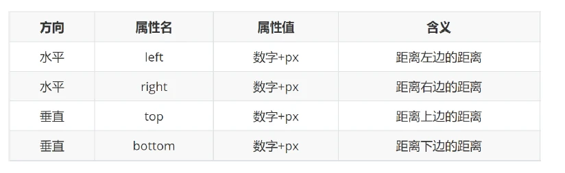

3. 偏移方向

- 水平距离左边 left
- 水平距离右边 right
- 垂直距离上边 top
- 垂直距离下边 bottom


<span style="color:red">css书写: 1. 定位 / 浮动 / display ; 2. 盒子模型; 3. 文字属性</span>

## 静态定位

> 介绍：静态定位是默认值，就之前识的标准流。

代码: `position: static`

注意: 

- 静态定位就是之前标准流，不能通过方位属性进行移动
- 之后说的定位不包括静态定位，一般特指后几种: 相对、绝对、固定

## 相对定位

> 自恋型定位，相对于自己之前的位置进行移动

代码: `position: relative;` 

特点: 

- 需要配合方位属性实现移动
- 相对于自己原来位置进行移动
- 在页面中占位置 -> 没有脱标 (不改变显示模式)

- 占有原来的位置
- 仍然具备标签原有的显示模式特点

```css
position: relative
left: 100px;
top: 100px;
```

> Tips: 如果 4 个定位都有，以 top 和 left 为准

## 绝对定位

> 拼爹型定位，相对于非静态定位的父元素进行定位移动

代码: `position: absolute;`

特点: 

- 需要配合方位属性实现移动
- 默认相对于浏览器可视区域进行移动
- 在页面中不占位置 -> 已经**脱标**

- 相对于非静态定位的父元素定位
- 不占有原来的位置
- 改变标签的显示模式: **具备行内块特点** (在一行共存，宽高生效)
- 默认以浏览器窗口定位

```css
/* 绝对定位:
         先找已经定位的父级，如果有这样的父级就以这个父级为参照物进行定位;
         有父级，但父级没有定位，以浏览器窗口为参照物进行定位;
*/
position: absolue
left: 100px;
top: 100px;
```

- **子绝父相**：父级相对定位，子级绝对定位
- **绝对定位查找父级的方法**：就近找定位的父级，如果逐层查找不到这样的父级，就以浏览器窗口为参照进行定位

**注意:**

- 绝对定位的盒子，不能使用 左右margin auto 居中
- 绝对定位的盒子显示模式具备行内块特点: 加宽高高度生效，如果没有宽度也没有内容，盒子的尺寸就是0

## 固定定位

> 死心眼型定位，相对于浏览器进行移动

代码: `positions: fixed;`

特点：

- **脱标**-不占位置
- 改变位置相对于浏览器定位
- 具备**行内块**特点

## 元素层级关系

1. 不同布局方式元素的层级关系：

```css
标准流 < 浮动 < 定位
```

2. 不同定位之间的层级关系:
   - 相对、绝对、固定默认层级相同
   - 此时 HTML 中写在下面的元素层级更高，会覆盖上面的元素 (默认情况下)
3. 设置元素层级

```css
/*  
	z-index的默认值是0；
	数值越大，显示越靠前 
	z-index必须配合定位才能生效
*/
z-index: 整数;
```

## 案例：子盒子在父盒子中水平居中

方式一：margin

```html
<style>
    .box-wrap {
        position: relative;

        width: 500px;
        height: 500px;

        background-color: skyblue;
    }

    .box {
        position: absolute;
        left: 50%;
        top: 50%;
        /* 手动计算盒子的一半 */
        margin-left: -150px;
        margin-top: -150px;

        width: 300px;
        height: 300px;

        background-color: pink;
    }
</style>

<div class="box-wrap">
    <div class="box"></div>
</div>
```

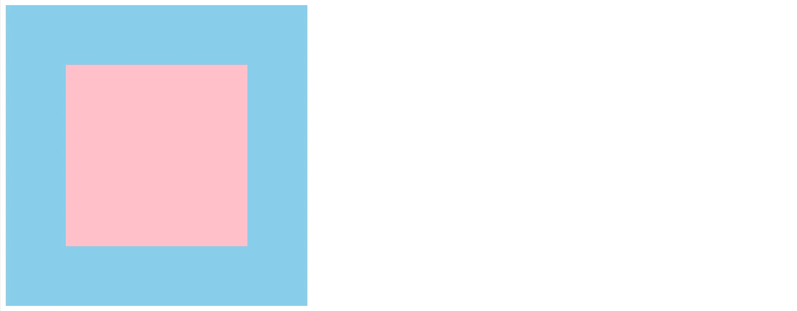

方式二：transform

```html
<style>
    .box-wrap {
        position: relative;

        width: 500px;
        height: 500px;

        background-color: skyblue;
    }

    .box {
        position: absolute;
        left: 50%;
        top: 50%;

        /* 移动自身一半 */
        transform: translate(-50%, -50%);
        width: 300px;
        height: 300px;

        background-color: pink;
    }
</style>

<div class="box-wrap">
    <div class="box"></div>
</div>
```


## 总结

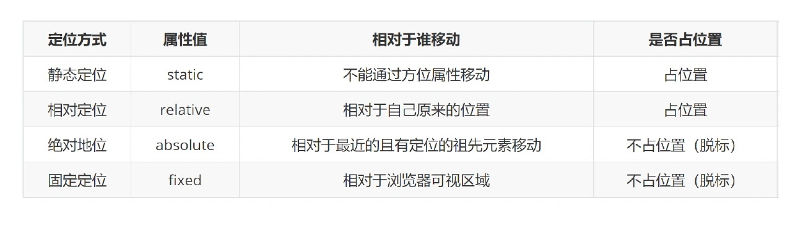


# CSS 装饰

## 垂直对齐 vertical-align

基线(baseline)：浏览器文字类型元素排版中存在用于对齐的基线

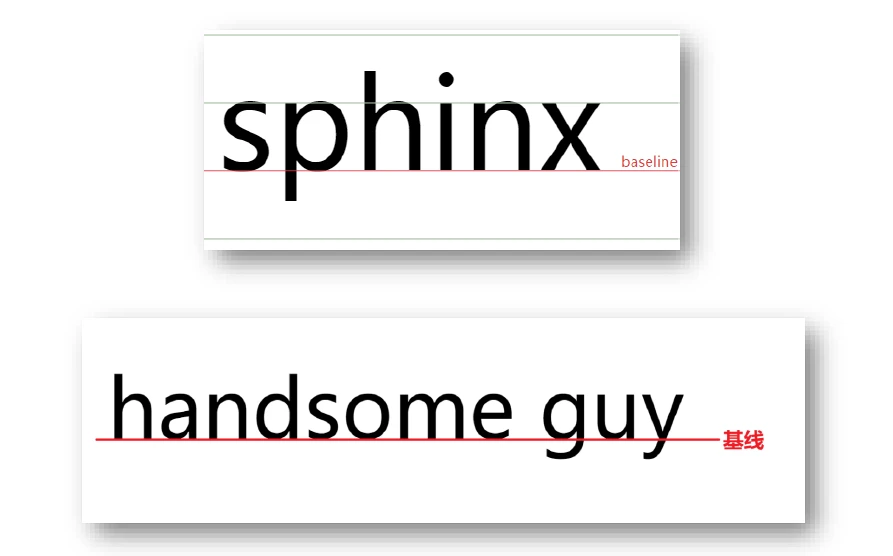

**属性名:** `vertical-align`

**属性值:** 

| 属性值   | 效果           |
| -------- | -------------- |
| baseline | 默认，基线对齐 |
| top      | 顶部对齐       |
| middle   | 中部对齐       |
| bottom   | 底部对齐       |

```css
vertical-align: middle;
```

示例:

```html
<style>
    .text {
        border-bottom: 1px solid #ccc;
    }

    .text-baseline {
        vertical-align: baseline;
    }

    .text-top {
        vertical-align: top;
    }

    .text-middle {
        vertical-align: middle;
    }

    .text-bottom {
        vertical-align: bottom;
    }
</style>
<div>
    <span class="text text-baseline">绝知此事要躬行</span>
    <span class="text text-top">绝知此事要躬行</span>
    <span class="text text-middle">绝知此事要躬行</span>
    <span class="text text-bottom">绝知此事要躬行</span>
</div>
```

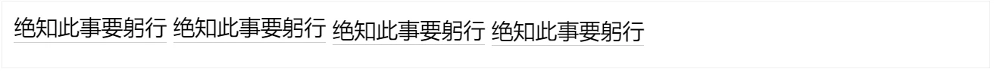

> 浏览器遇到行内和行内块标签当做文字处理，文字默认基线对齐
>
> 块标签不会当做文字处理

示例一：输入框垂直居中对齐

```html
<style>
    input {
        height: 50px;
    }

    input[type="button"] {
        height: 30px;
    }

    .middle input {
        vertical-align: middle;
    }
</style>

<div>

    <input type="text" />
    <input type="button"
           value="搜索" />
</div>
```

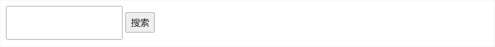

示例二：图片垂直居中对齐

```html
<style>
    .box {
        border: 1px solid #ccc;
        width: 500px;
    }

    img {
        height: 200px;
        width: 200px;
    }

    .middle-box {
        margin-top: 20px;
    }

    .middle-box img {
        vertical-align: middle;
    }
</style>

<div>
    <div class="box">
        <input type="button"
               value="搜索" /></div>

    <div class="box middle-box">
        <input type="button"
               value="搜索" /></div>
</div>
```

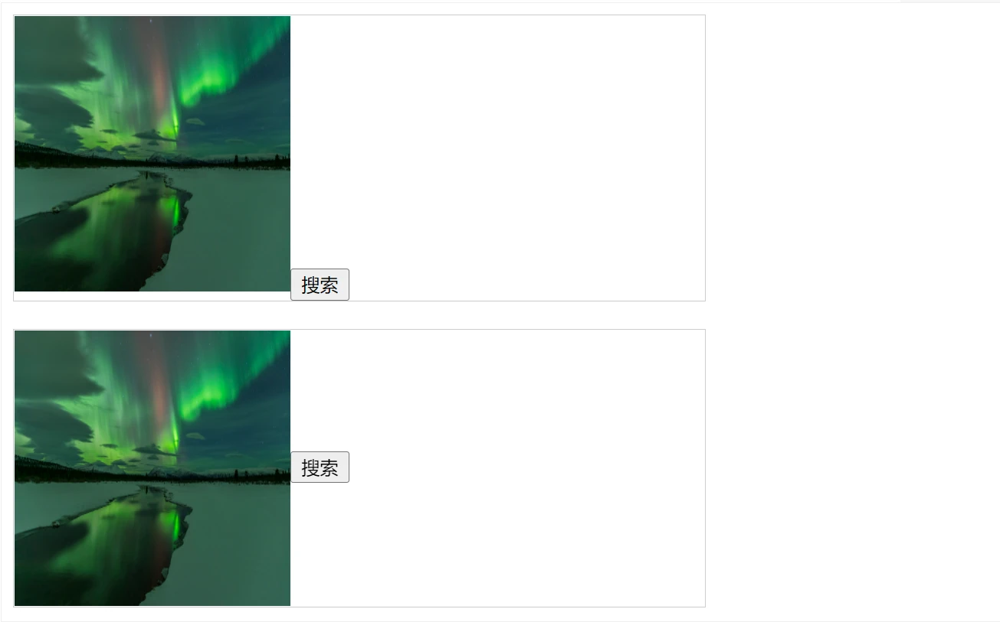

示例三：图片水平垂直居中

```html
<style>
    .box {
        width: 400px;
        height: 400px;
        background-color: skyblue;
        /* 水平居中 */
        text-align: center;
    }

    .box::after {
        height: 100%;
        content: '';
        display: inline-block;
        vertical-align: middle;
    }

    img {
        height: 200px;
        width: 200px;
        /* 垂直居中 */

        /*方式一*/
        vertical-align: middle;
        /*方式二*/
        /* display: block; */
    }
</style>

<div class="box">
    
</div>
```

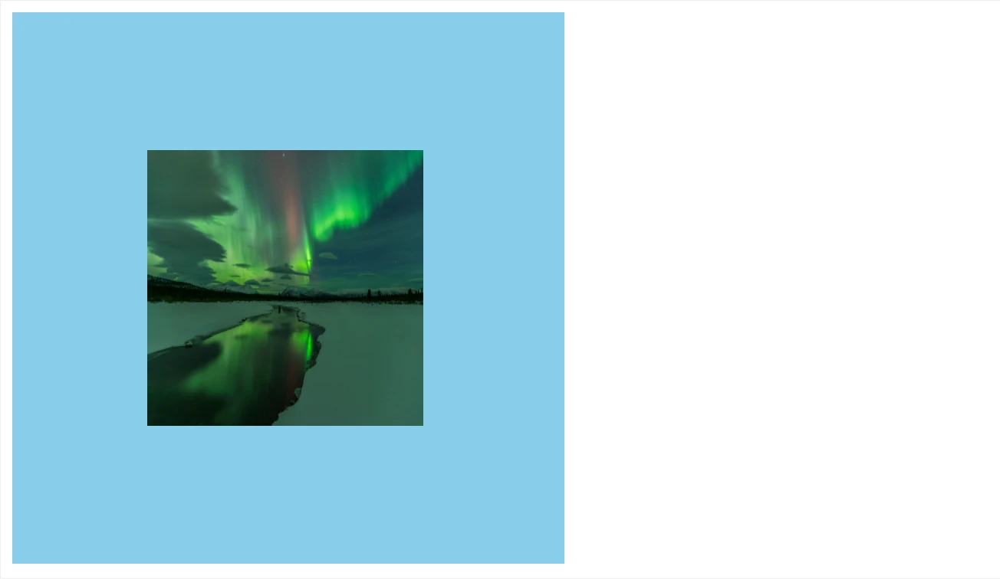

## 光标类型 cursor

> 设置鼠标光标在元素上时显示的样式

**属性名:** `cursor`

**属性值:**

| 属性值  | 效果                     |
| ------- | ------------------------ |
| default | 默认，箭头               |
| pointer | 小手，提示可点击         |
| text    | 工字型，提示可选择、复制 |
| move    | 十字光标，提示可移动     |

示例：

```html
<style>
    .cursor--pointer {
        cursor: pointer;
    }

    .cursor--text {
        cursor: text;
    }

    .cursor--move {
        cursor: move;
    }
</style>

<div class="box">
    <div>默认，箭头</div>
    <div class="cursor--pointer">小手，提示可点击</div>
    <div class="cursor--text">工字型，提示可选择</div>
    <div class="cursor--move">十字光标，提示可移动</div>
</div>
```

<iframe src="https://mouday.github.io/coding-tree/blog/front-end-learn/demo/css-decorate-5.html" height="110" style="-webkit-font-smoothing: antialiased; -webkit-tap-highlight-color: transparent; text-size-adjust: none; box-sizing: border-box; font-size: 16px; border: 1px solid rgb(238, 238, 238); width: 1px; min-width: 100%; margin: 1em 0px; color: rgb(52, 73, 94); font-family: &quot;Source Sans Pro&quot;, &quot;Helvetica Neue&quot;, Arial, sans-serif; font-style: normal; font-variant-ligatures: normal; font-variant-caps: normal; font-weight: 400; letter-spacing: normal; orphans: 2; text-align: start; text-indent: 0px; text-transform: none; white-space: normal; widows: 2; word-spacing: 0px; -webkit-text-stroke-width: 0px; background-color: rgb(255, 255, 255); text-decoration-thickness: initial; text-decoration-style: initial; text-decoration-color: initial;"></iframe>

## 边框圆角 border-radius

> 让盒子四个角变得圆润，增加页面细节，提升用户体验

**属性名:** `border-radius`

**赋值规则:** 从左上角开始赋值，然后顺时针赋值，没有赋值的看对角!

```css
/* 单值 4个角一样*/
border-radius: 数字px/百分比;

/* 多值 左上角开始，顺时针赋值，没有赋值看对角*/
border-radius: 左上 右上 右下 左下;
```

（1）正圆

- 盒子必须是正方形
- 设置边框圆角为盒子宽高的一半

示例：

```html
<style>
    .box {
        width: 200px;
        height: 200px;
        border-radius: 50%;
        background-color: skyblue;
    }
</style>

<div class="box"></div>

```

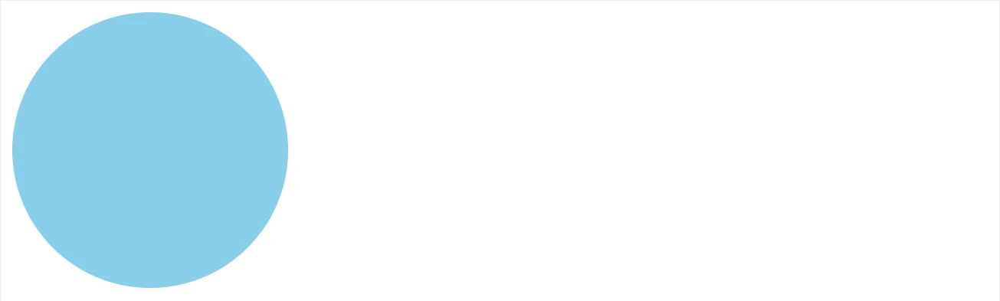

```css
/* 最大值 50% */
border-radius: 50%;
```

（2）胶囊按钮

- 盒子设置为长方形
- 设置边框圆角取值为高度的一半

```css
border-radius: height/2;
```

示例：

```html
<style>
    .box {
        width: 100px;
        height: 50px;
        border-radius: 25px;
        background-color: skyblue;
    }
</style>

<div class="box"></div>
```

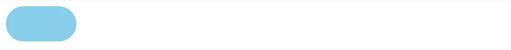

## 溢出部分效果 overflow

溢出部分：指的是盒子<span style="color:red">内容部分</span>超出盒子范围的区域

**属性名:** `overflow`

**属性值:**

| 属性值  | 效果                               |
| ------- | ---------------------------------- |
| visible | 默认，溢出部分可见                 |
| hidden  | 溢出部分隐藏                       |
| scroll  | 无论是否溢出都显示滚动条           |
| auto    | 根据是否溢出，自动显示或隐藏滚动条 |

示例：

```html
<style>
    .box {
        width: 100px;
        height: 100px;
        background-color: skyblue;

        overflow: hidden;
    }
</style>

<div class="box">
    江夏赠韦南陵冰

    李白〔唐代〕

    胡骄马惊沙尘起，胡雏饮马天津水。
    君为张掖近酒泉，我窜三色九千里。(三色 一作：三巴)
    天地再新法令宽，夜郎迁客带霜寒。
    西忆故人不可见，东风吹梦到长安。
    宁期此地忽相遇，惊喜茫如堕烟雾。
    玉箫金管喧四筵，苦心不得申长句。
    昨日绣衣倾绿尊，病如桃李竟何言。
    昔骑天子大宛马，今乘款段诸侯门。
    赖遇南平豁方寸，复兼夫子持清论。
    有似山开万里云，四望青天解人闷。
    人闷还心闷，苦辛长苦辛。
    愁来饮酒二千石，寒灰重暖生阳春。
    山公醉后能骑马，别是风流贤主人。
    头陀云月多僧气，山水何曾称人意。
    不然鸣笳按鼓戏沧流，呼取江南女儿歌棹讴。
    我且为君槌碎黄鹤楼，君亦为吾倒却鹦鹉洲。
    赤壁争雄如梦里，且须歌舞宽离忧。
</div>
```

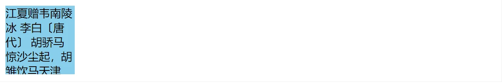

## 元素本身隐藏

常见的属性:

- `visibility: hidden`
- `display: none`

```html
/* 占位隐藏 */
visibility: hidden;

/* 不占位隐藏（常用） */
display: none;
<style>
    .box-1 {
        width: 100px;
        height: 100px;
        visibility: hidden;
    }

    .box-2 {
        width: 100px;
        height: 100px;
        display: none;
    }
</style>

<div class="box-1"></div>
<div class="box-2"></div>

```

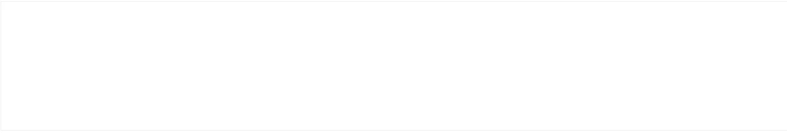

示例：默认隐藏 鼠标悬停显示

```html
<style>
    .box {
        width: 100px;
        height: 100px;
        background-color: skyblue;
        position: relative;
    }

    .box:hover .box-qrcode {
        display: block;
    }

    .box-qrcode {
        position: absolute;
        top: 100px;
        width: 100px;
        height: 100px;
        background-color: pink;
        display: none;
    }
</style>

<div class="box">
    <div class="box-qrcode"></div>
</div>
```

<iframe src="https://mouday.github.io/coding-tree/blog/front-end-learn/demo/css-decorate-10.html" height="220" style="-webkit-font-smoothing: antialiased; -webkit-tap-highlight-color: transparent; text-size-adjust: none; box-sizing: border-box; font-size: 16px; border: 1px solid rgb(238, 238, 238); width: 1px; min-width: 100%; margin: 1em 0px; color: rgb(52, 73, 94); font-family: &quot;Source Sans Pro&quot;, &quot;Helvetica Neue&quot;, Arial, sans-serif; font-style: normal; font-variant-ligatures: normal; font-variant-caps: normal; font-weight: 400; letter-spacing: normal; orphans: 2; text-align: start; text-indent: 0px; text-transform: none; white-space: normal; widows: 2; word-spacing: 0px; -webkit-text-stroke-width: 0px; background-color: rgb(255, 255, 255); text-decoration-thickness: initial; text-decoration-style: initial; text-decoration-color: initial;">
</iframe>

## 元素整体透明 opacity

**属性值：**

- 0-1 之间的数字；
- 0 完全透明，1 完全不透明

示例：

```html
<style>
    .box {
        width: 100px;
        height: 100px;
        background-color: skyblue;
        opacity: .5;
    }
</style>

<div class="box"></div>
```

<iframe src="https://mouday.github.io/coding-tree/blog/front-end-learn/demo/css-decorate-11.html" height="120" style="-webkit-font-smoothing: antialiased; -webkit-tap-highlight-color: transparent; text-size-adjust: none; box-sizing: border-box; font-size: 16px; border: 1px solid rgb(238, 238, 238); width: 1px; min-width: 100%; margin: 1em 0px; color: rgb(52, 73, 94); font-family: &quot;Source Sans Pro&quot;, &quot;Helvetica Neue&quot;, Arial, sans-serif; font-style: normal; font-variant-ligatures: normal; font-variant-caps: normal; font-weight: 400; letter-spacing: normal; orphans: 2; text-align: start; text-indent: 0px; text-transform: none; white-space: normal; widows: 2; word-spacing: 0px; -webkit-text-stroke-width: 0px; background-color: rgb(255, 255, 255); text-decoration-thickness: initial; text-decoration-style: initial; text-decoration-color: initial;">
</iframe>

## 半透明

```css
background-color: rgba(0, 0, 0, 0.5);
```

示例：

```html
<style>
    .box {
        /* width: 100px; */
        height: 100px;
        background-color: rgba(0, 0, 0, 0.4);
    }
</style>

<div class="box"></div>
```

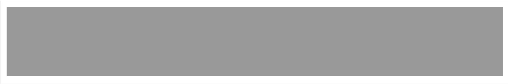

## 精灵图（雪碧图, sprite）

> 项目中将多张小图，合并成一张大图，这张大图片称为精灵图

- 优点：减少服务器发送次数，减轻服务器压力，提高页面加载速度
- 缺点：修改起来比较麻烦

精灵图使用步骤

1. 创建一个盒子，设置盒子的尺寸和小图尺寸相同
2. 将精灵图设置为盒子的背景图片
3. 修改背景图位置
   - 通过PxCook测量小图片左上角坐标，分别取**负值**设置给盒子的`background-position: x y`

```html
<style>
    .box {
        background-image: url('./img/jd-sprite.png');
        background-repeat: no-repeat;
        background-size: 113px 86.5px;
        width: 36px;
        height: 42px;
        display: inline-block;
        margin-right: 50px;
    }

    .box-1 {
        /* 背景图位置属性: 改变背景图的位置 */
        /* 水平方向位置 垂直方向位置 */
        /* 想要向左侧移动图片，位置取负数 */
        /* 想要向上移动，位置取负数 */
        background-position: 0 0;
    }

    .box-2 {
        background-position: -38.5px 0;
    }

    .box-3 {
        background-position: -77px 0;
    }

    .box-4 {
        background-position: 0 -44.5px;
    }
</style>

<div class="box box-1"></div>
<div class="box box-2"></div>
<div class="box box-3"></div>
<div class="box box-4"></div>
```

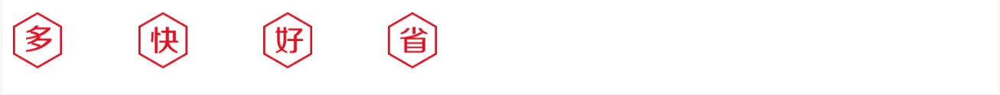

## 背景图片大小 background-size

> 设置背景图片的大小

**语法:** `background-size: 宽度 高度;`

**取值:**

| 取值    | 场景                                                         |
| ------- | ------------------------------------------------------------ |
| 数字+px | 简单方便                                                     |
| 百分比  | 相对于当前盒子自身的宽高百分比                               |
| contain | 包含，将背景图片**等比缩放**，直到**不会超出盒子**的最大，可能有留白 |
| cover   | 覆盖，将背景图片等比缩放，直到**刚好填满整个盒子**没有空白，图片可能显示不全 |

background 连写

```css
background： color image repeat position/size;
```

## 盒子阴影 box-shadow

> 给盒子添加阴影效果，吸引用户注意，体现页面的制作细节

**属性名:** `box-shadow`

| 参数     | 作用                       |
| -------- | -------------------------- |
| h-shadow | 必须，水平偏移量，允许负值 |
| v-shadow | 必须，垂直偏移量，允许负值 |
| blur     | 可选，模糊度               |
| spread   | 可选，阴影扩大             |
| color    | 可选，阴影颜色             |
| inset    | 可选，将阴影改为内部阴影   |

```html
<style>
    .box {
        width: 100px;
        height: 100px;
        box-shadow: 0 10px 50px 8px #ccc;
    }
</style>

<div class="box"></div>
```

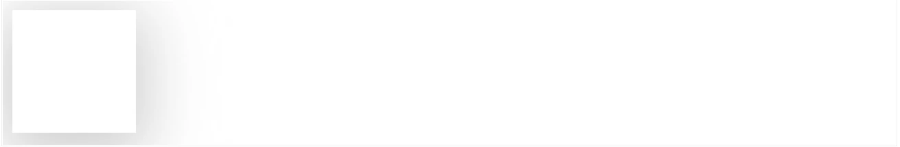

**注意:**

- 外阴影，不能添加outset，添加了会导致属性报错

## 过渡 transition

> 让元素的样式慢慢的变化，常配合hover使用，增强网页交互体验

**属性名:** `transition`

- 让元素样式慢慢变化
- 常配合 hover 使用

```css
transition 属性 时长, 属性 时长;
```

| 参数     | 取值                                                         |
| -------- | ------------------------------------------------------------ |
| 过渡属性 | `all`:所有能过渡的属性都过渡、`集体属性名如: width`:只有width有过渡 |
| 过渡时长 | 数字 + s(秒)                                                 |

注意：

- 过渡需要: 默认状态和 hover 状态 样式不同，才能有过渡效果
- transition 属性给需要过渡的元素<span style="color:red">本身加</span>
- transition 属性设置在不同状态中，效果不同
  - 给默认状态设置，鼠标移入移出都有过渡效果
  - 给 hover 状态设置，鼠标移入有过渡效果，移出没有过渡效果

```html
<style>
    /* 过渡配合hover使用，谁变化谁加过渡属性 */
    .box {
        width: 100px;
        height: 100px;
        background-color: skyblue;
        /* 如果变化的属性多，直接写all，表示所有 */
        transition: all 2s;
    }

    .box:hover {
        width: 200px;
        background-color: pink;
    }
</style>

<div class="box"></div>
```

<iframe src="https://mouday.github.io/coding-tree/blog/front-end-learn/demo/css-decorate-15.html" height="120" style="-webkit-font-smoothing: antialiased; -webkit-tap-highlight-color: transparent; text-size-adjust: none; box-sizing: border-box; font-size: 16px; border: 1px solid rgb(238, 238, 238); width: 1px; min-width: 100%; margin: 1em 0px; color: rgb(52, 73, 94); font-family: &quot;Source Sans Pro&quot;, &quot;Helvetica Neue&quot;, Arial, sans-serif; font-style: normal; font-variant-ligatures: normal; font-variant-caps: normal; font-weight: 400; letter-spacing: normal; orphans: 2; text-align: start; text-indent: 0px; text-transform: none; white-space: normal; widows: 2; word-spacing: 0px; -webkit-text-stroke-width: 0px; background-color: rgb(255, 255, 255); text-decoration-thickness: initial; text-decoration-style: initial; text-decoration-color: initial;"> </iframe>