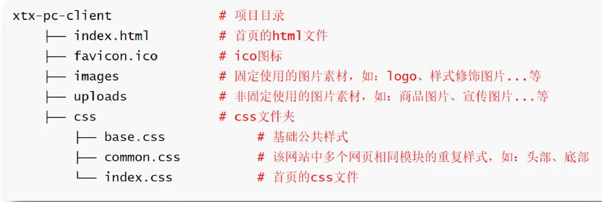

# CSS 实战1---学成在线

网站项目目录

```
index.html
css
js
img
```

**布局**: 从外到内，从上到下，从左到右

**CSS 书写顺序**

​	1. 浮动 / display

​	2. 盒子模型 margin border padding 宽度高度背景色

​	3. 文字样式

清除浏览器默认样式

```css
/* reset.css */

* {
  margin: 0;
  padding: 0;
  /* 内减模式 */
  box-sizing: border-box;
}

li {
  list-style: none;
}

a {
  text-decoration: none;
}

/* 清除浮动 */
.clearfix::before,
.clearfix::after {
  content: '';
  display: table;
}

.clearfix::after {
  clear: both;
}

body {
  background-color: #f3f5f7;
}

/* 版心居中 */
.wrapper {
  width: 1200px;
  margin: 0 auto;
}
```

控制 input placeholder 样式

```css
input::placeholder {
}
```

调节图片上下对齐

```css
img {
  vertical-align: middel; //设置图片居中对齐
}
```

通栏盒子

```css
/* 占据屏幕整个宽度 */
.box {
  width: 100%;
}
```


# CSS 实战2---小兔儿鲜

## 网站骨架结构标签

```html
<!-- 文档类型声明，告知浏览器该网页的版本，HTML5 -->
<!DOCTYPE html>

<!-- 标识网页使用的语言，中文zh-CN / 英文en，作用: 搜索引擎归类 + 浏览器翻译 -->
<html lang="en">
  <!-- 规定网页的字符编码 -->
  <meta charset="UTF-8" />

  <meta http-equiv="X-UA-Compatible" content="IE=edge,chrome=1" />

  <!-- 宽度 = 设备宽度 : 移动端网页的时候使用 -->
  <meta
    name="viewport"
    content="width=device-width, user-scalable=no, initial-scale=1.0, maximum-scale=1.0, minimum-scale=1.0"
  />
</html>
```

## SEO

Search Engine Optimization 搜索引擎优化

作用: 让网站在搜索引擎上的排名靠前

提升网站排名方法：

1. 竞价排名
2. 将网页制作成 html 后缀
3. 标签语义化，适合的地方使用合适的标签
4. ......

## SEO 三大标签

1. title : 网页标题标签
2. description : 网页描述标签
3. keywords : 网页关键词标签，英文逗号分隔

```html
<title>Coding Tree</title>

<meta name="description" content="Description" />

<meta name="keywords" content="keywords1,keywords2" />
```

## icon 图标

favicon.ico 文件放根路径

```html
<link rel="shortcut icon" href="favicon.ico" type="image/x-icon" />
```

## 项目结构搭建

文件和目录准备

```
favicon.ico

index.html  首页

css/

  base.css   基本公共的样式 清除浏览器默认样式

  common.css 重复使用样式 网页头，网页尾

  index.css  页面单独的样式

images/       固定使用的图片素材

uploads/      非固定使用的图片素材

```



base.css

```css
/* base.css 清除默认样式*/

/*清除常见标签的margin和padding*/
body,
h1,
h2,
h3,
h4,
h5,
h6,
p,
ul,
ol,
li,
dl,
dt,
dd,
input {
  margin: 0;
  padding: 0;
}

/*内减模式*/
* {
  box-sizing: border-box;
}

/*设置网页统一的字体大小，行高，字体系列 */
body {
  font: 16px/1.5 Arial, 'Microsoft Yahei', sans-serif;
  color: #333;
}

/*去除列表默认样式*/
ul,
ol {
  list-style: none;
}

/*去除默认倾斜*/
i,
em {
  font-style: normal;
}

/*去除a标签下划线，并设置默认文字颜色*/
a {
  text-decoration: none;
  color: #333;
}

/*设置img垂直对齐方式为居中对齐，去除默认下间隙*/
img {
  vertical-align: middle;
}

/* 去除input默认样式 */
input {
  border: none;
  outline: none;
  color: #333;
}

/*左浮动*/
.fl {
  float: left;
}
/*右浮动*/
.fr {
  float: right;
}

/*双伪元素清除浮动*/
.clearfix::before,
.clearfix::after {
  content: '';
  display: table;
}

.clearfix::after {
  clear: both;
}
```

common.css

```css
/* 版心居中 */
.wrapper {
  width: 1240px;
  margin: 0 auto;
}

/* 让文字看不见 */
font-size: 0;
```

绝对定位，盒子具备行内块特点

对齐方式：

1. vertical-align
2. 行高
3. 定位

常用类名

```css
prev
next
current/active
```

