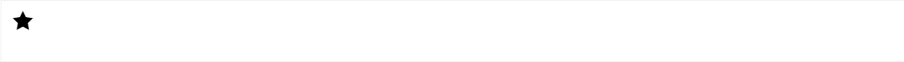

# 字体图标

> 字体图标<span style="color:red">展示的是图标，本质是字体。</span>


iconfont-阿里巴巴矢量图标库

https://www.iconfont.cn/

iconfont 支持上传 SVG 矢量图

示例：

```html
<link rel="stylesheet" href="iconfont/iconfont.css">

<i class="iconfont icon-star"></i>
```

