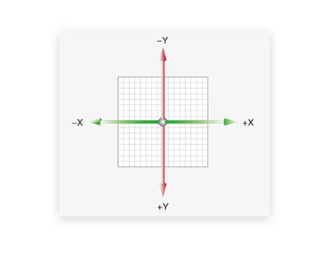
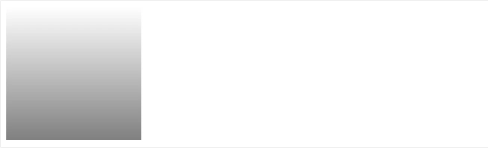

# 平面转换 transform

> 使用 `transform` 实现<span style="color:red">位移、旋转、缩放</span>等效果



平面坐标

```
   -y
-x  0  +x
   +y
```

## 位移 translate

**语法: ** `transform: translate(水平移动距离，垂直移动距离);`

**取值:**

- <span style="color:red">正负</span>均可
- 像素单位数值
- 百分比（参照盒子自身大小）

注意: <span style="color:red">X轴正方向为右，Y轴正方向为下</span>

配合过渡使用

```css
transition: all 0.5s;
```

示例：(元素居中效果)

```html
<style>
    .wrap {
        width: 500px;
        height: 200px;
        border: 1px solid #333;
        position: relative;
    }

    .box {
        left: 0;
        top: 0;

        width: 100px;
        height: 100px;
        background-color: skyblue;
        position: absolute;
        /* 过渡 */
        transition: all 0.5s;

    }

    /* 鼠标移入后居中 */
    .wrap:hover .box {
        top: 50%;
        left: 50%;

        /* 替换：margin-left: -1/2x; margin-top: -1/2y */
        transform: translate(-50%, -50%);
    }
</style>

<div class="wrap">
    <div class="box"></div>
</div>
```

<iframe src="https://mouday.github.io/coding-tree/blog/front-end-combat/demo/transform.html" height="220" style="-webkit-font-smoothing: antialiased; -webkit-tap-highlight-color: transparent; text-size-adjust: none; box-sizing: border-box; font-size: 16px; border: 1px solid rgb(238, 238, 238); width: 1px; min-width: 100%; margin: 1em 0px; color: rgb(52, 73, 94); font-family: &quot;Source Sans Pro&quot;, &quot;Helvetica Neue&quot;, Arial, sans-serif; font-style: normal; font-variant-ligatures: normal; font-variant-caps: normal; font-weight: 400; letter-spacing: normal; orphans: 2; text-align: start; text-indent: 0px; text-transform: none; white-space: normal; widows: 2; word-spacing: 0px; -webkit-text-stroke-width: 0px; background-color: rgb(255, 255, 255); text-decoration-thickness: initial; text-decoration-style: initial; text-decoration-color: initial;"></iframe>

技巧

- `translate()` 只给<span style="color:red">一个值</span>，表示<span style="color:red"> x 轴</span>方向移动距离
- 单独设置某个方向的移动：<span style="color:red">translateX()</span>, <span style="color:red">translateY()</span>

```css
/* 背景图从右显示 */
background-position: right 0;
```

示例：双开门

```html
<style>
    .box {
        width: 600px;
        height: 200px;
        border: 1px solid #333;
        position: relative;
        
        /* 超出父级范围的隐藏 */
        overflow: hidden;
    }

    .box::before,
    .box::after {
        /* 必须有content属性 */
        content: '';
        position: absolute;
        width: 50%;
        height: 100%;
        /* 过渡 */
        transition: all 0.5s;
    }

    .box::before {
        left: 0;
        top: 0;
        background-color: skyblue;
    }

    .box::after {
        right: 0;
        top: 0;
        background-color: yellow;
    }

    /* 鼠标移入 */
    .box:hover::before {
        transform: translateX(-100%);
    }

    .box:hover::after {
        transform: translateX(100%);
    }
</style>

<div class="box"></div>
```

<iframe src="https://mouday.github.io/coding-tree/blog/front-end-combat/demo/transform-2.html" height="220" style="-webkit-font-smoothing: antialiased; -webkit-tap-highlight-color: transparent; text-size-adjust: none; box-sizing: border-box; font-size: 16px; border: 1px solid rgb(238, 238, 238); width: 1px; min-width: 100%; margin: 1em 0px; color: rgb(52, 73, 94); font-family: &quot;Source Sans Pro&quot;, &quot;Helvetica Neue&quot;, Arial, sans-serif; font-style: normal; font-variant-ligatures: normal; font-variant-caps: normal; font-weight: 400; letter-spacing: normal; orphans: 2; text-align: start; text-indent: 0px; text-transform: none; white-space: normal; widows: 2; word-spacing: 0px; -webkit-text-stroke-width: 0px; background-color: rgb(255, 255, 255); text-decoration-thickness: initial; text-decoration-style: initial; text-decoration-color: initial;"></iframe>

## 旋转 rotate

**语法: **`transform: rotate(角度);`

**注意: **角度单位`deg`, 

**技巧:**  取值<span style="color:red">正负均可</span>

- 正数：顺时针
- 负数：逆时针

示例：

```html
<style>
    .box {
        margin: 0 auto;
        width: 50px;
        height: 50px;
        background-color: skyblue;
        /* 需要配合过渡 */
        transition: all 0.5s;

    }

    .box:hover {
        /* 顺时针旋转360度 */
        transform: rotate(360deg);
    }
</style>


<div class="box"></div>
```

<iframe src="https://mouday.github.io/coding-tree/blog/front-end-combat/demo/transform-rotate.html" height="70" style="-webkit-font-smoothing: antialiased; -webkit-tap-highlight-color: transparent; text-size-adjust: none; box-sizing: border-box; font-size: 16px; border: 1px solid rgb(238, 238, 238); width: 1px; min-width: 100%; margin: 1em 0px; color: rgb(52, 73, 94); font-family: &quot;Source Sans Pro&quot;, &quot;Helvetica Neue&quot;, Arial, sans-serif; font-style: normal; font-variant-ligatures: normal; font-variant-caps: normal; font-weight: 400; letter-spacing: normal; orphans: 2; text-align: start; text-indent: 0px; text-transform: none; white-space: normal; widows: 2; word-spacing: 0px; -webkit-text-stroke-width: 0px; background-color: rgb(255, 255, 255); text-decoration-thickness: initial; text-decoration-style: initial; text-decoration-color: initial;"></iframe>

## 改变转换原点 transform-origin

<span style="color:red">默认的旋转原点是盒子中心点</span>

**语法: **`transform-origin: 原点水平位置 原点垂直位置;`

取值

- <span style="color:red">方位名词 top left right bottom center</span>
- 像素单位数值
- 百分比（参照盒子自身尺寸）

示例：

```html
<style>
    .box {
        margin: 0 auto;
        width: 50px;
        height: 50px;
        background-color: skyblue;
        transition: all 0.5s;

        /* 改变旋转中心点 */
        /* 添加给标签本身，不要加到hover */
        transform-origin: right bottom;
    }

    .box:hover {
        /* 顺时针旋转360度 */
        transform: rotate(360deg);
    }
</style>


<div class="box"></div>
```

<iframe src="https://mouday.github.io/coding-tree/blog/front-end-combat/demo/transform-rotate-2.html" height="120" style="-webkit-font-smoothing: antialiased; -webkit-tap-highlight-color: transparent; text-size-adjust: none; box-sizing: border-box; font-size: 16px; border: 1px solid rgb(238, 238, 238); width: 1px; min-width: 100%; margin: 1em 0px; color: rgb(52, 73, 94); font-family: &quot;Source Sans Pro&quot;, &quot;Helvetica Neue&quot;, Arial, sans-serif; font-style: normal; font-variant-ligatures: normal; font-variant-caps: normal; font-weight: 400; letter-spacing: normal; orphans: 2; text-align: start; text-indent: 0px; text-transform: none; white-space: normal; widows: 2; word-spacing: 0px; -webkit-text-stroke-width: 0px; background-color: rgb(255, 255, 255); text-decoration-thickness: initial; text-decoration-style: initial; text-decoration-color: initial;"></iframe>

## 多重转换

```css
/* 复合属性 先后顺序不一样，效果也不一样 */
transform: translate() rotate();
```

<span style="color:red">旋转会改变坐标轴向，先旋转改变了坐标轴向，位移方向会受影响 -- 多重转换如果涉及到旋转往最后书写</span>

示例：边走边转

```html
<style>
    .wrap {
        width: 600px;
        height: 200px;
        border: 1px solid #666;
        margin: 0 auto;

    }

    .box {
        height: 200px;
        width: 200px;
        background-color: skyblue;

        border-radius: 50%;
       
        position: relative;
        overflow: hidden;
        transition: all 3s;
    }

    .box::before {
        position: absolute;

        content: '';
        width: 200px;
        height: 100px;
        background-color: yellow;
    }

    .wrap:hover .box {
        /* 旋转会改变坐标轴向 */
        transform: translate(400px) rotate(360deg);
    }
</style>

<div class="wrap">
    <div class="box"></div>
</div>
```

<iframe src="https://mouday.github.io/coding-tree/blog/front-end-combat/demo/transform-translate-rotate.html" height="240" style="-webkit-font-smoothing: antialiased; -webkit-tap-highlight-color: transparent; text-size-adjust: none; box-sizing: border-box; font-size: 16px; border: 1px solid rgb(238, 238, 238); width: 1px; min-width: 100%; margin: 1em 0px; color: rgb(52, 73, 94); font-family: &quot;Source Sans Pro&quot;, &quot;Helvetica Neue&quot;, Arial, sans-serif; font-style: normal; font-variant-ligatures: normal; font-variant-caps: normal; font-weight: 400; letter-spacing: normal; orphans: 2; text-align: start; text-indent: 0px; text-transform: none; white-space: normal; widows: 2; word-spacing: 0px; -webkit-text-stroke-width: 0px; background-color: rgb(255, 255, 255); text-decoration-thickness: initial; text-decoration-style: initial; text-decoration-color: initial;"></iframe>

## 缩放 scale

实现元素从中心点缩放效果

语法

```css
transform: scale(x轴缩放倍数, y轴缩放倍数);

/* x、y等比例缩放 */
transform: scale(缩放倍数);
```

| 效果 | 取值   | 示例       |
| ---- | ------ | ---------- |
| 放大 | 数值>1 | scale(1.2) |
| 不变 | 数值=1 | scale(1)   |
| 缩小 | 数值<1 | scale(0.8) |

示例：

```html
<style>
    .box {
        margin: 0 auto;
        height: 250px;
        width: 200px;
        border: 1px solid #666;
        overflow: hidden;
        text-align: center;
    }

    .cover {
        width: 200px;
        height: 150px;
        background-color: skyblue;
        position: relative;
    }

    .cover::after {
        /* 居中布局 */
        position: absolute;
        content: '';
        left: 50%;
        top: 50%;


        background-image: url(../img/play-circle.png);
        background-size: contain;
        width: 40px;
        height: 40px;

        transition: all .5s;

        /* 居中可以使用 margin 也可以使用 translate */
        /* 放大 */
        /* margin-left: -20px;
        margin-top: -20px; 
        transform: scale(5); */
        transform: translate(-50%, -50%) scale(5);
        /* 透明 */
        opacity: 0;
    }

    .box:hover .cover::after {
        /* transform: scale(1); */
        transform: translate(-50%, -50%) scale(1);
        opacity: 1;
    }
</style>

<div class="box">
    <div class="cover"></div>

    <p>欲把西湖比西子</p>
    <p>淡妆浓抹总相宜</p>
</div>
```

<iframe src="https://mouday.github.io/coding-tree/blog/front-end-combat/demo/transform-scale.html" height="270" style="-webkit-font-smoothing: antialiased; -webkit-tap-highlight-color: transparent; text-size-adjust: none; box-sizing: border-box; font-size: 16px; border: 1px solid rgb(238, 238, 238); width: 1px; min-width: 100%; margin: 1em 0px; color: rgb(52, 73, 94); font-family: &quot;Source Sans Pro&quot;, &quot;Helvetica Neue&quot;, Arial, sans-serif; font-style: normal; font-variant-ligatures: normal; font-variant-caps: normal; font-weight: 400; letter-spacing: normal; orphans: 2; text-align: start; text-indent: 0px; text-transform: none; white-space: normal; widows: 2; word-spacing: 0px; -webkit-text-stroke-width: 0px; background-color: rgb(255, 255, 255); text-decoration-thickness: initial; text-decoration-style: initial; text-decoration-color: initial;"></iframe>

https://www.bilibili.com/video/BV1xq4y1q7jZ?p=19&spm_id_from=pageDriver

## 渐变背景 background-image

**语法: **`background-image: linear-gradient(颜色1, 颜色2,...);`

示例 1：

```html
<style>
    .box {
        width: 200px;
        height: 200px;
        /* 逗号隔开多个值, 从透明:transparent 到半透明:rgba 渐变 */
        background-image: linear-gradient(transparent, rgba(0, 0, 0, .5));
    }
</style>

<div class="box"></div>
```



示例 2：

```html
<style>
    p {
        margin: 0;
        padding: 0;
    }

    .box {
        display: block;
        width: 200px;
        height: 150px;
        margin: 0 auto;
        position: relative;
        overflow: hidden;
    }

    .box .cover {
        width: 100%;
        height: 100%;
        object-fit: cover;
        transition: all 0.5s;
    }

    .box .title {
        position: absolute;
        width: 100%;
        height: 50px;
        padding: 10px;
        bottom: 0;
        left: 0;
        color: white;
        box-sizing: border-box;
        z-index: 2;
    }


    /* 渐变背景 */
    .box .mask {
        position: absolute;
        opacity: 0;
        transition: all 0.5s;
        width: 100%;
        height: 100%;
        top: 0;
        left: 0;
        background-image: linear-gradient(transparent,
                rgba(0, 0, 0, .6));
    }

    .box:hover .mask {
        opacity: 1;
    }

    .box:hover .cover {
        transform: scale(1.2);
    }
</style>

<a class="box"
   href="#">
    

    <div class="title">
        <p>百日依山尽</p>
    </div>

    <div class="mask"></div>
</a>
```

<iframe src="https://mouday.github.io/coding-tree/blog/front-end-combat/demo/transform-mask.html" height="170" style="-webkit-font-smoothing: antialiased; -webkit-tap-highlight-color: transparent; text-size-adjust: none; box-sizing: border-box; font-size: 16px; border: 1px solid rgb(238, 238, 238); width: 1px; min-width: 100%; margin: 1em 0px; color: rgb(52, 73, 94); font-family: &quot;Source Sans Pro&quot;, &quot;Helvetica Neue&quot;, Arial, sans-serif; font-style: normal; font-variant-ligatures: normal; font-variant-caps: normal; font-weight: 400; letter-spacing: normal; orphans: 2; text-align: start; text-indent: 0px; text-transform: none; white-space: normal; widows: 2; word-spacing: 0px; -webkit-text-stroke-width: 0px; background-color: rgb(255, 255, 255); text-decoration-thickness: initial; text-decoration-style: initial; text-decoration-color: initial;"></iframe>

