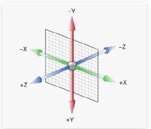
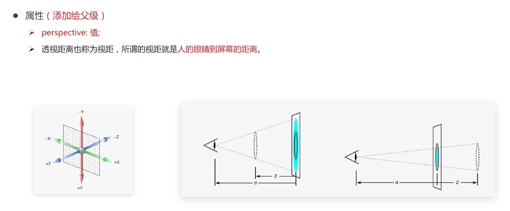

# 空间转换（3D 转换）

> 使用`transform`属性实现元素在空间内位移、旋转、缩放等效果

**空间：**是从坐标轴角度定义的。<span style="color:red">x 、y 和z</span>三条坐标轴构成了一个立体空间，<span style="color:red">z轴位置与视线方向相同。</span>

z 轴的正方向指向用户（屏幕外边方向）



**语法** 

```css
transform: translate3d(x, y, z);

transform: translateX(x);
transform: translateY(y);
transform: translateZ(z);
```

取值：

- <span style="color:red">正负</span>均可
- 百分比
- 像素值

## 透视

`perspective` 属性实现<span style="color:red">透视</span>效果

透视效果：近大远小，近实远虚

**属性:**

- <span style="color:red">父级添加属性</span>
- <span style="color:red">perspective: 值;</span>
- 取值: 像素单位数值，数值一般在 <span style="color:red">800 - 1200</span>

```css
/* 透视距离(视距): 人眼睛到屏幕的距离 */
perspective: 像素值; /* (800-1200) */
```



示例：

```html
<style>
    .box-wrap {
        perspective: 1000px;
    }

    .box {
        margin: 0 auto;
        width: 200px;
        height: 200px;
        background-color: skyblue;
        transition: all .5s;
    }

    .box:hover {
        transform: translateZ(100px);
    }
</style>

<div class="box-wrap">
    <div class="box"></div>
</div>
```

<iframe src="https://mouday.github.io/coding-tree/blog/front-end-combat/demo/transform-3d-perspective.html" height="220" style="-webkit-font-smoothing: antialiased; -webkit-tap-highlight-color: transparent; text-size-adjust: none; box-sizing: border-box; font-size: 16px; border: 1px solid rgb(238, 238, 238); width: 1px; min-width: 100%; margin: 1em 0px; color: rgb(52, 73, 94); font-family: &quot;Source Sans Pro&quot;, &quot;Helvetica Neue&quot;, Arial, sans-serif; font-style: normal; font-variant-ligatures: normal; font-variant-caps: normal; font-weight: 400; letter-spacing: normal; orphans: 2; text-align: start; text-indent: 0px; text-transform: none; white-space: normal; widows: 2; word-spacing: 0px; -webkit-text-stroke-width: 0px; background-color: rgb(255, 255, 255); text-decoration-thickness: initial; text-decoration-style: initial; text-decoration-color: initial;"></iframe>

## 空间旋转 rotate

语法

```css
transform: rotateZ(角度);
transform: rotateX(角度);
transform: rotateY(角度);
```

示例：

```html
<style>
    .box-wrap {
        margin: 0 auto;
        display: grid;
        grid-template-columns: repeat(3, 1fr);
        width: 640px;
        overflow: hidden;

        perspective: 1000px;
    }

    .box {
        width: 200px;
        height: 200px;
        /* background-color: skyblue; */
        transition: all .5s;
        background-image: url('https://api.isoyu.com/bing_images.php');
    }

    .box .cover {
        width: 100%;
        height: 100%;
        object-fit: cover;
    }

    .box-rotate-z:hover {
        /* 以z轴为中心点旋转 */
        transform: rotateZ(60deg);
    }

    .box-rotate-x:hover {
        /* 以x轴为中心点旋转 */
        transform: rotateX(60deg);
    }

    .box-rotate-y:hover {
        /* 以y轴为中心点旋转 */
        transform: rotateY(60deg);
    }
</style>

<div class="box-wrap">
    <div class="box box-rotate-z"></div>

    <div class="box box-rotate-x"></div>

    <div class="box box-rotate-y"></div>
</div>
```

<iframe src="https://mouday.github.io/coding-tree/blog/front-end-combat/demo/transform-rotate3d.html" height="220" style="-webkit-font-smoothing: antialiased; -webkit-tap-highlight-color: transparent; text-size-adjust: none; box-sizing: border-box; font-size: 16px; border: 1px solid rgb(238, 238, 238); width: 1px; min-width: 100%; margin: 1em 0px; color: rgb(52, 73, 94); font-family: &quot;Source Sans Pro&quot;, &quot;Helvetica Neue&quot;, Arial, sans-serif; font-style: normal; font-variant-ligatures: normal; font-variant-caps: normal; font-weight: 400; letter-spacing: normal; orphans: 2; text-align: start; text-indent: 0px; text-transform: none; white-space: normal; widows: 2; word-spacing: 0px; -webkit-text-stroke-width: 0px; background-color: rgb(255, 255, 255); text-decoration-thickness: initial; text-decoration-style: initial; text-decoration-color: initial;"></iframe>

## 左手法则: 判断旋转方向

<span style="color:red">左手握住旋转轴，拇指指向正值方向，手指弯曲方向为旋转正值方向</span>

## rotate3d（了解）

<span style="color:red">自定义旋转轴的位置</span>及旋转角度

```css
rotate3d(x, y, z, 角度);
```

x, y, z 取 0-1 之间的数字

## 呈现立体图形

**实现方法**

- 添加 `transform-style: preserve-3d;`
- 使子元素处于真正的<span style="color:red">3d空间</span>
- 默认值 flat，表示子元素处于 2D 平面内呈现

让子级元素处于 3d 空间中

```css
transform-style: preserve-3d;
```

示例:

```html
<style>
    .box-wrap {
        margin: 0 auto;
        width: 200px;
        height: 200px;
        position: relative;
        background-color: pink;
        transform-style: preserve-3d;
        transition: all 2s;
    }

    .box {
        top: 0;
        left: 0;
        width: 200px;
        height: 200px;
        position: absolute;
    }

    .box-front {
        background-color: green;
        transform: translateZ(200px);
    }

    .box-back {
        background-color: yellow;
    }

    .box-wrap:hover {
        transform: rotateY(180deg);
    }
</style>

<div class="box-wrap">
    <div class="box box-front"></div>
    <div class="box box-back"></div>
</div>
```

<iframe src="https://mouday.github.io/coding-tree/blog/front-end-combat/demo/transform-style.html" height="220" style="-webkit-font-smoothing: antialiased; -webkit-tap-highlight-color: transparent; text-size-adjust: none; box-sizing: border-box; font-size: 16px; border: 1px solid rgb(238, 238, 238); width: 1px; min-width: 100%; margin: 1em 0px; color: rgb(52, 73, 94); font-family: &quot;Source Sans Pro&quot;, &quot;Helvetica Neue&quot;, Arial, sans-serif; font-style: normal; font-variant-ligatures: normal; font-variant-caps: normal; font-weight: 400; letter-spacing: normal; orphans: 2; text-align: start; text-indent: 0px; text-transform: none; white-space: normal; widows: 2; word-spacing: 0px; -webkit-text-stroke-width: 0px; background-color: rgb(255, 255, 255); text-decoration-thickness: initial; text-decoration-style: initial; text-decoration-color: initial;"></iframe>

示例: 3D 导航

```html
<style>
    /* 清除样式 */
    ul {
        list-style: none;
    }

    a {
        text-decoration: none;
        color: white;
    }

    /* 导航开始 */
    .nav {
        display: flex;
        width: 300px;
        margin: 0 auto;
    }

    .nav-item {
        position: relative;

        display: block;
        width: 100px;
        line-height: 50px;
        text-align: center;
        transform-style: preserve-3d;
        transition: all .5s;

        /* 开发时看到立体盒子 */
        /* transform: rotateX(-20deg) rotateY(30deg); */
    }

    /* 中文 */
    .nav-item__zh {
        background-color: green;
        transform: translateZ(25px);
    }

    /* 英文 */
    .nav-item__en {
        position: absolute;
        top: -50%;
        width: 100%;
        background-color: orange;
        transform: rotateX(90deg);
    }

    /* 旋转立方体 */
    .nav-item:hover {
        transform: rotateX(-90deg);
    }
</style>

<div class="nav-wrap">
    <ul class="nav">
        <li><a href="#"
               class="nav-item">
                <div class="nav-item__zh">首页</div>
                <div class="nav-item__en">Index</div>
            </a>
        </li>

        <li><a href="#"
               class="nav-item">
                <div class="nav-item__zh">登录</div>
                <div class="nav-item__en">Login</div>
            </a>
        </li>

        <li><a href="#"
               class="nav-item">
                <div class="nav-item__zh">注册</div>
                <div class="nav-item__en">Register</div>
            </a>
        </li>
    </ul>
</div>
```

<iframe src="https://mouday.github.io/coding-tree/blog/front-end-combat/demo/transform-3d-nav.html" height="70" style="-webkit-font-smoothing: antialiased; -webkit-tap-highlight-color: transparent; text-size-adjust: none; box-sizing: border-box; font-size: 16px; border: 1px solid rgb(238, 238, 238); width: 1px; min-width: 100%; margin: 1em 0px; color: rgb(52, 73, 94); font-family: &quot;Source Sans Pro&quot;, &quot;Helvetica Neue&quot;, Arial, sans-serif; font-style: normal; font-variant-ligatures: normal; font-variant-caps: normal; font-weight: 400; letter-spacing: normal; orphans: 2; text-align: start; text-indent: 0px; text-transform: none; white-space: normal; widows: 2; word-spacing: 0px; -webkit-text-stroke-width: 0px; background-color: rgb(255, 255, 255); text-decoration-thickness: initial; text-decoration-style: initial; text-decoration-color: initial;"></iframe>

## 总结

```css
/* 位移 */
transform: translate3d(x, y, z);

transform: translateX(x);
transform: translateY(y);
transform: translateZ(z);

/* 旋转，效果相同*/
transform: rotate(角度);
transform: rotateZ(角度);

/* 透视距离 */
perspective: 像素值; /* (800-1200) */

/* 实现3d */
transform-style: preserve-3d;
```

# 空间缩放 scale

```css
transform: scaleX(x);
transform: scaleY(y);
transform: scaleZ(z);
transform: scale3d(x, y, z);
```

