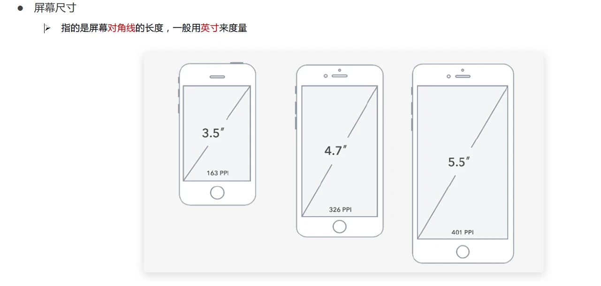
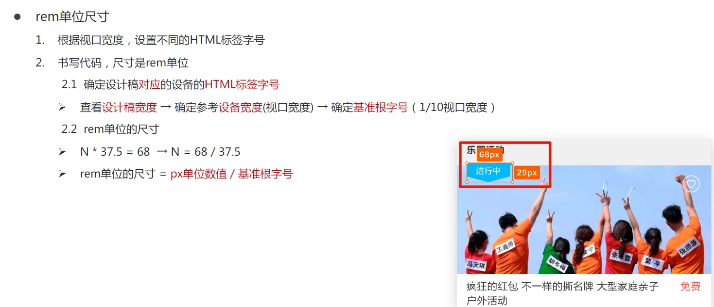
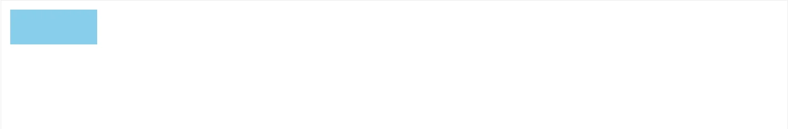

# 移动端网页适配

## 屏幕尺寸

屏幕对角线的长度，一般用英寸来度量

## PC 分辨率



```
1920 * 1080
1366 * 768
```

- 硬件(物理)分辨率 物理分辨率 不可改变，固定的
- 软件(逻辑)分辨率 逻辑分辨率 由软件驱动决定

移动端主流设备分辨率

| 手机型号    | 物理分辨率 | 逻辑分辨率 | 比例关系 |
| ----------- | ---------- | ---------- | -------- |
| iPhone6/7/8 | 750 * 1334 | 375 * 667  | 2:1      |

写代码一般基于逻辑分辨率来写的

## 视口

- 移动端网页宽度默认：`980px`
- PC 端网页宽度和屏幕宽度相同

视口的作用: 规定HTML网页标签的大小

```
网页宽度 = 逻辑宽度
```

视口标签

```html
<meta name="viewport" content="width=device-width, initial-scale=1.0" />
```

二倍图：750px

## 移动适配

解决方案：

- rem: 目前多数企业在用的解决方案
- vw / vh 未来的解决方案

## rem

- <span style="color:red">相对</span>单位
- rem 单位是相对于<span style="color:red"> HTML 标签的字号</span>计算结果
- `1rem=1HTML`字号大小

实现效果：屏幕宽度不同，网页元素尺寸不同（等比缩放）

示例:

```html
<body>
    <style>
        /* html字号默认 16px */
        .box {
            /* 16 * 5 = 80px */
            width: 5rem;
            /* 16 * 2 = 32px */
            height: 2rem;
            background-color: skyblue;
        }
    </style>

    <div class="box"></div>
</body>
```


使用 rem 需要解决的问题

- 不同设备屏幕尺寸，设置不同的 HTML 标签字号
- 设备宽度不同，HTML 标签字号设置多少合适

rem 布局方案中，将网页等分成 10 份，HTML 标签的字号为<span style="color:red">视口宽度</span>的 `1/10`

## rem 单位尺寸

确定设计稿对应的设备 HTML 标签字号



```
基准根字号 = 设备宽度（视口宽度）/ 10

rem单位的尺寸 = px单位数值 / 基准根字号

eg:

设计稿设备宽度  375px
设计稿元素宽度  75px
rem宽度 = 75px / (375px / 10) = 2rem
```

## 媒体查询

<span style="color:red">媒体查询</span> 能够<span style="color:red">检测视口的宽度</span>，设置<span style="color:red">差异化 css 样式</span>

```css
@media (媒体特性) {
  /* css样式 */
}

/* eg:  */

@media (width: 375px) {
  html {
    font-size: 37.5px;
  }
}

@media (width: 320px) {
  html {
    font-size: 32px;
  }
}
```

示例:

```html
<html>

<head>
    <meta name="viewport"
          content="width=device-width, initial-scale=1, maximum-scale=1, minimum-scale=1, user-scalable=no">
</head>

<body>
    <style>
        @media (width: 375px) {
            html {
                font-size: 37.5px;
            }
        }

        @media (width: 320px) {
            html {
                font-size: 32px;
            }
        }

        .box {
            width: 5rem;
            height: 2rem;
            background-color: skyblue;
        }
    </style>

    <div class="box"></div>
</body>

</html>
```



## flexible.js

> flexible.js 适配移动端的<span style="color:red"> js 框架</span>

原理：根据<span style="color:red">不同的视口宽度</span>，给网页 `html` 根节点设置不同的 <span style="color:red">font-size</span>

github: https://github.com/amfe/lib-flexible

示例:

```html
<html>

<head>
    <meta name="viewport"
          content="width=device-width, initial-scale=1, maximum-scale=1, minimum-scale=1, user-scalable=no">
</head>

<body>
    <style>
        .box {
            width: 5rem;
            height: 2rem;
            background-color: skyblue;
        }
    </style>

    <div class="box"></div>

    <script src="https://cdn.jsdelivr.net/npm/amfe-flexible@2.2.1/index.min.js"></script>
</body>

</html>
```

<iframe src="https://mouday.github.io/coding-tree/blog/front-end-combat/demo/flexible.js.html" height="120" style="-webkit-font-smoothing: antialiased; -webkit-tap-highlight-color: transparent; text-size-adjust: none; box-sizing: border-box; font-size: 16px; border: 1px solid rgb(238, 238, 238); width: 1px; min-width: 100%; margin: 1em 0px; color: rgb(52, 73, 94); font-family: &quot;Source Sans Pro&quot;, &quot;Helvetica Neue&quot;, Arial, sans-serif; font-style: normal; font-variant-ligatures: normal; font-variant-caps: normal; font-weight: 400; letter-spacing: normal; orphans: 2; text-align: start; text-indent: 0px; text-transform: none; white-space: normal; widows: 2; word-spacing: 0px; -webkit-text-stroke-width: 0px; background-color: rgb(255, 255, 255); text-decoration-thickness: initial; text-decoration-style: initial; text-decoration-color: initial;"></iframe>

## 长度单位：vw/vh

- 相对单位
- 相对<span style="color:red">视口的尺寸</span>计算结果

含义

- vw: viewport width
  - 1 vw = `1/100`视口宽度
- vh: viewport height
  - 1 vh = `1/100`视口高度

换算方式

```
1vw = 1/100视口宽度
1vh = 1/100视口高度

vw单位的尺寸 = px单位数值 / ( 1 / 100 * 视口宽度)
```

vw**单位尺寸**

1. 确定设计稿<span style="color:red">对应</span>的vw尺寸 (1/100视口宽度)
   - 查看<span style="color:red">设计稿宽度</span> -> 确定参考<span style="color:red">设备宽度</span> (视口宽度) -> 确定<span style="color:red">vw尺寸</span> (1/100视口宽度)
2. vw单位的尺寸 = <span style="color:red">px单位数值</span> / (1/100 视口宽度) 

例如：

```
357px宽的设备

1vw = 357px / 100 = 3.57px
// index.less
// 375的设计稿：68 * 29
.box {
  width: (68 / 3.75vw);
  height: (29 / 3.75vw);
}
```

统一使用 vw 或者 vh 作为单位