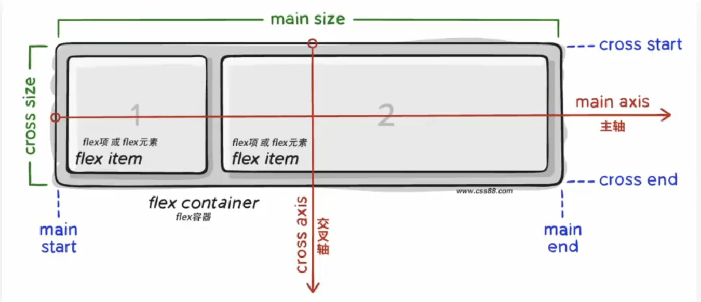
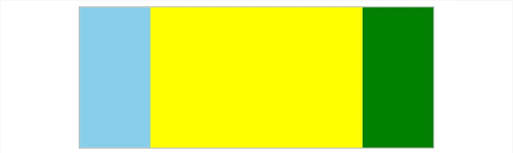
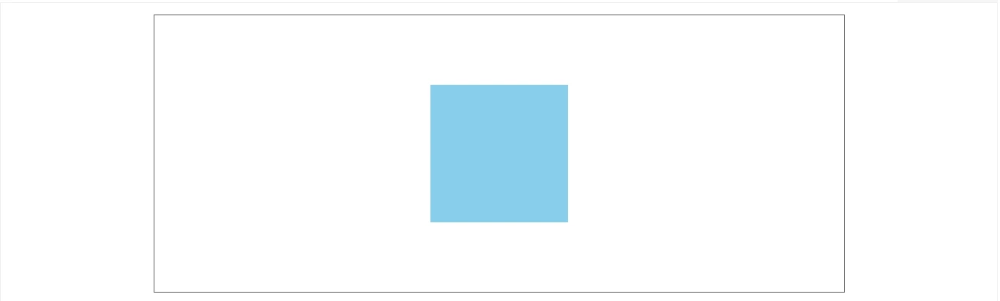
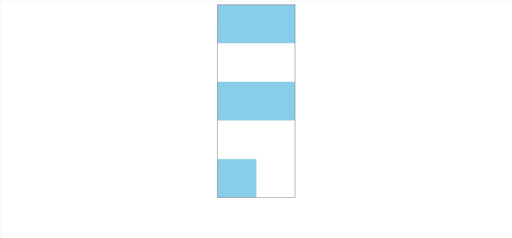
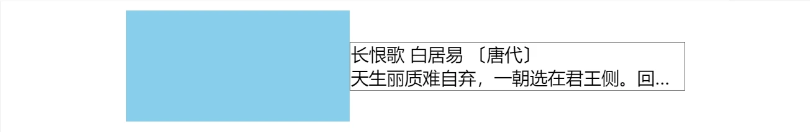

# Flex 布局

## 百分比布局

百分比布局，也叫流式布局

效果：<span style="color:red">宽度自适应，高度固定</span>

```css
width: 100%;
height: 50px;
```

百分数: 参考父级去计算

## Float 浮动布局

- 最初为了实现文字环绕
- Float 布局会造成浮动的盒子脱标，不能撑开父级容器

## Flex 布局

Flex 布局: 弹性布局

- 是一种<span style="color:red">浏览器提倡</span>的<span style="color:red">布局模型</span>
- 布局网页<span style="color:red">更简单，灵活</span>
- 避免<span style="color:red">浮动脱标</span>的问题
- 非常适合结构化布局

Flex 布局示例

```css
.box {
  display: flex;
}
```

**作用:** 

- 基于 `Flex` 精确灵活控制块级盒子的布局方式，<span style="color:red">避免浮动布局中脱离文档流现象发生</span>
- `Flex` 布局非常适合结构化布局

**设置方式:**

- 父元素(必须是亲爹)添加 `display: flex;`，子元素可以自动的挤压或拉伸

**组成部分:**	

- 弹性容器: 直接父级
- 弹性盒子: 直接子级
- <span style="color:red">主轴:</span> 默认 x 轴
- <span style="color:red">侧轴 / 交叉轴: </span>y 轴



查看 web 技术浏览器兼容性：

https://caniuse.com/

flex 容器下的元素默认水平排列：默认主轴在 x 轴，弹性盒子沿着主轴排列

## 主轴对齐方式 justify-content

Flex 布局模型中，可以调节<span style="color:red">主轴或侧轴的对齐方式</span>来设置盒子之间的间距

**修改主轴对齐方式属性:** `justify-content`

| 属性值          | 作用                                                 |
| --------------- | ---------------------------------------------------- |
| flex-start      | 默认值，起点开始依次排列                             |
| flex-end        | 终点开始依次排列                                     |
| `center`        | 沿主轴居中排列                                       |
| `space-around`  | 弹性盒子沿主轴均匀排列，空白间距均分在弹性[盒子两侧] |
| `space-between` | 弹性盒子沿主轴均匀排列，空白间距均分在相邻[盒子之间] |
| `space-evenly`  | 弹性盒子沿主轴均匀排列，弹性盒子与容器之间[间距相等] |

示例:

```html
<style>
    h3 {
        text-align: center;
    }

    .box-wrap {
        display: flex;
        margin: 0 auto;
        width: 500px;
        border: 1px solid #eee;
    }

    .box-wrap+.box-wrap {
        margin-top: 20px;
    }

    .box {
        width: 100px;
        height: 100px;
        font-size: 20px;
        line-height: 100px;
        text-align: center;
        background-color: skyblue;
    }

    /* 居中 */
    .box-center {
        justify-content: center;
    }

    /* 间距在盒子之间 */
    .box-between {
        justify-content: space-between;
    }

    /* 间距在子两侧，视觉效果：子级之间的距离是两头距离的 2 倍 */
    .box-around {
        justify-content: space-around;
    }

    /* 盒子和容器所有间距相等 */
    .box-evenly {
        justify-content: space-evenly;
    }
</style>

<h3>默认</h3>
<div class="box-wrap">
    <div class="box">1</div>
    <div class="box">2</div>
    <div class="box">3</div>
</div>

<h3>justify-content: center;</h3>
<div class="box-wrap box-center">
    <div class="box">1</div>
    <div class="box">2</div>
    <div class="box">3</div>
</div>

<h3>justify-content: space-between;</h3>
<div class="box-wrap box-between">
    <div class="box">1</div>
    <div class="box">2</div>
    <div class="box">3</div>
</div>

<h3>justify-content: space-around;</h3>
<div class="box-wrap box-around">
    <div class="box">1</div>
    <div class="box">2</div>
    <div class="box">3</div>
</div>


<h3>justify-content: space-evenly;</h3>

<div class="box-wrap box-evenly">
    <div class="box">1</div>
    <div class="box">2</div>
    <div class="box">3</div>
</div>
```

<iframe src="https://mouday.github.io/coding-tree/blog/front-end-combat/demo/flex-1.html" width="100%" height="400" style="-webkit-font-smoothing: antialiased; -webkit-tap-highlight-color: transparent; text-size-adjust: none; box-sizing: border-box; font-size: 16px; border: 1px solid rgb(238, 238, 238); width: 1px; min-width: 100%; margin: 1em 0px; color: rgb(52, 73, 94); font-family: &quot;Source Sans Pro&quot;, &quot;Helvetica Neue&quot;, Arial, sans-serif; font-style: normal; font-variant-ligatures: normal; font-variant-caps: normal; font-weight: 400; letter-spacing: normal; orphans: 2; text-align: start; text-indent: 0px; text-transform: none; white-space: normal; widows: 2; word-spacing: 0px; -webkit-text-stroke-width: 0px; background-color: rgb(255, 255, 255); text-decoration-thickness: initial; text-decoration-style: initial; text-decoration-color: initial;"> </iframe>

## 侧轴对齐方式 align-items

> 使用`align-items`调节元素在<span style="color:red">侧轴的对齐方式</span>

**修改侧轴对齐方式属性:**

- 容器属性 `align-items: `<span style="color:red">(添加到弹性容器)</span>

- 元素属性 `align-self: `控制某个弹性盒子在侧轴的对齐方式 <span style="color:red">(添加到弹性盒子)</span>

| 属性值     | 作用                                                         |
| ---------- | ------------------------------------------------------------ |
| flex-start | 默认值，起点开始依次排列                                     |
| flex-end   | 终点开始依次排列                                             |
| `center`   | 沿侧轴居中排列                                               |
| `stretch`  | <span style="color:red">默认值</span>，弹性盒子沿着主轴线被<span style="color:red">拉伸</span>至铺满容器 |

示例:

```html
<!DOCTYPE html>
<html lang="en">

<body>
    <style>

        h3{
            text-align: center;
        }
        .box-wrap {
            width: 500px;
            margin: 0 auto;
            display: flex;
            height: 200px;
            border: 1px solid #666;
        }

        .box {
            width: 100px;
            background-color: skyblue;
        }

        .box-wrap-height .box {
            height: 100px;
        }

        /* 拉伸 */
        .stretch {
            align-items: stretch;
        }

        /* 顶对齐 */
        .flex-start {
            align-items: flex-start;
        }

        /* 底对齐 */
        .flex-end {
            align-items: flex-end;
        }

        /* 上下居中 */
        .center {
            align-items: center;
        }

        .child-center .box:nth-child(2){
            align-self: center;
        }
    </style>

    <h3>子元素没有设置高度，默认撑开和父级一样高</h3>
    <div class="box-wrap">
        <div class="box"></div>
        <div class="box"></div>
        <div class="box"></div>
    </div>
    
    <h3>子元素没有设置高度，默认：align-items: stretch;</h3>
    <div class="box-wrap stretch">
        <div class="box"></div>
        <div class="box"></div>
        <div class="box"></div>
    </div>

    <h3>子元素设置高度，默认</h3>
    <div class="box-wrap box-wrap-height">
        <div class="box"></div>
        <div class="box"></div>
        <div class="box"></div>
    </div>

    <h3>子元素设置高度，默认：align-items: flex-start;</h3>
    <div class="box-wrap box-wrap-height flex-start">
        <div class="box"></div>
        <div class="box"></div>
        <div class="box"></div>
    </div>

    <h3>align-items: flex-end;</h3>
    <div class="box-wrap box-wrap-height flex-end">
        <div class="box"></div>
        <div class="box"></div>
        <div class="box"></div>
    </div>

    <h3>align-items: center;</h3>
    <div class="box-wrap box-wrap-height center">
        <div class="box"></div>
        <div class="box"></div>
        <div class="box"></div>
    </div>

    <h3>设置单独子元素 align-self: center</h3>
    <div class="box-wrap box-wrap-height child-center">
        <div class="box"></div>
        <div class="box"></div>
        <div class="box"></div>
    </div>
</body>

</html>
```

<iframe src="https://mouday.github.io/coding-tree/blog/front-end-combat/demo/flex-align.html" height="900" style="-webkit-font-smoothing: antialiased; -webkit-tap-highlight-color: transparent; text-size-adjust: none; box-sizing: border-box; font-size: 16px; border: 1px solid rgb(238, 238, 238); width: 1px; min-width: 100%; margin: 1em 0px; color: rgb(52, 73, 94); font-family: &quot;Source Sans Pro&quot;, &quot;Helvetica Neue&quot;, Arial, sans-serif; font-style: normal; font-variant-ligatures: normal; font-variant-caps: normal; font-weight: 400; letter-spacing: normal; orphans: 2; text-align: start; text-indent: 0px; text-transform: none; white-space: normal; widows: 2; word-spacing: 0px; -webkit-text-stroke-width: 0px; background-color: rgb(255, 255, 255); text-decoration-thickness: initial; text-decoration-style: initial; text-decoration-color: initial;"></iframe>

## 伸缩比 flex

**语法:** `flex: 数值;`

**取值分类:** `数值`(整数)

> 注意：<span style="color:red">占用父级剩余尺寸的份数</span>

示例:

```html
<!DOCTYPE html>
<html lang="en">

<body>
    <style>
        .box-wrap {
            width: 500px;
            margin: 0 auto;
            display: flex;
            height: 200px;
            border: 1px solid #666;
        }

        /* 固定尺寸 */
        .box-1 {
            width: 100px;
            background-color: skyblue;
        }
        
        /* 占 3/4 */
        .box-2 {
            flex: 3;
            background-color: yellow;
        }

        /* 占 1/4 */
        .box-3 {
            flex: 1;
            background-color: green;
        }
    </style>


    <div class="box-wrap">
        <div class="box box-1"></div>
        <div class="box box-2"></div>
        <div class="box box-3"></div>
    </div>

</body>

</html>
```



移动端触发区域默认大小 44x44

## 主轴方向 flex-direction

> 修改主轴方向，实现改变元素排列方向

- 主轴<span style="color:red">默认是水平方向</span>，侧轴默认是垂直方向
- 修改主轴方向属性: `flex-direction`

| 属性值         | 作用                                    |
| -------------- | --------------------------------------- |
| row            | 默认值，行，水平                        |
| `column`       | <span style="color:red">列，垂直</span> |
| row-reverse    | 行，从右往左                            |
| column-reverse | 列，从下到上                            |

示例:

```html
<!DOCTYPE html>
<html lang="en">

<body>
    <style>
        .box-wrap {
            margin: 0 auto;
            display: flex;

            /*
            	1. 先确定主轴方向
            	2. 再选择对应的属性实现主轴或侧轴的对齐方式
            */
            /* 修改主轴方向为垂直方向(列) */
            flex-direction: column;
            
            /* 视觉效果：垂直居中 */
            justify-content: center;

            /* 视觉效果：水平居中 */
            align-items: center;

            width: 500px;
            height: 200px;
            border: 1px solid #666;
        }

        .box {
            width: 100px;
            height: 100px;
            background-color: skyblue;
        }
    </style>


    <div class="box-wrap">
        <div class="box"></div>
    </div>

</body>

</html>
```



## 弹性盒子换行 flex-wrap

实现多行排列效果

语法

```css
flex-wrap: nowrap/wrap;
```

| 属性值 | 作用           |
| ------ | -------------- |
| nowrap | 默认值，不换行 |
| wrap   | 换行           |

## 行对齐方式 align-content

> 调整行对齐方式: `align-content`

- 取值和 justify-content 基本相同

| 属性值          | 作用                                                 |
| --------------- | ---------------------------------------------------- |
| flex-start      | 默认值，起点开始依次排列                             |
| flex-end        | 终点开始依次排列                                     |
| `center`        | 沿主轴居中排列                                       |
| `space-around`  | 弹性盒子沿主轴均匀排列，空白间距均分在弹性[盒子两侧] |
| `space-between` | 弹性盒子沿主轴均匀排列，空白间距均分在相邻[盒子之间] |
| `space-evenly`  | 弹性盒子沿主轴均匀排列，弹性盒子与容器之间[间距相等] |

**参考:** https://developer.mozilla.org/zh-CN/docs/Web/CSS/align-content

示例:

```html
<!DOCTYPE html>
<html lang="en">
    
<body>
    <style>
        .box-wrap {
            margin: 0 auto;
            display: flex;
            
            /* 换行显示 */
            flex-wrap: wrap;
            /* 行对齐方式 */
            align-content: space-between;

            width: 200px;
            height: 500px;
            border: 1px solid #666;
        }

        .box {
            width: 100px;
            height: 100px;
            background-color: skyblue;
        }
    </style>


    <div class="box-wrap">
        <div class="box"></div>
        <div class="box"></div>
        <div class="box"></div>
        <div class="box"></div>
        <div class="box"></div>
    </div>

</body>

</html>
```



## Flex 溢出隐藏

示例:

```html
<!DOCTYPE html>
<html lang="en">

<body>
    <style>
        .box-wrap {
            margin: 0 auto;
            display: flex;
            align-items: center;
            width: 500px;
        }

        .box-left {
            width: 200px;
            height: 100px;
            background-color: skyblue;
        }

        /* 注意父级需要增加的属性 */
        /* 溢出显示省略号 */
        /* 弹性盒子的尺寸可以被内容撑开*/
        .box-right {
            flex: 1;
            width: 0;
            border: 1px solid #666;
        }

        .box-right__content {
            text-overflow: ellipsis;
            overflow: hidden;
            white-space: nowrap;
        }
    </style>

    <div class="box-wrap">
        <div class="box-left"></div>
        <div class="box-right">
            <div class="box-right__title">长恨歌 白居易 〔唐代〕</div>
            <div class="box-right__content">天生丽质难自弃，一朝选在君王侧。回眸一笑百媚生，六宫粉黛无颜色。</div>
        </div>
    </div>
</body>

</html>
```



