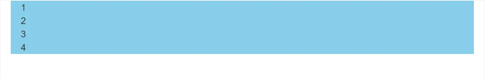

# BootStrap

- github：https://github.com/twbs/bootstrap
- Bootstrap 官网：https://getbootstrap.com/
- Bootstrap 中文文档：https://www.bootcss.com/
- 全局样式
- 字体图标
- 组件
- 插件

## BootStrap 使用步骤

1、引入 css 代码

```html
<!-- Bootstrap 核心 CSS 文件 -->
<link rel="stylesheet" href="./bootstrap@3.4.1/css/bootstrap.min.css" />
```

2、使用样式类名

```html
<!-- 响应式布局版心类 -->
<div class="container"></div>
```

代码示例

```html
<body>
      <!-- 最新版本的 Bootstrap 核心 CSS 文件 -->
      <link rel="stylesheet"
            href="https://stackpath.bootstrapcdn.com/bootstrap/3.4.1/css/bootstrap.min.css"
            integrity="sha384-HSMxcRTRxnN+Bdg0JdbxYKrThecOKuH5zCYotlSAcp1+c8xmyTe9GYg1l9a69psu"
            crossorigin="anonymous">
      <div class="container">1</div>
</body>
```

## BootStrap 栅格系统

实现响应式网页布局

栅格化：网页宽度等分为 12 等份

|                     | 超小屏幕 | 小屏幕   | 中等屏幕   | 大屏幕       |
| ------------------- | -------- | -------- | ---------- | ------------ |
| 设备                | 手机     | 平板     | 桌面显示器 | 大桌面显示器 |
| 响应断点            | <768px   | ≥768px   | ≥992px     | ≥1200px      |
| 别名                | xs       | sm       | md         | lg           |
| 容器宽度(container) | 100%     | 750px    | 970px      | 1170px       |
| 类前缀              | col-xs-* | col-sm-* | col-md-*   | col-lg-*     |
| 列（column）数      | 12       | 12       | 12         | 12           |
| 槽（gutter）宽      | 30px     | 30px     | 30px       | 30px         |

栅格示例:

```html
<body>
      <!-- 最新版本的 Bootstrap 核心 CSS 文件 -->
      <link rel="stylesheet"
            href="https://stackpath.bootstrapcdn.com/bootstrap/3.4.1/css/bootstrap.min.css"
            integrity="sha384-HSMxcRTRxnN+Bdg0JdbxYKrThecOKuH5zCYotlSAcp1+c8xmyTe9GYg1l9a69psu"
            crossorigin="anonymous">

      <style>
            .container div {
                  background-color: skyblue;
            }
      </style>

      <div class="container">
            <!-- 大屏一行4个 中屏一行2个 小屏一行1个 -->
            <div class="col-lg-3 col-md-6 col-sm-12">1</div>
            <div class="col-lg-3 col-md-6 col-sm-12">2</div>
            <div class="col-lg-3 col-md-6 col-sm-12">3</div>
            <div class="col-lg-3 col-md-6 col-sm-12">4</div>
      </div>
</body>
```



## BootStrap 常用类

- `.container` 指定宽度并居中，自带间距 15px
- `.container-fluid` 宽度为 100%
- `.row` 布局行 自带间距-15px
- `.col` 布局列

```html
<!-- 有一个15px的间距-->
<div class="container"></div>

<!-- 使用row自带的-15px间距抵消container的15px间距-->
<div class="container">
  <div class="row"></div>
</div>
```

## BootStrap 查找手册

全局 CSS 样式 https://v3.bootcss.com/css/

示例

```html
<body>
      <!-- 最新版本的 Bootstrap 核心 CSS 文件 -->
      <link rel="stylesheet"
            href="https://stackpath.bootstrapcdn.com/bootstrap/3.4.1/css/bootstrap.min.css"
            integrity="sha384-HSMxcRTRxnN+Bdg0JdbxYKrThecOKuH5zCYotlSAcp1+c8xmyTe9GYg1l9a69psu"
            crossorigin="anonymous">

      <div class="container">
            <button class="btn btn-success">确定</button>

            <button class="btn btn-warning">确定</button>
      </div>
</body>
```


使用插件需要引入以下文件

```
bootstrap.min.css

// 需要注意先后顺序
jquery.js
bootstrap.min.js
```

响应式网站：

- 适合：元素内容较少的网站，例如：企业站
- 不适合：元素较多的网站，不适合做响应式，最好分开做