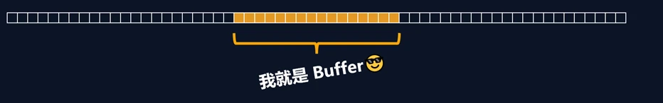

# Buffer（缓冲器）

## 概念

Buffer 是一个类似于数组的 `对象` ，用于表示固定长度的字节序列

Buffer 本质是一段内存空间，专门用来处理 `二进制数据` 。



## 特点

1. Buffer 大小固定且无法调整
2. Buffer 性能较好，可以直接对计算机内存进行操作
3. 每个元素的大小为 1 字节（byte）


## 使用

### 创建 Buffer

Node.js 中创建 Buffer 的方式主要如下几种：

1. `Buffer.alloc`

   ```js
   // 创建了一个长度为 10 字节的 Buffer，相当于申请了 10 字节的内存空间，每个字节的值为 0
   let buf_1 = Buffer.alloc(10) //=>结果为<Buffer 00 00 00 00 00 00 00 00 00 00>
   ```

2. `Buffer.allocUnsafe`

   ```js
   // 创建了一个长度为 10 字节的 Buffer，buffer 中可能存在旧数据，可能会影响执行结果，所以叫 unsafe ，但是效率比 alloc 高
   let buf_2 = Buffer.allocUnsafe(10)
   ```


3. `Buffer.from`

   ```js
   // 通过字符串创建 Buffer
   let buf_3 = Buffer.from('hello')
   // 通过数组创建 Buffer
   let buf_4 = Buffer.from([105, 108, 111, 118, 101, 121, 111, 117])
   ```

   

### Buffer 与字符串的转化

> 我们可以借助 `toString` 方法将 Buffer 转为字符串

```js
let buf_4 = Buffer.from([105, 108, 111, 118, 101, 121, 111, 117])
console.log(buf_4.toString()) //=>iloveyou
```

**注意: **`toString` 默认是按照 `utf-8` 编码方式进行转换的

### Buffer 的读写

> Buffer 可以直接通过 `[]` 的方式对数据进行处理。

```js
let buf_3 = Buffer.from('hello')
// 读取
console.log(buf_3[1]) //=>101
// 修改
buf_3[1] = 97
//查看字符串结果
console.log(buf_3.toString()) //=>hallo
```

**注意:**

1. 如果修改的数值超过 `255` ，则<span style="color:red">超过</span> `8` 位数据会被舍弃
2. 一个 `utf-8` 的字符 <span style="color:red">一般</span> 占3个字节
