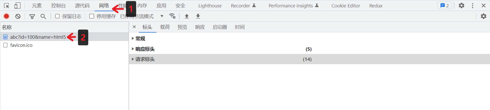
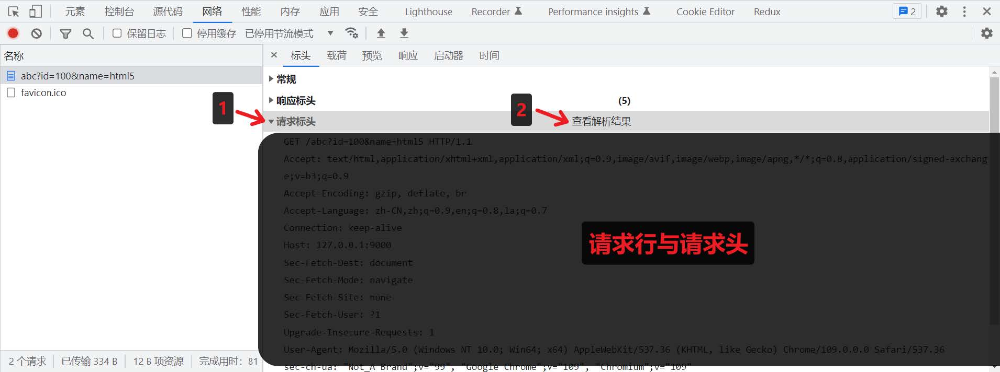
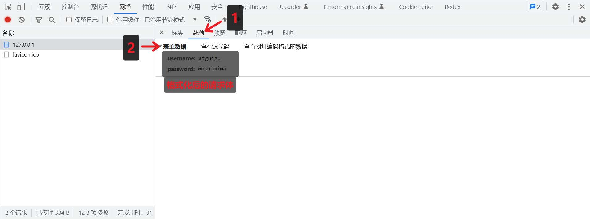
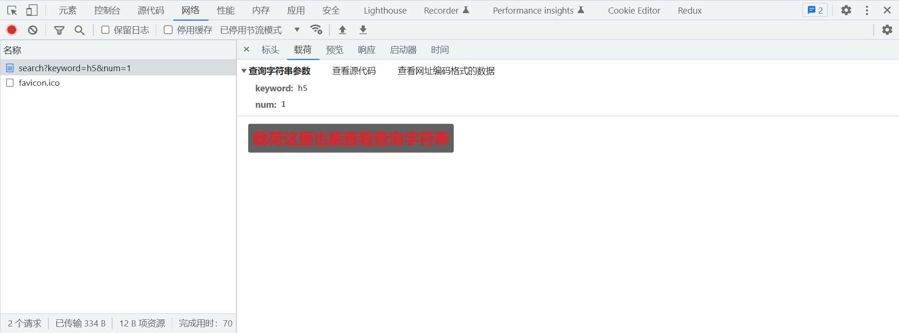
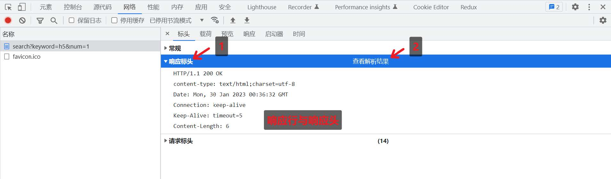
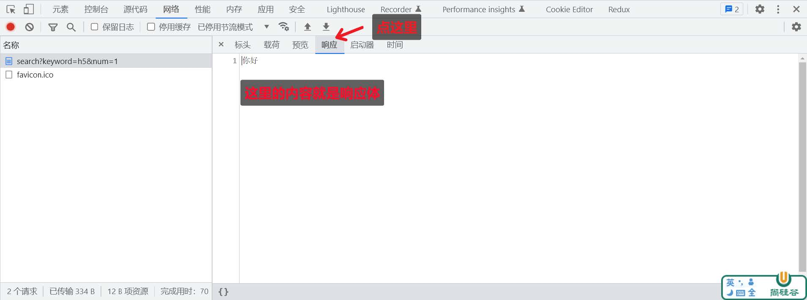
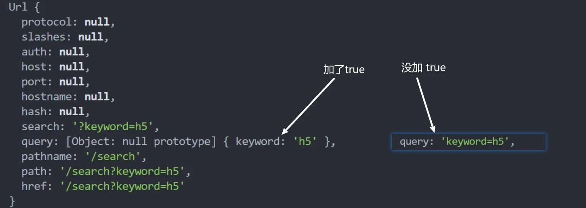
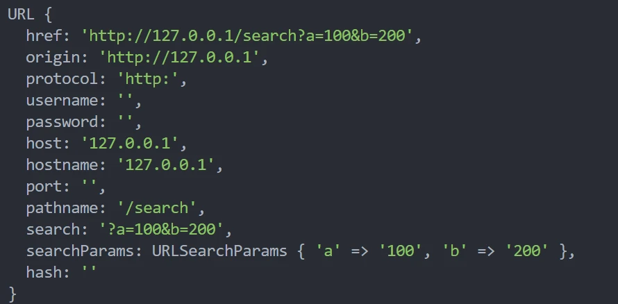
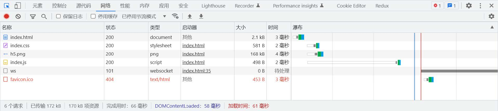

# HTTP 协议

## 概念

> HTTP（hypertext transport protocol）协议；中文叫 <span style="color:red">超文本传输协议</span>

是一种基于TCP/IP的应用层通信协议

这个协议详细规定了 `浏览器` 和 万维网 `服务器` 之间互相通信的规则

协议中主要规定了两个方面的内容:

- 客户端：用来向服务器发送数据，可以被称之为 <span style="color:red">请求报文</span>

- 服务端：向客户端返回数据，可以被称之为 <span style="color:red">响应报文</span>

> 报文：可以简单理解为就是一堆字符串

## 请求报文的组成

- 请求行
- 请求头
- 空行
- 请求体

## **HTTP** 的请求行

- 请求方法（get、post、put、delete等）

- 请求 URL（统一资源定位器）

  例如：http://www.baidu.com/index.html?a=100&b=200#logo

  - http:          协议 (https、ftp、ssh等)
  - www.baidu.com  域名
  - 80             端口号
  - /index.html     路径
  - a=100&b=200     查询字符串
  - #logo           哈希 (锚点链接)

- HTTP协议版本号

## HTTP 请求头

格式：『头名：头值』

常见的请求头有：

| 请求头                    | 解释                                                         |
| ------------------------- | ------------------------------------------------------------ |
| Host                      | 主机名                                                       |
| Connection                | 连接的设置 keep-alive（保持连接）；close（关闭连接）         |
| Cache-Control             | 缓存控制 max-age = 0 （没有缓存）                            |
| Upgrade-Insecure-Requests | 将网页中的http请求转化为 https 请求（很少用）老网站升级      |
| User-Agent                | 用户代理，客户端字符串标识，服务器可以通过这个标识来识别这个请求来自哪个客户端 ，一般在PC端和手机端的区分 |
| Accept                    | 设置浏览器接收的数据类型                                     |
| Accept-Encoding           | 设置接收的压缩方式                                           |
| Accept-Language           | 设置接收的语言 q=0.7 为喜好系数，满分为1                     |
| Cookie                    | 后面单独讲                                                   |

## HTTP 的请求体

请求体内容的格式是非常灵活的，

（可以是空）==> GET请求，

（也可以是字符串，还可以是JSON）===> POST请求

例如：

- 字符串：keywords=手机&price=2000

- JSON：{"keywords":"手机","price":2000}

## 响应报文的组成

- 响应行:  `HTTP/1.1 200 OK`

  - HTTP/1.1：HTTP协议版本号

  - 200：响应状态码 404 Not Found 500 Internal Server Error

    还有一些状态码，参考：https://developer.mozilla.org/zh-CN/docs/Web/HTTP/Status

    OK：响应状态描述

> 响应状态码 和 响应字符串 关系是 一一对应 的。

- 响应头
  - `Cache-Control`: 缓存控制 private 私有的，只允许客户端缓存数据
  - `Connection`: 链接设置
  - `Content-Type:text/html;charset=utf-8`: 设置响应体的数据类型以及字符集,响应体为html，字符集utf-8
  - `Content-Length`: 响应体的长度，单位为字节

- 空行 

- 响应体

  响应体内容的类型是非常灵活的，常见的类型有 HTML、CSS、JS、图片、JSON

## 创建 **HTTP** 服务

使用 nodejs 创建 HTTP 服务

### 操作步骤

```js
//1. 导入 http 模块
const http = require('http');


//2. 创建服务对象 create 创建 server 服务
// request 意为请求. 是对请求报文的封装对象, 通过 request 对象可以获得请求报文的数据
// response 意为响应. 是对响应报文的封装对象, 通过 response 对象可以设置响应报文
const server = http.createServer((request, response) => { 		
    // 设置响应体
    response.end('Hello HTTP server');
});  //=>返回结果是一个对象

//3. 监听端口, 启动服务
server.listen(9000, () => {
	console.log('服务已经启动, 端口 9000 监听中...');
});
```

> `http.createServer` 里的回调函数的执行时机： <span style="color:red">当接收到 HTTP 请求的时候，就会执行</span>

### 测试

浏览器请求对应端口

```js
http://127.0.0.1:9000
```

### 注意事项

1. 命令行 `ctrl + c` 停止服务

2. 当服务启动后，更新代码 <span style="color:red">必须重启服务才能生效</span>

3. 响应内容中文乱码的解决办法

   ```js
   // 设置响应头
   response.setHeader('content-type','text/html;charset=utf-8');
   ```

4. 端口号被占用

   `Error: listen EADDRINUSE: address already in use :::9000`

   1）关闭当前正在运行监听端口的服务 （ <span style="color:red">使用较多</span> ）

   2）修改其他端口号

5. `HTTP` 协议<span style="color:red">默认端口</span>是 `80` 。`HTTPS` 协议的<span style="color:red">默认端口</span>是 `443`, HTTP 服务开发常用端口有 `3000`，`8080`，`8090`，`9000` 等

> 如果端口被其他程序占用，可以使用 <span style="color:red">资源监视器</span> 找到占用端口的程序，然后使用 <span style="color:red">任务管理器</span> 关闭对应的程序

## 浏览器查看 HTTP 报文

点击步骤



### 查看请求行与请求头



### 查看请求体



### 查看 **URL** 查询字符串



### 查看响应行与响应头



### 查看响应体



## 获取 HTTP 请求报文

| 含义           | 语法                                                         | 重点掌握 |
| :------------- | :----------------------------------------------------------- | :------- |
| 请求方法       | `request.method`                                             | *****    |
| 请求版本       | request.httpVersion                                          |          |
| 请求路径       | `request.url`                                                | *****    |
| URL 路径       | `require('url').parse(request.url).pathname`                 | *****    |
| URL 查询字符串 | `require('url').parse(request.url,  true).query`             | *****    |
| 请求头         | `request.headers`                                            | *****    |
| 请求体         | request.on('data', function(chunk){})<br>request.on('end', function(){}) |          |

```js
// 1. 导入 http 模块
const http = require('http')

// 2. 创建服务对象
const server = http.createServer((request, response) => {
  // 获取请求的方法
  console.log(request.method)  //=>GET
  // 获取请求的 url
  console.log(request.url)  // 只包含 url 中的 路径 与查询字符串
  // 获取 http 协议的版本号
  console.log(request.httpVersion)  //=> 1.1
  // 获取 http 的请求头
  console.log(request.headers) //=>结果是一个对象
  response.end('http') //=>设置响应体
})

// 3. 监听端口，启动服务
server.listen(9000, () => {
  console.log('服务已经启动...')
})
```

**注意事项：** 

1. `request.url` 只能获取路径以及查询字符串，无法获取 URL 中的域名以及协议的内容
2. `request.headers` 将请求信息转化成一个对象，并将属性名都转化成了『小写』
3. 关于路径：如果访问网站的时候，只填写了 IP 地址或者是域名信息，此时请求的路径为『 `/` 』
4. 关于 `favicon.ico`：这个请求是属于浏览器自动发送的请求


提取 http 报文的请求体

```js
// 1. 导入 http 模块
const http = require('http')

// 2. 创建服务对象
const server = http.createServer((request, response) => {
  // 1. 声明一个变量
  let body = ''
  // 2. 绑定 data 事件
  request.on('data', chunk => {
    body += chunk
  })
  // 3. 绑定 end 事件
  request.on('end', () => {
    console.log(body)  //=>'username=111&password=111'
    // 响应
    response.end('Hello Http') //=>设置响应体 
  })
})

// 3. 监听端口，启动服务
server.listen(9000, () => {
  console.log('服务已经启动...')
})
```

提取 http 报文中 url的路径 与 查询字符串

```js
// 导入 http 模块
const http = require('http')
// 1. 导入 url 模块
const url = require('url')

// 创建服务对象
const server = http.createServer((request, response) => {
  // 2. 解析 request.url
  console.log(request.url)   //=>/search?keyword=h5
  // 使用 parse 解析 request.url 的内容
  // true 将 query 属性将会设置为一个 对象
  let res = url.parse(request.url, true)
  console.log(res)  // 如下图所示，为一个对象
  // 路径
  let pathname = res.pathname
  // 查询字符串
  let keyword = res.query.keyword
  console.log(keyword)   //=>h5
  response.end('url')
})

// 监听端口，启动服务
server.listen(9000, () => {
  console.log('服务已经启动...')
})
```

```js
// 导入 http 模块
const http = require('http')

// 创建服务对象
const server = http.createServer((request, response) => {
  // 实例化 url 对象
  // let url = new URL('/search?a=100&b=200','http://127.0.0.1:9000')
  let url = new URL(request.url, 'http://127.0.0.1')
  console.log(url)  //=>如图所示，为一个对象
  // 输出路径
  console.log(url.pathname)  //=>/search
  // 输出 keyword 查询字符串
  console.log(url.searchParams.get('a'))  //=> 100
  response.end('url new')
})

// 监听端口，启动服务
server.listen(9000, () => {
  console.log('服务已经启动...')
})
```



### 练习

按照以下要求搭建 HTTP 服务

| 请求类型**(**方法**)** | 请求地址 | 响应体结果 |
| ---------------------- | -------- | ---------- |
| get                    | /login   | 登录页面   |
| get                    | /reg     | 注册页面   |

```js
//1、引入http模块
const http = require("http");

//2、建立服务
const server = http.createServer((request,response)=>{ 
    let {url, method} = request; //对象的解构赋值

	//设置响应头信息
	//解决中文乱码
	response.setHeader("Content-Type","text/html;charset=utf-8") 
    if(url == "/register" && method == "GET"){
		response.end("注册页面");
	}else if(url=="/login" && method == "GET"){
		response.end("登录页面");
	}else{
		response.end("<h1>404 Not Found</h1>")
	}
})

//3、监听端口
server.listen(8000,()=>{
	console.log('服务启动中....');
})
```

## 设置 **HTTP** 响应报文

| 作用             | 语法                                               |
| ---------------- | -------------------------------------------------- |
| 设置响应状态码   | response.statusCode                                |
| 设置响应状态描述 | response.statusMessage （ 用的非常少 ）            |
| 设置响应头信息   | response.setHeader('头名', '头值')  (`可以自定义`) |
| 设置响应体       | response.write('xx')<br/>response.end('xxx')       |

```js
// 1. 设置响应状态码
response.statusCode = 203
// 2. 响应状态的描述
response.statusMessage = 'i love you'
// 3. 响应头
response.setHeader('content-type', 'text/html;charset=utf-8')
// 自定义响应头
response.setHeader('myHeader', 'test test')
// 设置多个同名的响应头
response.setHeader('test', ['a', 'b', 'c'])
```

```js
// write 和 end 的两种使用情况：
// 1. write 和 end 的结合使用 响应体相对分散
response.write('xx');
response.write('xx');
response.write('xx');
response.end(); //每一个请求，在处理的时候必须要执行 end 方法的

//2. 单独使用 end 方法 响应体相对集中
response.end('xxx');
```

### 练习

搭建 HTTP 服务，响应一个 4 行 3 列的表格，并且要求表格有 `隔行换色效果` ，且 `点击` 单元格能 `高亮显示`

**方法一**

```js
// 导入 http 模块
const http = require('http')
const fs = require('fs')

// 创建服务对象
const server = http.createServer((request, response) => {
  response.setHeader('content-type', 'text/html;charset=utf-8')
  response.end(`
    <!DOCTYPE html>
    <html lang="en">

    <head>
      <meta charset="UTF-8">
      <meta http-equiv="X-UA-Compatible" content="IE=edge">
      <meta name="viewport" content="width=device-width, initial-scale=1.0">
      <title>Document</title>
      <style>
        td {
          padding: 20px 40px;
        }

        table tr:nth-child(odd) {
          background-color: #aef;
        }

        table tr:nth-child(even) {
          background-color: #fcb;
        }

        table,
        td {
          border-collapse: collapse;
        }
      </style>
    </head>

    <body>
      <table border="1">
        <tr>
          <td></td>
          <td></td>
          <td></td>
        </tr>
        <tr>
          <td></td>
          <td></td>
          <td></td>
        </tr>
        <tr>
          <td></td>
          <td></td>
          <td></td>
        </tr>
        <tr>
          <td></td>
          <td></td>
          <td></td>
        </tr>
      </table>
      <script>
        const tds = document.querySelectorAll('td')
        tds.forEach(item => {
          item.addEventListener('click', function () {
            this.style.backgroundColor = '#000'
          })
        })
      </script>
    </body>

    </html>
  `)
})

// 监听端口，启动服务器
server.listen(9000, () => {
  console.log('服务器已经启动...')
})
```

方法二

```js
// 导入 http 模块
const http = require('http')
const fs = require('fs')

// 创建服务对象
const server = http.createServer((request, response) => {
  response.setHeader('content-type', 'text/html;charset=utf-8')
  // 读取文件内容
  let html = fs.readFileSync(__dirname + '/table.html')
  // end 方法的参数可以是字符串也可以是Buffer
  response.end(html)
})

// 监听端口，启动服务器
server.listen(9000, () => {
  console.log('服务器已经启动...')
})
```

table.html

```html
<!DOCTYPE html>
<html lang="en">

<head>
  <meta charset="UTF-8">
  <meta http-equiv="X-UA-Compatible" content="IE=edge">
  <meta name="viewport" content="width=device-width, initial-scale=1.0">
  <title>Document</title>
  <style>
    td {
      padding: 20px 40px;
    }

    table tr:nth-child(odd) {
      background-color: #aef;
    }

    table tr:nth-child(even) {
      background-color: #fcb;
    }

    table,
    td {
      border-collapse: collapse;
    }
  </style>
</head>

<body>
  <table border="1">
    <tr>
      <td></td>
      <td></td>
      <td></td>
    </tr>
    <tr>
      <td></td>
      <td></td>
      <td></td>
    </tr>
    <tr>
      <td></td>
      <td></td>
      <td></td>
    </tr>
    <tr>
      <td></td>
      <td></td>
      <td></td>
    </tr>
  </table>
  <script>
    const tds = document.querySelectorAll('td')
    tds.forEach(item => {
      item.addEventListener('click', function () {
        this.style.backgroundColor = '#000'
      })
    })
  </script>
</body>

</html>
```


## 网页资源的基本加载过程




网页资源的加载都是循序渐进的，首先获取 HTML 的内容， 然后解析 HTML 在发送其他资源的请求，如 CSS，Javascript，图片等。<span style="color:red">理解了这个内容对于后续的学习与成长有非常大的帮助</span>

## 静态资源服务

`静态资源` 是指 <span style="color:red">内容长时间不发生改变的资源</span> ，例如图片，视频，CSS 文件，JS文件，HTML文件，字体文件等

`动态资源` 是指 <span style="color:red">内容经常更新的资源</span> ，例如百度首页，网易首页，京东搜索列表页面等

### 网站根目录或静态资源目录

HTTP 服务在哪个文件夹中寻找静态资源，那个文件夹就是 <span style="color:red">静态资源目录</span> ，也称之为 <span style="color:red">网站根目录</span>

> 思考：vscode 中使用 live-server 访问 HTML 时， 它启动的服务中网站根目录是谁？
>
> - 改文件的所处的文件夹

### 网页中的 **URL**

网页中的 URL 主要分为两大类：`相对路径` 与 `绝对路径`

#### 绝对路径

绝对路径可靠性强，而且相对容易理解，在项目中运用较多

| 形式                                              | 特点                                                         |
| ------------------------------------------------- | ------------------------------------------------------------ |
| [http://atguigu.com/w eb](http://atguigu.com/web) | 直接向目标资源发送请求，容易理解。网站的外链会用到此形式     |
| //atguigu.com/web                                 | 与页面 URL 的协议拼接形成完整 URL 再发送请求。大型网站用的比较多 |
| /web                                              | 与页面 URL 的协议、主机名、端口拼接形成完整 URL 再发送请求。中小型网站 |

#### 相对路径

相对路径在发送请求时，需要与当前页面 URL 路径进行 `计算` ，得到完整 URL 后，再发送请求，学习阶段用的较多

例如当前网页 url 为 http://www.atguigu.com/course/h5.html

| 形式               | 最终的 **URL**                            |
| ------------------ | ----------------------------------------- |
| ./css/app.css      | http://www.atguigu.com/course/css/app.css |
| js/app.js          | http://www.atguigu.com/course/js/app.js   |
| ../img/logo.png    | http://www.atguigu.com/img/logo.png       |
| ../../mp4/show.mp4 | http://www.atguigu.com/mp4/show.mp4       |

#### 网页中使用 **URL** 的场景小结

包括但不限于如下场景：

- a 标签 href
- link 标签 href
- script 标签 src 
- img 标签 src
- video audio 标签 src
- form 中的 action
- AJAX 请求中的 URL


### 设置资源类型（**mime**类型）

`媒体类型`（通常称为 Multipurpose Internet Mail Extensions 或 MIME 类型 ）是一种标准，用来表示文档、文件或字节流的性质和格式。

```
mime 类型结构： [type]/[subType]

例如： text/html text/css image/jpeg image/png application/json
```

HTTP 服务可以设置响应头 Content-Type 来表明响应体的 MIME 类型，浏览器会根据该类型决定如何处理资源

下面是常见文件对应的 mime 类型

```js
html: 'text/html',
css: 'text/css',
js: 'text/javascript',
png: 'image/png',
jpg: 'image/jpeg', 
gif: 'image/gif',
mp4: 'video/mp4',
mp3: 'audio/mpeg',
json: 'application/json'
```

> 对于未知的资源类型，可以选择 `application/octet-stream` 类型，浏览器在遇到该类型的响应时，会对响应体内容进行独立存储，也就是我们常见的 `下载` 效果

```js
require('http').createServer((request,response)=>{
	//获取请求的方法已经路径
	let {url,method} = request;
	//判断请求方式以及请求路径
	if(method == "GET" && url == "/index.html"){
		//需要响应文件中的内容
		let data = require('fs').readFileSync( dirname + '/index.html');
         response.end(data);
	}else if(method == "GET" && url == "/css/app.css"){
		//需要响应文件中的内容
		let data = require('fs').readFileSync( dirname + '/public/css/app.css');
		response.end(data);
	}else if(method == "GET" && url == "/js/app.js"){
		//需要响应文件中的内容
		let data = require('fs').readFileSync( dirname + '/public/js/app.js');
         response.end(data);
	}else{
		//404响应
         response.statusCode = 404;
		response.end("<h1>404 Not Found</h1>");
	}
}).listen(80,()=>{

console.log('80端口正在启动中....');

})
```

很明显上面的代码，当只要有一个请求路径就需要进行判断，显然这种方式不够完美，那么我们需要封装

```js
require('http').createServer((request,response)=>{
	//获取请求的方法已经路径
	let {url,method} = request;
	//文件夹路径  根路径
	let rootDir = dirname + '/public';
	//拼接文件路径
	let filePath = rootDir + url;
	//读取文件内容
    fs.readFile(filePath,(err,data)=>{
		//判断
        if(err){
			//如果出现错误，响应404状态码
            response.statusCode = 404; 
            response.end('<h1>404 Not Found</h1>');
		}else{
			//响应文件内容
            response.end(data);
		}
	})
}).listen(80,()=>{
	console.log('80端口正在启动中....');
})
```


### GET **和** POST **请求场景小结**

GET 请求的情况：

- 在地址栏直接输入 url 访问
- 点击 a 链接
- link 标签引入 css
- script 标签引入 js
- img 标签引入图片
- form 标签中的 method 为 get （不区分大小写）
- ajax 中的 get 请求

POST 请求的情况：

- form 标签中的 method 为 post（不区分大小写）

- AJAX 的 post 请求


## **GET**和**POST**请求的区别

`GET` 和 `POST` 是 HTTP 协议请求的两种方式。

- `GET` 主要用来获取数据，`POST` 主要用来提交数据
- `GET` 带参数请求是将参数缀到 URL 之后，在地址栏中输入 url 访问网站就是 GET 请求，`POST` 带参数请求是将参数放到请求体中
- `POST` 请求相对 `GET` 安全一些，因为在浏览器中参数会暴露在地址栏
- `GET` 请求大小有限制，一般为 2K，而 POST 请求则没有