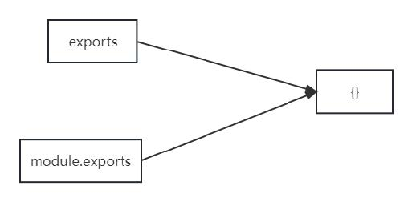
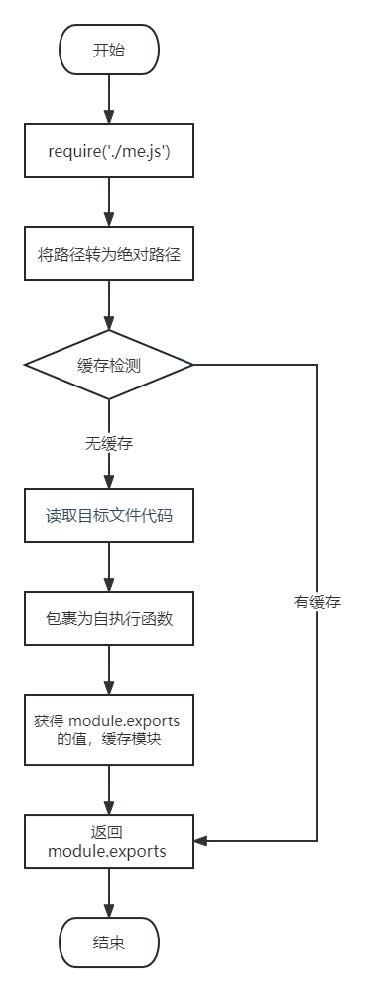

# Node.js 模块化

## 介绍

### 什么是模块化与模块 ?

> 将一个复杂的程序文件依据一定规则（规范）拆分成多个文件的过程称之为 `模块化`

其中拆分出的 <span style="color:red">每个文件就是一个模块</span>，模块的内部数据是私有的，不过模块可以暴露内部数据以便其他模块使用

### 什么是模块化项目 ?

> 编码时是按照模块一个一个编码的， 整个项目就是一个模块化的项目

### 模块化好处

下面是模块化的一些好处：

1. 防止命名冲突

2. 高复用性

3. 高维护性

## 模块暴露数据

### 模块初体验

可以通过下面的操作步骤，快速体验模块化

1. 创建 me.js

   ```js
   //声明函数
   function tiemo(){
   	console.log('贴膜....');
   }
   //暴露数据
   module.exports = tiemo;
   ```

2. 创建 index.js

   ```js
   //导入模块
   const tiemo = require('./me.js');
   //调用函数
   tiemo(); //=> 贴膜....
   ```


### 暴露数据

模块暴露数据的方式有两种：

1. `module.exports` = value

2. `exports.name` = value

> 使用时有几点注意：
>
> - `module.exports` 可以暴露 <span style="color:red">任意</span> 数据
> - 不能使用 `exports = value` 的形式暴露数据，模块内部 module 与 exports 的隐式关系
>   `exports = module.exports = {}` ，require 返回的是目标模块中 `module.exports` 的值



## 导入（引入）模块

在模块中使用 require 传入文件路径即可引入文件

```js
const test = require('./me.js')
```

require 使用的一些注意事项：

1. 对于自己创建的模块，导入时路径建议写 <span style="color:red">相对路径</span>，且不能省略 `./` 和 `../`

2. `js` 和 `json` 文件导入时可以不用写后缀，c/c++编写的 `node` 扩展文件也可以不写后缀，但是一般用不到，直接使用 **node** 的 `require()` 方法即可将 JSON 文件转换成 JS 对象
   
3. 如果导入其他类型的文件，会以 `js` 文件进行处理

4. 如果导入的路径是个文件夹，则会 <span style="color:red">首先</span> 检测该文件夹下 `package.json` 文件中 `main` 属性对应的文件，
   
   如果存在则导入，反之如果文件不存在会报错。
   
   如果 main 属性不存在，或者 package.json 不存在，则会尝试导入文件夹下的 `index.js` 和
   `index.json`，
   
   如果还是没找到，就会报错
   
5. 导入 node.js 内置模块时，直接 require 模块的名字即可，无需加 `./` 和 `../`

    

## 导入模块的基本流程

这里我们介绍一下 `require` 导入 <span style="color:red">自定义模块</span> 的基本流程

1. 将相对路径转为绝对路径，定位目标文件
2. 缓存检测
3. 读取目标文件代码
4. 包裹为一个函数并执行（自执行函数）。通过 `arguments.callee.toString()` 查看自执行函数
5. 缓存模块的值
6. 返回 `module.exports` 的值

```js
/**
 * 伪代码
 */

function require(file){
  //1. 将相对路径转为绝对路径，定位目标文件
  let absolutePath = path.resolve(__dirname, file);
  //2. 缓存检测
  if(caches[absolutePath]){
    return caches[absolutePath];
  }
  //3. 读取文件的代码
  let code = fs.readFileSync(absolutePath).toString();
  //4. 包裹为一个函数 然后执行
  let module = {};
  let exports = module.exports = {};
  (function (exports, require, module, __filename, __dirname) {
    const test = {
      name: '尚硅谷'
    }
  
    module.exports = test;
  
    //输出
    console.log(arguments.callee.toString());
  })(exports, require, module, __filename, __dirname)
  //5. 缓存结果
  caches[absolutePath] = module.exports;
  //6. 返回 module.exports 的值
  return module.exports;
}
```




## CommonJS 规范

`module.exports` 、`exports` 以及 `require` 这些都是 `CommonJS` 模块化规范中的内容。

而 Node.js 是实现了 CommonJS 模块化规范，二者关系有点像 JavaScript 与 ECMAScript