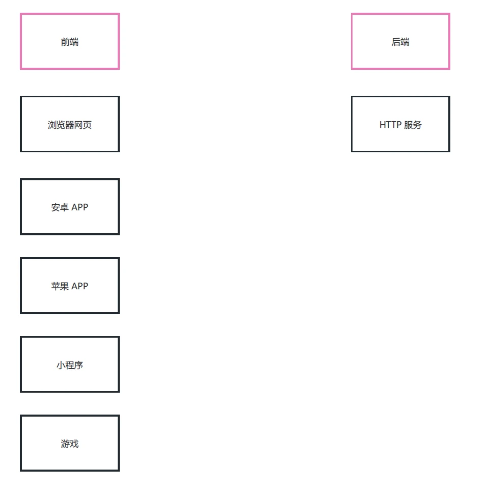

# 接口

## 简介

### 接口是什么

> 接口是 <span style="color:red">前后端通信的桥梁</span>

简单理解：一个接口就是 <span style="color:red">服务中的一个路由规则</span> ，根据请求响应结果

接口的英文单词是 API (Application Program Interface)，所以有时也称之为 `API 接口`

这里的接口指的是『数据接口』， <span style="color:red">与编程语言（Java，Go 等）中的接口语法不同</span>

### 接口的作用

> 实现 <span style="color:red">前后端通信</span>



### 接口的开发与调用

大多数接口都是由 <span style="color:red">后端工程师</span> 开发的， <span style="color:red">开发语言不限</span>

一般情况下接口都是由 <span style="color:red">前端工程师</span> 调用的，但有时 <span style="color:red">后端工程师也会调用接口</span> ，比如短信接口，支付接口
等

### 接口的组成

一个接口一般由如下几个部分组成

- 请求方法

- 接口地址（URL）

- 请求参数

- 响应结果

一个接口示例 https://www.free-api.com/doc/325

体验一下： https://api.asilu.com/idcard/?id=371522199111299668

## RESTful API

RESTful API 是一种特殊风格的接口，主要特点有如下几个：

- URL 中的路径表示 <span style="color:red">资源</span>，路径中不能有 `动词`，例如`create` , `delete` , `update` 等这些都不能有
- 操作资源要与 `HTTP 请求方法` 对应
- 操作结果要与 `HTTP 响应状态码` 对应

规则示例：

| 操作         | 请求类型 | URL      | 返回                 |
| ------------ | -------- | -------- | -------------------- |
| 新增歌曲     | POST     | /song    | 返回新生成的歌曲信息 |
| 删除歌曲     | DELETE   | /song/10 | 返回一个空文档       |
| 修改歌曲     | PUT      | /song/10 | 返回更新后的歌曲信息 |
| 修改歌曲     | PATCH    | /song/10 | 返回更新后的歌曲信息 |
| 获取所有歌曲 | GET      | /song    | 返回歌曲列表数组     |
| 获取单个歌曲 | GET      | /song/10 | 返回单个歌曲信息     |

> 扩展阅读： https://www.ruanyifeng.com/blog/2014/05/restful_api.html

## json-server

json-server 本身是一个 JS 编写的工具包，可以快速搭建 RESTful API 服务

官方地址: https://github.com/typicode/json-server

操作步骤：

1. 全局安装 `json-server`

   ```shell
   npm i -g json-server
   ```

2. 创建 JSON 文件（db.json），编写基本结构

   ```json
   {
   	"song": [
   		{ "id": 1, "name": "干杯", "singer": "五月天" },
   		{ "id": 2, "name": "当", "singer": "动力火车" },
   		{ "id": 3, "name": "不能说的秘密", "singer": "周杰伦" }
   	]
   }
   ```

3. `以 JSON 文件所在文件夹作为工作目录`，执行如下命令

   ```shell
   json-server --watch db.json
   ```

默认监听端口为 `3000`

## 接口测试工具

  介绍几个接口测试工具
  apipost https://www.apipost.cn/ (中文)
  apifox https://www.apifox.cn/ (中文)
  postman https://www.postman.com/ (英文)