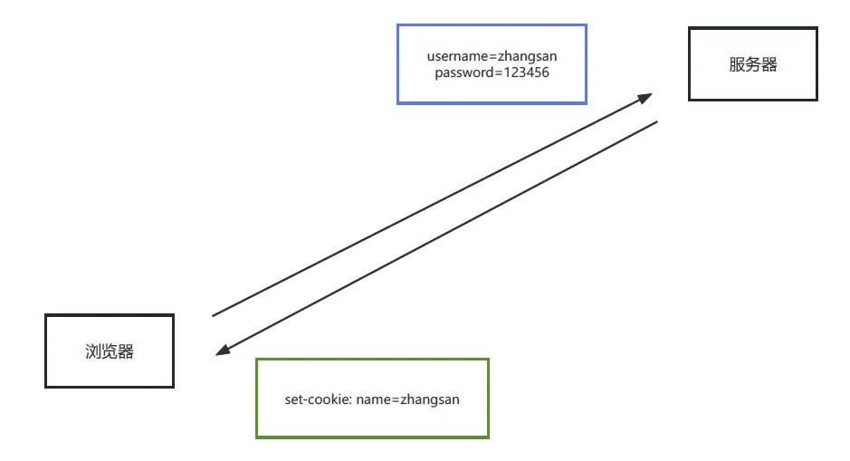
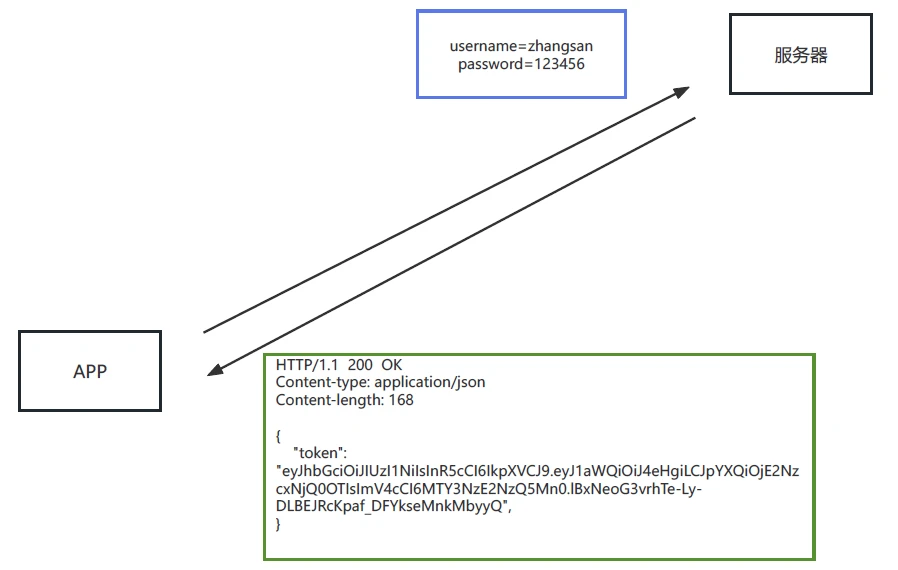
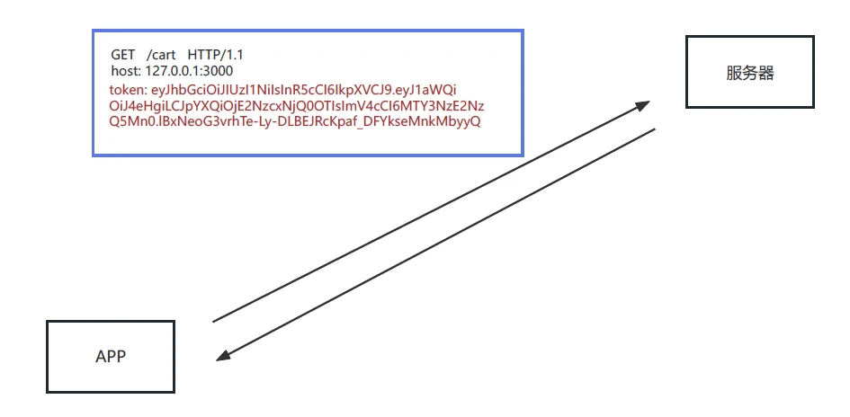
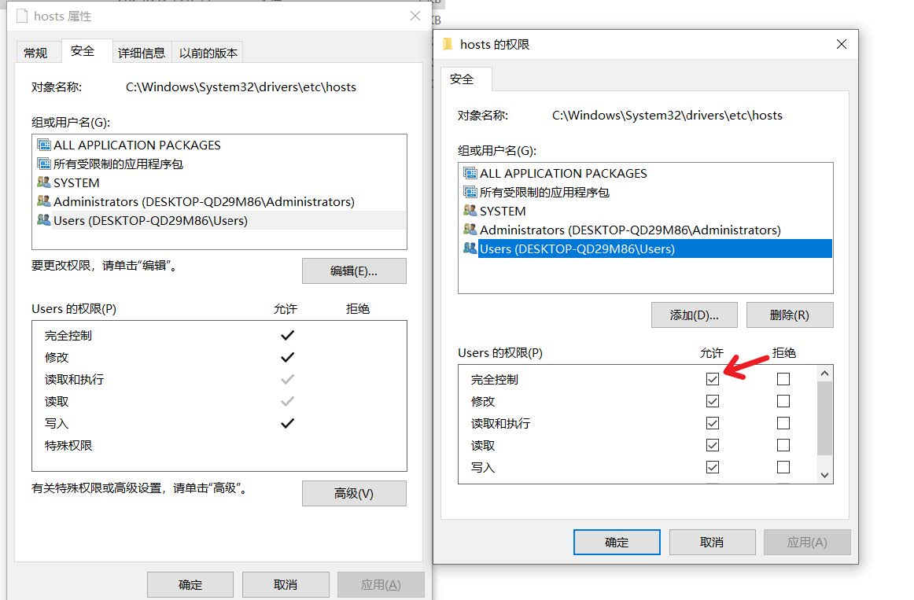

# 会话控制

## 介绍

> 所谓会话控制就是 <span style="color:red">对会话进行控制</span>

HTTP 是一种无状态的协议，它没有办法区分多次的请求是否来自于同一个客户端，<span style="color:red">无法区分用户</span>

而产品中又大量存在的这样的需求，所以我们需要通过 <span style="color:red">会话控制</span> 来解决该问题

常见的会话控制技术有三种：

- cookie
- session
- token

## cookie

### cookie 是什么

> cookie 是 HTTP 服务器发送到用户浏览器并保存在本地的一小块数据

<span style="color:red">cookie 是保存在浏览器端的一小块数据</span>

<span style="color:red">cookie 是按照域名划分保存的</span>

简单示例：

| 域名             | cookie                        |
| ---------------- | ----------------------------- |
| www.baidu.com    | a=100; b=200                  |
| www.bilibili.com | xid=1020abce121; hm=112411213 |
| jd.com           | x=100; ocw=12414cce           |

### cookie 的特点

浏览器向服务器发送请求时，会自动将 `当前域名下` 可用的 cookie 设置在请求头中，然后传递给服务器


这个请求头的名字也叫 `cookie` ，所以将 <span style="color:red">cookie 理解为一个 HTTP 的请求头也是可以的</span>

### cookie 的运行流程

填写账号和密码校验身份，校验通过后下发 cookie


有了 cookie 之后，后续向服务器发送请求时，就会自动携带 cookie


### 浏览器操作 cookie

浏览器操作 cookie 的操作，使用相对较少，大家了解即可

1. 禁用所有 cookie
2. 删除 cookie
3. 查看 cookie

### cookie 的代码操作

express 中可以使用 `cookie-parser` 进行处理

```js
const express =require('express');
//1. 安装 cookie-parser	 npm i cookie-parser
//2. 引入 cookieParser 包
const cookieParser = require('cookie-parser');
  
const app = express();

//3. 设置 cookieParser 中间件
app.use(cookieParser());
  
//4-1 设置 cookie
app.get('/set-cookie', (request, response) => {
	// 不带时效性    会在浏览器关闭的时候，销毁
	response.cookie('username','wangwu');
  	// 带时效性
  	response.cookie('email','23123456@qq.com', {maxAge: 5*60*1000 });
  	//响应
  	response.send('Cookie的设置');
});

//4-2 读取 cookie
app.get('/get-cookie', (request, response) => {
    //读取 cookie
    console.log(request.cookies);
  	//响应体
  	response.send('Cookie的读取');
});

//4-3 删除cookie
app.get('/delete-cookie', (request, response) => {
	//删除
	response.clearCookie('username');
	//响应
	response.send('cookie 的清除');
});

//4. 启动服务
app.listen(3000, () => {
	console.log('服务已经启动....');
});
```

> 不同浏览器中的 cookie 是相互独立的，不共享

## session

### session 是什么

session 是保存在 <span style="color:red">服务器端的一块儿数据</span>，保存当前访问用户的相关信息

### session 的作用

实现会话控制，可以识别用户的身份，快速获取当前用户的相关信息

### session 运行流程

填写账号和密码校验身份，校验通过后创建 `session 信息`，然后将 `session_id` 的值通过响应头返回给浏览器


有了cookie，下次发送请求时会自动携带cookie，服务器通过 `cookie` 中的 `session_id` 的值确定用
户的身份


### session 的代码操作

express 中可以使用 `express-session` 对 session 进行操作
```js
const express = require('express');
//1. 安装包 npm i express-session connect-mongo
//2. 引入 express-session connect-mongo
const session = require("express-session");
const MongoStore = require('connect-mongo');

const app = express();

//3. 设置 session 的中间件
app.use(session({
	name: 'sid', //设置cookie的name，默认值是：connect.sid
	secret: 'atguigu', //参与加密的字符串（又称签名）  加盐
	saveUninitialized: false, //是否为每次请求都设置一个cookie用来存储session的id
	resave: true, //是否在每次请求时重新保存session
	store: MongoStore.create({
		mongoUrl: 'mongodb://127.0.0.1:27017/project' //数据库的连接配置
	}),
	cookie: {
		httpOnly: true, // 开启后前端无法通过 JS 操作
		maxAge: 1000 * 300 // 这一条 是控制 sessionID 的过期时间的！！！
	},
}))

//创建 session  session的设置
app.get('/login', (req, res) => {
    //设置session
    req.session.username = 'zhangsan';
    req.session.email = 'zhangsan@qq.com'
    res.send('登录成功');
})

//获取 session
app.get('/home', (req, res) => {
    console.log('session的信息');
    console.log(req.session.username);
    // 检测 session 是否存在用户数据
    if (req.session.username) {
    	res.send(`你好 ${req.session.username}`);
    }else{
    	res.send('登录 注册');
    }
})

//销毁 session
app.get('/logout', (req, res) => {
    //销毁session
    // res.send('设置session');
    req.session.destroy(() => {
    	res.send('成功退出');
	});
});
app.listen(3000, () => {
	console.log('服务已经启动, 端口 ' + 3000 + ' 监听中...');
});
```


## session 和 cookie 的区别

cookie 和 session 的区别主要有如下几点：

1. 存在的位置
  - cookie：浏览器端
  - session：服务端
2. 安全性
  - cookie 是以明文的方式存放在客户端的，安全性相对较低
  - session 存放于服务器中，所以安全性 `相对` 较好
3. 网络传输量
  - cookie 设置内容过多会增大报文体积， 会影响传输效率
  - session 数据存储在服务器，只是通过 cookie 传递 id，所以不影响传输效率
4. 存储限制
  - 浏览器限制单个 cookie 保存的数据不能超过 `4K` ，且单个域名下的存储数量也有限制
  - session 数据存储在服务器中，所以没有这些限制

## token

### token 是什么

`token` 是服务端生成并返回给 HTTP 客户端的一串加密字符串， `token` 中保存着`用户信息`

token 不属于 http 标准，完全由前后端协商而定，但 cookie 属于 http 标准

### token 的作用

实现会话控制，可以识别用户的身份，主要用于移动端 APP

### token 的工作流程

填写账号和密码校验身份，校验通过后响应 token，token 一般是在响应体中返回给客户端的


后续发送请求时，需要`手动`将 token 添加在请求报文中(<span style="color:red">cookie是自动携带的</span>)，一般是放在请求头中


### token 的特点

- 服务端压力更小

  - 数据存储在客户端

- 相对更安全
  - 数据加密
  - 可以避免 CSRF（跨站请求伪造）

- 扩展性更强
  - 服务间可以共享
  - 增加服务节点更简单

### JWT

JWT（JSON Web Token ）是目前最流行的跨域认证解决方案，可用于基于 `token` 的身份验证

JWT 使 token 的生成与校验更规范

我们可以使用 `jsonwebtoken 包` 来操作 token

```js
//导入 jsonwebtokan
const jwt = require('jsonwebtoken');

//创建 token
// jwt.sign(数据, 加密字符串, 配置对象)
let token = jwt.sign({
    username: 'zhangsan'
}, 'atguigu', {
    expiresIn: 60 //单位是 秒
})

//解析 token
// jwt.verify(token,加密字符串，回调函数)
jwt.verify(token, 'atguigu', (err, data) => {
    if(err){
    	console.log('校验失败~~');
	    return
	}
	console.log(data);// { username: '张三', iat: (创建时间), exp:(过期时间)}
})
```

> 扩展阅读： https://www.ruanyifeng.com/blog/2018/07/json_web_token-tutorial.html

## 附录

### 本地域名

所谓本地域名就是 <span style="color:red">只能在本机使用的域名</span>，一般在开发阶段使用

#### 操作流程

编辑文件 `C:\Windows\System32\drivers\etc\hosts`

```
127.0.0.1   www.baidu.com
```

如果修改失败，<span style="color:red">可以修改该文件的权限</span>



#### 原理

在地址栏输入 `域名` 之后，浏览器会先进行 DNS（Domain Name System）查询，获取该域名对应的 IP 地
址
请求会发送到 DNS 服务器，可以 `根据域名返回 IP 地址`

可以通过 `ipconfig /all` 查看本机的 DNS 服务器

`hosts` 文件也可以设置域名与 IP 的映射关系，在发送请求前，可以通过该文件获取域名的 IP 地址