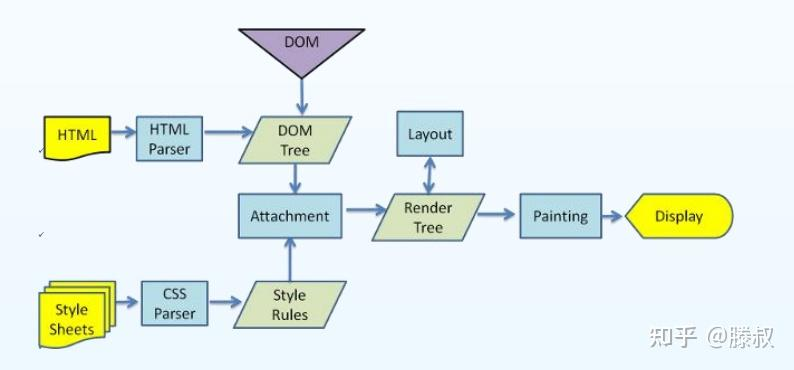

浏览器解析渲染页面分为以下五个步骤：

1. 解析HTML标签，构建DOM树；
2. 解析CSS，构建CSSOM树；
3. 把DOM和CSSOM组合成 渲染树（render tree）；
4. 在渲染树的基础上进行布局，计算每个节点的几何结构；
5. 把每个节点绘制到屏幕上（painting）。

# html

## html执行顺序

基本执行顺序是从上到下。页面上通常会有三个标签，html,head,body,这三个之间的关系是，html包含整个页面代码，head主要用于引入一些js,css文件，body用来包含页面代码和js代码,也可以放在head里面，但是js代码放在window.onload事件里面，这样也可以.浏览器加载页面的顺序为，先加载head,如果碰到script标签的话，会判断是引入外部js文件还是js代码，如果是文件会开始下载外部文件，如果是代码则html页面加载会暂停，此时javascript引擎开始执行代码，等代码执行完了继续加载页面，等head标签里面的内容都加载完了之后 开始加载body标签的内容，如果body里面遇到script标签的话，是文件就下载，是代码又会暂停加载页面，转而让引擎执行js代码，等js代码执行完毕之后才会继续加载页面这种。

# css

# Js

# Promise

## 什么是promise?

- 抽象表达 :  `Promise`是JS中进行**异步编程**的新的解决方案 (旧方案是单纯使用回调函数)

- 具体表达 : 

  - 从语法上看: `Promise`是一个构造函数 (身上有`all`、`reject`、`resolve`这几个方法，原型上有`then`、`catch`等方法)
  - 从功能上看: `Promise`对象用来封装一个异步操作并可以获取其 成功 / 失败 的结果值

## promise解决了什么问题?

1.回调地狱问题
2.代码的可读性问题
3.信任问题

## 什么是回调地狱?

> 回调函数嵌套使用，外部回调函数异步执行的结果是其内部嵌套的回调函数执行的条件

# Vue

## v-model的原理

vue采用数据劫持 结合 发布者-订阅者 模式的方式，通过 Object.defineProperty 劫持 data 属性 的setter，getter，在数据变动时发布消息给订阅者，触发相应的监听回调
